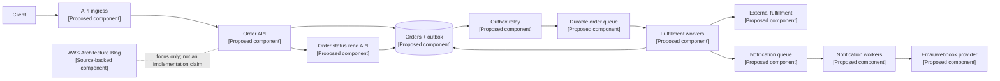

## 1. Original Engineering Problem

[SOURCE FACT] The supplied source is the AWS Architecture Blog, a collection published at [AWS Architecture Blog](https://aws.amazon.com/blogs/architecture/). The supplied verified excerpt contains no description of one named production system, traffic volume, database schema, or implementation.

[ANALYSIS] That limitation matters. A landing page about architecture is not evidence for a particular AWS internal topology. The defensible engineering question is instead: how should we turn the source's stated focus, well-architected design, multi-AZ deployment, decoupling, queues, and resilience, into a system that can survive partial failure without making synchronous callers wait for every downstream operation?

[PROPOSED DESIGN] We will design an order-processing platform. A client submits an order, receives a durable acceptance response, and later observes fulfillment progress. The platform must preserve an order's intent, avoid duplicate side effects during retries, isolate slow workers from the request path, and continue accepting work when one availability zone or one worker pool is impaired.

The core problem is not selecting a fashionable service. It is choosing failure boundaries and making the guarantees explicit:

- The synchronous path validates and durably records an order.
- A queue absorbs bursts and separates admission from processing.
- Workers perform idempotent fulfillment and publish state changes.
- Read paths remain available while asynchronous processing is delayed.

## 2. What the Original System Did

[SOURCE FACT] No original runtime system is described in the verified material supplied for this article. The only verified source is the AWS Architecture Blog landing page: https://aws.amazon.com/blogs/architecture/.

[ANALYSIS] Consequently, there is no responsible way to write that “AWS used” a particular queue, database, retry policy, or multi-AZ diagram based on this source. The patterns in this article should be read as engineering analysis of the requested focus, not as a reconstruction of an AWS production implementation.

[PROPOSED DESIGN] In the proposed platform, the request service writes an order and an outbox record in one database transaction. A relay publishes the outbox record to a durable queue. Fulfillment workers consume messages, update order state, and record an idempotency result. A separate notification consumer handles email or webhook delivery. These consumers can be scaled, paused, or repaired independently.

This choice provides a useful contract: an accepted order means “the platform durably recorded the request,” not “every downstream action has completed.” That distinction prevents a slow notification provider from extending the customer's request latency.

## 3. Architecture Diagram

[ANALYSIS] The diagram has no source-backed runtime components because the supplied excerpt specifies none. The source context is shown separately so that a proposed topology cannot be mistaken for an AWS-described system.

[PROPOSED DESIGN] All runtime nodes below are proposed components. The labels intentionally distinguish them from the source context.



[ANALYSIS] A multi-AZ deployment is a placement property, not a magic availability guarantee. Each stateless API and worker pool should have instances in at least two zones; the database, queue, and load-balancing layer must have failure behavior that is understood and tested. Cross-zone redundancy also does not remove dependency failures, bad deployments, exhausted connection pools, or poison messages.

## 4. System Design Analysis

[ANALYSIS] The design separates four concerns. Admission protects the user-facing path. Durability protects accepted intent. Asynchronous processing protects the system from variable downstream latency. Idempotency protects correctness when delivery is retried.

[PROPOSED DESIGN] The order API uses a client-supplied idempotency key scoped to the customer. It validates the request, checks the key, and inserts the order plus outbox event atomically. If the same key is retried with the same request hash, it returns the original result. If the key is reused with a different payload, it returns a conflict.

[ANALYSIS] The outbox avoids a dual-write gap. Without it, the API could commit an order and fail before publishing its queue message, or publish a message and fail before committing the order. The relay may publish the same event more than once; therefore “exactly once” is not a safe assumption. Consumers must be idempotent.

[PROPOSED DESIGN] State transitions are monotonic and guarded: `PENDING -> PROCESSING -> FULFILLED`, with explicit `FAILED_RETRYABLE` and `FAILED_FINAL` states. A worker claims work with a lease, performs an external call using an idempotency token, and commits the result. An expired lease permits another worker to retry.

## 5. Data Model

[PROPOSED DESIGN] A relational model makes the order state transition and outbox insert atomic.

```sql
CREATE TABLE orders (
  order_id          UUID PRIMARY KEY,
  customer_id       UUID NOT NULL,
  request_key       VARCHAR(128) NOT NULL,
  request_hash      CHAR(64) NOT NULL,
  state             VARCHAR(32) NOT NULL,
  version           BIGINT NOT NULL DEFAULT 0,
  external_ref      VARCHAR(128),
  created_at        TIMESTAMP NOT NULL,
  updated_at        TIMESTAMP NOT NULL,
  UNIQUE (customer_id, request_key)
);

CREATE TABLE outbox_events (
  event_id          UUID PRIMARY KEY,
  aggregate_id      UUID NOT NULL,
  event_type        VARCHAR(64) NOT NULL,
  payload           JSON NOT NULL,
  published_at      TIMESTAMP,
  created_at        TIMESTAMP NOT NULL
);

CREATE TABLE idempotency_results (
  consumer_name     VARCHAR(64) NOT NULL,
  message_id        UUID NOT NULL,
  result_hash       CHAR(64) NOT NULL,
  completed_at      TIMESTAMP NOT NULL,
  PRIMARY KEY (consumer_name, message_id)
);
```

[ANALYSIS] `version` supports optimistic concurrency, while the unique customer/key pair makes API retries observable. The idempotency table records consumer work, but it cannot undo a side effect at an external provider. The provider must accept an idempotency token, or the integration needs reconciliation and a business-specific compensating action.

## 6. API Design

[PROPOSED DESIGN] The external contract is intentionally small:

```text
POST /v1/orders
Idempotency-Key: customer-opaque-key

201 Created
{
  "order_id": "uuid",
  "state": "PENDING",
  "status_url": "/v1/orders/uuid"
}

GET /v1/orders/{order_id}

200 OK
{
  "order_id": "uuid",
  "state": "FULFILLED",
  "updated_at": "2026-08-16T03:00:00Z"
}
```

[PROPOSED DESIGN] `202 Accepted` is also valid if the service intentionally separates durable admission from resource creation. The important rule is to document what the response guarantees. `409 Conflict` represents an idempotency key reused with a different request. `429 Too Many Requests` communicates admission pressure, and `503 Service Unavailable` is appropriate when the service cannot durably accept new work.

[ANALYSIS] A status endpoint is preferable to making clients poll the queue or exposing internal worker state. It also lets read traffic be served during a processing outage, subject to the database's availability and consistency behavior.

## 7. Scaling Strategy

[PROPOSED DESIGN] Scale the API tier horizontally across zones because it is stateless. Keep connection pools bounded so a database slowdown does not turn every API replica into an additional source of overload. Scale workers from queue depth and message age rather than CPU alone: a low-CPU worker pool can still be failing to drain work.

[ANALYSIS] Queue depth is not sufficient by itself. A backlog of old messages is more urgent than the same number of newly arrived messages. Useful control signals include oldest-message age, processing latency, retry rate, database saturation, and external-provider error rate. Autoscaling should have a ceiling and admission control; otherwise a backlog can trigger a retry-driven load storm.

[PROPOSED DESIGN] Partition work by a stable key when per-customer or per-order ordering matters. Use a dead-letter queue for messages that exceed the retry policy. Re-drive dead letters only after the underlying defect is understood. Keep payloads small and store large immutable documents separately, referenced by an identifier.

## 8. Failure Scenarios

[PROPOSED DESIGN] If one availability zone fails, traffic is routed to healthy API replicas and workers. In-flight requests may fail and be retried with the same idempotency key. The system must tolerate duplicate delivery and must not treat a client timeout as proof that no order was created.

[ANALYSIS] If the primary database is unavailable, the service should fail closed for writes rather than acknowledge work it cannot durably record. A read-only status path may continue if its consistency and failover guarantees are acceptable. Multi-AZ placement reduces a single-zone dependency but does not define recovery time or recovery point by itself.

[PROPOSED DESIGN] If a worker crashes after an external call but before committing its result, the lease expires and another worker retries. The external call uses the same deterministic idempotency token. If the provider lacks that feature, reconciliation compares provider state with the order record before issuing another call.

[PROPOSED DESIGN] If a poison message repeatedly fails validation, bounded retries move it to the dead-letter queue. If the external provider slows down, circuit breaking and a concurrency limit prevent the worker pool from consuming all database connections. Notifications have their own queue so notification failure does not block fulfillment.

## 9. Capacity Estimation

[PROPOSED DESIGN] The following are illustrative assumptions, not source facts: 1,000 order requests per second at peak, a 4 KB order record, 30 days of hot data, and an average fulfillment time of 2 seconds.

[PROPOSED DESIGN] At 1,000 requests/second, the order stream is approximately 86.4 million requests/day. At 4 KB per order before indexes, that is about 346 GB/day of logical order payload. A two-second average processing time implies roughly 2,000 concurrent in-flight orders at peak, before adding headroom for variance and retries. These figures are planning inputs only; production sizing requires measured payloads, index overhead, replication, queue retention, and failure traffic.

[ANALYSIS] Queue capacity should be expressed as a time-to-drain objective, not only a message count. If workers process too slowly, adding replicas helps only until the database or external provider becomes the bottleneck. Capacity tests should inject zone loss, provider latency, duplicate messages, and database throttling while measuring oldest-message age and user-visible error rate.

## 10. Trade-offs

[ANALYSIS] The outbox adds storage, relay logic, cleanup, and operational metrics, but it removes the most dangerous API-to-queue dual-write gap. At-least-once delivery creates duplicate work, but idempotency is usually more observable and recoverable than pretending distributed exactly-once execution exists.

[ANALYSIS] A relational database simplifies transactional state changes and status queries. It can become the shared bottleneck for API writes, relay scans, worker updates, and reconciliation. Separating read models or partitioning by tenant can help later, but adds replication lag and operational complexity.

[PROPOSED DESIGN] Strong consistency is used for the create response and idempotency lookup; eventual consistency is acceptable for secondary projections and notifications. This is a deliberate boundary, not a universal rule. The business must decide whether a stale status is acceptable and how long a notification may be delayed.

## 11. What We Can Learn From This Architecture

[SOURCE FACT] The supplied source is the AWS Architecture Blog resource; it does not furnish a named implementation or measurements in the verified material. Source: https://aws.amazon.com/blogs/architecture/.

[ANALYSIS] The transferable lesson is to make reliability a set of explicit contracts: what is durable, what is retryable, what is idempotent, what is allowed to be stale, and what happens when a dependency is unavailable. Multi-AZ placement is useful only when state, failover, and operational procedures are designed around it.

[ANALYSIS] Decoupling is also not synonymous with adding queues everywhere. A queue earns its place when it absorbs a burst, isolates latency, provides controlled retry, or separates ownership. Every queue introduces lag, visibility problems, poison-message handling, and another operational state machine.

## 12. Proposed Interview-Style System Design

[PROPOSED DESIGN] In an interview, I would state the scope first: create orders, report status, process fulfillment asynchronously, and tolerate a zone failure. I would ask whether ordering, cancellation, data residency, and provider idempotency are requirements. I would then draw the API, transactional store, outbox, queue, workers, and status path before discussing service-specific products.

[PROPOSED DESIGN] The design answer should include these invariants:

- An accepted request has a durable order record.
- A retry with the same key cannot create a second order.
- A message can be delivered more than once without duplicating fulfillment.
- A worker failure does not permanently lose a queued order.
- Notification failure does not block fulfillment.
- A single-zone failure does not require changing the client contract.

[ANALYSIS] I would close with observability and tests: trace the order ID across API, outbox, queue, worker, and provider; alert on oldest-message age and retry growth; run failover and replay drills; and verify that recovery procedures preserve the invariants. This is a proposed interview design, not a claim about AWS's internal systems.

## Original Sources

- Company: AWS; Exact Article Title: AWS Architecture Blog; URL: https://aws.amazon.com/blogs/architecture/; What information from the source was used: The source identity and the existence of the AWS Architecture Blog resource. The supplied verified excerpt contained no named system, architecture components, quotes, statistics, or implementation facts.
