## 1. Problem and Scope

[SOURCE FACT] The supplied source is the [AWS Architecture Blog](https://aws.amazon.com/blogs/architecture/). The verified material supplied with this article does not describe one named production system, its traffic, database schema, or implementation details.

[ANALYSIS] That distinction limits what can be claimed. An architecture-blog landing page is not evidence for a particular AWS internal topology. The useful engineering question is how to apply the stated themes, such as well-architected design, multi-AZ deployment, decoupling, queues, and resilience, to a system that can tolerate partial failure without making synchronous callers wait for every downstream operation.

[PROPOSED DESIGN] This article uses an order-processing platform as a concrete design exercise. A client submits an order, receives a response after the request has been durably recorded, and later reads fulfillment progress. The platform must preserve the order intent, avoid duplicate side effects during retries, keep slow workers out of the request path, and continue accepting work when an availability zone or worker pool is impaired.

The central design work is defining failure boundaries and guarantees:

- The synchronous path validates and durably records an order.
- A queue absorbs bursts and separates admission from processing.
- Workers perform idempotent fulfillment and publish state changes.
- Read paths remain available while asynchronous processing is delayed.

## 2. Source Boundary and Proposed System

[SOURCE FACT] No original runtime system is described in the verified material supplied for this article. The only verified source is the AWS Architecture Blog landing page: https://aws.amazon.com/blogs/architecture/.

[ANALYSIS] It would be unsupported to state that AWS used a particular queue, database, retry policy, or multi-AZ diagram based on this source. The patterns below are engineering analysis and a proposed design, not a reconstruction of an AWS production implementation.

[PROPOSED DESIGN] The request service writes an order and an outbox record in one database transaction. An outbox relay publishes the record to a durable queue. Fulfillment workers consume messages, update order state, and record an idempotency result. A separate notification consumer handles email or webhook delivery. These consumers can be scaled, paused, or repaired independently.

An accepted order therefore means that the platform durably recorded the request. It does not mean that every downstream action has completed. This contract prevents a slow notification provider from extending the customer's request latency.

## 3. Architecture

[ANALYSIS] The supplied source does not name runtime components, so none of the components in this diagram should be read as source-backed AWS claims.

[PROPOSED DESIGN] The topology is intentionally explicit about the proposed components:

```mermaid
flowchart LR
    SRC["AWS Architecture Blog\n[Source-backed context]"]
    C["Client"] --> G["API ingress\n[Proposed component]"]
    G --> R["Order API\n[Proposed component]"]
    R --> DB[("Orders + outbox\n[Proposed component]")]
    DB --> O["Outbox relay\n[Proposed component]"]
    O --> Q["Durable order queue\n[Proposed component]"]
    Q --> W["Fulfillment workers\n[Proposed component]"]
    W --> DB
    W --> E["External fulfillment\n[Proposed component]"]
    W --> NQ["Notification queue\n[Proposed component]"]
    NQ --> N["Notification workers\n[Proposed component]"]
    N --> P["Email/webhook provider\n[Proposed component]"]
    R --> READ["Order status read API\n[Proposed component]"]
    READ --> DB
    SRC -. "focus only; not an implementation claim" .- R
```



[ANALYSIS] Multi-AZ deployment is a placement property, not an availability guarantee by itself. The stateless API and worker pools should be placed in at least two availability zones as a proposed deployment choice. The database, queue, and load-balancing layer need understood and tested failure behavior. Cross-zone redundancy does not remove dependency failures, bad deployments, exhausted connection pools, or poison messages.

## 4. Request Path and Delivery Guarantees

[ANALYSIS] The design separates several concerns: admission protects the user-facing path; durability protects accepted intent; asynchronous processing isolates variable downstream latency; and idempotency protects correctness when delivery is retried.

[PROPOSED DESIGN] The Order API accepts a client-supplied idempotency key scoped to the customer. It validates the request, checks the key, and inserts the order and outbox event atomically. A retry with the same key and request hash returns the original result. Reusing the key with a different payload returns a conflict.

[ANALYSIS] The outbox closes the dual-write gap. Without it, the API could commit an order and fail before publishing its queue message, or publish a message and fail before committing the order. The relay may publish an event more than once, so exactly-once delivery is not a safe assumption. Consumers must be idempotent.

[PROPOSED DESIGN] Use guarded, monotonic state transitions:

`PENDING -> PROCESSING -> FULFILLED`

Also model `FAILED_RETRYABLE` and `FAILED_FINAL` explicitly. A worker claims work with a lease, calls the external fulfillment system with an idempotency token, and commits the result. When the lease expires, another worker may retry the message. The external operation must tolerate that retry; a local database lock cannot make an external side effect exactly once.

## 5. Data Model

[PROPOSED DESIGN] A relational model makes the order transition and outbox insert atomic. The uniqueness constraint on `(customer_id, idempotency_key)` enforces the request contract at the database boundary.

```sql
CREATE TABLE orders (
  order_id          UUID PRIMARY KEY,
  customer_id       UUID NOT NULL,
  idempotency_key   TEXT NOT NULL,
  request_hash      TEXT NOT NULL,
  status            TEXT NOT NULL,
  result_json       JSONB,
  created_at        TIMESTAMP NOT NULL,
  updated_at        TIMESTAMP NOT NULL,
  UNIQUE (customer_id, idempotency_key)
);

CREATE TABLE outbox (
  event_id          UUID PRIMARY KEY,
  aggregate_id      UUID NOT NULL,
  event_type        TEXT NOT NULL,
  payload_json      JSONB NOT NULL,
  published_at      TIMESTAMP
);
```

[ANALYSIS] The outbox relay should claim unpublished rows safely, publish them, and mark them published. A crash between publish and the update creates a duplicate, which is why the queue consumer needs a durable deduplication or idempotency record. Retaining outbox rows until the publication policy is satisfied also makes recovery diagnosable; the retention policy itself is an operational choice, not a source fact.

## 6. Failure Handling

[PROPOSED DESIGN] Apply timeouts to database calls and external calls. Retry only transient failures, use bounded exponential backoff with jitter, and cap attempts or elapsed retry time. A retry without a timeout can occupy a worker indefinitely; an unbounded retry can overload a recovering dependency.

[PROPOSED DESIGN] Use a dead-letter queue for messages that cannot be processed after the configured retry policy. Operators should inspect and safely replay those messages after fixing the cause. A poison message must not block unrelated work in the main queue.

[ANALYSIS] Backpressure (điều tiết áp lực ngược) is part of the design, not an afterthought. If workers cannot keep up, queue depth and message age expose the problem. The system should limit in-flight work and protect database connection pools instead of increasing concurrency without a bound.

[PROPOSED DESIGN] A circuit breaker (ngắt mạch) can stop calls to a failing external dependency for a controlled interval. It should fail fast or leave work queued, depending on the business contract. It does not replace timeouts, bounded retries, or an idempotency strategy.

## 7. Read Path and Operations

[PROPOSED DESIGN] The status API reads the durable order state and returns progress separately from fulfillment completion. It should not call the fulfillment provider or notification provider synchronously. If read traffic grows independently, a read projection can be added, but that projection must expose its freshness or lag.

[ANALYSIS] Useful signals include request error rate and latency, queue depth and message age, worker failure and retry rates, database connection-pool exhaustion, outbox backlog, and external-provider timeouts. These signals describe the failure boundaries in this design; they are not measurements from the AWS source.

[PROPOSED DESIGN] Test the failure modes that the topology claims to handle: stop a worker during processing, make the relay restart after publishing, delay the external provider, exhaust a connection pool, and isolate an availability zone. Verify that retries do not create duplicate orders or fulfillment, that poison messages are isolated, and that the read path still reports durable state.

## 8. Interview Summary

[ANALYSIS] The strongest explanation of this design is not a list of AWS services. It is the set of guarantees and their failure boundaries:

- The transaction makes the accepted order and outbox event durable together.
- The relay and consumers assume at-least-once delivery.
- Idempotency keys protect request retries and external side effects.
- The queue isolates admission latency from fulfillment latency.
- Leases allow recovery from worker failure, while bounded retries limit dependency pressure.
- Multi-AZ placement reduces the impact of a zone failure but does not eliminate other failure modes.

[PROPOSED DESIGN] Service names can be selected after these contracts are clear. The source supports the architectural themes, but the concrete order platform in this article remains a proposed design.
