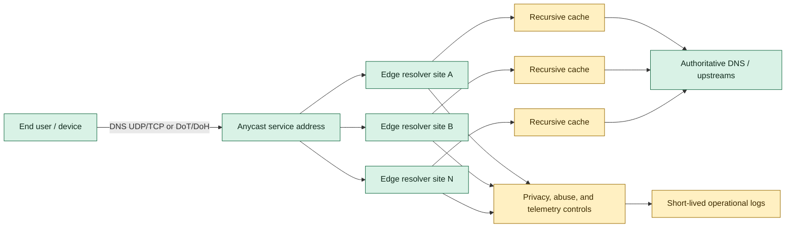

## 1. Original Engineering Problem

[SOURCE FACT] DNS is the directory-like lookup step that commonly precedes loading a website, sending email, or opening an application. The source distinguishes authoritative DNS, which serves the content side of the system, from resolvers, which serve users and are often selected by an ISP, Wi-Fi operator, or mobile network. ([Cloudflare, “Announcing 1.1.1.1: the fastest, privacy-first consumer DNS service”](https://blog.cloudflare.com/announcing-1111/))

[SOURCE FACT] Cloudflare described two user-facing problems: resolvers could be slow and could expose a user's queried domains to the network operator, even when the destination website used HTTPS. The source also describes DNS blocking as a censorship mechanism. ([Cloudflare](https://blog.cloudflare.com/announcing-1111/))

[ANALYSIS] This is a distributed-systems problem with three coupled objectives:

- Reduce lookup latency by putting recursive resolution close to users.
- Make a stable service reachable despite failures in individual locations or networks.
- Minimize the privacy damage created by operating a high-volume observation point.

The hard part is not answering one DNS question. It is operating a globally reachable, low-latency service while keeping routing, cache behavior, abuse controls, protocol compatibility, and data retention consistent.

## 2. What the Original System Did

[SOURCE FACT] Cloudflare said it used its large, highly interconnected global network and DNS experience to launch a consumer resolver. Testing showed the resolver running across that network outperformed other consumer DNS services available at the time. ([Cloudflare](https://blog.cloudflare.com/announcing-1111/))

[SOURCE FACT] The service used the memorable addresses `1.1.1.1` and `1.0.0.1`. APNIC's research group held those addresses and had observed a flood of garbage traffic when they were announced. Cloudflare offered its network to receive and study that traffic while offering a resolver on the addresses. ([Cloudflare](https://blog.cloudflare.com/announcing-1111/))

[SOURCE FACT] Cloudflare committed not to write querying IP addresses to disk, to wipe logs within 24 hours, and to retain KPMG for annual audits with a public report. The source says some logging was still needed for abuse prevention and debugging. ([Cloudflare](https://blog.cloudflare.com/announcing-1111/))

[SOURCE FACT] At launch, 1.1.1.1 supported DNS-over-TLS and DNS-over-HTTPS. The source presents DNS-over-HTTPS as encrypted and promising for newer transports and protocol capabilities. ([Cloudflare](https://blog.cloudflare.com/announcing-1111/))

[SOURCE FACT] DNSPerf was described as ranking 1.1.1.1 fastest for queries to non-Cloudflare customers, averaging around 14 ms globally. For Cloudflare authoritative-DNS customers, the source says the resolver and recursor were on the same network and hardware, enabling very fast answers and immediate updates without waiting for TTL expiry. ([Cloudflare](https://blog.cloudflare.com/announcing-1111/))

[ANALYSIS] These facts imply a design centered on edge-local ingress and recursive-cache locality, not on one central resolver cluster. They do not, by themselves, disclose the exact routing policy, process layout, cache algorithm, or abuse pipeline.

## 3. Architecture Diagram

The diagram separates what the source explicitly says from an interview-style extension.



[SOURCE FACT] In the diagram, green nodes are [Source-backed component] and yellow nodes are [Proposed component].

[SOURCE FACT] The source-backed components are the consumer resolver, the global network, the memorable service addresses, DNS-over-TLS/DNS-over-HTTPS support, and the relationship with Cloudflare authoritative DNS. ([Cloudflare](https://blog.cloudflare.com/announcing-1111/))

[PROPOSED DESIGN] The per-site caches, explicit privacy pipeline, and short-lived log sink are a concrete decomposition for discussion. The source does not claim that Cloudflare used these exact components or boundaries.

## 4. System Design Analysis

[ANALYSIS] Anycast gives the service a single address from the client's perspective while allowing traffic to enter at a nearby or topologically preferred edge. The benefit is not guaranteed geographic proximity: BGP chooses a route according to network policy, and a nearby site can be unreachable or suboptimal. Therefore, health withdrawal and route diversity are as important as the number of sites.

[ANALYSIS] DNS has unusually strong cache leverage. A recursive resolver can answer many repeated questions from an edge-local cache, avoiding an upstream round trip. Negative answers and TTLs also shape load, but aggressive caching must respect authoritative records and avoid turning stale data into a correctness failure.

[ANALYSIS] Privacy is an architecture constraint, not merely a policy page. If the system does not need client IP addresses after request handling, the data path should avoid durable storage of them. Abuse detection then needs coarse, short-lived, or separately protected signals. The source's 24-hour deletion commitment is a source fact; the implementation mechanism here is analysis.

[ANALYSIS] Encryption on the client-to-resolver leg changes the edge workload. DoH adds HTTP connection management and request parsing; DoT adds TLS session handling. Both improve confidentiality over plaintext DNS on the access network, but neither makes the resolver unable to see the query itself.

## 5. Data Model

[PROPOSED DESIGN] The following logical records are an interview model, not a description of Cloudflare's internal schema:

```text
CacheEntry {
  question_key: (qname, qtype, qclass, ecs_scope)
  response: dns_message
  expires_at: timestamp
  authoritative_ttl: duration
  negative: boolean
}

AbuseSignal {
  coarse_source_token: short_lived_token
  edge_site: opaque_site_id
  query_class: enum
  count_window: short_window
  expires_at: timestamp
}

RouteHealth {
  edge_site: opaque_site_id
  resolver_ready: boolean
  upstream_reachability: enum
  withdraw_recommended: boolean
}
```

[ANALYSIS] `question_key` must include every dimension that can change an answer. A cache key that ignores query type or an applicable client-subnet scope can return a valid DNS message for the wrong question. `expires_at` lets the serving path reject expired data without rewriting authoritative semantics.

[PROPOSED DESIGN] `coarse_source_token` is intentionally not a raw client IP. It is a privacy-preserving abuse-control input with a short lifetime. A production design would define its derivation, access policy, and deletion test before launch.

## 6. API Design

[PROPOSED DESIGN] The public interface can expose standards-compatible DNS transports rather than a custom application API:

```http
POST /dns-query HTTP/2
Content-Type: application/dns-message
Accept: application/dns-message

<wire-format DNS query>
```

```text
Response: 200 OK
Content-Type: application/dns-message

<wire-format DNS response>
```

[SOURCE FACT] The source says 1.1.1.1 supported DNS-over-HTTPS and DNS-over-TLS at launch. ([Cloudflare](https://blog.cloudflare.com/announcing-1111/))

[PROPOSED DESIGN] For UDP and TCP DNS, the equivalent contract is a wire-format DNS request to the service address and a wire-format response, with standard response codes such as `NOERROR`, `NXDOMAIN`, and `SERVFAIL`. DoH and DoT should share the same resolver core so that transport choice does not change cache or policy semantics.

[ANALYSIS] Operational APIs should not expose query logs by default. A safer interface reports aggregate health, cache effectiveness, upstream failure classes, and deletion status without returning raw user histories.

## 7. Scaling Strategy

[SOURCE FACT] Cloudflare's source says the resolver ran across its global network and that resolver and authoritative DNS could run on the same network and hardware for Cloudflare customers. ([Cloudflare](https://blog.cloudflare.com/announcing-1111/))

[ANALYSIS] Scaling follows the request's locality:

- Add edge ingress capacity so a single site is not a global bottleneck.
- Keep recursive caches local enough to capture repeated demand without requiring every site to replicate every record.
- Use anycast route announcements for reachability, with health checks able to remove unhealthy sites.
- Separate packet processing, recursive work, encrypted transport termination, and abuse controls so a DoH connection surge does not starve ordinary DNS.
- Keep authoritative co-location as a fast path, while retaining upstream recursion for domains outside that path.

[PROPOSED DESIGN] A practical rollout would use per-site admission limits and bounded work queues. When a site is saturated, it should shed expensive recursion before it exhausts memory or causes tail latency to spread. The exact queue sizes and site counts are illustrative assumptions, not source facts.

## 8. Failure Scenarios

[ANALYSIS] Important failure cases include:

- Edge-site loss: anycast should steer new traffic elsewhere; existing TCP, DoT, or DoH sessions may need retry behavior.
- Route hijack or route leak: the address can remain reachable but land at the wrong network. Route-origin validation, independent monitoring, and rapid withdrawal reduce exposure.
- Upstream authoritative failure: serve valid unexpired cache entries, return an honest failure when recursion cannot complete, and avoid inventing answers.
- Cache poisoning attempt: validate responses, constrain bailiwick, and isolate suspicious upstream behavior.
- Privacy-control failure: fail closed for prohibited durable fields; an observability outage must not silently become raw query retention.
- Abuse flood: rate-limit at the edge, preserve capacity for normal queries, and retain only the minimum short-lived signals needed to respond.

[SOURCE FACT] The source says the addresses had previously attracted overwhelming garbage traffic when announced, which makes traffic filtering and capacity isolation a first-class concern. ([Cloudflare](https://blog.cloudflare.com/announcing-1111/))

## 9. Capacity Estimation

[SOURCE FACT] The source reports an average of around 14 ms globally for queries to non-Cloudflare customers, as described by DNSPerf. It also states that Cloudflare committed to wiping logs within 24 hours. ([Cloudflare](https://blog.cloudflare.com/announcing-1111/))

[PROPOSED DESIGN] No request rate, packet size, site count, cache hit ratio, or hardware capacity is supplied by the permitted source. Any numeric planning model below is therefore an illustrative assumption, not a claim about Cloudflare:

```text
Assume peak query rate per edge site        = 1,000,000 queries/s
Assume average request + response bytes     = 600 bytes
Estimated DNS payload bandwidth             = 1,000,000 * 600 * 8
                                             = 4.8 Gbit/s per site
Assume 30% headroom                          = 6.24 Gbit/s planned
```

[ANALYSIS] The meaningful sizing variables are packet rate, encrypted connection rate, cache hit ratio, recursion concurrency, upstream latency, and failure amplification. A resolver can have ample bandwidth and still fail because of CPU spent on TLS, memory pressure from outstanding recursion, or an upstream dependency outage. The design should be load-tested against tail latency and cache-miss storms, not only average throughput.

## 10. Trade-offs

[ANALYSIS] Global anycast trades operational complexity for a stable, memorable endpoint. It can shorten paths for many users, but routing is policy-driven and failure diagnosis becomes distributed.

[ANALYSIS] Edge-local caching reduces latency and upstream traffic, but creates cache fragmentation and more copies of mutable state. Centralized cache coordination could improve hit rate in some workloads while adding latency and a coordination dependency.

[ANALYSIS] Short retention limits privacy risk and forensic history. It also narrows the window for investigating abuse and intermittent failures. The source explicitly frames limited logging as compatible with abuse prevention and debugging, but the exact controls are not disclosed. ([Cloudflare](https://blog.cloudflare.com/announcing-1111/))

[ANALYSIS] DoH improves deployability through HTTP infrastructure and encryption, but consumes more connection and parsing resources than a minimal UDP path. Supporting both DoH and DoT increases compatibility and operational surface area.

## 11. What We Can Learn From This Architecture

[SOURCE FACT] The source connects performance to running a resolver across a global network and to placing resolver and authoritative functions on the same network and hardware. ([Cloudflare](https://blog.cloudflare.com/announcing-1111/))

[ANALYSIS] The transferable lesson is to place computation where the request already needs to go. Network topology, cache locality, and authoritative ownership can reinforce one another; they should not be optimized as isolated services.

[SOURCE FACT] The source also describes privacy commitments with explicit deletion and audit mechanisms. ([Cloudflare](https://blog.cloudflare.com/announcing-1111/))

[ANALYSIS] A privacy promise becomes credible when it is represented in storage schemas, retention jobs, access controls, and an independently checkable report. “We do not use the data” is weaker than designing the system so the most sensitive data is never durably written.

## 12. Proposed Interview-Style System Design

[PROPOSED DESIGN] Requirements:

- Provide recursive DNS over UDP, TCP, DoT, and DoH.
- Offer one globally reachable service identity with regional fault isolation.
- Return correct answers with low tail latency and bounded upstream work.
- Avoid durable client-IP storage and delete operational logs within the stated policy window.
- Protect normal users from garbage traffic and abusive clients.

[PROPOSED DESIGN] Request path:

1. Anycast directs a client to an edge site.
2. The edge validates transport and applies cheap admission controls.
3. A normalized question checks the local cache.
4. A hit is returned after TTL validation; a miss is deduplicated by question key.
5. One recursive worker resolves the miss through authoritative servers or a configured upstream.
6. The response is validated, inserted with its TTL, and returned to waiting clients.
7. Privacy-safe aggregate signals feed health and abuse controls; raw client IPs are not written to durable logs.

[PROPOSED DESIGN] Consistency and correctness:

- TTL is the minimum freshness contract; do not extend it silently.
- Negative caching follows the negative response's validity rules.
- In-flight request coalescing prevents a popular cache miss from becoming an upstream storm.
- Route health reflects both process readiness and recursive dependency reachability.

[PROPOSED DESIGN] Interview success metrics should include p50/p95/p99 lookup latency, cache-hit ratio, `SERVFAIL` rate, upstream timeout rate, encrypted-transport handshake cost, route convergence time, and the percentage of prohibited fields found in retention audits. These are proposed metrics, not measurements reported in the source.

## Original Sources

- Company: Cloudflare
- Exact Article Title: “Announcing 1.1.1.1: the fastest, privacy-first consumer DNS service”
- URL: https://blog.cloudflare.com/announcing-1111/
- What information from the source was used: The DNS resolver problem, privacy and censorship motivations, global-network deployment, the `1.1.1.1` and `1.0.0.1` addresses, garbage-traffic context, DNS-over-TLS and DNS-over-HTTPS support, log-retention and audit commitments, the around-14-ms global performance figure, and resolver/authoritative-DNS co-location.
