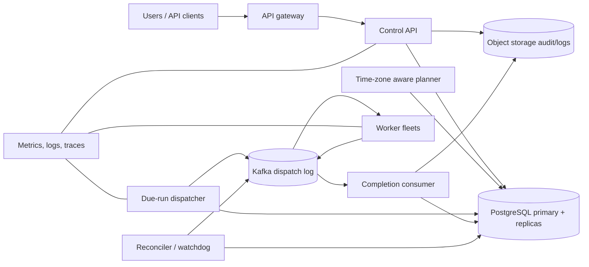

## 1. Problem

We are building a multi-tenant scheduler for data pipelines, billing tasks, notifications, and maintenance jobs. A user can define a cron schedule, submit a one-off run, or compose tasks into a directed acyclic graph (DAG). The scheduler must decide when a run is due and arrange execution on worker fleets; it is not the business worker itself.

Functional requirements:

- Cron expressions, one-off timestamps, and DAG dependencies are supported.
- A run is at-least-once: a worker may receive it again after a timeout or failover.
- Retries use bounded exponential backoff with jitter and end in a dead-letter state after a policy limit.
- Catch-up is explicit: missed occurrences after downtime can be replayed, coalesced, or skipped per schedule.
- Time zones and daylight-saving transitions use IANA zone rules. A local time that occurs twice is represented by a distinct offset; a nonexistent local time follows a declared skip policy.

Non-functional requirements:

- No silent double execution: the platform prevents duplicate *logical dispatches*, while job code must still be idempotent because at-least-once delivery cannot prevent an old worker from finishing late.
- Missed-task detection, audit history, horizontal scale, tenant isolation, and regional disaster recovery.
- Target availability is 99.95% for schedule evaluation and control APIs, with a 99.9% objective for dispatch latency under normal load. A due run should be enqueued within 30 seconds of its due instant at p99.

The users are platform teams and service owners. They need a durable record of what was intended, what was dispatched, which attempt ran, and why a run was skipped or delayed.

## 2. Scale Estimation

Assume 2,000 tenants and 10,000 active schedules. This is a deliberately moderate starting point: it is large enough for operational pressure but small enough that the primary database remains useful for authoritative state. Assume each tenant has 25 daily API actions on average (schedule edits, run queries, and manual triggers).

- API volume = `2,000 DAU x 25 requests/day = 50,000 requests/day`.
- Average API rate = `50,000 / 86,400 = 0.58 RPS`; design for `10x = 5.8 RPS` peak, rounded to 10 RPS for bursts.
- If each schedule produces 100 occurrences/day, occurrence creation is `10,000 x 100 = 1,000,000 occurrences/day`, or `11.6 per second` average. A 10x temporal burst is 116 due events/second.
- Let 2% of occurrences need a retry. Dispatch-attempt events are `1,000,000 x 1.02 = 1.02 million/day`. At 1.5 KB per event, the event log is about `1.53 GB/day`, or `1.67 TB` for three years before compression and replicas.
- Authoritative run rows average 1 KB. With 1.02 million attempts plus metadata, 30-day hot storage is approximately `1.02M x 1 KB x 30 = 30.6 GB`, excluding indexes and replicas; budget 3x, or 92 GB.
- At 5% of runs using 20 KB of logs retained for 30 days, log ingress is `1.02M x 0.05 x 20 KB = 1.02 GB/day`; logs belong in object storage, not the transactional database.
- A 1.5 KB dispatch event at 116 peak events/second is only `174 KB/s` or 1.4 Mbps before replication. We provision 10 Mbps per broker direction to leave room for workflow metadata and bursts.
- The normal attempt-to-control-read ratio is roughly 20:1. Run state is read by the UI and controllers, while attempts are append-heavy.

Growth is forecast at 3x in 18 months: 30,000 schedules and 3 million occurrences/day. We provision for 100,000 due events/second at 100x only after a sharding milestone, rather than pretending the initial cluster has that capacity. The availability target implies no single scheduler process or availability zone may be required for correctness. A regional outage is a recovery objective, not transparent zero-loss active-active behavior: target RPO 5 minutes and RTO 30 minutes.

## 3. API Design

All endpoints require an OAuth2 service or user token. `tenant_id` comes from the authenticated principal and is never trusted from a query parameter. Every mutating request accepts `Idempotency-Key`; the server stores its result for 24 hours, scoped to tenant and endpoint.

`POST /v1/schedules`

```json
{
  "name": "nightly-settlement",
  "cron": "0 2 * * *",
  "timezone": "America/New_York",
  "misfire_policy": "catch_up",
  "max_catch_up": 3,
  "job_ref": "settlement:v4",
  "retry_policy": {"max_attempts": 5, "backoff_seconds": 30, "max_backoff_seconds": 3600}
}
```

`201 Created` returns `schedule_id`, normalized schedule fields, `next_fire_at`, and `version`. The server validates the cron and IANA zone before committing.

`PATCH /v1/schedules/{schedule_id}` updates a schedule with an `If-Match: <version>` header. A stale version returns `409`, preventing an operator from overwriting a concurrent change. `DELETE` disables future occurrences but does not erase audit history.

`POST /v1/schedules/{schedule_id}/runs` creates a manual or one-off run:

```json
{"scheduled_for":"2026-08-20T09:30:00Z","parameters":{"account":"eu"}}
```

The response is `202 Accepted` with `run_id` and `status: "queued"`. It is asynchronous because a worker may not be available and the API should not hold a database transaction open for execution.

`POST /v1/workflows` accepts a DAG of task references and edges. The API rejects cycles, unknown task references, and more than 500 nodes. `GET /v1/runs/{run_id}` returns the run, task states, attempt counters, and timestamps. `POST /v1/runs/{run_id}/cancel` records a cancellation request; workers cooperatively stop, while already completed side effects are not rolled back.

The dispatch contract includes `run_id`, `task_id`, `attempt`, `lease_id`, `fencing_token`, deadline, and a trace ID. A worker acknowledges receipt, renews its lease, and reports completion with the same lease. A completion for an expired lease is rejected as stale and is safe to retry.

## 4. Data Model

PostgreSQL is the source of truth. Times are stored in UTC; the original IANA timezone and user expression are retained for explainability.

```sql
CREATE TABLE schedules (
  tenant_id UUID NOT NULL,
  schedule_id UUID NOT NULL,
  name TEXT NOT NULL,
  cron TEXT,
  timezone TEXT NOT NULL,
  misfire_policy TEXT NOT NULL CHECK (misfire_policy IN ('skip','catch_up','coalesce')),
  max_catch_up INT NOT NULL DEFAULT 3,
  next_fire_at TIMESTAMPTZ,
  enabled BOOLEAN NOT NULL DEFAULT true,
  version BIGINT NOT NULL DEFAULT 1,
  updated_at TIMESTAMPTZ NOT NULL,
  PRIMARY KEY (tenant_id, schedule_id)
);

CREATE TABLE runs (
  tenant_id UUID NOT NULL,
  run_id UUID NOT NULL,
  schedule_id UUID,
  workflow_id UUID,
  scheduled_for TIMESTAMPTZ NOT NULL,
  status TEXT NOT NULL,
  created_at TIMESTAMPTZ NOT NULL,
  PRIMARY KEY (tenant_id, run_id),
  UNIQUE (tenant_id, schedule_id, scheduled_for)
);

CREATE TABLE task_attempts (
  tenant_id UUID NOT NULL,
  run_id UUID NOT NULL,
  task_id UUID NOT NULL,
  attempt INT NOT NULL,
  status TEXT NOT NULL,
  lease_id UUID,
  fencing_token BIGINT,
  available_at TIMESTAMPTZ NOT NULL,
  started_at TIMESTAMPTZ,
  finished_at TIMESTAMPTZ,
  PRIMARY KEY (tenant_id, run_id, task_id, attempt)
);

CREATE INDEX runs_due_idx ON runs (status, scheduled_for);
CREATE INDEX attempts_ready_idx ON task_attempts (available_at)
  WHERE status IN ('READY','RETRY');
CREATE INDEX attempts_run_idx ON task_attempts (tenant_id, run_id);
```

The unique schedule/time key makes a cron calculation idempotent: two evaluators can race, but only one logical run is inserted. The partial ready index serves the dispatcher without scanning completed attempts. The run index serves UI and reconciliation lookups. In production, all large tables are range-partitioned by `created_at` monthly for retention, while the logical shard key is `tenant_id`; this keeps a tenant’s control-plane transaction local and prevents one global due-time index from becoming the write hotspot. A hash of `tenant_id` maps tenants to database shards at higher scale. Cross-tenant reporting is asynchronous.

## 5. High-Level Architecture



The gateway authenticates, rate-limits, and assigns request IDs. The control API owns validation and transactional mutations; read replicas absorb dashboards but never decide whether a run exists. The planner advances each schedule’s next occurrence using timezone rules and creates durable run intents. The dispatcher claims ready attempts in short batches and appends immutable dispatch records to Kafka. Kafka is useful here because the append log decouples a burst of due work from worker availability, supports replay, and exposes consumer lag; it is not the source of truth.

Workers execute business code and must use a job-specific idempotency key such as `(tenant_id, run_id, task_id)`. The completion consumer applies state transitions. The reconciler compares database intent, dispatch records, leases, and completion state, repairing gaps after crashes. Object storage holds verbose logs and immutable audit exports. Metrics and traces are cross-cutting, not an afterthought.

## 6. Deep Dive

**Time and catch-up.** The planner stores the last committed occurrence and computes the next one with a timezone library backed by the IANA database. It never adds 24 hours to a local timestamp. For a repeated DST hour, the policy chooses both offsets or one explicitly; for a nonexistent hour, `skip` records a skipped occurrence and `catch_up` moves it to the next valid instant. A planner transaction locks one schedule row, inserts each bounded run using the unique key, and advances `next_fire_at`. Catch-up is capped so a year-long outage cannot create an unbounded burst; the remainder is reported as missed.

**Horizontal scheduling.** Planners and dispatchers are stateless fleets. They claim work with `SELECT ... FOR UPDATE SKIP LOCKED` on a bounded batch, set a lease expiry, commit, and publish outside the transaction. A crash between commit and publish is repaired by the reconciler through an outbox table or by republishing missing attempt IDs. The preferred implementation writes an outbox row in the same transaction as the state transition; an outbox publisher then delivers it to Kafka and marks it sent. This avoids the database/Kafka dual-write gap.

**Queues, ordering, and backpressure.** Kafka partitions by `tenant_id` for per-tenant ordering and isolation. Global ordering is intentionally not promised. A worker pool has a bounded in-flight count and leases only when it has capacity. Queue depth and oldest message age feed admission control: when age exceeds 20 seconds, new low-priority runs are delayed, while deadline-critical tenants retain reserved capacity. Retries are scheduled in the database with `available_at`, not immediately requeued, so a failing dependency cannot create a tight loop. After five attempts, the task enters `DLQ` and the workflow is blocked or compensated according to policy.

**Exactly-once boundaries.** The scheduler provides at-least-once delivery plus duplicate logical-run suppression. It cannot make an arbitrary HTTP call exactly once. Workers pass an idempotency key to downstream systems; a billing consumer, for example, commits the key and effect in one downstream transaction. Completion uses a compare-and-set on `lease_id` and `fencing_token`. A late worker cannot overwrite a newer attempt. The lease is a liveness mechanism, not proof that the old process stopped.

**DAG execution.** Each task has a dependency count. A completion transaction marks the task successful and decrements dependent counters; when a counter reaches zero, dependent attempts become READY. The transaction also appends an outbox event. A failed task prevents descendants from running unless the workflow declares an alternate branch. This avoids a coordinator holding all DAG state in memory and permits recovery by replaying durable task state.

**Locks and transactions.** Row locks serialize a schedule’s cursor; no long-running worker transaction is held. A fencing token increments whenever a lease is acquired. Workers include it in heartbeats and completion, and the database rejects older tokens. Redis may provide advisory rate-limit counters, but correctness locks live in PostgreSQL because losing Redis must not create two owners. At scale, shard-local transactions remain strong; global analytics are eventually consistent.

**Retries and protection.** Backoff is `min(max_backoff, base * 2^(attempt-1)) + random(0, base)`, capped by the run deadline. Retry only transient classes; invalid parameters go directly to a terminal failure. Per-tenant quotas, per-job concurrency limits, circuit breakers for downstream dependencies, and a global token bucket prevent a bad tenant from exhausting connection pools. API and worker load balancers use health checks and connection draining. Pools are bounded: excess work waits in the queue rather than opening unbounded database connections.

**Caching and storage.** Cache schedule definitions and tenant policy for read-heavy API paths with a short TTL and versioned invalidation. Never cache `next_fire_at` for planner decisions. Redis failure degrades latency and increases database reads; it must not change correctness. Read replicas serve historical run queries with a visible `replica_lag_seconds` indicator. Audit records are append-only and exported to object storage with a retention lock. Old partitions and event segments are deleted only after the retention window and a verified backup.

**Disaster recovery.** A synchronous standby in the primary region supports failover; WAL is replicated asynchronously to a second region. Promotion uses a fencing epoch so an isolated old primary cannot accept writes. On recovery, the planner scans schedules and applies the declared misfire policy. The RPO/RTO targets are explicit because active-active writes would complicate unique run creation, lease ownership, and timezone cursor ordering without helping the ordinary case.

## 7. Consistency Model

Strong consistency is required for schedule version updates, unique `(schedule_id, scheduled_for)` run creation, lease acquisition, fencing-token checks, cancellation state transitions, and task dependency counters. These operations use the shard’s primary and serializable or carefully scoped read-committed transactions.

Eventual consistency is acceptable for dashboards from replicas, metrics, search indexes, audit exports, and Kafka consumer state. The UI labels a newly submitted run as “pending visibility” if the replica has lagged rather than claiming it does not exist.

If a write succeeds but the response is lost, the client retries with the same idempotency key. The API returns the recorded result instead of creating another schedule or run. If a planner crashes after the database commit, the unique constraint makes replay harmless. If a dispatcher crashes after publishing, the same attempt may be delivered again; the worker’s downstream idempotency key and fencing checks handle it. If replication lags during failover, the recovery process may replay up to the declared RPO; audit tooling marks such uncertainty rather than silently asserting exactly-once history.

## 8. Failure Scenarios

| Failure | Impact | Detection | Recovery |
|---|---|---|---|
| Primary database unavailable | Control writes fail; planning and lease changes pause | Connection errors, primary health, transaction latency, replica WAL position | Fail over to synchronous standby; reject writes during fencing; replay planner from durable cursor |
| Kafka consumer stuck or poisoned message | One partition’s completion state and downstream tasks stop advancing | Consumer lag, oldest message age, repeated exception rate | Pause partition, move offending record to DLQ with trace ID, deploy/fix consumer, replay after validation |
| Redis/cache outage | Higher database read load and slower API responses | Cache error rate, hit ratio, DB read IOPS | Bypass cache with request-rate limits; rebuild asynchronously; correctness remains in PostgreSQL |
| Planner process crash after run commit | A due run may not be published promptly | Outbox age, due-versus-dispatched gap, watchdog heartbeat | Another planner claims the schedule; outbox publisher/reconciler republishes idempotently |
| Worker dies after downstream side effect | Duplicate attempt can repeat the side effect | Lease expiry, missing heartbeat, attempt timeout | Retry with downstream idempotency key; stale completion rejected by fencing token |
| Region loss | API and execution unavailable in the region; possible recent writes lost | Regional health checks, WAL shipping age, synthetic probes | Promote secondary, fence old region, replay within 5-minute RPO, apply catch-up policy |
| Hot tenant or schedule | One shard/partition saturates and other tenants see latency | Per-tenant queue depth, shard CPU, partition skew | Apply quotas, split tenant to a dedicated shard, salt high-volume event keys while preserving tenant-local ordering where required |

## 9. Observability

Every API request, planner transaction, dispatch event, worker attempt, and completion carries `trace_id`, `request_id`, `tenant_id`, `run_id`, and `task_id`. Logs are structured; parameters are redacted. A trace links the API decision to the database transaction, Kafka offset, worker execution, and downstream call.

SLIs and alerts include:

- Schedule-evaluation success and control API availability, with a 99.95% monthly SLO.
- `due_to_enqueue_seconds` p50/p95/p99; alert when p99 exceeds 30 seconds for 10 minutes.
- Run and attempt error rates by tenant, job, and terminal reason; this distinguishes bad code from infrastructure failure.
- Kafka consumer lag and oldest-event age; a rising age with normal producer rate signals stuck consumers.
- Ready-queue depth and oldest `available_at`; this signals worker saturation or backpressure.
- Lease-expiry rate and heartbeat failures; this signals worker crashes or network partitions.
- Database commit latency, lock wait time, replication lag, CPU, IOPS, storage, and connection-pool utilization; pool saturation with low CPU usually means leaked or slow connections.
- Cache hit ratio and error rate; a simultaneous hit-ratio drop and DB IOPS spike indicates cache failure.
- Reconciliation gap: durable READY attempts without an outbox/dispatch record, and dispatched attempts without a terminal result.

Dashboards must support tenant drill-down and show skipped, coalesced, and misfired occurrences separately. Alerts page on customer impact, not on every retry. Synthetic schedules in each supported timezone exercise DST, failover, and end-to-end latency.

## 10. Capacity Planning

For the initial 116 peak due events/second, use 3 planner instances across three zones, each sized for 100 events/second, and 4 dispatcher instances at 150 claims/second. This leaves more than 2x headroom after one instance fails. Six worker consumers at 25 concurrent tasks each provide 150 in-flight tasks; actual worker fleet size is driven by task runtime, not event rate.

Kafka uses 12 partitions initially: at an observed safe 50 events/second per partition, capacity is 600 events/second, over 5x the 116 peak. Six consumers can share partitions; scale consumers only up to partition count. Increase partitions before the 3x growth point, recognizing that partition-key changes affect ordering.

PostgreSQL starts with 8 vCPU, 32 GB RAM, 1,000 provisioned IOPS, one synchronous standby, and two read replicas. If each due-row claim takes 4 ms of primary time, 116 claims/second consumes about `0.464 CPU-seconds/second`, or 46% of one core before other transactions; batching 50 rows and indexing the partial ready set reduces this. A 100-connection pool across 10 application processes would overload an 8-vCPU database, so use 8 application processes with 8 connections each (64 total), reserving connections for migrations and reconciliation.

Hot storage budget is 92 GB for 30 days of attempts plus roughly 30 GB for schedules, indexes, and safety margin; provision 250 GB usable. Event storage is about 1.67 TB for three years before compression/replicas, so use tiered Kafka retention and object storage for the immutable audit stream. Redis needs 2 GB for 10,000 schedules, policy objects, keys, and 3x overhead; provision a 6 GB replicated cluster.

At 3x growth, increase to 24 Kafka partitions, 12 consumers, and shard PostgreSQL by tenant hash across three primaries. At 100x, the global due index and single planner namespace are the first redesign targets: maintain per-shard timing wheels or bucketed due queues, use a coordinator only for shard ownership, and keep reconciliation shard-local. Capacity tests must include a 10x DST burst, retries from a failing dependency, and one-zone loss.

## 11. Bottlenecks and Evolution

The first bottleneck is usually the primary database’s due-row scan and lock contention, not the HTTP API. The partial ready index, bounded claims, monthly partitions, and planner cursor keep it tractable. The next bottleneck at 10x is Kafka partition skew from a large tenant and completion-consumer lag; tenant quotas, partition expansion, and shard-local consumers address it.

At 100x, a single database primary cannot own all schedule cursors and audit writes. Split control state by tenant hash, place an outbox beside each shard, and run independent planner/dispatcher groups. Use a compact time-bucket index or timing wheel per shard rather than polling every schedule. Keep a separate analytical stream for cross-tenant reports. A future push-based worker protocol can reduce polling, but the durable lease and outbox remain the correctness boundary.

Evolution should be measured by queue age, lock waits, partition skew, and reconciliation gaps. Adding machines without these measurements can hide a bad retry policy or an unbounded tenant.

## 12. Trade-offs

| Decision | Option A | Option B | Decision | Why |
|---|---|---|---|---|
| Primary store | SQL | NoSQL | SQL initially | Transactions, unique run keys, and DAG state transitions matter more than schema flexibility |
| Event transport | Kafka | RabbitMQ | Kafka | Replayable append log and lag visibility fit dispatch; RabbitMQ may be preferable for small low-latency queues |
| Cache | Redis | Database cache | Redis for reads only | TTL and invalidation are practical; correctness does not depend on it |
| Execution API | Synchronous | Asynchronous | Asynchronous | Workers and retries outlive HTTP requests |
| Regional topology | Active-active | Active-passive | Active-passive | Simpler lease fencing and unique scheduling; accept explicit RPO |
| Sharding | Range by time | Hash by tenant | Hash by tenant, time partitions inside | Tenant isolation avoids hot global time ranges; time partitions control retention |
| Worker wake-up | Polling | Push | Polling plus leases initially | Durable and easy to recover; push can reduce latency at high scale |
| Service protocol | REST | gRPC | REST control plane, Kafka worker contract | REST is accessible to operators; event contract decouples worker languages and versions |

## 13. Production Checklist

- Validate cron, IANA timezone, DST behavior, catch-up cap, and schedule version conflicts.
- Verify unique run creation and idempotency-key replay after lost responses.
- Test lease expiry, fencing tokens, late completions, duplicate delivery, and downstream idempotency.
- Exercise DB failover, Kafka partition pause, poisoned-message DLQ, cache bypass, and regional promotion.
- Confirm due-to-enqueue p99, consumer lag, queue age, reconciliation gaps, and replica lag alerts.
- Load-test 10x peak, retry storms, hot tenants, connection-pool limits, and one-zone loss.
- Verify backups, WAL restore, audit retention lock, partition deletion, and RPO/RTO measurements.
- Confirm tenant quotas, priority reservations, secret rotation, access controls, redacted logs, and operator audit trails.

## 14. Engineering References

1. **Company:** Google SRE. **Article title:** *The Site Reliability Engineering Book: Table of Contents*. **URL:** https://sre.google/sre-book/table-of-contents/ . **Key engineering lesson:** Reliability is an explicit engineering target measured with SLOs, error budgets, and operational practices rather than an implicit promise. **How it influenced this design:** The design makes availability, dispatch latency, RPO/RTO, alerts, and capacity headroom measurable.
2. **Company:** Netflix Tech Blog. **Article title:** *Netflix Tech Blog*. **URL:** https://netflixtechblog.com/ . **Key engineering lesson:** Large distributed services isolate failure domains, automate recovery, and use telemetry to operate asynchronous systems. **How it influenced this design:** Leases, reconciliation, regional fencing, bounded queues, and failure-oriented tests are first-class components.
3. **Company:** AWS Architecture Blog. **Article title:** *AWS Architecture Blog*. **URL:** https://aws.amazon.com/blogs/architecture/ . **Key engineering lesson:** Resilient architectures make retry, backpressure, decoupling, and disaster-recovery objectives deliberate choices. **How it influenced this design:** The outbox, retry jitter, queue-age admission control, tiered retention, and explicit RPO/RTO follow that principle.
4. **Company:** Uber Engineering. **Article title:** *Uber Engineering Blog*. **URL:** https://www.uber.com/blog/engineering/ . **Key engineering lesson:** Multi-tenant, high-throughput platforms evolve through partitioning, operational ownership, and workload-aware scaling. **How it influenced this design:** Tenant-hash sharding, per-tenant quotas, partition-skew metrics, and a staged 3x/100x evolution path are part of the initial model.
