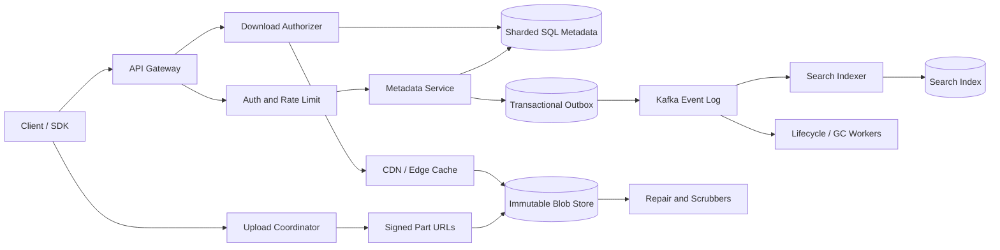

## 1. Problem

We are building a multi-tenant object store for product users, internal services, and automation. A client should be able to upload a 4 GB video from an unreliable mobile connection, resume it after a process restart, retrieve an older version, and create a link that expires tomorrow. A service should be able to find objects by tenant-owned metadata without scanning the blob bytes.

Functional requirements:

- Multipart upload and download, including resumable ranges and parallel parts.
- Immutable object versions. A logical key such as `reports/2026.pdf` may point to a new version while old versions remain addressable.
- Content deduplication within a tenant, without allowing one tenant to infer another tenant's data.
- Authenticated reads and short-lived sharing links with TTL and optional download limits.
- Search over explicitly indexed metadata: tenant, key prefix, content type, tags, size, and creation time.
- Delete, restore, lifecycle expiration, and audit events.

The non-functional contract is more important than an attractive upload API:

- At least 99.999999999% annual durability for committed bytes. This is a durability objective, not a promise that every request is available during a regional disaster.
- 99.99% monthly availability for metadata APIs and 99.9% for data transfer, with a documented degraded mode.
- Objects range from kilobytes to 5 TB. The metadata plane must not carry object payloads.
- Horizontal capacity growth, CDN edge caching for public or shared reads, checksum verification at every storage boundary, and tenant isolation.
- A successful retry must not create a second logical version or charge a client twice.

The key boundary is therefore two planes: a transactional metadata/control plane and an immutable blob/data plane. The former decides what an object means; the latter stores bytes efficiently.

## 2. Scale Estimation

Assumptions are intentionally explicit so that they can be replaced by product telemetry:

| Quantity | Assumption | Reason |
|---|---:|---|
| Daily active users | 10 million | A large consumer/work collaboration product |
| Object API operations per active user/day | 20 | 8 reads, 2 writes, 10 metadata/list/link actions |
| New logical objects/day | 5 million | Not every API operation creates an object |
| Average new object size | 20 MB | Mix of documents, photos, and short media; large files are a minority |
| Read:write object-byte ratio | 5:1 | Shared assets are downloaded repeatedly |
| Peak multiplier | 10x average | Workday and launch-event concentration |
| Retention | 3 years | Versioning and recovery policy |
| Multipart part size | 64 MiB | Good retry granularity without excessive manifest rows |

Request math:

```text
10,000,000 DAU x 20 operations/day = 200,000,000 operations/day
200,000,000 / 86,400 = 2,315 average API requests/second
2,315 x 10 = 23,150 peak API requests/second
```

Writes create `5,000,000 x 20 MB = 100 TB/day` of logical payload. With 3-year retention:

```text
100 TB/day x 365 x 3 = 109,500 TB = 109.5 PB logical bytes
```

If tenant-local deduplication removes 25% of repeated content, physical primary bytes are 82.1 PB. Three independently stored copies or erasure-coded equivalent at an average 1.5x overhead produce about 123.1 PB in the primary region. A second region with the same durability policy doubles the capacity requirement to approximately 246 PB. Metadata is smaller but not negligible: 5 million object versions/day x 1.2 KB average row footprint is 6 GB/day before indexes, or about 6.6 TB over three years including a 1.2x index/row overhead. Multipart manifests and part records add roughly 10%.

The 5:1 byte read ratio means roughly `500 TB/day` egress from origin before CDN. That is:

```text
500 TB x 8 / 86,400 = 46.3 Gbit/s average origin egress
46.3 x 10 = 463 Gbit/s peak origin egress
```

CDN hit rate of 70% would lower peak origin transfer to about 139 Gbit/s, but the edge still needs to serve the full 463 Gbit/s. The sizing target is therefore both CDN-scale bandwidth and origin protection, not merely application RPS. At 99.99% monthly availability, the error budget is about 4.32 minutes/month; durability is measured independently through repair, checksum, and loss-budget telemetry.

## 3. API Design

All endpoints use HTTPS and require a tenant-scoped bearer token except a share URL. `Idempotency-Key` is mandatory on mutating operations. The server binds the key to tenant, endpoint, request hash, and result for 24 hours; reusing it with a different request returns `409`.

### Create an upload

```http
POST /v1/tenants/{tenant_id}/uploads
Authorization: Bearer <token>
Idempotency-Key: 01J...
Content-Type: application/json

{
  "key": "videos/demo.mp4",
  "size": 4294967296,
  "content_type": "video/mp4",
  "content_sha256": "optional-final-sha256",
  "metadata": {"project": "demo", "classification": "internal"},
  "dedup_scope": "tenant"
}
```

```json
{
  "upload_id": "upl_7f3",
  "object_id": "obj_91a",
  "version_id": "ver_2b1",
  "part_size": 67108864,
  "expires_at": "2026-08-16T10:00:00Z"
}
```

The control plane reserves a version but does not make it visible. The client uploads each part directly to a signed data-plane URL:

```http
PUT /v1/uploads/upl_7f3/parts/42
Content-Length: 67108864
Content-Digest: sha-256=:...:
```

The response includes the server-observed checksum and an opaque `ETag`. `PUT /v1/uploads/{upload_id}/parts/{part_number}` may be retried safely because a part number is unique within an upload and a different checksum returns `409`.

### Complete or abort

```http
POST /v1/uploads/upl_7f3/complete
Idempotency-Key: 01J...

{"parts":[{"number":1,"sha256":"..."},{"number":2,"sha256":"..."}]}
```

The service verifies part membership, checksums, declared size, and final digest, then atomically transitions the version from `UPLOADING` to `COMMITTED`. A repeated completion returns the original version result. `DELETE /v1/uploads/{upload_id}` aborts an upload; a sweeper also expires abandoned uploads.

### Read and list

```http
GET /v1/tenants/{tenant_id}/objects/{key}?version_id=ver_2b1
Range: bytes=0-67108863
```

The API returns a redirect to a signed, range-capable data URL or streams through the gateway for policy enforcement. `GET /v1/tenants/{tenant_id}/objects?prefix=videos/&limit=100&cursor=...` lists committed versions. Listing is cursor-based and bounded; it never promises an unbounded directory.

```http
POST /v1/tenants/{tenant_id}/shares
Idempotency-Key: 01J...

{"version_id":"ver_2b1","ttl_seconds":86400,"max_downloads":3}
```

The response contains a random, non-enumerable token. `GET /s/{token}` checks revocation, expiry, and download count before issuing a short-lived CDN URL. The share token is not the object key and is stored hashed.

### Metadata search and lifecycle

```http
POST /v1/tenants/{tenant_id}/search

{"filters":{"content_type":"video/mp4","tags":{"project":"demo"},"size_gte":1000000},"sort":"created_at_desc","limit":50,"cursor":"..."}
```

Search is eventually consistent and only covers declared fields. `POST /v1/tenants/{tenant_id}/lifecycle-rules` defines age or tag-based transitions to cold storage and deletion. Authorization checks tenant, role, object policy, and legal hold before any data-plane URL is minted.

## 4. Data Model

The source of truth is a sharded SQL metadata store. Blob bytes live in immutable segments addressed by hash; the SQL database stores references, not bytes.

```sql
CREATE TABLE object_versions (
  tenant_id       BIGINT NOT NULL,
  object_id       UUID NOT NULL,
  version_id      UUID NOT NULL,
  object_key      TEXT NOT NULL,
  state           TEXT NOT NULL CHECK (state IN ('UPLOADING','COMMITTED','DELETING','DELETED')),
  size_bytes      BIGINT NOT NULL CHECK (size_bytes >= 0),
  content_sha256  BYTEA NOT NULL,
  content_type    TEXT NOT NULL,
  metadata        JSONB NOT NULL DEFAULT '{}',
  created_at      TIMESTAMPTZ NOT NULL,
  committed_at    TIMESTAMPTZ,
  legal_hold      BOOLEAN NOT NULL DEFAULT FALSE,
  PRIMARY KEY (tenant_id, object_id, version_id)
);

CREATE UNIQUE INDEX current_key ON object_versions (tenant_id, object_key)
  WHERE state = 'COMMITTED';
CREATE INDEX versions_by_key ON object_versions (tenant_id, object_key, created_at DESC);
CREATE INDEX versions_by_sha ON object_versions (tenant_id, content_sha256);
```

The partial unique index guarantees one current committed version per logical key; historical versions remain in the second index. The tenant prefix is present in every index to prevent cross-tenant scans and to support tenant-level authorization.

```sql
CREATE TABLE blob_chunks (
  tenant_id       BIGINT NOT NULL,
  chunk_sha256    BYTEA NOT NULL,
  size_bytes      INT NOT NULL,
  storage_class   TEXT NOT NULL,
  replica_state   TEXT NOT NULL,
  ref_count       BIGINT NOT NULL DEFAULT 0,
  PRIMARY KEY (tenant_id, chunk_sha256)
);

CREATE TABLE version_chunks (
  tenant_id       BIGINT NOT NULL,
  version_id      UUID NOT NULL,
  part_number     INT NOT NULL,
  chunk_sha256    BYTEA NOT NULL,
  offset_bytes    BIGINT NOT NULL,
  size_bytes      INT NOT NULL,
  PRIMARY KEY (tenant_id, version_id, part_number)
);

CREATE TABLE upload_parts (
  tenant_id       BIGINT NOT NULL,
  upload_id       UUID NOT NULL,
  part_number     INT NOT NULL,
  chunk_sha256    BYTEA NOT NULL,
  size_bytes      INT NOT NULL,
  state           TEXT NOT NULL,
  PRIMARY KEY (tenant_id, upload_id, part_number)
);
```

`blob_chunks` is tenant-scoped intentionally: global deduplication can leak existence through timing or authorization mistakes. A content hash is an address and an integrity check, not an authorization grant. `version_chunks` reconstructs an object in order and lets garbage collection find unreferenced chunks. `upload_parts` gives resumable progress an idempotent key.

Other entities are `share_links(share_hash PK, tenant_id, version_id, expires_at, max_downloads, used_count, revoked_at)`, `idempotency_records(tenant_id, key, request_hash, status, response, expires_at)`, and an outbox table keyed by `(tenant_id, event_id)`. The shard key is `tenant_id` for isolation and predictable tenant queries; within a very large tenant, `hash(object_id)` is a subpartition. Search has a separate index projection keyed by tenant and time, fed from the outbox.

## 5. High-Level Architecture



The gateway authenticates requests, normalizes keys, applies quotas, and emits request IDs. It does not proxy normal multi-gigabyte payloads because doing so consumes application connections and memory. The metadata service owns version state, idempotency, authorization decisions, and signed URL issuance. Sharded SQL provides transactions for these small records.

The upload coordinator calculates part URLs and records completion. The immutable blob store is optimized for large sequential reads, independent capacity scaling, and replication or erasure coding. Content-addressed chunks allow deduplication and make scrubber checks precise. The CDN absorbs repeated reads close to users, while the download authorizer ensures a cache key cannot bypass tenant or share policy.

Kafka is the durable change stream, not the commit path for a successful upload. The outbox makes the SQL state transition and event publication recoverable. Search, lifecycle, notifications, and garbage collection consume independently. Repair workers continuously compare stored checksums with manifests and rebuild missing replicas.

## 6. Deep Dive

### Multipart transfer and commit

The client asks for a part size based on object size and uploads directly to the nearest healthy ingress. Each part carries a checksum; the ingress verifies it before acknowledging durable staging. A completion request names every part. The coordinator rejects gaps, duplicate part numbers, incorrect lengths, or a final digest mismatch. Only after all chunks meet the replication policy does SQL mark the version `COMMITTED`. A client may see an upload as pending while repair catches up; it must not see a partially committed object.

The commit transaction inserts `version_chunks`, increments chunk references, changes the version state, updates the current-key pointer, and writes an outbox event. If this transaction fails, no public version exists. If it succeeds but the HTTP response is lost, the same idempotency key or a `GET upload` query returns the committed result rather than creating another version.

### Deduplication without a correctness shortcut

The write path hashes chunks and looks up `(tenant_id, chunk_sha256)`. A hit can avoid storing bytes, but the reference count and version reference must be changed transactionally or repaired by a reconciliation job. The store uses a short-lived `PENDING` chunk state so two writers racing on the same hash do not publish a pointer before bytes are verified. A hash collision is extraordinarily unlikely with SHA-256 but is still handled by comparing size and sampled/full bytes when policy requires it.

Deduplication is not a reason to skip encryption boundaries. Per-tenant encryption keys and tenant-scoped hashes preserve isolation. If cross-tenant deduplication is later required, it needs an explicit side-channel and confidentiality review.

### Scaling and hot keys

API servers are stateless and scale behind a layer-7 load balancer. Upload and download bytes bypass them. Metadata shards partition by tenant; a tenant that generates a hot prefix is spread by object ID for point operations, while prefix listings use a time-bucketed index and continuation tokens. A single popular object is served by CDN and origin request coalescing; otherwise one hash or key could overload a metadata row or a storage gateway.

SQL uses a primary for transactions and read replicas for list/search-adjacent reads. Reads that follow a write carry a minimum commit sequence; the router sends them to a replica caught up to that sequence or to the primary. Rebalancing moves whole tenant partitions through a dual-write or change-capture process, with a checksum comparison before cutover.

### Queues, backpressure, and ordering

The outbox publisher uses bounded batches and retries with exponential backoff plus jitter. Kafka partitions use a stable hash of `tenant_id` and event type; events for one version are ordered, but global ordering is deliberately not promised. Consumers checkpoint only after the side effect is durable. A stuck consumer is detected by lag age, not just message count. After bounded retries, a poison event goes to a DLQ with the original payload, error, schema version, and correlation ID. Replay is an explicit, audited operation.

Workers use a token bucket for storage reads and a bounded work queue. When repair falls behind, lifecycle deletion yields to repair and API admission returns `429` for new bulk jobs. This is preferable to allowing background work to starve foreground reads. Retries are limited by a deadline; a retry of a timed-out storage request can be in flight while the first succeeds, so operations are keyed by part or repair task ID.

### Caching, links, and rate limits

The CDN caches immutable version URLs using `version_id` and checksum in the cache key. A mutable logical key is resolved by the authorizer first and should have a short cache lifetime. Share links are authorized at issuance and again at redemption; a revocation check is cached only for a few seconds. The edge never caches a response that includes an unbounded private authorization decision.

Rate limits are hierarchical: per IP for anonymous redemption, per user and tenant for API requests, and per tenant for bytes and concurrent multipart uploads. Limits are enforced at the gateway and again at the storage ingress because clients can otherwise bypass a single layer. A distributed token bucket in Redis is useful for approximate, high-throughput admission; quota accounting that changes billing uses SQL ledger records.

Connection pools are bounded per instance. With 100 API instances and a 40-connection pool, the theoretical 4,000 connections must fit below each database shard's connection and query budget. A pool timeout is surfaced as overload rather than creating unbounded sockets. Load balancing uses least outstanding requests for metadata and locality-aware routing for data ingress.

### Locks, transactions, and garbage collection

The current-key update is protected by a database constraint and transaction, not a long-lived distributed lock. A short lease may serialize lifecycle transitions for one object, but lease expiry and fencing tokens are required. No lock is held while transferring bytes. The outbox is the transaction boundary for downstream effects.

Deletion first marks a version `DELETING`, removes it from the current-key view, and emits a tombstone. A grace period allows restoration and lets delayed readers finish. Garbage collection scans `version_chunks`, subtracts references idempotently, and deletes a chunk only after a second mark-and-sweep pass. Legal holds and retention policies override ordinary deletion.

### Disaster recovery

The primary region stores data with independent failure domains and continuously scrubs checksums. Metadata is synchronously replicated within a region and asynchronously replicated to a second region with an ordered log. The target is RPO under 15 minutes for metadata and committed object bytes, with RTO under 60 minutes for a regional failure. During failover, the control plane may be read-only until the replica's log position is fenced; serving a stale pointer is worse than returning `503` for a private object.

## 7. Consistency Model

The system is deliberately mixed-consistency:

| Operation | Guarantee | Behavior |
|---|---|---|
| Complete upload | Strong within region | A committed version is atomically visible with its manifest and checksum. |
| Read by exact `version_id` | Read-after-write | Router waits for a replica sequence or uses primary. |
| Read by mutable key | Strong on primary, bounded stale on replicas | A client can request `consistency=strong`; normal reads may lag briefly. |
| List and metadata search | Eventual | Outbox/index lag is exposed as a metric and in response metadata. |
| Share revocation | Bounded eventual at CDN, strong at authorizer | Revocation propagates within the cache TTL; sensitive tenants can bypass edge cache. |
| Delete | Tombstone-first | Old CDN objects expire or are purged; legal hold can reject deletion. |

If completion succeeds but its response is lost, the idempotency record and upload lookup return the same `version_id`. If a part `PUT` times out, retrying the same part number and checksum is safe. If the checksum differs, the server refuses the overwrite, forcing a new upload or explicit part replacement before completion. A dedup hit never means “the caller may read this hash”; authorization still resolves through the tenant's version reference.

Replication lag is returned as `X-Metadata-Commit-Sequence` and `X-Read-Sequence`. A client requiring read-after-write supplies the commit sequence. The service either waits up to a deadline or returns `503 consistency_timeout`, avoiding silent stale reads.

## 8. Failure Scenarios

| Failure | Impact | Detection | Recovery |
|---|---|---|---|
| SQL shard primary unavailable | Metadata writes fail or become read-only; bytes already in the blob store remain intact | Primary health checks, transaction error rate, pool timeout, replica apply position | Promote a fenced replica, replay outbox, retry idempotent requests; return `503` rather than exposing uncertain commits |
| Kafka consumer stuck on a poison schema/event | Search or GC stops advancing for affected partition | Lag age, no checkpoint movement, DLQ rate | Pause partition, send event to DLQ after bounded retries, deploy/fix consumer, replay from recorded offset |
| CDN or Redis cache failure | Higher origin egress and share redemption latency; no data loss | CDN hit ratio, origin bandwidth, Redis timeout and fallback rate | Bypass cache with strict origin rate limits; use authorizer/SQL for correctness; restore cache gradually |
| Region loses storage ingress | Uploads in region fail and reads may become slow | Regional error budget burn, health probes, checksum/replication alerts | Route new traffic to the other region, finish from replicated manifests, fence stale writers, reconcile after recovery |
| Blob replica silently corrupts a segment | A subset of reads may fail checksum validation | Scrubber mismatch, client checksum failure, replica divergence | Quarantine replica, reconstruct from other replicas/erasure fragments, alert if repair budget is exceeded |
| Client retries after response loss | Duplicate version or duplicate charge is possible without idempotency | Same request hash/key seen multiple times | Return stored idempotency result; reject key reuse with a different request hash |
| Repair queue overwhelms storage | Foreground reads and writes experience latency spikes | Queue depth, oldest task age, storage IOPS saturation | Apply token-bucket backpressure, prioritize under-replicated data, pause cold lifecycle jobs |
| Hot tenant or popular object | One shard, key, or origin path saturates | Per-tenant RPS/bytes, shard p99, CDN miss concentration | Split tenant subpartitions, coalesce origin requests, raise edge TTL for immutable versions |

## 9. Observability

Every request gets a generated or validated `trace_id`, `request_id`, and tenant-safe correlation ID. Logs contain operation, tenant hash, object/version ID, idempotency key hash, outcome, bytes, checksum result, retry count, and policy decision; they never contain bearer tokens or raw share tokens. Traces cover gateway, metadata SQL, outbox publish, URL signing, blob ingress, and CDN origin fetch.

SLIs and alerts:

| Signal | SLI / alert meaning |
|---|---|
| API availability and error rate | Alert on 5-minute burn of the 99.99% metadata SLO; separate `4xx` policy errors from `5xx`. |
| p50/p95/p99 metadata latency | p99 increase with pool wait indicates DB saturation; p99 only on one shard suggests a hot partition. |
| Upload completion latency | High p99 with normal SQL latency points to blob replication or checksum verification. |
| CDN hit ratio and origin egress | Falling hit ratio predicts bandwidth cost and origin overload before request failures. |
| Kafka lag age and checkpoint rate | Age identifies stale search/GC; checkpoint flatness identifies a stuck consumer. |
| Queue depth and oldest task age | Shows repair or lifecycle backpressure and whether the queue can drain within its SLA. |
| DB connections, pool wait, CPU, IOPS, replica lag | Distinguishes connection exhaustion, compute saturation, storage saturation, and stale reads. |
| Under-replicated bytes and scrub mismatch rate | Direct durability health; page before the loss budget is consumed. |
| 429 rate and concurrent uploads | Indicates quota pressure or deliberate admission control, not necessarily a server fault. |

Dashboards must break down all latency and error metrics by tenant tier, region, storage class, endpoint, and status. Synthetic probes perform a small multipart upload, checksum-verified range read, search, and share redemption in each region. SLOs include durability repair time and search freshness, not only HTTP success.

## 10. Capacity Planning

The following is an initial production allocation with 30% headroom over the 10x peak calculations:

| Component | Calculation | Initial capacity |
|---|---|---:|
| Metadata API | 23,150 peak RPS / 300 RPS per instance / 0.70 target utilization | 111 instances; deploy 120 |
| Metadata SQL shards | 23,150 x 20% metadata writes and reads / 2,000 sustainable ops/s / 0.70 | 4 primary shards plus 2 standby capacity; begin with 8 shards for tenant isolation |
| Redis admission cache | 10 million active token buckets x 200 B plus replicas | About 4 GB logical; deploy 12 GB usable per region |
| Kafka | 5 million versions/day = 58 events/s average; 10x plus retries and lifecycle events | 96 partitions, 3 replicas, 12 brokers with 10 TB usable each |
| Search consumers | 580 peak events/s / 50 events/s per consumer / 0.70 | 17 consumers; deploy 20 |
| DB connections | 120 instances x 40 max = 4,800 theoretical | Cap at 4,000 total; route 500 connections/shard across primary/read replicas and use pool timeout |
| Primary blob capacity | 109.5 PB logical x 0.75 dedup x 1.5 redundancy | 123.2 PB, plus 20% free-space reserve = 148 PB |
| Two-region blob capacity | 148 PB x 2 | 296 PB provisioned |
| Origin bandwidth | 463 Gbit/s peak x 30% miss rate x 1.3 headroom | 181 Gbit/s provisioned per region, with burst contracts |

The metadata API figure assumes one instance can sustain 300 mixed requests/s at the chosen p99 target. Load tests must validate that number with real authorization, SQL, and signing work. Storage is purchased in failure-domain units, not as one pool: a 20% reserve is needed for rebuilds, uneven tenant growth, and compaction. If average object size falls, object count and metadata/index cost grow even when byte capacity does not.

The 64 MiB part size means a 4 GB upload has 64 parts. At 10,000 simultaneous 4 GB uploads, the coordinator tracks 640,000 part rows, a manageable hot working set, while the data plane carries about 5.1 Gbit/s of ingress if spread over 10 minutes. Per-tenant concurrent-upload quotas prevent one customer from consuming all coordinator memory.

## 11. Bottlenecks and Evolution

The first bottleneck is usually origin bandwidth and hot-object fan-out, not Kafka. CDN adoption, immutable cache keys, and origin coalescing are the first redesign levers. The next is metadata concentration: a few enterprise tenants can overload a shard even when fleet averages look healthy. Tenant subpartitioning and online movement address that before adding a new database technology.

At 10x, 100 million DAU would imply 231,500 peak API RPS, 1 PB/day logical writes, and roughly 4.6 Tb/s peak origin-equivalent reads before caching. The system needs regional metadata cells, a globally routed control plane, larger Kafka fleets, and storage namespaces split by tenant cohorts. Search should be independently scalable and allowed to be stale by an explicit freshness SLO.

At 100x, a single global SQL namespace is the wrong abstraction. Use a cell per geography or tenant cohort, a global directory mapping tenant to home cell, and an asynchronous replication fabric for disaster recovery. Objects remain immutable and portable; metadata migrations copy manifests and verify checksums before changing directory ownership. Active-active writes require conflict-free version IDs and a conflict policy for the same logical key, so active-passive is safer until product semantics justify the complexity.

The long-term target is a cell-based metadata plane, multi-CDN edge delivery, erasure-coded cold tiers, a separate quota ledger, and a searchable event projection. The invariant remains unchanged: only a transactionally committed manifest can make immutable bytes visible.

## 12. Trade-offs

| Decision | Option A | Option B | Decision | Why |
|---|---|---|---|---|
| Metadata database | SQL | NoSQL | SQL first | Version visibility, idempotency, uniqueness, and outbox need transactions; shard SQL by tenant. |
| Event transport | Kafka | RabbitMQ | Kafka | Replayable ordered partitions suit search, GC, and audit fan-out; RabbitMQ is preferable for small work queues with per-message routing. |
| Hot cache | Redis | Database cache | Redis | Distributed rate limits and short-lived share state need low latency; SQL remains the correctness source. |
| Completion path | Synchronous | Asynchronous | Synchronous metadata commit, async projections | The caller needs a clear committed/not-committed result; search and lifecycle can lag. |
| Regional topology | Active-active | Active-passive | Active-passive initially | Fencing and same-key conflicts make active-active costly; failover RPO/RTO are explicit. |
| Sharding | Range | Hash | Hash tenant key plus time/index buckets | Hash avoids hot tenant ranges; range/time buckets make bounded listings and retention scans efficient. |
| Change delivery | Polling | Push | Outbox to Kafka push | Lowers search freshness and database polling load; consumers still replay from durable offsets. |
| Service protocol | REST | gRPC | REST externally, gRPC internally | Browser and SDK compatibility matter at the edge; typed internal calls reduce serialization overhead. |

The choices are not universal. For a small deployment, SQL plus an object-storage product and a managed CDN may be safer than operating every worker. The design becomes custom only where tenant semantics, deduplication, or lifecycle policy require control.

## 13. Production Checklist

- [ ] Every mutation has tenant authorization, request hashing, and an idempotency test.
- [ ] Multipart parts verify size and checksum before acknowledgment.
- [ ] Completion cannot expose a partial manifest and is safe after response loss.
- [ ] Current-key uniqueness, version retention, legal hold, and delete tombstones are covered by transaction tests.
- [ ] Blob replicas span independent failure domains; scrub and repair drills have passed.
- [ ] CDN cache keys cannot bypass share expiry, revocation, or tenant policy.
- [ ] Gateway and storage-ingress rate limits protect both request and byte budgets.
- [ ] Outbox, Kafka offsets, DLQ replay, and schema compatibility are tested.
- [ ] Backpressure pauses low-priority lifecycle work before foreground SLOs burn.
- [ ] Dashboards show p99, pool wait, replica lag, queue age, CDN hit rate, and under-replicated bytes.
- [ ] Regional failover, stale-read fencing, restore, and checksum reconciliation are exercised.
- [ ] Capacity tests include hot tenants, one popular object, 5 TB uploads, and 10x peak traffic.

## 14. Engineering References

1. **Google, _Google SRE Book: Table of Contents_**  
   URL: https://sre.google/sre-book/table-of-contents/  
   Key engineering lesson: Availability targets are meaningful only when paired with measurable SLIs, error budgets, and operational response.  
   How it influenced this design: The article separates availability from durability, defines a 4.32-minute monthly metadata error budget, and alerts on budget burn and repair health.

2. **Google Research, _Publications_**  
   URL: https://research.google/pubs/  
   Key engineering lesson: Large-scale systems research treats replication, partitioning, and failure as first-class design dimensions.  
   How it influenced this design: The metadata/data-plane split, bounded consistency, and explicit regional RPO/RTO are designed as failure and scale properties rather than implementation afterthoughts.

3. **Cloudflare, _Cloudflare Blog_**  
   URL: https://blog.cloudflare.com/  
   Key engineering lesson: Edge caching and locality can reduce origin work, but cache keys and invalidation are part of correctness.  
   How it influenced this design: Immutable version URLs are cacheable, mutable keys are short-lived, and share authorization is checked before issuing an edge URL.

4. **AWS, _AWS Architecture Blog_**  
   URL: https://aws.amazon.com/blogs/architecture/  
   Key engineering lesson: Durable object systems need independent failure domains, integrity validation, lifecycle tiers, and operational automation.  
   How it influenced this design: Multipart direct transfer, checksum scrubbing, redundancy reserves, lifecycle workers, and repair-before-delete are explicit parts of the architecture.
