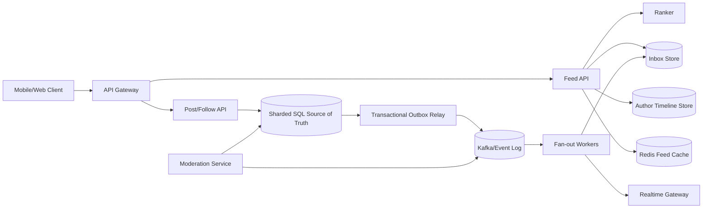

## 1. Problem

We are building the home feed for a social product. A user follows authors, opens the home screen, and expects a ranked stream of posts from those authors. A post should normally become visible within 30 seconds, while the first page should load in p95 under 300 ms. A user can refresh or paginate without seeing duplicates or losing items because the ranking changed between requests.

The users are readers, authors, and internal ranking/abuse systems. Functional requirements are:

- create, delete, and retrieve posts;
- follow and unfollow authors;
- aggregate followed authors' posts and rank them per reader;
- paginate with an opaque cursor;
- insert newly eligible posts into an active feed without corrupting pagination;
- hide deleted, blocked, or policy-removed content.

The workload is read-heavy, approximately 1,000 feed reads per post write. Read latency and freshness are both important, but a few seconds of staleness is acceptable. Ranking is personalized and may change as features arrive. We therefore avoid promising a globally identical order. We promise a stable page boundary, no intentional duplicates, and monotonic visibility of committed content within a reader's chosen snapshot.

The central decision is where aggregation happens. Fan-out-on-write copies a post into each follower's inbox and makes reads cheap, but celebrity authors can create millions of writes. Fan-out-on-read avoids that amplification, but a reader following many authors pays the merge cost on every request. The design below uses both paths.

## 2. Scale Estimation

Assumptions are explicit so capacity can be recomputed rather than treated as a prediction:

| Quantity | Assumption | Calculation / result |
|---|---:|---:|
| Daily active users | 50 million | Product target |
| Feed requests per active user/day | 20 | 50M x 20 = 1 billion requests/day |
| Average feed RPS | 1B / 86,400 | 11,574 RPS |
| Peak factor | 10x average | 115,740 RPS; provision for 150k RPS |
| New posts/day | 1 million | One post per 50 DAU per day is a conservative write baseline for a read-heavy feed |
| Post write RPS | 1M / 86,400 | 11.6 average, about 116 peak |
| Read:write ratio | 1B / 1M | 1,000 feed reads per post, matching the read-heavy requirement |
| Retained post record | 2 KiB | 1M x 2 KiB x 365 = 0.73 TB/year before replicas and indexes |
| Feed-edge record | 32 bytes | Ordinary fan-out is estimated at 5 followers/post, so 5M edges/day x 32 bytes x 30 days = 4.8 GB logical hot inbox data |
| Feed response | 20 items x 1.5 KiB | 30 KiB; 115,740 x 30 KiB x 8 = 27.8 Gbit/s peak egress before compression |
| Availability target | 99.95% monthly | About 22 minutes of unavailability/month for feed reads; writes may degrade to delayed fan-out |

The 5-follower average is deliberately not a universal social-graph assumption: it represents the subset of posts we fan out. The remaining high-degree authors use on-read merge. At 10x growth, posts become 500M/day, average feed traffic becomes 115,740 RPS, and the hybrid boundary must move based on measured fan-out amplification rather than a fixed follower count.

Storage is larger in practice: three replicas, indexes, tombstones, moderation metadata, and media pointers can make the 0.73 TB/year post estimate roughly 3 TB/year. Media itself belongs in object storage and is excluded from the feed database calculation. Feed edges have a short TTL because they are a retrieval accelerator, not the source of truth.

## 3. API Design

All endpoints use HTTPS and an authenticated user identity from the access token. `X-Request-ID` is accepted or generated and propagated to logs and traces. Cursors are opaque, signed, and contain a feed version plus the last `(rank_key, post_id)` boundary.

### Read the feed

```http
GET /v1/feed?limit=20&cursor=eyJ2Ijox...
Authorization: Bearer <token>
X-Request-ID: 7f2c...
```

Response:

```json
{
  "items": [{"post_id":"p91", "author_id":"u7", "text":"...", "created_at":"2026-08-15T02:00:00Z", "rank":0.984}],
  "next_cursor":"eyJ2IjoxLCJsYXN0IjpbMC45ODQsInA5MSJdfQ",
  "feed_version":"v-20260815-020001",
  "generated_at":"2026-08-15T02:00:03Z"
}
```

`limit` is capped at 100. A cursor keeps the same ranking snapshot for a bounded session, so a new post can be inserted at the top without shifting the current page. If the snapshot expires, the service returns a new cursor and a `snapshot_expired` warning rather than silently repeating rows.

### Create a post

```http
POST /v1/posts
Authorization: Bearer <token>
Idempotency-Key: 01J...
Content-Type: application/json

{"text":"hello", "media_ids":["m1"]}
```

The response is `201 Created` with the durable `post_id`. The idempotency key is unique per author for 24 hours and stores the original response. A timeout after the database commit can therefore be retried without creating a second post.

### Follow and unfollow

```http
PUT    /v1/users/{author_id}/follow
DELETE /v1/users/{author_id}/follow
```

Both operations are idempotent. The follow write records `following_since`; the feed reader uses it as a lower bound so old posts are not unexpectedly backfilled. `DELETE` also emits an invalidation event; already materialized rows are filtered at read time until asynchronous cleanup completes.

### Publish a real-time insertion

The client opens `GET /v1/feed/stream` over a WebSocket or server-sent event connection. The server sends `{event:"new_item", post_id, feed_version}` only for items that pass authorization and a lightweight eligibility check. The client prepends it outside the paginated list and deduplicates by `post_id`; the next HTTP page remains cursor-based.

## 4. Data Model

The source of truth is sharded SQL because post creation, follow state, moderation state, and idempotency require constraints and transactions. A denormalized inbox is an accelerator.

```sql
CREATE TABLE posts (
  post_id        BIGINT PRIMARY KEY,
  author_id      BIGINT NOT NULL,
  created_at     TIMESTAMPTZ NOT NULL,
  text           TEXT NOT NULL,
  rank_features  JSONB NOT NULL,
  visibility     SMALLINT NOT NULL DEFAULT 1,
  deleted_at     TIMESTAMPTZ NULL
);
CREATE INDEX posts_author_time ON posts (author_id, created_at DESC, post_id DESC);

CREATE TABLE follows (
  follower_id       BIGINT NOT NULL,
  followed_id       BIGINT NOT NULL,
  following_since   TIMESTAMPTZ NOT NULL,
  PRIMARY KEY (follower_id, followed_id)
);
CREATE INDEX follows_reverse ON follows (followed_id, follower_id);

CREATE TABLE feed_inbox (
  reader_id      BIGINT NOT NULL,
  rank_key       DOUBLE PRECISION NOT NULL,
  post_id        BIGINT NOT NULL,
  author_id      BIGINT NOT NULL,
  inserted_at    TIMESTAMPTZ NOT NULL,
  expires_at     TIMESTAMPTZ NOT NULL,
  PRIMARY KEY (reader_id, rank_key, post_id)
);
CREATE INDEX feed_inbox_expiry ON feed_inbox (expires_at);

CREATE TABLE outbox_events (
  event_id       BIGSERIAL PRIMARY KEY,
  aggregate_id   BIGINT NOT NULL,
  event_type     TEXT NOT NULL,
  payload        JSONB NOT NULL,
  created_at     TIMESTAMPTZ NOT NULL,
  published_at   TIMESTAMPTZ NULL
);
CREATE INDEX outbox_unpublished ON outbox_events (published_at, event_id)
  WHERE published_at IS NULL;
```

`posts_author_time` supports on-read author timelines. `follows_reverse` finds the fan-out recipients of a post. `feed_inbox` is partitioned by hashed `reader_id`, because every home-feed read is keyed by reader and a celebrity must not put all writes on one partition. The `(rank_key, post_id)` tie-breaker makes the cursor total and deterministic. Inbox entries expire after 30 days; older content can be fetched from author timelines when the product allows it.

The outbox is in the same SQL transaction as the post or follow mutation. A publisher leases unpublished rows and sends them to the durable event stream. This avoids the dual-write gap where the post exists but no fan-out event does. Consumers maintain a compact deduplication key `(reader_id, post_id, algorithm_version)` or use the inbox primary key, so at-least-once delivery is safe.

## 5. High-Level Architecture



The API Gateway authenticates, rate-limits, and balances traffic across stateless services. The Feed API reads a cached or materialized inbox, fetches missing author timelines for high-degree authors, asks the Ranker for a bounded candidate set, and filters visibility. The Post/Follow API owns transactional mutations.

The sharded SQL store is authoritative for posts, follows, and moderation. The outbox relay exists because a database commit and a broker publish are not one atomic operation. Kafka/Event Log absorbs bursts and allows replay when ranking or fan-out logic changes. Fan-out workers copy ordinary-author candidates to reader inboxes with bounded concurrency. High-degree authors are marked `on_read` and bypass this amplification.

The Inbox Store is optimized for ordered per-reader reads and conditional inserts. Redis caches the first page briefly, but correctness does not depend on it. The Author Timeline Store makes an on-read merge bounded and avoids scanning the post database. The Realtime Gateway handles long-lived connections separately from feed request capacity. Moderation emits invalidations so removed content disappears quickly even if an inbox copy still exists.

## 6. Deep Dive

### Hybrid fan-out and ranking

On post commit, the classifier estimates `follower_count x expected_read_rate`. If the product-specific cost exceeds a budget, the author is `on_read`; otherwise the event is fanned out. This avoids a dangerous global rule such as “fan out every author with fewer than N followers.” A bursty account with 40,000 followers can be more expensive than a quiet account with 200,000.

For a normal reader, the Feed API takes the newest 100 inbox candidates, adds up to 20 candidates per on-read author (bounded by a configurable author count), and sends features to the Ranker. It performs a k-way merge on `(score, post_id)` and returns 20. A post is never accepted solely because it is in an inbox: block lists, follow start time, deletion, and moderation are checked against current state or a versioned authorization cache.

The ranker returns a score with `algorithm_version` and a short feature TTL. If it times out, the service uses a deterministic fallback such as recency plus author affinity. This preserves availability without pretending that a stale model is equivalent to the current one.

### Caching and pagination

The first page is cached by `(reader_id, feed_version, policy_version)` for 5 seconds. We do not cache arbitrary cursor pages broadly: cache cardinality and invalidation cost would exceed the benefit. A new eligible item increments a reader's feed version and invalidates only the first-page key. A push event can make the client display the item immediately, but pagination still uses the server cursor.

The cursor stores a signed snapshot/version and a total-order boundary. Offset pagination is rejected because inserts at the front cause skips and duplicates. Cache failures fall back to the inbox store; a cache stampede is controlled with request coalescing and a small per-key lease, not a distributed lock around the entire feed.

### Events, retries, and backpressure

The outbox relay publishes keyed events with `post_id` as the key. Kafka gives durable buffering and partition ordering, but it does not make the end-to-end operation exactly once. Workers commit their consumer offset only after the inbox write succeeds. A duplicate is harmless because the inbox insert is idempotent. Transient errors use exponential backoff with jitter and a retry limit; poison events go to a DLQ containing the original payload, error, and attempt history.

Each worker has a bounded fetch batch, semaphore, and database connection budget. When inbox latency or write rejection rises, workers pause partitions and let Kafka lag grow. The autoscaler uses lag and oldest-event age, but a hard cap prevents a scale-out event from exhausting the SQL connection pool. DLQ replay is isolated from the live consumer group.

### Ordering and real-time behavior

Kafka ordering is only per partition, so it is not used as the user's global feed order. The rank key is generated from event time, model score, and a deterministic post ID tie-breaker. A late event can be inserted safely because the feed cursor is a snapshot boundary. A realtime notification may arrive before the inbox write; the client treats it as a provisional item and reconciles on the next response.

### Database scaling and hot keys

SQL primaries are sharded by `hash(user_id)` for user-owned mutation rows, with read replicas for timelines where replica lag is acceptable. Feed inbox partitions use the same reader hash but are separate from transactional primaries. A very active reader is a hot key; per-reader write rate limits, batching, and a short-lived “recent items” side bucket prevent one inbox from monopolizing a partition. A celebrity's follower list is paged and processed in chunks, never loaded into one worker's memory.

Connection pools are sized per service from the database's safe connection budget, not per instance's maximum concurrency. The Feed API uses timeouts at every dependency boundary, hedges only idempotent replica reads when measured tail latency justifies it, and sheds optional rank features before it consumes all request time.

### Transactions, idempotency, and recovery

Post plus outbox is one local transaction. Follow plus outbox is also one transaction. Fan-out is intentionally asynchronous and eventually consistent. The idempotency record for a post request is committed with the post; a retry reads and returns the saved result. A worker's inbox insert and processed-event marker are committed together where the store supports it; otherwise the primary-key conflict is the deduplication mechanism.

Cross-region operation uses an append-only event log replicated to the recovery region. We keep the write region for a user stable during normal operation, because active-active writes would make follow/unfollow ordering and cursor versions harder to reason about. Backups, object-store media, schemas, and replay procedures are tested against a stated RPO of 5 minutes and RTO of 30 minutes.

Rate limits apply separately to post creation, follow mutations, feed reads, and realtime connections. The gateway uses token buckets per user and per IP, while internal fan-out has a tenant/product budget. Load balancing is least-request for HTTP and connection-aware for streaming; health checks include dependency readiness rather than process liveness alone.

## 7. Consistency Model

The system deliberately exposes several consistency levels:

| Operation | Guarantee | Behavior |
|---|---|---|
| Post creation | Strong in write region | `201` means the post and outbox row committed; feed visibility may lag up to 30 seconds |
| Follow/unfollow | Strong source-of-truth state | A read checks follow start/block state, so an unfollow stops eligibility before inbox cleanup |
| Inbox fan-out | Eventual, at-least-once | Duplicates are suppressed by the inbox key; lag is measurable |
| Ranking | Eventual model/features | A fallback ranker serves during model or feature-store failure |
| Feed page | Snapshot-stable cursor | The cursor's version and boundary prevent page overlap; new items appear above the snapshot |
| Cross-region recovery | Bounded asynchronous | RPO is 5 minutes; clients may see a prior feed version after failover |
| Realtime insertion | Best effort | The event can precede materialization; HTTP reconciliation is authoritative |

If the post write succeeds but the response is lost, the client retries with the same idempotency key. If the outbox relay is down, the post remains durable and a repair scanner publishes unpublished rows. If a consumer crashes after writing but before committing its offset, it retries and hits the idempotent key. Replication lag is exposed in response metadata and can trigger a slightly older replica to be bypassed for a reader who just created a post.

## 8. Failure Scenarios

| Failure | Impact | Detection | Recovery |
|---|---|---|---|
| SQL primary unavailable | New posts/follows fail or enter a short degraded mode; existing feeds can be served from replicas/cache | write error rate, primary health, transaction latency | fail over within the region, stop new fan-out writes, replay outbox after recovery; return explicit 503 rather than fabricate a post |
| Kafka broker or partition unavailable | Fan-out freshness degrades; source writes still work | producer errors, under-replicated partitions, oldest-event age | use replicated broker set, pause affected consumers, restore partition, replay from committed offsets |
| Fan-out consumer stuck on a poison event | One partition's inboxes stop receiving updates | per-partition lag, consumer heartbeat, oldest event age | bounded retries, DLQ the event, advance the partition, investigate and replay after fix |
| Redis cluster failure | First-page latency and SQL load increase | cache error ratio, hit rate, DB QPS, p99 latency | bypass cache with request coalescing, shed optional ranking features, restore Redis without making it a correctness dependency |
| Region loss | Requests fail or are served from a stale recovery region | regional synthetic checks and traffic-manager health | route to recovery region, accept stated RPO/RTO, rebuild missing inboxes from posts/follows and event log |
| Celebrity follower burst | Fan-out queue and inbox partitions overload | amplification ratio, queue depth, DB write saturation | switch author to `on_read`, batch and throttle followers, keep a hot-author timeline |
| Ranker timeout or bad model | Slow or low-quality ordering | ranker p99, timeout rate, score distribution and quality guardrails | circuit-break to deterministic fallback, roll back model, retain cursor compatibility |
| Moderation event delayed | Removed content remains in a materialized inbox | moderation-to-hide latency, policy audit scans | read-time visibility filter, high-priority invalidation topic, scrub inbox copies asynchronously |

## 9. Observability

Every request, event, and database operation carries `trace_id`, `request_id`, `user_id` (hashed in logs), `post_id` where applicable, region, shard, and `algorithm_version`. Logs are structured and exclude post text and access tokens. Distributed traces follow HTTP -> Feed API -> cache/inbox/timeline -> ranker, and Post API -> SQL -> outbox -> Kafka -> worker -> inbox.

SLIs and useful alerts include:

| Signal | What it indicates | Example alert |
|---|---|---|
| Feed p50/p95/p99 latency | user-visible performance and tail saturation | p95 > 300 ms for 10 minutes |
| Feed 5xx/timeout rate | dependency or overload failure | >0.1% for 5 minutes |
| Freshness age: post commit to eligible feed | outbox, Kafka, or worker lag | p95 > 30 seconds |
| Kafka consumer lag and oldest event age | stuck or under-capacity workers | oldest age > 2 minutes |
| Inbox write rejection and per-shard QPS | hot partitions or DB saturation | shard >80% budget |
| Cache hit rate and Redis p99 | cache outage or ineffective keying | hit rate <70% with DB QPS rising |
| SQL connection-pool wait, CPU, lock time, replica lag | pool exhaustion, contention, or stale reads | pool wait >20 ms or lag >5 seconds |
| Ranker timeout and fallback percentage | model/feature dependency failure | fallback >5% |
| DLQ depth | poison data or code regression | any increase sustained 10 minutes |
| Realtime connection count/send failures | gateway capacity or network issue | send failures >1% |

Dashboards slice all signals by region, shard, author degree class, client version, and cache hit/miss. Alerts use burn rates against the 99.95% availability SLO, not only instantaneous CPU. Synthetic users publish a test post, wait for eligibility, and page through it to measure the end-to-end freshness and cursor contract.

## 10. Capacity Planning

The 150k peak feed RPS target assumes 10x burst plus headroom. If one Feed API instance safely sustains 1,500 RPS at p95 below 250 ms, deploy `150,000 / 1,500 = 100` instances and keep 30% spare capacity: 130 instances. At 50k realtime connections per gateway instance and 10 million concurrent connections, use 200 instances plus 25% spare, or 250.

The hot inbox workload is 5M logical inserts/day, or 58 inserts/s average and about 579/s peak. With 8 inbox partitions each rated for 1,000 writes/s under the target latency, 1 partition is required at peak; use 16 to allow rebalancing and hot-key isolation. Fan-out workers should produce no more than the store's 579/s peak budget. If one worker handles 500 inserts/s with a 16-connection pool, 2 workers cover peak; deploy 4 and autoscale on oldest-event age.

For SQL, assume 1,000 peak post/follow transactions/s and 2,000 reads/s that cannot be served by timelines or replicas. Two primary shards at 800 write transactions/s each provide 1,600/s; use four shards to allow rebalancing and uneven follow traffic. Each shard's connection budget is 300, divided among services; with 130 Feed instances, they must not each open a full pool to every shard. Use a pooler and per-instance pools of 2-4 connections per shard, enforced by a global budget.

Redis first-page cache sizing: 50M DAU x 20% active in the five-minute window x 20 cached items x 1.5 KiB is about 3 TB of uncompressed values, which is too expensive for one tier. Cache only 10% of hot readers and store compact post IDs plus a 30-second object cache: `50M x 10% x 20 x 8 bytes` is 8 GB for IDs, with metadata separately. This is why the cache is a latency optimization, not a full feed copy.

Post storage grows by 2 GB/day logical at 2 KiB/post, or 0.73 TB/year; three replicas and indexes require roughly 3 TB/year. Object storage handles media. Kafka sizing starts from 1M post events plus follow/moderation events, approximately 3M events/day. At 1 KiB/event and seven-day retention, that is 21 GB logical; with replication factor three and 2x operational headroom, reserve about 130 GB. Recalculate after measuring actual payloads.

## 11. Bottlenecks and Evolution

The first bottleneck is usually fan-out amplification and inbox write saturation, not the stateless HTTP tier. At 10x, the system should move more authors to on-read, use compact candidate IDs, separate hot-author timelines, and introduce a dedicated ranking candidate service. Inbox retention may fall from 30 to 7 days while older pages use timelines.

At 100x, a single global Kafka namespace, SQL control plane, and one ranker feature store become operational boundaries. Partition by region and tenant, colocate user data with its write region, use a global directory for routing, and run independent feed cells. A cell owns gateway, feed API, inbox partitions, event topics, and ranker capacity for a bounded user set. Cross-cell fan-out is avoided unless a follow graph crosses regions; then the event is routed to the reader's cell.

The next redesign is not “use a bigger cache.” It is a cell-based architecture with replayable candidate logs, a separate policy filter, model-versioned ranking, and an explicit freshness budget. Feed correctness remains derived from posts/follows, so rebuilding materialized inboxes is a routine migration rather than a data-recovery gamble.

## 12. Trade-offs

| Decision | Option A | Option B | Decision | Why |
|---|---|---|---|---|
| Source database | SQL | NoSQL | SQL source + ordered inbox store | constraints, outbox transaction, and follow semantics matter; inbox access is simpler in a key-oriented store |
| Event transport | Kafka | RabbitMQ | Kafka | replay, partitioned throughput, and lag-based scaling fit fan-out; RabbitMQ would be attractive for smaller task queues |
| Cache | Redis | DB cache | Redis for first page | isolates hot reads and supports short TTL; DB remains the fallback and authority |
| Fan-out timing | Synchronous | Asynchronous | Asynchronous | post latency must not multiply by follower count; freshness is measured and bounded |
| Region mode | Active-active | Active-passive | Active-passive per user cell | simpler follow ordering and cursor versions; recovery accepts bounded RPO |
| Sharding | Range | Hash | Hash for inbox, time index for timelines | reader-key locality without celebrity range hotspots; author timelines need time ordering |
| Live updates | Polling | Push | Push plus HTTP reconciliation | low notification latency without making a socket the source of truth |
| Service protocol | REST | gRPC | REST at edge, gRPC internally | public debuggability and compatibility; internal typed calls reduce serialization overhead |

## 13. Production Checklist

- Verify post/follow plus outbox commit is atomic and idempotency keys are retained for 24 hours.
- Verify cursors are signed, bounded, snapshot-aware, and use a deterministic tie-breaker.
- Verify deleted, blocked, and pre-follow posts are filtered even when inbox cleanup lags.
- Verify author degree classification, fan-out budgets, batch limits, and hot-key throttles.
- Verify consumer retries, offset-after-write ordering, DLQ replay, and poison-event handling.
- Verify cache bypass, request coalescing, ranker fallback, and dependency timeouts.
- Verify SQL shard, pooler, replica-lag, Kafka, Redis, and gateway capacity alarms.
- Verify freshness, p95 latency, 5xx rate, and cursor duplicate/skip synthetic tests.
- Verify regional failover, backup restore, inbox rebuild, RPO/RTO, and schema rollback drills.
- Verify privacy, authorization, token redaction, abuse limits, and moderation invalidation.

## 14. Engineering References

1. **Google SRE Book** — *The Site Reliability Workbook / Table of Contents*. https://sre.google/sre-book/table-of-contents/ — Key engineering lesson: availability is an SLO with an error budget, not an unlimited promise. It influenced the explicit 99.95% target, burn-rate alerts, and graceful freshness degradation.
2. **Google Research** — *Research publications*. https://research.google/pubs/ — Key engineering lesson: large-scale ranking and retrieval should be separated into bounded candidate generation and scoring stages. It influenced the inbox/timeline candidate bound and ranker fallback boundary.
3. **Meta Engineering** — *Engineering at Meta*. https://engineering.fb.com/ — Key engineering lesson: high-volume social products need specialized storage, asynchronous pipelines, and careful handling of hot entities. It influenced the hybrid celebrity path, replayable events, and per-reader partitioning.
4. **AWS Architecture Blog** — *AWS Architecture Blog*. https://aws.amazon.com/blogs/architecture/ — Key engineering lesson: decoupling, backpressure, retries, and failure isolation make elastic systems predictable. It influenced the outbox, bounded workers, DLQ, and cache-as-optional design.
