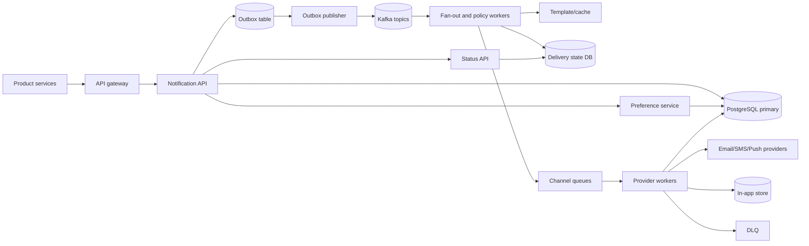

## 1. Problem

We are building a notification platform used by product services such as billing, chat, security, and marketing. A producer submits an event and the platform renders a versioned template, evaluates the recipient's preferences, fans out to email, SMS, push, and in-app delivery, and retains a durable audit trail.

The contract is **at least once**: an accepted notification is not silently lost. It is not exactly once, because a provider timeout can occur after the provider accepted a message. Every boundary therefore carries an idempotency key, and providers are called with a stable delivery ID where they support deduplication.

Functional requirements:

- Accept notification commands from many authenticated product services.
- Render locale- and channel-specific templates with bounded, validated variables.
- Apply user preferences, channel opt-outs, quiet hours, consent, and policy rules.
- Fan out one logical notification into independently retried channel deliveries.
- Support scheduled notifications, cancellation before dispatch, and in-app inbox reads.
- Keep an immutable audit of acceptance, policy decision, attempts, provider result, and final state.

Non-functional requirements:

- Return an enqueue response in under 1 second at the 99th percentile.
- Provide at-least-once processing, idempotent producer submission, retry with exponential backoff, and a dead-letter queue (DLQ).
- Isolate slow or failing providers; apply backpressure rather than exhaust worker or database pools.
- Target 99.95% monthly availability for acceptance and 99.9% successful dispatch within the channel's retry window.
- Retain audit data for 13 months and support deletion of personal content under privacy policy.

The platform acknowledges durable acceptance, not provider delivery, in the synchronous response. That distinction prevents a slow SMS provider from making every product request slow.

## 2. Scale Estimation

The seed workload is one million channel messages per day. A logical notification can fan out, so the sizing unit below is a channel message, not a producer event.

| Quantity | Assumption and calculation | Result |
|---|---|---:|
| Daily messages | Given requirement | 1,000,000/day |
| Average enqueue/dispatch rate | 1,000,000 / 86,400 | 11.6 messages/s |
| Peak rate | 10x average for launches and billing runs | 116 messages/s |
| Growth headroom | 3x peak for capacity and burst absorption | 350 messages/s |
| Average message payload | 4 KB rendered body plus metadata | 4 GB/day raw |
| Durable row footprint | 4 KB payload + 2 KB indexes/overhead | 6 GB/day |
| Audit retention | 13 months, approximately 395 days | 2.37 TB before compression |
| Delivery-attempt rows | 1.5 attempts/message, 2 KB each | 1.19 TB/year |
| In-app reads | 20% of messages become inbox items; 5 reads/item | 1,000,000 reads/day |

The 6 GB/day calculation is `1,000,000 x 6 KB`; with 3x replicas it consumes about 7.1 TB over 395 days. Cold audit storage can reduce cost, but the hot database should not carry all 13 months. Partitioning by month permits cheap retention and deletion.

For bandwidth, 4 KB x 350 messages/s is 1.4 MB/s, or about 11.2 Mb/s of rendered payload before protocol overhead. Provider egress is separate: SMS and email may add provider responses, while push payloads are usually smaller. The service has roughly 5:1 read:write traffic for in-app inboxes, but the durable delivery path is write-heavy.

Assume 2 million daily active users and 0.5 notifications per active user per day: `2,000,000 x 0.5 = 1,000,000`. This is an explicit product assumption, not a claim about all products. At 15% annual volume growth, year-one average is about 1.08M/day; 350 messages/s remains a reasonable initial envelope.

Availability budgeting at 99.95% gives about 21.9 minutes of monthly downtime for the acceptance API. Dispatch can continue from the queue during a short API outage, so acceptance and delivery have separate SLOs.

## 3. API Design

All endpoints use TLS, service-to-service OAuth2/mTLS, and an `X-Request-Id`. Tenant authorization is checked before reading or mutating another tenant's data.

### Submit a notification

`POST /v1/notifications`

Request:

```json
{
  "idempotency_key": "billing:invoice:inv_928:due",
  "recipient": {"user_id": "usr_42"},
  "template": {"name": "invoice_due", "version": 3},
  "variables": {"amount": "125.00", "currency": "USD", "due_date": "2026-08-20"},
  "channels": ["email", "push", "in_app"],
  "send_at": "2026-08-19T04:00:00Z",
  "dedupe_window_seconds": 86400
}
```

The producer is authenticated and the server derives `tenant_id` from its credential. Variables are schema-validated and size-limited; arbitrary HTML and URLs are not accepted by default.

Response `202 Accepted`:

```json
{"notification_id":"ntf_01J...", "status":"accepted", "channels":["email","push","in_app"]}
```

The unique key `(tenant_id, idempotency_key)` makes a retried request return the original notification ID. A lost response is therefore safe to retry. `409 Conflict` means the same key was reused with a different request fingerprint.

### Query status

`GET /v1/notifications/{notification_id}` returns the logical state and per-channel state. It is eventually consistent by up to a few seconds while workers update attempts.

### Preferences

`GET /v1/users/{user_id}/notification-preferences` and `PUT /v1/users/{user_id}/notification-preferences` manage opt-outs and quiet hours. `PUT` is idempotent with an `If-Match` version; a stale version gets `412 Precondition Failed`. Product-critical channels can be policy-protected, but legal opt-outs always win.

### In-app inbox

`GET /v1/users/{user_id}/inbox?cursor=...&limit=50` reads a cursor-paginated list. `POST /v1/users/{user_id}/inbox/{message_id}/read` is idempotent and records `read_at`.

Cancellation uses `POST /v1/notifications/{id}/cancel` with an idempotency key. It succeeds only while the channel delivery is `pending` or `scheduled`; a provider call already in progress may still win, so cancellation is not advertised as retraction.

## 4. Data Model

PostgreSQL is the source of truth for commands, preferences, and state transitions. Kafka carries work; it is not the audit database.

```sql
CREATE TABLE notifications (
  tenant_id       bigint NOT NULL,
  notification_id uuid NOT NULL,
  idempotency_key  text NOT NULL,
  request_hash     bytea NOT NULL,
  user_id          bigint NOT NULL,
  template_name    text NOT NULL,
  template_version int NOT NULL,
  variables_json   jsonb NOT NULL,
  created_at       timestamptz NOT NULL,
  send_at          timestamptz NOT NULL,
  status           text NOT NULL,
  PRIMARY KEY (tenant_id, notification_id),
  UNIQUE (tenant_id, idempotency_key)
) PARTITION BY RANGE (created_at);

CREATE TABLE deliveries (
  tenant_id       bigint NOT NULL,
  delivery_id     uuid NOT NULL,
  notification_id  uuid NOT NULL,
  channel         text NOT NULL,
  status           text NOT NULL,
  attempt_count   int NOT NULL DEFAULT 0,
  next_attempt_at timestamptz,
  provider_id     text,
  last_error      text,
  updated_at      timestamptz NOT NULL,
  PRIMARY KEY (tenant_id, delivery_id),
  UNIQUE (tenant_id, notification_id, channel)
);

CREATE INDEX deliveries_due_idx ON deliveries (next_attempt_at)
  WHERE status IN ('pending', 'retry');
CREATE INDEX deliveries_notification_idx ON deliveries (tenant_id, notification_id);

CREATE TABLE notification_preferences (
  tenant_id bigint NOT NULL, user_id bigint NOT NULL, version bigint NOT NULL,
  preferences_json jsonb NOT NULL, updated_at timestamptz NOT NULL,
  PRIMARY KEY (tenant_id, user_id)
);
```

The notification partition key keeps retention and scans bounded; monthly partitions are created ahead of time. At much larger scale, tenant-hashed PostgreSQL shards distribute writes, while `tenant_id` remains in every key to prevent cross-tenant queries. The partial due index serves the scheduler without indexing completed rows. The delivery uniqueness constraint makes a fan-out retry unable to create a second channel row.

An append-only `notification_events` table stores `(tenant_id, event_id, delivery_id, event_type, occurred_at, details_json)` with a unique event ID. In-app data is separately indexed by `(tenant_id, user_id, created_at DESC, message_id)` because its read path is user-centric.

## 5. High-Level Architecture



The gateway authenticates, rate-limits, and attaches tenant identity. The API validates input and commits the notification plus an outbox row in one transaction; this closes the database/Kafka dual-write gap. The publisher retries until Kafka has the event.

Kafka separates ingestion from work and absorbs bursts. Fan-out workers resolve preferences and create one delivery per permitted channel. Template cache avoids repeated database reads but has a versioned fallback to the template store. Channel queues isolate provider latency and rate limits. Provider workers own retry, provider-specific authentication, and response classification. The DLQ preserves poison messages for inspection and replay. A separate status API reads materialized state rather than forcing clients to inspect Kafka.

## 6. Deep Dive

**Horizontal scaling and backpressure.** API instances are stateless and scale behind a load balancer. They use bounded request bodies and a small database pool. Kafka consumers scale by partition, but each provider queue has its own worker pool and token bucket. When a provider reaches its quota, workers stop fetching aggressively, Kafka lag grows, and the bounded lag alert fires. This is safer than accepting unlimited work into memory or holding database connections open.

**Transactions and idempotency.** In one PostgreSQL transaction, the API inserts the logical notification, permitted delivery rows, and an outbox record. A unique idempotency key handles producer retries. The outbox publisher may publish twice; consumers use `delivery_id` plus an atomic state transition such as `UPDATE ... WHERE status IN ('pending','retry')`. A worker claims work with a short lease, not a long database lock. If it dies after a provider timeout, the lease expires and the delivery is retried. Duplicate provider delivery remains possible; a stable provider idempotency key and a user-visible dedupe policy reduce it where supported.

**Fan-out and preference races.** Preferences are read at fan-out time, then the decision is recorded. A newly issued opt-out is not a time machine: a message already accepted and handed to a provider may be delivered. For regulated channels, the provider worker rechecks a compact opt-out cache immediately before send. Cache misses fail closed for SMS/email rather than send against unknown consent. In-app messages can be hidden after an opt-out without deleting the audit.

**Retry and DLQ.** Errors are classified: `429` and provider timeouts are retryable; malformed addresses, invalid templates, and permanent provider rejection are not. Backoff is `min(1h, 2^attempt * 10s) + jitter`, with 8 attempts. A retry row is scheduled by `next_attempt_at`; the scheduler uses `FOR UPDATE SKIP LOCKED` in small batches, so one stuck row does not block others. After the limit, status becomes `dead` and the event goes to a channel-specific DLQ. Replay requires an operator reason and a new replay ID.

**Ordering.** Global order is neither needed nor affordable. For one user and event family, the producer may set an ordering key; Kafka keeps that key in one partition. Workers preserve order only for messages whose predecessor is unresolved. Notifications from unrelated products remain independent. A per-user ordering guarantee is documented as best effort because retries and provider queues can reorder external delivery.

**Caching and database scaling.** Redis caches preferences and templates with short TTLs, versioned keys, and pub/sub invalidation. Redis is an optimization: a miss goes to PostgreSQL, and stale preference data is never used for a safety-sensitive send. Read replicas serve status and inbox queries, but writes and preference updates use the primary. Connection pools are bounded per instance; pool size is based on database CPU and query time, not the number of HTTP requests. At 10x, hash-shard by tenant and route a tenant consistently; do not shard by user alone, which can create a hot celebrity tenant.

**Distributed locks and scheduling.** No global lock is used. A short lease on a delivery row prevents concurrent claims, and Kafka partition ownership prevents duplicate active consumers. Scheduled jobs use time buckets in Kafka or a partitioned due index; a single cron leader would become a needless availability dependency.

**Provider isolation and rate limiting.** Each provider has a circuit breaker, timeout, concurrency limit, and token bucket. The breaker opens on a rolling failure ratio and closes gradually with probes. Tenant quotas protect shared capacity; security notifications have a reserved lane. Provider credentials are rotated through a secret manager, and payloads are redacted from logs.

**Load balancing and connections.** The gateway uses least-loaded or latency-aware balancing, while Kafka balances partitions. HTTP clients use keep-alive and separate connection pools per provider. Timeouts are shorter than the retry interval and include DNS, connect, TLS, and response budgets. Retries must not multiply a request at every layer; only the owner of delivery policy retries provider calls.

**Disaster recovery.** PostgreSQL uses synchronous standby within a region and asynchronous cross-region replication; Kafka replicates critical topics across three zones and mirrors them to a secondary region. The initial posture is active-passive because preference writes and provider sends are easier to fence. A regional failover promotes the database, redirects producers, and resumes consumers from replicated Kafka offsets. Define RPO <= 5 minutes and RTO <= 30 minutes, and test them rather than treating replication as a DR plan.

## 7. Consistency Model

Acceptance is strongly consistent within the primary: a `202` is returned only after the notification and outbox row commit. A response lost after commit produces the same ID on an idempotent retry. If the primary fails after commit but before response, the retry may briefly see an unavailable or lagging replica; the client retries with backoff against the write endpoint.

Delivery state, status reads, cache invalidation, and analytics are eventually consistent. A status query can show `accepted` while Kafka lag exists, and a read replica can lag the primary by seconds. The API exposes `updated_at` and does not claim provider delivery until a provider result is durably recorded.

Duplicate prevention is layered: unique producer key, unique `(notification, channel)`, atomic worker claim, and provider idempotency key. These prevent most duplicates, not the mathematically impossible provider-side timeout ambiguity. Audit events are append-only and ordered per delivery by a database sequence; cross-delivery ordering is unspecified.

## 8. Failure Scenarios

| Failure | Impact | Detection | Recovery |
|---|---|---|---|
| PostgreSQL primary unavailable | New acceptance and preference writes fail; queued work may continue | Write error rate, health checks, replication alerts | Fail over to synchronous standby; replay outbox; return retryable 503, never acknowledge uncommitted work |
| Outbox publisher stopped | API accepts rows but Kafka does not receive new work | Outbox age and row count alert | Restart publisher; publish by monotonically increasing ID; consumers deduplicate |
| Kafka consumer stuck on poison record | One partition's lag grows; later records in that partition wait | Per-partition lag, no-commit interval | Pause partition, move classified poison record to DLQ, resume; do not skip silently |
| SMS provider returns 429 | SMS latency and retry queue grow | Provider status, 429 ratio, channel lag | Token-bucket throttle, exponential retry, optional secondary provider after policy check |
| Redis cluster unavailable | Preference/template latency rises; cache lookups fail | Cache error rate, DB read saturation | Bypass with strict DB rate limit; fail closed for consent-sensitive sends; restore cache |
| Region lost | Acceptance unavailable in region; in-flight sends uncertain | Regional synthetic checks, replication lag | Fence old region, promote secondary, replay replicated commands; dedupe at every boundary |
| Worker dies after provider accepted but before commit | Message may be sent twice | Attempt timeout and duplicate-provider reports | Retry with stable provider key; reconcile provider receipts; mark uncertain separately |
| Tenant floods API | Shared queue and DB starve | Per-tenant quota and queue-share metrics | Enforce quotas, reserve security lane, shed noncritical traffic with explicit 429 |

## 9. Observability

Every request, outbox row, Kafka record, delivery, and provider call carries `request_id`, `notification_id`, `delivery_id`, and `trace_id`. Logs contain state transitions and error classes, not message bodies, addresses, or access tokens.

SLIs and useful alerts:

- API availability, enqueue p50/p95/p99, and 5xx/429 rate: detect gateway, validation, and database trouble; alert when the 99th percentile exceeds 1 second for 10 minutes.
- Outbox age, Kafka consumer lag by topic/partition, queue depth, oldest message age: distinguish publisher failure from provider backpressure.
- Dispatch success by channel/provider, retry ratio, DLQ rate, and provider latency: detect provider degradation or bad templates.
- PostgreSQL CPU, WAL rate, replication lag, query latency, lock wait, and connection-pool utilization: detect saturation before timeouts.
- Redis hit rate, evictions, errors, and latency: detect a cache outage or ineffective keys.
- Worker utilization, in-flight calls, circuit-breaker state, and rate-limit tokens: show whether capacity or an external quota is limiting throughput.

Dashboards slice all metrics by tenant, channel, provider, region, and template version. Alerts are tied to user impact: an elevated DLQ for one broken template should not page for a global outage, but security-channel lag should page quickly. Traces follow a sample of successful work and all failures across API, Kafka, worker, and provider boundaries.

## 10. Capacity Planning

The 350 messages/s envelope is the design target, not the average. If one API instance safely handles 50 requests/s at the p99 target, use `ceil(350/50) = 7` instances and deploy 10 for N+3 failure headroom. If one provider worker handles 10 calls/s, use 35 logical worker slots, split by channel and quota, and run 45 slots across zones.

Kafka partitions are chosen from both throughput and parallelism. At 20 messages/s of safe consumer throughput per partition, `ceil(350/20) = 18`; provision 24 partitions for six-way growth and rebalancing room. Use replication factor 3 across zones. Consumer count cannot exceed useful partition parallelism, and each consumer has a bounded in-flight batch.

Assume 6 GB/day of primary data and 7.1 TB replicated over 395 days. Keep 30 days hot: `6 GB x 30 = 180 GB` raw, approximately 540 GB with three replicas and indexes. Archive older audit partitions to object storage and retain a compact status row. A 20% free-space target makes the hot database budget about 650 GB.

For 1M in-app items/day, 30 days means 30M items. At 1.5 KB indexed storage, that is 45 GB raw; with indexes, replicas, and 30% headroom budget 100 GB. Redis needs only hot preferences and templates: 2M users x 1 KB = 2 GB plus replicas and overhead, so provision about 6 GB usable memory, not the entire inbox.

The API pool might have 10 instances x 20 database connections = 200 connections, but start lower and validate against CPU. A 200-connection pool is not automatically safe: if average query time is 20 ms, theoretical capacity is `200/0.02 = 10,000 queries/s`, far above this workload, while PostgreSQL context switching may still hurt. Cap each pool, reserve connections for migrations/operations, and measure saturation.

Storage growth, queue oldest-age, and provider quota utilization are capacity triggers. Scale consumers before Kafka lag violates the dispatch SLO; scale database write IOPS before WAL or lock wait becomes the limiting resource.

## 11. Bottlenecks and Evolution

The first bottleneck is likely a provider quota or the preference/database write path during a synchronized campaign, not Kafka throughput. The first redesign is to isolate channel queues, add campaign admission control, and batch or cache preference reads without weakening opt-out semantics.

At 10x, 3,500 messages/s requires more partitions, tenant-hashed database shards, regional provider pools, and a dedicated scheduler. Move audit events to an append log plus object storage while keeping current status in a smaller operational database. Template rendering may need a compiled-template cache and separate CPU workers.

At 100x, cross-region active-active ingestion becomes attractive, but only after choosing a global idempotency namespace and a clear ownership region for preferences. Use a globally routed command log, per-tenant home regions, and provider adapters that can fence old epochs. Analytics must be off the delivery database. Do not make the original system active-active merely because traffic grew; make each consistency boundary explicit.

## 12. Trade-offs

| Decision | Option A | Option B | Decision | Why |
|---|---|---|---|---|
| Operational state | SQL | NoSQL | SQL initially | Transactions, conditional updates, and audit queries matter more than extreme scale at 1M/day |
| Work transport | Kafka | RabbitMQ | Kafka | Replay, partitioned ordering, and lag visibility fit bursty durable work; RabbitMQ is reasonable for smaller queue-centric deployments |
| Cache | Redis | DB cache | Redis | Shared TTL and invalidation; DB remains the correctness fallback |
| Request path | Synchronous send | Async enqueue | Async enqueue | Keeps p99 stable and isolates provider failures |
| DR | Active-active | Active-passive | Active-passive initially | Easier fencing, preference ownership, and duplicate control |
| Sharding | Range | Hash by tenant | Hash by tenant | Even writes and tenant locality; time range remains a table partition for retention |
| Inbox updates | Polling | Push/WebSocket | Polling first | Simpler reconnect and replay semantics; add push for high-value real-time surfaces |
| Internal RPC | REST | gRPC | REST at boundaries, gRPC selectively | HTTP JSON is easy for many producers; gRPC helps typed high-volume internal calls |

## 13. Production Checklist

- [ ] Load test 10x peak, provider throttling, retries, and database failover.
- [ ] Verify unique idempotency constraints and replay behavior after lost responses.
- [ ] Verify outbox recovery, Kafka partition rebalance, bounded in-flight work, and DLQ replay approval.
- [ ] Test opt-out, quiet hours, template versioning, cancellation races, and privacy deletion.
- [ ] Configure per-tenant/channel quotas, security reserved capacity, circuit breakers, and provider credential rotation.
- [ ] Confirm p99 enqueue SLO, dispatch SLO, RPO/RTO, dashboards, synthetic checks, and actionable alerts.
- [ ] Run a regional failover drill and reconcile uncertain provider outcomes.
- [ ] Partition and archive audit data before the hot database reaches its free-space threshold.

## 14. Engineering References

1. **Company:** Google. **Article title:** *The Site Reliability Workbook / Google SRE Book*. **URL:** https://sre.google/sre-book/table-of-contents/ . **Key engineering lesson:** SLOs, error budgets, capacity, and tested failure handling are part of the design, not post-launch operations. **How it influenced this design:** Separate acceptance and dispatch SLOs, quantify 99.95% availability, and require RPO/RTO drills and actionable alerts.
2. **Company:** Netflix. **Article title:** *Netflix Tech Blog*. **URL:** https://netflixtechblog.com/ . **Key engineering lesson:** isolate dependencies and make distributed systems resilient through controlled failure and operational feedback. **How it influenced this design:** Provider-specific circuit breakers, bulkheads, bounded queues, and provider-level dashboards.
3. **Company:** Uber. **Article title:** *Uber Engineering*. **URL:** https://www.uber.com/blog/engineering/ . **Key engineering lesson:** durable event-driven platforms need explicit partitioning, replay, and operational scaling decisions. **How it influenced this design:** Kafka partition sizing, outbox publication, consumer lag monitoring, and tenant-oriented evolution.
4. **Company:** AWS. **Article title:** *AWS Architecture Blog*. **URL:** https://aws.amazon.com/blogs/architecture/ . **Key engineering lesson:** decouple asynchronous workloads, design for failure, and make backpressure and retry behavior explicit. **How it influenced this design:** channel queues, exponential backoff with jitter, DLQs, and active-passive disaster recovery at the initial scale.
