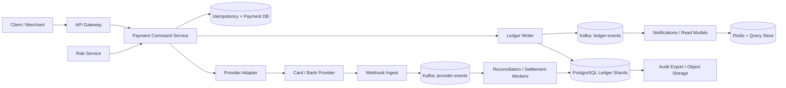

## 1. Problem

We are building a payment platform for merchants and their customers. It accepts card and bank-payment intents, records what the platform owes each party, refunds captured charges, pays merchants out, and represents disputes. A merchant portal and internal operations team need a durable history that can explain every cent without trusting mutable balance fields.

The functional requirements are:

- Create and capture a charge, including a provider authorization reference.
- Refund a whole or partial captured charge.
- Create and execute a payout from a merchant payable balance.
- Make every client command idempotent, including retries after a lost response.
- Post every money movement as balanced double-entry journal lines.
- Reconcile our records against provider reports and bank statements.
- Freeze or reverse funds when a card dispute arrives, with an auditable case.

The non-functional requirements are stronger than ordinary CRUD. Money semantics must be exactly once from the ledger's point of view: one accepted command produces one business effect, never two. The ledger commits with strong consistency, journal history is append-only and tamper-evident, and PCI scope is minimized by tokenizing payment details at a hosted provider. We target 99.99% monthly availability for ledger commands, p99 command latency below 400 ms when the provider responds, and zero unbalanced journal transactions.

“Exactly once” does not mean an internet request is delivered exactly once. It means a unique command key and an immutable transaction enforce one financial effect despite at-least-once delivery. Provider APIs are treated as at-least-once too; provider idempotency keys and reconciliation close the remaining ambiguity.

## 2. Scale Estimation

Assume 200,000 daily active customers and merchants combined. Each active user creates or checks out 2 payment-related commands per day on average:

- `DAU x requests/day = 200,000 x 2 = 400,000 commands/day`.
- `400,000 / 86,400 = 4.63 average requests/second`.
- A 10x shopping peak gives 46.3 command requests/second. We provision for 100 requests/second to leave room for retries and a promotion.
- A charge produces 1 payment row, 1 ledger transaction, and 4 lines on average; a refund or payout produces approximately 4 lines. With 500,000 ledger transactions/day and 4 lines, this is 2,000,000 line writes/day, or 23 lines/second average and 230/second at the modeled peak.

The assumptions are deliberately conservative: 25% more commands than customer actions are reserved for merchant automation, and 100 requests/second is more useful for capacity planning than the observed average. Read traffic is 8:1 over writes because dashboards, receipts, and reconciliation queries read history repeatedly. That is about 800 read requests/second at peak if all reads reach the service.

Storage assumptions: a payment or journal-line row, including indexes and metadata, averages 700 bytes. `2,000,000 lines/day x 700 bytes x 7 years = 3.58 TB` of primary line data before replicas, WAL, and headroom. Add 1 payment row per command: `400,000 x 500 bytes x 7 years = 0.51 TB`. With a 2x replica/WAL/headroom factor, plan for about 8.2 TB of database storage. Provider events and audit records add roughly 1 TB over seven years.

Peak ingress at 100 commands/second and a 3 KB request is 2.4 Mb/s; peak egress at 800 reads/second and 10 KB responses is 64 Mb/s. These figures exclude provider webhooks and exports, so network capacity should be at least 1 Gb/s per production zone.

Growth is modeled at 30% year over year. At year three, command volume is `400,000 x 1.3^3 = 878,800/day`; a 10x peak is about 102 commands/second after rounding. The ledger SLO is 99.99% monthly availability (about 4.38 minutes of unavailable time), p99 under 400 ms for local acceptance, and reconciliation completion within 30 minutes of a provider file.

## 3. API Design

All endpoints use TLS and OAuth2 service/user authorization. `Idempotency-Key` is mandatory on commands and scoped to merchant plus endpoint. The server stores the request hash, status, response body, and resource ID for 30 days; reusing a key with a different body returns `409`.

### Create and capture a charge

```http
POST /v1/charges
Authorization: Bearer <token>
Idempotency-Key: ch_merchant_20260815_001
Content-Type: application/json

{"amount":12500,"currency":"USD","merchant_id":"m_42","payment_method_token":"pm_tok_9","capture":true}
```

```json
{"id":"ch_901","status":"succeeded","amount":12500,"currency":"USD","ledger_transaction_id":"ltx_7001","provider_payment_id":"pp_88"}
```

The amount is an integer in the currency's minor unit. The service validates merchant ownership, currency, and tokenization, then reserves/records the local effect only after the provider result is safely correlated. A timeout returns `202` with `status: "pending"` if the provider outcome is unknown; the client polls `GET /v1/charges/{id}`.

### Refund

```http
POST /v1/charges/ch_901/refunds
Idempotency-Key: rf_merchant_20260815_001
Content-Type: application/json

{"amount":3000,"reason":"customer_request"}
```

```json
{"id":"rf_301","status":"succeeded","amount":3000,"charge_id":"ch_901","ledger_transaction_id":"ltx_7010"}
```

### Payout

```http
POST /v1/merchants/m_42/payouts
Idempotency-Key: po_merchant_20260815_001
Content-Type: application/json

{"amount":8000,"currency":"USD","destination_token":"bank_tok_2"}
```

```json
{"id":"po_501","status":"processing","amount":8000,"currency":"USD","ledger_transaction_id":"ltx_7020"}
```

Payout authorization checks available balance and a risk/velocity limit in the same database transaction. Provider execution may remain `processing`; a webhook or settlement file changes it to `paid` or `failed`.

Other endpoints are `GET /v1/ledger/accounts/{id}/entries?cursor=...`, `POST /v1/provider-events` (signed webhook ingestion), `POST /v1/reconciliation/runs`, and `POST /v1/disputes/{id}/accept` or `/contest`. Webhook ingestion authenticates the provider signature and deduplicates on provider event ID.

## 4. Data Model

The following PostgreSQL-style schema captures the critical invariants. Amounts never use floating point.

```sql
CREATE TABLE idempotency_keys (
  merchant_id bigint NOT NULL,
  endpoint text NOT NULL,
  idem_key text NOT NULL,
  request_hash bytea NOT NULL,
  status text NOT NULL,
  response_json jsonb,
  resource_id bigint,
  created_at timestamptz NOT NULL DEFAULT now(),
  PRIMARY KEY (merchant_id, endpoint, idem_key)
);

CREATE TABLE ledger_accounts (
  account_id bigint PRIMARY KEY,
  owner_type text NOT NULL,
  owner_id bigint NOT NULL,
  currency char(3) NOT NULL,
  account_type text NOT NULL,
  UNIQUE (owner_type, owner_id, currency, account_type)
);

CREATE TABLE ledger_transactions (
  transaction_id bigint PRIMARY KEY,
  command_id text NOT NULL UNIQUE,
  kind text NOT NULL,
  state text NOT NULL CHECK (state = 'posted'),
  provider_reference text,
  created_at timestamptz NOT NULL DEFAULT now()
);

CREATE TABLE ledger_lines (
  line_id bigint PRIMARY KEY,
  transaction_id bigint NOT NULL REFERENCES ledger_transactions(transaction_id),
  account_id bigint NOT NULL REFERENCES ledger_accounts(account_id),
  direction text NOT NULL CHECK (direction IN ('debit','credit')),
  amount_minor bigint NOT NULL CHECK (amount_minor > 0),
  currency char(3) NOT NULL,
  created_at timestamptz NOT NULL DEFAULT now()
);

CREATE INDEX ledger_lines_account_time ON ledger_lines(account_id, created_at, line_id);
CREATE INDEX ledger_transactions_provider ON ledger_transactions(provider_reference);
```

`command_id UNIQUE` prevents two postings for one accepted command. A deferred constraint trigger checks that each transaction has at least two lines, all lines share currency, and total debits equal total credits. For a charge, an illustrative transaction debits `cash_at_provider` and credits `merchant_payable` plus `platform_fee`; a refund reverses those economic directions. Payout debits `merchant_payable` and credits `cash_at_provider` or `payout_clearing`.

The account-and-time index serves statements and balance reconstruction. The provider index supports reconciliation and webhook correlation. The natural partition key is `account_id` for line reads, but a very large account can be salted into monthly partitions; transaction IDs remain globally unique. Commands are routed by merchant ID so idempotency and balance locks stay local to one database shard. Cross-merchant transfers are a separate workflow, not a hidden multi-shard transaction.

Balances may be materialized in `account_balances(account_id, version, available_minor, pending_minor)`, but they are derived under the same transaction as lines. The journal, not this projection, is the source of truth. No update or delete is permitted on posted rows; corrections are compensating transactions.

## 5. High-Level Architecture



- The API Gateway authenticates, rate-limits, and attaches a request/trace ID; it does not decide money state.
- The Payment Command Service validates commands and owns the idempotency state machine.
- The Ledger Writer is the only component allowed to post journal lines. Its database transaction enforces balance and available-funds invariants.
- The Provider Adapter isolates PCI-sensitive SDKs, provider retries, timeouts, and provider-specific states. Raw PAN data never enters our service.
- Webhook Ingest verifies signatures and durably queues events before acknowledging them, preventing provider retries from being mistaken for new money.
- Kafka separates committed ledger writes from slow notifications and reconciliation. It is not the source of financial truth.
- Redis and the query store accelerate bounded, non-authoritative reads. A statement can fall back to PostgreSQL.
- Object storage receives immutable, encrypted audit exports and reconciliation evidence.

## 6. Deep Dive

### Command and provider workflow

For a synchronous charge, the command service inserts the idempotency row in `started`, calls the provider with a derived stable provider key, and records the provider result plus a posted ledger transaction in one local commit. If the provider succeeds but the local commit times out, retrying uses the same provider key and then reconciles the provider reference before posting. If the outcome cannot be established, the API returns `pending`, never “failed” merely because a socket closed.

The provider call cannot participate in our SQL transaction. Therefore the state machine has `started`, `provider_unknown`, `posted`, and `failed` states, with a sweeper for unknown commands. A provider success is not posted twice because `command_id`, provider reference, and idempotency key are unique. Refunds and payouts follow the same pattern, with an amount ceiling enforced against already refunded or paid amounts.

### Strong local transaction, asynchronous edges

Within one shard, `SELECT ... FOR UPDATE` on the balance row plus insertion of immutable lines gives serializable money decisions without distributed locks. Keep the transaction short: validate, lock accounts in sorted ID order, append lines, update the balance projection, and commit. Do not hold locks during a provider call or Kafka publish. An outbox row is committed with the journal; an outbox publisher retries until Kafka has the event. This avoids the dual-write gap.

Kafka consumers are at-least-once. Each consumer stores the source event ID in its own inbox table, applies the projection, and commits the inbox marker and projection together. Partition by `account_id` for ordered statement events; use a separate topic keyed by merchant for merchant notifications. Ordering is guaranteed only within a key, which is sufficient for one account's projection.

### Scaling, backpressure, and hot keys

Stateless command instances scale horizontally behind the gateway. Each instance has a bounded database pool; when the pool or shard queue is saturated, admission control returns `429` with `Retry-After` rather than creating unbounded threads. Per-merchant and per-IP token buckets protect both the provider quota and hot accounts. A merchant with one account can still serialize its own balance decisions, while unrelated merchants scale independently.

The initial database is PostgreSQL with synchronous intra-region standby and read replicas for non-authoritative queries. At roughly 8 TB, partition lines by month and hash merchants across shards. Reconciliation uses provider reference ranges and time windows, not full-table scans. Shard rebalancing is an online copy followed by a brief routing cutover; a command is routed by a stable merchant-directory version.

Cache only immutable statement pages and merchant configuration with short TTLs. Never use Redis to authorize a spend or claim a balance. Cache failures therefore reduce performance, not correctness. Connection pools are sized from database capacity, not instance count: if a shard safely supports 300 active connections and 30 app instances share it, a 10-connection pool per instance already consumes the budget.

Retries use exponential backoff with jitter and a deadline. Retry validation failures never; retry transient database errors only before the client deadline; retry provider calls only with the provider idempotency key. Exhausted asynchronous messages go to a DLQ with alerting and replay tooling. Poison events are quarantined rather than blocking an entire partition.

Disputes arrive asynchronously. The signed event is stored first, then a workflow posts a debit to the merchant payable account and a credit to a dispute-clearing account. If the merchant balance is insufficient, the payable becomes negative or a reserve account absorbs the exposure according to policy; deleting history is never a recovery strategy.

Multi-region deployment is active-passive for writes: one home region owns a merchant's shard, while a warm secondary serves reads and takes over through a fenced lease. Active-active ledger writes would require a globally ordered conflict protocol and make provider ambiguity harder, so it is not justified at this scale. Backups are encrypted, continuously tested, and copied cross-region; the stated RPO is under 5 minutes and RTO under 30 minutes.

## 7. Consistency Model

Strong consistency applies to idempotency records, account availability, posted journal lines, command state transitions, and dispute/payout authorization. A successful command response means the shard committed and the outbox record exists. The balance projection and journal are atomically updated.

Eventual consistency applies to Redis, search/reporting read models, notifications, and dashboards. They show a `last_updated_at` watermark and can lag by seconds. Provider status is also eventually known; until a webhook, query, or settlement file resolves it, the resource remains `pending` or `unknown`.

If a write succeeds but the response is lost, the client repeats the exact idempotency key and body. The service returns the stored response, not a second provider call or posting. If the process crashes after provider success and before local commit, the recovery worker queries by provider idempotency key/reference and either posts exactly once or marks the command for manual review. A unique command ID and transaction constraint prevent duplicate prevention from depending on cache availability.

Replication lag must not serve an authorization decision. Read replicas may omit a just-posted charge; authoritative `GET` after a command routes to the primary or waits until a commit LSN is visible. During failover, new commands for the affected shard fail closed with retryable `503` until the fencing token and primary are established.

## 8. Failure Scenarios

| Failure | Impact | Detection | Recovery |
|---|---|---|---|
| Primary ledger DB unavailable | Commands cannot be authoritatively accepted | Connection errors, commit-error rate, failed health checks | Fail closed, route to synchronous standby after fencing, replay outbox; clients retry the same key |
| DB primary commits then process loses response | Client sees timeout; duplicate risk if naïve retry | Request timeout correlated with commit audit and idempotency state | Same key returns stored result; reconciliation repairs incomplete response metadata |
| Provider times out after authorization | Local status is unknown; funds may be held | Provider timeout rate plus unknown-command age | Query/provider webhook with same key, then post or compensate; never blind retry with a new key |
| Kafka consumer stuck on poison event | Read model or reconciliation lag grows | Partition lag, oldest-message age, consumer heartbeat | Pause only the bad message, send to DLQ, fix/replay; keep other partitions moving |
| Redis cluster fails | Higher DB read load; no money corruption | Cache error rate, DB QPS and latency | Bypass cache, rate-limit expensive statements, restore cluster asynchronously |
| Region is lost | Writes for its merchant shards unavailable | Regional health, replication/heartbeat alarms | Fence old region, promote warm secondary, verify RPO, resume writes; replay provider events |
| Webhook delivered 20 times | Duplicate work and noisy state transitions | Duplicate provider-event ID counter | Unique inbox key makes processing no-op after first commit |
| Ledger invariant check fails | Posting defect or corruption; financial close must stop | Unbalanced-transaction constraint and reconciliation alert | Block affected workflow, preserve evidence, compensate via reviewed transaction, restore from verified backup if needed |

## 9. Observability

Every request, provider call, Kafka record, SQL transaction, and audit export carries `trace_id`, `request_id`, `merchant_id`, and a redacted `command_id`. Never log PAN, CVV, full bank account numbers, or authorization tokens. Structured logs record state transitions and provider reference hashes.

SLIs and useful alerts include:

- Availability: successful authoritative command commits divided by valid command attempts; page when the 5-minute burn rate threatens the 99.99% SLO.
- Latency: p50/p95/p99 for command acceptance and provider round trips; p99 above 400 ms indicates pool, lock, or provider pressure.
- Correctness: unbalanced transactions, duplicate command conflicts, negative balances, and reconciliation deltas; any nonzero unbalanced count pages immediately.
- Saturation: DB CPU/IO, lock wait time, WAL rate, connection-pool utilization, shard queue depth, gateway throttles, and Kafka partition lag. Pool saturation with low DB CPU usually means pool sizing or stuck transactions; high lock waits point to hot accounts.
- Provider health: timeout, decline, unknown-outcome, and webhook age by provider. Unknown age above 10 minutes pages operations.
- Recovery: DLQ count/oldest age, outbox age, backup freshness, replication lag, and failover drill duration.

Distributed traces connect an API span to the provider request and database commit, but card data is scrubbed. Dashboards separate business decline rates from infrastructure errors so a fraud rule does not page the database team.

## 10. Capacity Planning

At the year-one 100-command/second peak, assume 60% charges, 20% reads, 10% refunds, and 10% payouts. Provision 6 stateless instances at 25 command requests/second each, giving 150 requests/second (1.5x headroom) across three zones. An instance uses a 10-connection pool, but only 60 total write connections are allowed per shard; this leaves room for migrations and operators under a 300-connection shard limit.

The 230 ledger-line writes/second peak fits a primary capable of 1,000 durable line inserts/second with 4x headroom. Two synchronous/in-region replicas provide failover; two read replicas handle the projected 800 peak reads/second. Partitioning keeps index maintenance bounded by month. At 8.2 TB planned storage, use a 12 TB usable volume so WAL spikes, vacuum, and six months of growth do not exhaust it.

Kafka receives about 300 ledger/provider events/second at peak. Twelve partitions allow 25 events/second per consumer lane; six consumers process two partitions each, with another six lanes available during replay. A 24-hour retry buffer at 300 events/second and 2 KB/event is about 52 GB before replication, so a 3x replicated 200 GB topic is adequate. The outbox publisher targets less than 30 seconds of age.

Redis stores 500,000 hot statement/configuration entries at an average 8 KB: about 4 GB of values. With indexes, replicas, and eviction reserve, provision 12 GB per primary. It is disposable and must not be counted as financial durability.

## 11. Bottlenecks and Evolution

The first bottleneck is usually row-lock contention on a very active merchant balance, not raw CPU. Measure lock wait and split operational accounts by currency or settlement bucket only when the accounting policy permits it. Next, monthly line indexes and reconciliation scans pressure database IO; partitioning plus incremental provider cursors address that.

At 10x, introduce more merchant shards, a dedicated reconciliation warehouse, and separate read models for statements and operations. Keep each merchant's authoritative write ownership stable. At 100x, move journal storage to an append-oriented partition service with a SQL-compatible invariant checker, maintain a compact per-account checkpoint, and use a globally managed merchant directory. Cross-shard reporting becomes a warehouse concern; cross-shard money movement remains an explicit saga with compensations.

Redesign the database/shard routing before replacing Kafka or adding a cache. The target architecture retains one-writer ownership per account, durable outbox/inbox processing, provider-independent reconciliation, and a cryptographically chained audit export. A new provider adapter can then be added without changing ledger semantics.

## 12. Trade-offs

| Decision | Option A | Option B | Decision | Why |
|---|---|---|---|---|
| Primary ledger store | SQL with constraints | NoSQL with application checks | SQL | ACID transactions, foreign keys, and deferred balance invariants reduce money-risk bugs |
| Event transport | Kafka | RabbitMQ | Kafka | Replayable ordered partitions suit durable projections; commands still use SQL |
| Read cache | Redis | Database cache tables | Redis | Fast disposable cache, while the journal remains authoritative |
| Provider workflow | Synchronous | Fully asynchronous | Hybrid | Fast success path, but pending states handle provider uncertainty safely |
| Regions | Active-active | Active-passive | Active-passive writes | Fewer split-brain and ordering hazards for a single account owner |
| Sharding | Range by merchant | Hash by merchant | Hash with directory | Even load; directory handles moves and preserves routing identity |
| Reconciliation | Polling | Push only | Both | Webhooks reduce latency; files/polling recover missed events |
| Internal RPC | REST | gRPC | REST at boundary, gRPC selectively | REST is interoperable for merchants; gRPC helps typed internal high-volume calls |

## 13. Production Checklist

- [ ] Every command requires a scoped idempotency key and request hash.
- [ ] Provider keys, webhook signatures, and timeout/unknown handling are tested.
- [ ] Posted transactions are immutable; debit equals credit and currency matches.
- [ ] Balance authorization and journal lines commit atomically.
- [ ] Outbox/inbox, DLQ replay, and poison-message isolation are operational.
- [ ] No PAN/CVV enters logs, databases, traces, or analytics.
- [ ] Primary failover is fenced; RPO/RTO drills and restore tests are current.
- [ ] Alerts cover SLO burn, unknown outcomes, lock waits, pool saturation, lag, DLQ, and reconciliation deltas.
- [ ] Load tests include hot merchants, duplicate requests, provider timeouts, and region loss.
- [ ] A statement can be rebuilt from the journal and every correction has an approver.

## 14. Engineering References

1. **Company:** Google. **Article title:** *Site Reliability Engineering Book: Table of Contents*. **URL:** https://sre.google/sre-book/table-of-contents/. **Key engineering lesson:** Define measurable SLIs/SLOs, error budgets, and failure-response practices rather than promising vague reliability. **How it influenced this design:** The 99.99% command SLO, burn-rate alerts, RPO/RTO, and fail-closed recovery policy are explicit operational contracts.
2. **Company:** Stripe. **Article title:** *Stripe Engineering*. **URL:** https://stripe.com/blog/engineering. **Key engineering lesson:** Payment systems must make retries safe and preserve a durable, inspectable state across unreliable network boundaries. **How it influenced this design:** Scoped idempotency keys, pending/unknown outcomes, provider adapters, and reconciliation are first-class rather than incidental error handling.
3. **Company:** Uber. **Article title:** *Uber Engineering*. **URL:** https://www.uber.com/blog/engineering/. **Key engineering lesson:** High-scale systems benefit from explicit event pipelines, ownership boundaries, and operational tooling. **How it influenced this design:** Kafka outbox/inbox processing, partition-key ordering, DLQs, and shard ownership are separated from the financial source of truth.
4. **Company:** AWS. **Article title:** *AWS Architecture Blog*. **URL:** https://aws.amazon.com/blogs/architecture/. **Key engineering lesson:** Resilience is designed through isolation, backpressure, retries with jitter, and tested recovery paths. **How it influenced this design:** Bounded pools, admission control, provider deadlines, retry budgets, regional fencing, and restore/failover drills are part of the architecture.
