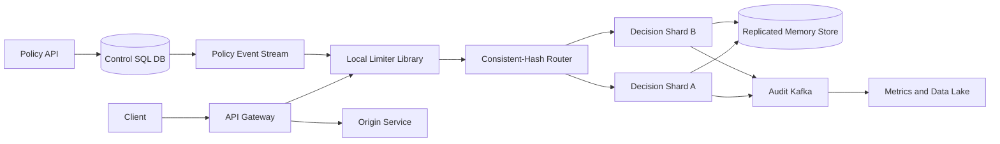

## 1. Problem

We need a service that answers one question before an API request reaches application code: **may this principal spend one unit of quota now?** A principal can be a user, source IP, API key, or OAuth token. A policy can differ by route, HTTP method, tenant plan, and region.

The service must support token-bucket limits for smooth traffic plus controlled bursts, and sliding-window limits when a product needs a hard count over a time interval. A rejected request receives HTTP `429 Too Many Requests` and a useful `Retry-After` value. Configuration changes must propagate without restarting gateways.

Users are API gateways and internal services; operators are platform and product teams. The limiter is on the synchronous request path, so the primary non-functional requirements are:

| Requirement | Target |
|---|---|
| Decision latency | p99 under 1 ms at the gateway, excluding network time to the origin |
| Decision availability | 99.99% monthly for the limiter path |
| Counter semantics | One global logical counter per key and policy; bounded, documented cross-region staleness |
| Scaling | No permanently central hotspot; shard ownership horizontally |
| Clock behavior | Correctness must not depend on synchronized wall clocks |
| Safety | A limiter outage must not silently turn into unlimited expensive traffic |

The design separates the fast decision plane from the slower control plane. It also makes fail-open versus fail-closed a policy choice, not an accidental timeout behavior.

## 2. Scale Estimation

Assume 10 million DAU. Each active user makes 100 API requests per day. That gives `10,000,000 x 100 = 1,000,000,000` decisions/day. Dividing by 86,400 seconds gives `11,574` average decisions/s. A 10x peak for launches and diurnal concentration gives `115,740` peak decisions/s. Add 30% headroom: provision for `150,000` decisions/s.

Assume 20% of decisions are API-key or service-token traffic not represented by a user session, so the estimate still covers those requests rather than adding them again. A 90:10 allow-to-reject ratio means about `135,000` allows/s and `15,000` rejects/s at peak. Every request is a counter read and usually a small atomic update, so the decision-plane read:write ratio is approximately `1:1`; configuration reads are cached and are not in this path.

For a token bucket, store key, policy version, token count, and last monotonic timestamp in 40 bytes. With 500 million active keys and two replicas, hot state is `500,000,000 x 40 x 2 = 40 GB` before index and memory overhead. At 2.5x overhead, reserve 100 GB of usable in-memory capacity. Expire idle buckets after 24 hours; this is an activity TTL, not a correctness clock.

If each decision emits a compact 100-byte audit/event record, peak event bandwidth is `150,000 x 100 = 15 MB/s` or 1.296 TB/day uncompressed. Keep detailed decision events sampled, while retaining counters and all rejects. A 7-day compressed event retention at 30% of raw size is roughly `1.296 TB x 7 x 0.3 = 2.72 TB`.

Configuration is small: 100,000 policies at 1 KB is about 100 MB, replicated in the control database and distributed cache. Assume 5% daily key growth: active state grows from 500 million to about 525 million keys after one day unless expiry offsets it. Target 99.99% monthly availability, or about 4.4 minutes of unavailable decision service per 30-day month. The p99 budget is intentionally much tighter than that availability budget because a slow limiter causes an origin-wide outage through connection and thread exhaustion.

## 3. API Design

The gateway calls the decision endpoint with a stable request identity. Authentication is mTLS between gateway and limiter; the limiter does not trust a caller-supplied tenant without validating the signed gateway identity.

```http
POST /v1/decisions
Authorization: mTLS
Content-Type: application/json
X-Request-Id: 01J...
Idempotency-Key: gateway-01J...-attempt-1

{
  "principal_type": "api_key",
  "principal_id": "key_7f3",
  "route": "POST:/v1/payments",
  "region": "sg",
  "cost": 1
}
```

An allowed response is:

```http
HTTP/1.1 200 OK
Content-Type: application/json

{"allowed":true,"remaining":39,"limit":40,"reset_at":"2026-08-15T03:01:00Z","policy_version":812}
```

A rejection is:

```http
HTTP/1.1 429 Too Many Requests
Retry-After: 2
Content-Type: application/json

{"allowed":false,"remaining":0,"limit":40,"retry_after_ms":1840,"policy_version":812}
```

`cost` supports expensive operations consuming more than one token. The gateway forwards the same `X-Request-Id`; a retry uses the same `Idempotency-Key`. The decision record is deduplicated for a short horizon so a timed-out response does not spend quota twice. This key is not a substitute for the business operation's idempotency key: payment creation still needs its own durable idempotency contract.

For administration:

```http
PUT /v1/policies/{policy_id}
If-Match: "policy-version-811"

{"match":{"route":"POST:/v1/payments","plan":"standard"},"algorithm":"token_bucket","rate_per_second":20,"burst":40,"scope":"api_key"}
```

`PUT` is idempotent and `If-Match` prevents lost updates. Only authorized operators can change policies. A policy is immutable by version; gateways may briefly use the previous version during propagation, with the maximum propagation delay exposed as a metric.

## 4. Data Model

The source of truth is a relational control database. Mutable bucket state lives in a sharded in-memory decision store and is periodically summarized, not synchronously copied into SQL.

```sql
CREATE TABLE rate_policy (
  policy_id        BIGINT PRIMARY KEY,
  version          BIGINT NOT NULL,
  route_pattern    TEXT NOT NULL,
  method           TEXT NOT NULL,
  principal_scope  TEXT NOT NULL,
  algorithm        TEXT NOT NULL CHECK (algorithm IN ('token_bucket', 'sliding_window')),
  rate_per_second  NUMERIC,
  burst            INTEGER,
  window_seconds   INTEGER,
  limit_count      INTEGER,
  state            TEXT NOT NULL CHECK (state IN ('active', 'disabled')),
  updated_at       TIMESTAMPTZ NOT NULL
);

CREATE UNIQUE INDEX rate_policy_version
  ON rate_policy (policy_id, version);

CREATE INDEX rate_policy_match
  ON rate_policy (method, route_pattern, principal_scope, state);

CREATE TABLE policy_audit (
  policy_id BIGINT NOT NULL,
  version BIGINT NOT NULL,
  actor TEXT NOT NULL,
  change_json JSONB NOT NULL,
  created_at TIMESTAMPTZ NOT NULL,
  PRIMARY KEY (policy_id, version)
);
```

The decision-store key is `hash(tenant_id | principal_type | principal_id | route | policy_id)`. Hash partitioning spreads arbitrary customer traffic and avoids range hotspots caused by sequential IDs. The value is `{tokens, last_elapsed_ns, policy_version, dedupe entries}`. A sliding-window value is a bounded ring of per-second counts plus the window epoch; it is not an unbounded list of request timestamps.

The control indexes support policy matching and optimistic version checks. There is no SQL index for every bucket because that would put the hot path on the database. Bucket records have a 24-hour idle TTL and are evicted safely: a missing bucket starts full according to the current policy. A policy version mismatch causes the shard to initialize or migrate state under the new parameters.

## 5. High-Level Architecture



The gateway is the enforcement point: it can return `429` before consuming origin capacity. The local library keeps policy snapshots and connection pools, reducing network hops for configuration and batching telemetry, but it does not own mutable global counters. The consistent-hash router maps a decision key to a primary shard and a replica; virtual nodes rebalance ownership.

Decision shards perform an atomic compare-and-update in the replicated memory store. The memory store is selected for sub-millisecond operations and native TTLs, not as the durable policy authority. The policy API and SQL database provide audited, transactional configuration. The policy event stream distributes versions to gateways and shards. Kafka carries audit data because it tolerates replay and consumer lag; it is deliberately not on the synchronous allow/reject path. Data lake consumers produce analytics and alerts.

## 6. Deep Dive

**Algorithms and atomicity.** A token bucket has capacity `B`, refill rate `r`, current tokens `t`, and elapsed time `d`: `t' = min(B, t + r x d)`. A request of cost `c` is allowed when `t' >= c`, then stores `t'-c` and the current elapsed timestamp in one atomic script. A sliding window divides time into one-second buckets and sums the last `W` buckets. The ring's update and expiry must be atomic, otherwise concurrent requests can both observe spare quota. Token buckets are the default because they bound bursts while keeping state constant; sliding windows are offered where a hard interval count matters.

Use a monotonic elapsed-time source for refill calculations. Wall-clock timestamps are used only to calculate a client-facing reset estimate. If a process's monotonic clock jumps or is unavailable, the shard rejects the update rather than minting tokens. Cross-node clock skew therefore affects display by at most the configured tolerance, not quota correctness.

**Horizontal scaling and hot keys.** Shard by the full decision key, not only tenant. One abusive API key then remains a hot key, but its traffic is serialized at one owner, which is unavoidable for an exact counter. The router can place a hot key on a dedicated shard and enforce a local per-connection guard. Splitting one exact key across shards would over-admit unless a quota lease protocol is used. Lease chunks improve throughput but trade away precision; use them only for explicitly approximate policies.

**Replication and failover.** Each shard has a primary and a nearby synchronous replica for acknowledged updates, plus an asynchronous cross-region copy. The primary returns success only after the replica acknowledges. On failure, a fencing epoch lets a new primary reject writes from a stale owner. A region failover may lose only asynchronous telemetry, not acknowledged counter state, if the client is routed to the paired region. During a partition, exact global active-active writes would require consensus on every decision and violate the latency target; the policy can instead choose bounded regional budgets.

**Caching and policy propagation.** Gateways cache compiled route matches and policy versions. A control-plane event invalidates or updates them; a 60-second maximum snapshot age is enforced for safety-sensitive routes. Unknown or expired policy behavior is explicit: fail closed for authentication, billing, and expensive mutations; fail open with a small emergency local bucket for low-risk reads. Cache failure must not cause every gateway to synchronously query SQL.

**Queues, retries, and backpressure.** Audit events are written to Kafka asynchronously through a bounded per-shard buffer. When the buffer is full, drop sampled allows but retain rejects, policy changes, and saturation counters. Consumers commit offsets after durable processing; a stuck consumer is isolated by a dead-letter topic for malformed events. Producers retry with bounded exponential backoff and jitter. Kafka is never retried inline before a decision response.

**Idempotency and ordering.** A gateway retry can repeat the same request after a lost response. The shard stores a short-lived `(idempotency_key, decision)` result and returns the original result for the same key and policy version. Keys are scoped to gateway and principal to prevent accidental cross-tenant collisions. Events include a per-shard sequence number; analytics can detect gaps. Policy versions are applied in order, and a shard pauses a route if it receives version 813 before 812.

**Load balancing and pools.** Consistent hashing keeps a decision key stable, while health-aware routing removes failed nodes. Gateway pools use short connect and request deadlines, circuit breakers, and bounded concurrency. A 1 ms p99 target is impossible if a pool queues behind a dead node, so pool wait time is measured separately from store execution time. The limiter rejects or uses the route's emergency mode when its concurrency budget is exhausted.

**Transactions and durability.** Policy update, audit row, and outbox record commit in one SQL transaction. The outbox publisher makes configuration delivery retryable without a dual-write gap. Bucket updates are not SQL transactions; their atomicity comes from the shard's single-key script and replication protocol. Periodic snapshots are useful for diagnostics and warm restart, but they are not treated as a lossless event log.

**DR and operational controls.** Policies replicate to a second region and are tested by restoring into an isolated namespace. A runbook declares whether a route uses global exact mode, regional budget mode, or emergency local mode. Operators can lower limits, disable a bad policy, or quarantine a principal without redeploying gateways. Every override has an expiry and audit actor.

## 7. Consistency Model

Policy writes are strongly consistent in the SQL primary: one version, one audit record, and one outbox event commit together. A gateway's policy view is eventually consistent, bounded by the snapshot TTL and event-replay SLA. A new restrictive policy therefore has a stated propagation window; security-critical routes fail closed while stale.

Counter updates for a key are linearizable within its shard because the primary serializes the atomic update and waits for its synchronous replica. Reads are returned from the owner, never from an asynchronous analytics copy. Cross-region replication is asynchronous for normal mode, so a region partition can temporarily allow traffic under a regional budget rather than pretending two independent counters are one exact global counter.

If an update succeeds but the response is lost, the idempotency record makes a retry return the same decision. If the client retries with a new key, it may spend another token; that is intentional and documented. If a primary fails after local execution but before replica acknowledgement, the operation is treated as unknown and the client may retry. The system chooses possible under-admission over possible over-admission during that ambiguity.

## 8. Failure Scenarios

| Failure | Impact | Detection | Recovery |
|---|---|---|---|
| SQL control database unavailable | No new policy changes; cached policies continue | SQL health, failed writes, outbox age | Fail admin writes, keep last valid snapshot, restore/repoint SQL, replay outbox |
| Decision primary fails | Affected keys time out or reject during election | Shard heartbeat, owner epoch, p99 timeout | Fence old owner, promote synchronous replica, rehash only its virtual nodes |
| Memory-store cache/replica failure | Counter decisions may be unavailable or lose unacknowledged state | Store error rate, replication offset, failover events | Fail closed for costly routes; promote replica; rebuild cold keys with explicit emergency budgets |
| Kafka consumer stuck | Audit and analytics lag; quota decisions continue | Consumer lag, oldest event age, DLQ rate | Restart/scale consumer, replay from last committed offset, inspect poison messages |
| Gateway policy cache expired | Requests use emergency behavior or are rejected | Snapshot age and route-mode metric | Replay policy stream, restore control-plane connectivity, page owner for safety routes |
| Region network partition | Global exact mode cannot safely coordinate | Cross-region RTT, quorum loss, routing health | Switch to regional budgets or active-passive; reconcile counters after fencing |
| Hot API key floods one shard | One shard saturates and p99 rises | Per-key QPS, shard CPU, queue wait | Isolate key, apply connection guard, notify tenant; do not split exact state silently |
| Client retries after lost 200 | Quota is double-spent without dedupe | Duplicate idempotency-key rate and request traces | Return stored result within dedupe TTL; require stable gateway keys |
| Clock skew or wall-clock rollback | Wrong reset headers or refill risk | NTP offset and monotonic clock errors | Use elapsed monotonic time; cap reset display; quarantine bad host |

## 9. Observability

Every request carries `X-Request-Id` and a trace context from gateway through router and shard. Logs include tenant, policy version, shard, decision, failure mode, and latency, but hash or redact principal identifiers. Never log raw API keys.

Core SLIs are decision success availability, allowed/rejected correctness samples, p50/p95/p99/p99.9 latency, and timeout rate. Alert on p99 above 1 ms for 5 minutes, availability below 99.99%, and any increase in fail-open decisions on protected routes. Measure gateway queue wait, store script time, network time, and policy-match time separately.

Capacity and failure signals include per-shard CPU and memory, hot-key QPS, replica offset, election count, connection-pool utilization, pool wait, circuit-breaker opens, Kafka producer buffer utilization, consumer lag, oldest event age, DLQ rate, SQL lock time, SQL connection-pool saturation, outbox age, and policy snapshot age. Each alert maps to an action: consumer lag pages analytics owners, pool saturation pages gateway owners, replica offset pages storage owners, and snapshot age pages control-plane owners.

Sample 1% of allows for traces but sample 100% of rejects, errors, policy changes, and fail-open decisions. A synthetic probe exercises a known key in every region and verifies both `200` and `429` boundaries. A reconciliation job compares shard decision totals with sampled gateway observations; it is diagnostic, not an authority for real-time quota.

## 10. Capacity Planning

At 150,000 peak decisions/s, assume one decision shard safely sustains 25,000 atomic operations/s at the p99 target, including replication. We need `150,000 / 25,000 = 6` active shards. Use 8 active shards for 33% failure and rebalancing headroom, each with one synchronous replica: 16 shard processes. A two-replica failure domain gives 24 processes if each shard also has a cross-zone asynchronous copy.

Assume 500,000 active decisions/s is the practical memory-store fleet ceiling before the next partitioning tier; the current fleet is well below it, but the 100 GB state estimate requires at least 8 nodes with 16 GB usable state each after reserving memory for overhead. Keep 30% free memory, so provision 8 nodes x 24 GB usable allocation rather than running at the limit. Cross-region traffic for asynchronous state copies is approximately `150,000 x 40 = 6 MB/s` before protocol overhead; reserve 10 MB/s per region pair.

Gateway instances are sized at 5,000 decisions/s, based on load tests including TLS and local matching. `150,000 / 5,000 = 30`; deploy 36 instances across three zones. With a 200-connection pool per instance, the fleet has 7,200 possible connections, but set an active concurrency limit from load tests rather than opening all of them.

Kafka receives 15 MB/s peak. If one partition is budgeted at 5 MB/s sustained, use 6 partitions for throughput and 8 for rebalancing. Start with 8 partitions and 4 consumers, each handling two partitions; scale consumers up to 8 without changing the topic. The 7-day compressed event store is about 2.72 TB; reserve 4 TB including indexes and growth.

The SQL database receives perhaps 10 policy writes/s in normal operations, not 150,000 decisions/s. Two read replicas serve administration and audits; the primary needs durable write IOPS and an outbox, but decision capacity should not be sized from SQL QPS. A 100-connection SQL pool shared across control-plane instances is enough for this write rate; cap it to prevent a retry storm from exhausting database backends.

## 11. Bottlenecks and Evolution

The first bottleneck is usually a hot key or an overloaded gateway connection pool, not SQL. At 10x, peak load is 1.5 million decisions/s: increase virtual shards, place hot tenants on isolated capacity, and move from a single router process to a replicated, locality-aware routing library. At 100x, 15 million decisions/s makes per-request cross-region exactness economically and physically unrealistic; adopt regional budgets with periodic global reconciliation, or reserve exact global mode for a small set of keys.

The next redesign is the state protocol: a single primary per exact key can be retained, but lease-based approximate tokens, hierarchical tenant buckets, and local admission filters reduce traffic. The target architecture keeps local gateway fast paths, regional shard fleets, a globally replicated policy log, and an explicit consistency tier per route. No evolution should silently change a customer's limit semantics.

## 12. Trade-offs

| Decision | Option A | Option B | Decision | Why |
|---|---|---|---|---|
| Policy store | SQL | NoSQL | SQL | Transactions, version checks, and audit history matter more than policy write throughput |
| Event transport | Kafka | RabbitMQ | Kafka | Replay and partitioned high-throughput audit streams fit; decisions do not depend on either |
| Hot state | Redis-compatible memory store | DB cache | Memory store | Atomic scripts and TTLs meet p99; SQL remains the control authority |
| Telemetry | Synchronous | Asynchronous | Asynchronous | Never add Kafka or storage latency to admission; bounded buffers protect memory |
| Region mode | Active-active exact | Active-passive exact | Active-passive for exact, regional budgets for availability | Consensus on every global token is too slow; passive failover preserves semantics |
| Sharding | Range | Hash | Hash | Uniform principal keys avoid sequential-range hotspots |
| Config delivery | Polling | Push stream | Push with bounded polling fallback | Fast propagation without SQL polling storms; polling recovers missed events |
| Internal API | REST/HTTP | gRPC | REST at edge, gRPC optional internally | HTTP integration is universal; gRPC can reduce internal overhead after measurement |

## 13. Production Checklist

- Verify token-bucket and sliding-window atomicity under concurrent load.
- Verify p99 under 1 ms with TLS, replication, and realistic key skew.
- Verify every route has an explicit fail-open or fail-closed mode.
- Verify `429`, `Retry-After`, reset, cost, and policy-version semantics.
- Verify stable idempotency keys across gateway retries and lost responses.
- Verify fencing, replica promotion, rehashing, and regional failover.
- Verify policy version ordering, outbox replay, TTL behavior, and snapshot expiry.
- Verify hot-key isolation and bounded gateway/store connection pools.
- Verify Kafka backpressure, retention, consumer replay, and DLQ ownership.
- Verify dashboards, synthetic probes, alerts, runbooks, and an error budget.
- Verify no raw credentials or principal identifiers leak into logs.
- Run a failure-injection exercise before enabling global exact mode.

## 14. Engineering References

1. **Company:** Google SRE. **Article title:** *Site Reliability Engineering Book*. **URL:** https://sre.google/sre-book/table-of-contents/ **Key engineering lesson:** Define measurable SLOs, error budgets, and failure-oriented operating practices. **How it influenced this design:** The 99.99% availability target, latency SLI decomposition, paging thresholds, and explicit error-budget behavior come from treating the limiter as a production dependency.
2. **Company:** Cloudflare. **Article title:** *Cloudflare Blog*. **URL:** https://blog.cloudflare.com/ **Key engineering lesson:** Edge enforcement must account for locality, adversarial traffic, and very high-cardinality keys. **How it influenced this design:** Gateway-local matching, hash sharding, hot-key isolation, and regional emergency modes keep hostile traffic from turning one global service into a hotspot.
3. **Company:** Netflix. **Article title:** *Netflix TechBlog*. **URL:** https://netflixtechblog.com/ **Key engineering lesson:** Resilience patterns such as isolation, bounded concurrency, and graceful degradation must be designed into distributed clients. **How it influenced this design:** Connection-pool limits, circuit breakers, failure modes, and the decision to keep Kafka off the synchronous path are first-class design constraints.
4. **Company:** AWS. **Article title:** *AWS Architecture Blog*. **URL:** https://aws.amazon.com/blogs/architecture/ **Key engineering lesson:** Capacity, retries, backpressure, and multi-region recovery need explicit operational boundaries. **How it influenced this design:** The calculations, jittered bounded retries, queue limits, regional failover modes, and recovery runbooks are specified rather than implied.
