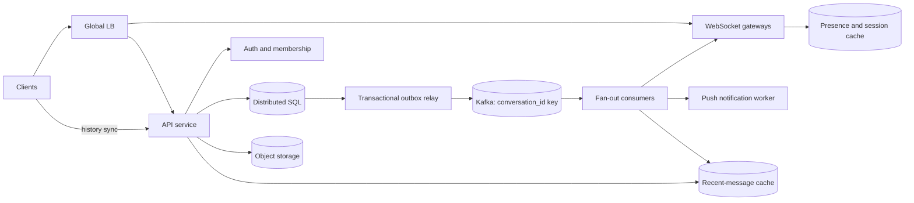

## 1. Problem

We are building chat for a consumer product used by people, support agents, and automated clients. A user can create a 1:1 conversation or a group, send text and media, see presence, receive typing indicators, search recent history, and continue receiving messages after a device has been offline. One account may have several phones, browsers, and desktop clients.

The important guarantees are deliberately scoped:

- Every accepted message is durable and has one order within its conversation.
- A send is acknowledged after durable commit, not merely after enqueueing in memory.
- Delivery is at-least-once; clients deduplicate by `message_id` and resume from a cursor.
- Presence and typing are ephemeral and may be stale. Message history is not.
- The target is p99 send acknowledgement below 200 ms in-region, millions of concurrent WebSocket connections, durable history, and multi-device synchronization.

The service is not a global total-order broadcast system. Ordering is per conversation, and media bytes are stored outside the message database. This boundary keeps the hard guarantees affordable.

## 2. Scale Estimation

Assumptions are planning inputs, not product facts:

| Quantity | Assumption | Reason |
|---|---:|---|
| DAU | 50 million | A large consumer deployment |
| Active senders/day | 20% of DAU | Many users read without sending |
| Messages/sender/day | 20 | Includes text and media metadata messages |
| Average message envelope | 1 KB | Text, IDs, timestamps, and a few attributes |
| Media attachment average | 2 MB, 5% of messages | Media is object storage, not hot-row storage |
| Retention | 3 years | Durable product history |
| Peak multiplier | 10x average | Regional time-zone and event spikes |

Messages/day = `50,000,000 x 20% x 20 = 200,000,000`.

Average message writes = `200,000,000 / 86,400 = 2,315 writes/s`; planning peak = `23,150 writes/s`. A send also creates an outbox event, so the durable write path handles roughly 46,300 row/event writes/s before replication. At-least-once delivery and retries are not counted as new user messages.

Raw message storage for three years = `200,000,000 x 1 KB x 1,095 days = 219 TB` decimal. Add two replicas, indexes, tombstones, and 30% headroom: about `219 x 2 x 1.3 = 569 TB`. Media storage = `200,000,000 x 5% x 2 MB x 1,095 = 21.9 PB` before lifecycle compression or deletion; it belongs in object storage with a CDN.

At peak, message ingress is about `23,150 x 1 KB = 23 MB/s` (184 Mb/s) and media upload traffic is approximately `1,158 x 2 MB = 2.3 GB/s` if the same peak factor applies. Direct-to-object-storage multipart upload is therefore mandatory. A typical active user has 12 conversation reads/day, or 600 million reads/day, 6,944 average read requests/s and about 69,440 peak requests/s. The read:write request ratio is approximately 3:1 after excluding WebSocket frames.

For 10 million concurrently connected clients, assuming 20% are connected in each region, four regions hold 2 million sockets each. At 4 KB/s average outbound traffic per connected client (presence, typing, and messages), egress is 8 GB/s per region at that occupancy. The availability objective is 99.99% for message acceptance and history reads; presence can have a lower 99.9% objective because it is recoverable.

Traffic grows with DAU and engagement. Capacity is provisioned for 2x the forecast peak, and a 100% annual growth review is a trigger to add shards rather than stretch a cluster past its failure domain.

## 3. API Design

HTTP APIs authenticate with a short-lived access token; WebSocket upgrade uses the same token. Every mutating request accepts an idempotency key scoped to the authenticated user.

```http
POST /v1/conversations
Authorization: Bearer <token>
Idempotency-Key: 7d2e...
Content-Type: application/json

{"type":"group","member_ids":["u2","u3"],"title":"Project"}
```

```json
{"conversation_id":"c_91","created_at":"2026-08-15T03:00:00Z","last_seq":0}
```

```http
POST /v1/conversations/{conversation_id}/messages
Authorization: Bearer <token>
Idempotency-Key: client-device-42:local-881
Content-Type: application/json

{"client_message_id":"local-881","text":"hello","attachments":[]}
```

```json
{"message_id":"m_7","conversation_id":"c_91","seq":1842,"sender_id":"u1","text":"hello","created_at":"2026-08-15T03:00:01Z"}
```

`POST /v1/media/upload-sessions` returns a bounded, authenticated object-storage upload URL. The client then sends the resulting object ID in the message request. `GET /v1/conversations/{id}/messages?after_seq=1830&limit=50` returns messages and `next_after_seq`; the server caps `limit` at 100. `POST /v1/conversations/{id}/read-cursors` stores a device cursor. `GET /v1/conversations?cursor=...` lists memberships and last-read state.

The WebSocket endpoint is `GET /v1/realtime` with subprotocol `chat.v1`. Frames are `message.new`, `message.ack`, `typing.start/stop`, `presence.update`, and `sync.required`. A reconnect sends `{"type":"resume","conversation_cursors":{"c_91":1840}}`; the server replays from history and then switches to live delivery. Clients acknowledge delivery with `message.received` but never treat delivery acknowledgement as durable send acknowledgement.

## 4. Data Model

The authoritative store is a distributed SQL database. Conversation membership and message metadata need transactions and predictable conditional writes; object storage holds media.

```sql
CREATE TABLE conversations (
  conversation_id UUID PRIMARY KEY,
  kind TEXT NOT NULL CHECK (kind IN ('direct', 'group')),
  created_at TIMESTAMPTZ NOT NULL,
  next_seq BIGINT NOT NULL DEFAULT 0
);

CREATE TABLE conversation_members (
  conversation_id UUID NOT NULL,
  user_id UUID NOT NULL,
  role TEXT NOT NULL,
  joined_at TIMESTAMPTZ NOT NULL,
  PRIMARY KEY (conversation_id, user_id)
);
CREATE INDEX members_by_user ON conversation_members (user_id, conversation_id);

CREATE TABLE messages (
  conversation_id UUID NOT NULL,
  seq BIGINT NOT NULL,
  message_id UUID NOT NULL,
  sender_id UUID NOT NULL,
  client_message_id TEXT NOT NULL,
  body JSONB NOT NULL,
  created_at TIMESTAMPTZ NOT NULL,
  PRIMARY KEY (conversation_id, seq),
  UNIQUE (sender_id, client_message_id)
);
CREATE INDEX messages_by_id ON messages (message_id);

CREATE TABLE outbox (
  event_id UUID PRIMARY KEY,
  conversation_id UUID NOT NULL,
  seq BIGINT NOT NULL,
  payload JSONB NOT NULL,
  published_at TIMESTAMPTZ NULL,
  UNIQUE (conversation_id, seq)
);
```

`(conversation_id, seq)` makes history scans ordered and local to a conversation. `members_by_user` answers login fan-out and membership checks; the primary key answers “who is in this group?” The sender/client unique key makes a retried HTTP request return the original message rather than allocate another sequence. `messages_by_id` supports receipt and moderation lookups.

Rows are hash-partitioned by `conversation_id`, with a deliberately separate hot-conversation policy: a very large group is assigned a conversation home shard and its fan-out is parallelized after the ordered append. A transaction locks or atomically increments `next_seq`, inserts the message and outbox row, and commits. No database sequence is shared across conversations, because global order is unnecessary.

## 5. High-Level Architecture



The global load balancer routes a WebSocket to a healthy gateway and keeps reconnect storms distributed. API services validate tokens, membership, payload size, and idempotency, then execute the transactional append. Distributed SQL is the source of truth. The outbox relay exists because a database commit and a broker publish cannot be one atomic operation; it publishes committed events at least once. Kafka partitions by conversation key, preserving per-key order while allowing parallel conversations.

Fan-out consumers resolve members and session locations, send to connected devices, and enqueue push notifications for offline devices. Gateways own sockets and use the session cache only as a routing hint; a missed hint is repaired by history replay. Redis stores expiring presence, typing, and connection ownership, not irreplaceable history. Recent-message cache reduces repeated tail reads, while object storage and a CDN keep large files off application and database links.

## 6. Deep Dive

**Horizontal scaling and connection ownership.** Gateways are stateless except for live sockets. A consistent-hash or rendezvous assignment limits session movement, but correctness does not depend on it. A gateway sends heartbeats, expires sessions after a short lease, and registers `(user_id, device_id, gateway_id, epoch)` in Redis. The epoch prevents an old gateway from deleting a newer registration. Load balancers drain connections before deploys; clients use exponential reconnect with jitter.

**Ordered append.** The message transaction checks membership, conditionally increments `next_seq`, inserts `(conversation_id, seq)`, and inserts the outbox event. Only one transaction wins a given sequence. Kafka preserves the order of those committed events for a conversation. Fan-out completion does not delay the send response. If a single group is hot, its append remains serialized, while delivery work is split by recipient batches; this preserves message order at the client without pretending all recipients share one queue.

**Outbox, retry, and backpressure.** Relays use `SELECT ... FOR UPDATE SKIP LOCKED` or the database's equivalent, publish with an event ID, and mark `published_at` only after broker acknowledgement. A crash between publish and marking causes a duplicate; consumers persist or atomically check an inbox/event ID before side effects. Retries use bounded exponential backoff. Poison payloads go to a DLQ with the conversation and event IDs; operators can replay after fixing the code. Consumer lag and queue depth are admission signals: pause nonessential push work, slow fan-out for low-priority notifications, and reject new media uploads before allowing memory to grow without bound.

**Database scaling.** History is append-heavy, so each shard uses sequential conversation-local keys and time-based compaction/archival. Read replicas serve history only when a cursor is older than the replica's replay position; after send, the writer or a replica meeting the required LSN serves the read. Membership and sequence allocation remain on the writer. Connection pools are bounded per application instance; otherwise scaling API instances can exhaust database connections faster than CPU.

**Caching and hot keys.** Cache only immutable message pages or short-lived conversation tails, keyed by conversation and sequence range. Invalidate by version or tolerate a short TTL; never use cache success as proof of persistence. Presence uses TTL leases and coalesced updates, with rate limits per user. A celebrity group can make one conversation key hot; split its fan-out topic by recipient bucket only after the ordered append, and cap group size or use a separate broadcast product if the product semantics permit it.

**Retries, limits, and locks.** Requests carry an idempotency key and the response is retained long enough for client retry windows. A retry after a lost response first checks the unique client key. Rate limits apply per user, IP, conversation, and gateway: message count, payload bytes, and connection attempts have separate buckets. Distributed locks are avoided in the send path; the row's conditional sequence update is the lock with a durable owner. A short lease may protect one-time membership migrations, with fencing tokens to prevent stale holders.

**Multi-region disaster recovery.** Each conversation has a home region for writes. Synchronous replication within the region provides the acknowledgement durability boundary; asynchronous cross-region replication targets an RPO below one minute. On regional loss, routing moves a conversation home after fencing the old writer. Clients may see a brief read-only interval rather than two writers allocating conflicting sequence numbers. Media uses cross-region object replication and immutable object IDs.

## 7. Consistency Model

Message append, membership authorization, idempotency lookup, sequence allocation, and outbox insertion are strongly consistent within the conversation's home region. A successful HTTP response means the message is in the committed writer and will be recoverable from the outbox, not that every recipient has seen it.

Delivery, presence, typing, unread counts, push notifications, and cache contents are eventual. A consumer may be behind Kafka; the client sees an older tail, then receives replayed messages after its cursor catches up. The API returns a `read_at_seq` and, where useful, the writer's commit position. A history read against a lagging replica is routed to the writer when `after_seq` exceeds that replica's replay position.

If the write succeeds but the response is lost, the client retries with the same idempotency key and `client_message_id`; the unique constraint returns the existing row and its sequence. If the outbox publishes twice, event IDs and `(conversation_id, seq)` suppress duplicate fan-out. Client UI can show “sent” at commit and “delivered/read” only from separate device cursors. There is no exactly-once network delivery claim.

## 8. Failure Scenarios

| Failure | Impact | Detection | Recovery |
|---|---|---|---|
| SQL writer unavailable | Sends fail or enter a short retry window; history may remain readable | p99 write latency, connection errors, failed health probes | Route to a healthy replica/home region after fencing; return retryable 503 and preserve client idempotency key |
| Outbox relay crashes after Kafka publish | Duplicate event | Relay heartbeat and duplicate event counters | Consumer inbox check makes replay harmless; restart relay and drain pending rows |
| Kafka consumer stuck on one partition | One conversation's delivery is delayed; other partitions continue | Partition consumer lag and age of oldest event | Restart or reassign consumer; inspect poison event and move it to DLQ |
| Redis session cache fails | Live routing and presence degrade; history remains durable | Redis errors, cache miss ratio, gateway send failures | Gateways fall back to local connection registry and clients reconnect; rebuild ephemeral keys |
| Gateway process dies | Its sockets disconnect; messages are replayable | Heartbeat lease expiry and socket disconnect rate | Load balancer removes node; clients reconnect with cursors; push covers offline gap |
| Region is lost | New sends in that home region pause; users reconnect elsewhere | Regional synthetic probes and replication health | Fence old region, promote designated home, replay cross-region log, accept declared RPO |
| Push provider throttles | Offline users receive delayed notifications | Provider response codes and notification age | Exponential retry, provider-specific rate limit, rely on sync on next app open |
| Hot group overwhelms a partition | Rising append or fan-out latency for one group | Per-conversation throughput and partition skew | Cap/rate-limit group, isolate fan-out buckets, move shard/home region |

## 9. Observability

Every request and event carries a trace ID, request ID, conversation ID, event ID, and client idempotency key. Logs are structured and exclude message bodies and access tokens. Traces cover API authorization, SQL commit, outbox publish, Kafka wait, fan-out, gateway write, and push enqueue.

SLIs and alerts include:

- Send success rate and p50/p95/p99 acknowledgement latency; alert when p99 exceeds 200 ms for five minutes.
- History error rate, stale-read rate, and replica replay lag; alert when a cursor cannot be served within the read freshness budget.
- Kafka consumer lag, age of oldest outbox row, DLQ rate, and queue depth; these identify stuck consumers or a relay outage before users report missing delivery.
- Gateway connected sockets, connection churn, event-loop saturation, outbound queue bytes, and send failures; these identify a gateway or reconnect storm.
- SQL CPU, disk latency, lock waits, replication lag, shard skew, failed transactions, and connection-pool utilization; these distinguish storage saturation from application errors.
- Redis memory, eviction, latency, and error rate; these signal loss of presence/routing hints.
- Media upload failure rate, object-store latency, CDN cache hit rate, and egress cost.

Dashboards slice all latency and lag by region, shard, conversation size, client version, and message type. Alerts have runbooks and a sampled end-to-end synthetic user that sends, reconnects, and verifies a cursor.

## 10. Capacity Planning

Use the peak figures rather than averages. Suppose one API instance safely sustains 2,000 message writes/s at the required p99. `23,150 / 2,000 = 12` instances; with 2x failure/upgrade headroom, deploy 24. Suppose one gateway holds 100,000 sockets at the selected heartbeat and outbound rate. `10,000,000 / 100,000 = 100` gateways; 2x headroom means 200 distributed across four regions.

Assume a database shard sustains 5,000 committed message transactions/s with replicas. `23,150 / 5,000 = 5` minimum write shards; choose 8 to absorb skew and maintenance. The 3-year raw history estimate is 219 TB, or about 569 TB with two replicas and headroom. At 200 million messages/day, growth is about 73 TB/year raw before indexes and replicas. Archive old immutable partitions to cheaper storage if the product keeps search latency only for recent history.

Kafka needs at least `ceil(23,150 / 500) = 47` partitions if a partition consumer safely handles 500 events/s. Choose 96 partitions to allow consumer parallelism and future growth; the key remains `conversation_id`, so partitions are not a global ordering mechanism. If one consumer handles 1,000 fan-out events/s, 24 active consumers cover the peak; run 48 for failover and uneven groups.

For 10 million sockets, a 512-byte session record is only about 5 GB before replicas and overhead; provision 20 GB usable Redis memory for presence, sessions, and churn. A 200-connection pool per API instance would be excessive: with 24 instances, even 50 connections each is 1,200 database connections. Start at 25 per instance, cap total by shard, and measure wait time; add read pools separately. These figures are capacity hypotheses to validate with load tests using large groups and reconnect storms.

## 11. Bottlenecks and Evolution

The first bottleneck is usually fan-out bandwidth and gateway write queues, not the append transaction: one message can target hundreds of devices. At 10x, hot groups and presence traffic dominate, so isolate presence into a lossy stream, batch recipient resolution, and partition fan-out by recipient bucket after the ordered log. At 100x, a single distributed SQL cluster and one Kafka fleet become operationally coupled; split conversation home regions, use independently scalable history clusters, and place a global directory in front of them.

Redesign the append path first only when sequence allocation or shard disk latency violates the 200 ms SLO. Otherwise redesign delivery first: regional gateway fleets, per-device cursors, compacted membership snapshots, and a durable replay log. A later target architecture can use tiered history, searchable indexing fed asynchronously, and a separate large-group broadcast service while retaining the same client cursor and idempotency contracts.

## 12. Trade-offs

| Decision | Option A | Option B | Decision | Why |
|---|---|---|---|---|
| Primary history store | Distributed SQL | NoSQL wide-column | SQL | Transactions for membership, sequence, and outbox outweigh simpler horizontal writes at this scale |
| Event transport | Kafka | RabbitMQ | Kafka | Replay, partition ordering, and high sustained throughput fit the delivery log |
| Ephemeral cache | Redis | Database cache | Redis | TTL leases and connection routing must not compete with durable writes |
| Send work | Synchronous append, async fan-out | Synchronous recipient delivery | Async fan-out | Keeps p99 send independent of offline devices and push providers |
| Region topology | Active-active writes | Active-passive home region | Active-passive per conversation | Avoids split-brain sequence allocation while allowing regional reads and fast failover |
| Sharding | Range by conversation ID | Hash by conversation ID | Hash | Distributes unrelated conversations; a separate hot-key policy handles giant groups |
| Live updates | Long polling | WebSocket push | WebSocket | Millions of long-lived connections justify lower frame overhead and bidirectional cursors |
| Service calls | REST/HTTP | gRPC | REST externally, gRPC internally | Public debuggability and compatibility; efficient typed internal fan-out |

## 13. Production Checklist

- [ ] Membership authorization is checked in the same transaction boundary as append.
- [ ] Repeated idempotency keys return the original result, including after a lost response.
- [ ] Sequence numbers are unique and monotonic per conversation; no global-order promise exists.
- [ ] Outbox, inbox/deduplication, bounded retries, DLQ, and replay tooling are tested.
- [ ] Client cursors replay safely after gateway, device, broker, and region failure.
- [ ] Backpressure limits memory, push work, media uploads, and fan-out queues.
- [ ] Shards, Kafka partitions, connection pools, and gateway counts have 2x failure headroom.
- [ ] Replica-lag routing and the declared cross-region RPO are tested in a game day.
- [ ] Logs redact bodies and tokens; dashboards expose p99, lag, queues, saturation, and skew.
- [ ] Load tests include a million-socket ramp, reconnect storm, and one very large group.

## 14. Engineering References

1. **Company:** Google SRE. **Article title:** *Site Reliability Engineering: The Book*. **URL:** https://sre.google/sre-book/table-of-contents/ **Key engineering lesson:** Define measurable SLIs/SLOs, design for failure, and use capacity and error budgets to guide operations. **How it influenced this design:** The 200 ms send SLO, 99.99% acceptance target, lag alerts, failure runbooks, and game-day checklist are explicit rather than implied.
2. **Company:** Google Research. **Article title:** *Google Research Publications*. **URL:** https://research.google/pubs/ **Key engineering lesson:** Validate distributed-systems assumptions against published research instead of treating a product pattern as a guarantee. **How it influenced this design:** Per-conversation ordering and at-least-once delivery are stated as bounded guarantees, not as “exactly once” claims.
3. **Company:** Netflix Tech Blog. **Article title:** *Netflix Tech Blog*. **URL:** https://netflixtechblog.com/ **Key engineering lesson:** Resilience is an operational property achieved with isolation, graceful degradation, and tested failure behavior. **How it influenced this design:** The architecture isolates ephemeral presence, gateway sockets, push providers, and media from durable message acceptance.
4. **Company:** Cloudflare. **Article title:** *Cloudflare Blog*. **URL:** https://blog.cloudflare.com/ **Key engineering lesson:** Edge connection services must account for connection lifecycle, load distribution, and backpressure at very large concurrency. **How it influenced this design:** Gateways own sockets, load balancers drain nodes, reconnects use jitter, and outbound queues are observable and bounded.
