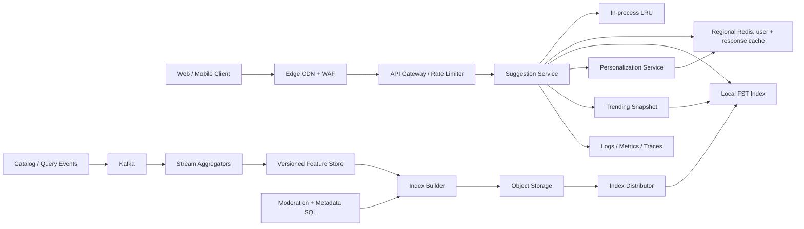

## 1. Problem

We are building the suggestion service behind a search box. A user types a prefix such as `phot`, and the service returns a short, ordered list of useful completions such as “photo printer”, “photo editor”, and “photography”. The same service powers web, mobile, and voice-assisted clients.

The users are anonymous visitors, signed-in customers, and internal ingestion jobs. The interactive path must support:

- Prefix suggestions from the global catalog.
- Personalized suggestions based on a user’s recent searches and preferences.
- Trending suggestions that react to recent demand without allowing one noisy event to dominate.
- Typo tolerance for common edit-distance-one mistakes.
- Category-aware ranking, such as products, people, places, or help articles.
- Partial results when personalization, trending, or one index replica is unavailable.

The user-visible SLO is p99 under 50 ms at the service boundary, excluding client network time. We target 99.99% monthly availability for the core prefix path. A stale but safe result is preferable to an error; suggestions must not expose private queries, blocked terms, or data from another tenant. A click or search event may be lost briefly, but a completed ingestion request must be idempotent and eventually indexed.

## 2. Scale Estimation

Assumptions are deliberately explicit so capacity can be replaced with production measurements:

- 50 million daily active users (DAU). This represents a large consumer product, not a global web index.
- Each user performs 20 autocomplete requests per day. This counts keystrokes that pass the client debounce, not every keypress.
- `50,000,000 x 20 = 1,000,000,000 requests/day`.
- Average request rate: `1,000,000,000 / 86,400 = 11,574 RPS`.
- Traffic is bursty around launches and evening usage. A 10x peak gives about `116,000 RPS`; we provision 30% headroom, or `151,000 RPS` of read capacity.
- An average response is 10 suggestions x 80 bytes plus JSON overhead, approximately 2 KB. Egress at peak is `116,000 x 2 KB = 232 MB/s`, or about 1.86 Gbit/s before protocol overhead.
- The read path dominates. Assume 10 million accepted query/event writes per day: the read:write ratio is `100:1`.
- An accepted event is about 500 bytes. Raw event storage for 30 days is `10,000,000 x 500 x 30 = 150 GB`; with three durable replicas, indexes, and 40% overhead, reserve about 630 GB. The event log is retained for 30 days and then compacted or deleted.
- The serving vocabulary is 200 million unique phrases. A compact trie/FST entry, category metadata, counters, and ranking features average 120 bytes, or 24 GB raw. Five regional replicas plus temporary build space require roughly 150 GB.
- We target 99.99% availability, allowing about 4 minutes 23 seconds of unavailability per 30-day month. The 50 ms p99 target applies to successful core responses; dependency degradation should produce a bounded partial response, not wait for a timeout.
- Phrase growth is 5% monthly. Events grow with DAU and usage, so the event pipeline should support at least 2x the current peak before an expansion is scheduled.

These numbers imply a read-optimized, memory-resident serving index, a separately scalable event pipeline, and bounded fan-out. The service should never query a relational database once per keystroke.

## 3. API Design

The public endpoint is:

```http
GET /v1/suggestions?q=phot&limit=8&category=all&locale=en-US
Authorization: Bearer <token>       # optional for personalization
X-Request-Id: 7f2c...
```

Response:

```json
{
  "query": "phot",
  "suggestions": [
    {"text": "photo printer", "category": "product", "score": 0.94},
    {"text": "photo editor", "category": "app", "score": 0.89}
  ],
  "complete": true,
  "sources": ["global", "trending"],
  "index_version": "2026-08-15T09:59:40Z",
  "request_id": "7f2c..."
}
```

`limit` is capped at 10, and the query is normalized (Unicode normalization, case folding, and bounded length) before lookup. The server returns `200` with `complete: false` if optional sources time out. It returns `400` for an invalid locale or query shape, `401` only when an explicitly requested authenticated feature requires identity, and `429` for a caller over its quota. A core index outage returns a cached result when available, otherwise `503` with `Retry-After`.

Event ingestion is separate:

```http
POST /v1/query-events
Idempotency-Key: 6b5d6b9e-...
Authorization: Bearer <token>
Content-Type: application/json

{"query":"photo printer","selected_suggestion":"photo printer","locale":"en-US","occurred_at":"2026-08-15T03:00:02Z"}
```

The response is `202 Accepted` after durable queue admission. The idempotency key is scoped to tenant and endpoint and retained for 48 hours. The client must not retry a `4xx` except `429`; it may retry a lost response for the same key. Events carry a server-assigned producer timestamp and are not trusted for authorization or tenant identity.

## 4. Data Model

The source-of-truth metadata is relational because phrase ownership, moderation, and versioned publication need constraints and transactions.

```sql
CREATE TABLE phrases (
  tenant_id       BIGINT NOT NULL,
  phrase_id       BIGINT NOT NULL,
  normalized_text  TEXT NOT NULL,
  locale           TEXT NOT NULL,
  category         TEXT NOT NULL,
  status           TEXT NOT NULL,
  base_score       DOUBLE PRECISION NOT NULL,
  updated_at       TIMESTAMPTZ NOT NULL,
  PRIMARY KEY (tenant_id, phrase_id),
  UNIQUE (tenant_id, locale, normalized_text)
);

CREATE INDEX phrases_lookup
  ON phrases (tenant_id, locale, status, normalized_text);

CREATE TABLE query_events (
  tenant_id       BIGINT NOT NULL,
  event_id        UUID NOT NULL,
  idempotency_key TEXT NOT NULL,
  user_id         BIGINT,
  normalized_text TEXT NOT NULL,
  category        TEXT,
  occurred_at     TIMESTAMPTZ NOT NULL,
  PRIMARY KEY (tenant_id, event_id),
  UNIQUE (tenant_id, idempotency_key)
);

CREATE INDEX events_time ON query_events (tenant_id, occurred_at);
```

The phrase uniqueness constraint prevents duplicate catalog entries within a tenant and locale. The lookup index serves moderation and rebuild tools, not the hot suggestion path. Events use `(tenant_id, event_id)` for durable deduplication and a time index for windowed aggregation. Large event tables are range-partitioned by day; this makes 30-day retention a partition drop rather than a billion-row delete.

The serving representation is an immutable, memory-mapped FST/trie snapshot. Each terminal stores phrase ID, category, base score, and compact feature references. A separate per-user list is keyed by `(tenant_id, user_id, locale)` and has a short TTL. The event stream is partitioned by `hash(tenant_id, normalized_text)`: the phrase is the ordering key for deterministic window aggregation, while a tenant salt prevents predictable cross-tenant placement. A very popular phrase can still be hot, so aggregators use bounded per-key state and a two-stage combine.

## 5. High-Level Architecture



The edge absorbs TLS and obvious abuse, but suggestions are not freely cacheable by URL when identity affects ranking. The gateway enforces tenant, user, and IP budgets before work reaches the service. Suggestion Service owns normalization, bounded parallel fan-out, merging, and response deadlines.

The in-process LRU handles repeated anonymous prefixes at nanosecond-scale latency. Regional Redis stores short-lived user suggestions and selected response fragments; it is not the source of truth. The local FST gives predictable prefix lookup without a network hop. Personalization and trending are optional branches with independent deadlines. Kafka separates user-facing reads from bursty events. Stream aggregators produce features, and the builder publishes immutable, checksummed snapshots through object storage. SQL remains the authoritative control plane for moderation and metadata. Telemetry is emitted from every boundary with the request ID.

## 6. Deep Dive

**Serving and ranking.** Normalize once, then query the local index for up to 50 candidates. In parallel, fetch at most 20 personal candidates and 20 trending candidates. A 35 ms internal deadline leaves time for serialization and network variance. Merge by normalized phrase ID, remove blocked or duplicate entries, apply category filters, and rank with:

`final = 0.55 x global + 0.20 x personal + 0.15 x trend + 0.10 x freshness`

Weights are configuration, not code. A minimum global prior prevents a user’s sparse history from producing empty or strange results. Sensitive queries are excluded before aggregation, and personalization is tenant-scoped.

**Typo tolerance.** First query the exact prefix because it is cheap and preserves precision. If it yields too few candidates, generate bounded alternatives using a keyboard-aware substitution map, one insertion, deletion, or transposition, and query a compact fuzzy side index. The service caps alternatives by prefix length and edit distance, then merges them with a penalty so an exact match always outranks a fuzzy match. This avoids an unbounded fuzzy search on every keystroke and keeps typo handling inside the latency budget.

**Horizontal scaling and load balancing.** Suggestion instances are stateless and spread across three availability zones. The load balancer uses least outstanding requests because CPU cost varies with prefix length and optional fan-out. Autoscaling uses CPU, p99 latency, and in-flight requests; CPU alone reacts too late to a network-bound cache failure. Each instance has a fixed worker budget and per-dependency connection limits.

**Caching.** Cache keys include tenant, normalized prefix, locale, category, model version, and an identity bucket where required. Anonymous global results can have a 30-second TTL; trending needs a 10-second TTL; personal data uses a 60-second TTL and explicit deletion on account removal. Negative caching for prefixes with no results lasts 2 seconds. TTL jitter of +/-20% avoids synchronized expiry. On Redis failure, local global results remain available and personal ranking is omitted. Caches are bounded by byte size, not only entry count, and never cache an authorization error.

**Index publication.** A builder consumes a consistent feature watermark, creates a new immutable snapshot, writes it to object storage, and records a manifest containing version, checksum, vocabulary statistics, and minimum supported schema. Distributors verify the checksum, warm the snapshot, then atomically switch a pointer. During rollout, instances serve the old snapshot if the new one fails validation. A blue/green index rollout can compare candidate quality and latency before promotion; no in-place trie mutation is needed.

**Events, ordering, and backpressure.** Producers write to Kafka with an idempotency key. The event consumer commits offsets only after the aggregate is durable. Ordering is guaranteed per phrase partition, not globally; global ordering would throttle throughput without improving ranking quality. If downstream feature storage is slow, consumers pause partitions after a bounded buffer fills. Gateway event quotas and Kafka producer limits prevent an ingestion spike from starving reads. A poison event is retried with exponential backoff, then sent to a DLQ with the payload, error class, and original offset. DLQ replay uses a new replay ID and remains idempotent.

**Retries and idempotency.** The interactive service retries no more than once, only for a short, idempotent cache read, and never retries a timed-out index query after the request deadline. Kafka and the event store use `(tenant_id, idempotency_key)` uniqueness. If a producer receives no response after the broker accepted a message, it retries the same key; the consumer deduplicates it. This addresses “write succeeded but response was lost” without pretending distributed exactly-once delivery exists.

**Rate limiting and isolation.** Apply token buckets at tenant, API key, user, and IP levels. Reserve a core-read budget separate from event ingestion. A noisy tenant cannot consume all FST CPU or Redis connections. Adaptive concurrency limits shed optional personalization first when p99 rises. Query length, candidate count, and category count are bounded at the gateway.

**Databases and sharding.** SQL has one writer per partition group and read replicas for rebuild tooling. It is not on the request path. Event aggregation uses hash partitions for even load; daily time partitions support retention in the durable store. Redis is deployed per region with replicas and automatic failover, but cached data can be reconstructed. No distributed lock is needed for serving: snapshot publication is an atomic pointer change. A lease is used only to ensure one active builder per `(tenant, locale, model_version)`; lease loss stops publication rather than corrupting an index.

**Regions and disaster recovery.** Each region has a complete serving snapshot and can serve global results independently. Event streams replicate asynchronously to a secondary region. Route traffic away from a failed region using health checks, accepting that the newest personal/trending features may lag. Snapshot manifests and object storage are cross-region replicated. Recovery point objective is 15 minutes for events; recovery time objective is 30 minutes for a full regional rebuild. A regional failover intentionally disables personalization if its user store is unavailable.

## 7. Consistency Model

There are three explicit consistency domains:

- Moderation and tenant metadata are strongly consistent in the primary SQL transaction. A blocked phrase must not enter a newly published snapshot after its blocking transaction is acknowledged.
- Global, trending, and model features are eventually consistent. The normal freshness target is 60 seconds from event acceptance to snapshot availability; replication lag is exposed in the response metadata and telemetry.
- User history is read-after-write within the serving region when possible, but cross-region reads can be stale by up to 5 minutes. A missing personal result degrades to global ranking.

Publication is atomic per instance: a request sees either a complete old snapshot or a complete new one, never a half-built structure. During lag, the service serves the last valid snapshot and marks `complete` based on source health, not on whether every optional feature arrived.

For a successful event write with a lost HTTP response, the client retries the same idempotency key. The API may return `202` again or a stored receipt; it never creates a second logical event. At-least-once delivery plus durable deduplication is the practical guarantee. Search results do not promise that a just-entered query appears immediately.

## 8. Failure Scenarios

| Failure | Impact | Detection | Recovery |
|---|---|---|---|
| Primary metadata DB is unavailable | Moderation updates and rebuild manifests pause; serving uses the last approved snapshot | DB health, write errors, replica lag, transaction latency | Fail writes closed, keep serving the last snapshot, fail over SQL, then rebuild from the last consistent watermark |
| Kafka consumer is stuck on a poison event | Trending freshness increases; partition lag grows | Consumer lag by partition, age of oldest message, DLQ rate | Stop retry loop, move the event to DLQ, resume from the next offset, replay after fixing validation |
| Redis cluster fails over or becomes unreachable | Personal cache misses and higher service CPU; global results remain available | Cache timeout rate, hit ratio, connection errors, pool saturation | Bypass Redis, use local cache, reduce optional fan-out, restore replicas before re-enabling writes |
| One index snapshot is corrupt | A subset of instances cannot load the new version | Checksum/load failures, version skew, readiness failures | Keep old snapshot, quarantine the artifact, rebuild and atomically republish |
| Region loses network or power | Regional requests fail; replicated feature freshness stops | Synthetic probes, regional error budget burn, load-balancer health | Shift traffic to another region, serve its last snapshot, reconcile events after recovery |
| Trending key becomes extremely hot | One aggregator partition or cache key saturates | Per-key throughput, partition skew, CPU and queue depth | Use salted subkeys and two-stage aggregation; cap contribution per user |
| Ranking dependency exceeds its deadline | p99 rises and requests become incomplete | Dependency latency histogram and `complete=false` ratio | Cancel optional work at deadline and return global candidates; do not retry in the request path |

## 9. Observability

Every request receives or propagates `X-Request-Id` and a W3C trace ID. Logs are structured and include tenant hash, normalized prefix length, cache outcome, index version, source set, deadline, and result count; raw user queries are sampled or redacted under privacy policy.

Core SLIs are availability, p50/p95/p99 latency, timeout rate, and percentage of responses with at least one valid suggestion. Alerts should map to actions:

- p99 over 50 ms for 5 minutes indicates overloaded instances, a slow dependency, or connection-pool contention.
- `complete=false` over 1% indicates optional dependency or snapshot health degradation.
- Local index version skew or freshness age over 2 minutes indicates failed distribution.
- Redis timeout rate and hit ratio distinguish cache outage from ordinary misses.
- Kafka oldest-message age, lag per partition, rebalance count, and DLQ rate identify a stuck consumer or poison data.
- SQL connection-pool utilization, lock wait, replica lag, and transaction errors identify control-plane saturation.
- CPU, RSS, page faults, file-descriptor use, and in-flight requests identify instance saturation.
- Per-tenant rejection rate and hot-key concentration identify abuse or partition skew.

Dashboards correlate trace spans for normalization, index lookup, Redis, personal ranking, and serialization. Synthetic probes type common prefixes from every region. Quality metrics such as click-through rate, zero-result rate, duplicate rate, and blocked-term exposure are monitored separately from latency; a fast incorrect suggestion is still a failure.

## 10. Capacity Planning

At the 151,000 RPS provisioned peak, benchmarked one instance at 2,500 RPS with p99 below 35 ms and 50% CPU. Required instances are `151,000 / 2,500 = 61`; with N+2 zone failure capacity and 30% operational headroom, deploy 84 instances, 28 per zone. If one zone is lost, 56 instances still provide 140,000 RPS, so autoscaling must raise the remaining zones during a sustained peak or the admission controller must shed optional work.

The 24 GB raw index becomes about 35 GB after runtime structures. A 64 GB instance leaves room for the process, allocator fragmentation, and two mapped snapshots during rollout. The 30-second anonymous cache at peak could contain `116,000 x 30 = 3.48 million` responses. At 2 KB each plus overhead, reserve 10 GB per region for that tier, with eviction rather than unbounded growth. Personal cache size is capped separately by tenant and user budgets.

Kafka needs at least 48 partitions for event traffic, assuming 2,500 events/s per partition and a 2x burst margin (`10,000,000/day = 116 events/s average`, but launch bursts and replay dominate). Six consumer instances with eight partitions each provide parallelism; consumers scale to 12 during catch-up. Keep 24 hours of broker retention for replay, while the durable event store retains 30 days.

The event database receives about 116 writes/s on average and 1,160 writes/s at a 10x burst, but replicas and indexes make I/O the limiting resource. Provision a primary for 2,000 durable writes/s, two read replicas, and daily partitions. A 40-connection pool per suggestion instance would create 3,360 potential connections, so the request path does not connect to SQL; control-plane workers use a separate pool of 100 connections per region with a database-side maximum sized for failover.

Cross-region snapshot transfer is roughly 35 GB per publish. Publishing hourly is 840 GB/month before replication overhead, so manifests and delta-aware distribution should be introduced if this becomes material. The first capacity test must include cold snapshot loading, Redis failure, Kafka replay, and a single-zone loss, not only steady-state cache hits.

## 11. Bottlenecks and Evolution

The first bottleneck is usually the p99 tail from optional fan-out, not trie lookup. At 10x traffic, Redis connection pools, network bandwidth, and hot prefixes become the next limits. We would first isolate the core index path, move trending to a compact local snapshot, and enforce adaptive concurrency before adding more dependencies.

At 100x, a single regional vocabulary and full snapshot per instance become expensive. Split the index by tenant/locale or prefix range, route prefixes consistently, and replicate only hot ranges to every node. Use a two-level index: a tiny common-prefix tier in memory and remotely loaded immutable shards with admission control. Separate interactive traffic from batch rebuild traffic at the network and compute layers.

The target architecture retains stateless serving but adds a global traffic manager, regional isolation, tiered index shards, streaming feature computation, and an offline evaluation gate for model changes. Ranking models can evolve from weighted rules to a learned model only after feature freshness, explainability, and rollback are measurable. The redesign order is driven by tail latency and hot-key skew, not by adopting a more fashionable database.

## 12. Trade-offs

| Decision | Option A | Option B | Decision | Why |
|---|---|---|---|---|
| Metadata store | SQL | NoSQL | SQL | Uniqueness, moderation, and publication constraints matter more than write scale; it is off the hot path. |
| Event transport | Kafka | RabbitMQ | Kafka | Replay, partition ordering, and high-throughput streams fit aggregation; RabbitMQ is preferable for small work queues with per-message routing. |
| Cache | Redis | Database cache | Redis | Bounded TTL, regional failover, and low-latency structures are needed; the DB remains authoritative. |
| Feature updates | Synchronous | Asynchronous | Asynchronous | Keystroke latency must not wait for aggregation; freshness is explicitly eventual. |
| Regions | Active-active | Active-passive | Active-active serving | A complete immutable snapshot makes read failover practical; writes still use a controlled primary pipeline. |
| Sharding | Range | Hash | Hash events, selective range index shards | Hash avoids event hotspots; range locality helps prefix lookup only at much larger scale. |
| Freshness delivery | Polling | Push | Polling manifests | Hourly or minute-level snapshots do not justify persistent connections to every serving node. |
| Service protocol | REST | gRPC | REST at edge, gRPC internally | Browsers and mobile clients need simple HTTP; internal typed calls reduce overhead where fan-out exists. |

## 13. Production Checklist

- [ ] p99, availability, freshness, and partial-result SLOs have owners and alert thresholds.
- [ ] Query normalization, tenant isolation, moderation filtering, and privacy redaction are tested.
- [ ] Idempotency keys, duplicate handling, retry limits, and DLQ replay are verified.
- [ ] Snapshot checksum, schema compatibility, warm-up, rollback, and version-skew checks pass.
- [ ] Load tests cover 10x peak, hot prefixes, cold caches, Redis failure, Kafka replay, and zone loss.
- [ ] Rate limits isolate tenant, user, IP, core reads, and ingestion.
- [ ] Dashboards expose p99, incomplete responses, cache health, index age, lag, pool saturation, and quality metrics.
- [ ] Regional failover, event reconciliation, RPO 15 minutes, and RTO 30 minutes are exercised.

## 14. Engineering References

1. **Company:** Google SRE  
   **Article title:** *Site Reliability Engineering: The SRE Book*  
   **URL:** https://sre.google/sre-book/table-of-contents/  
   **Key engineering lesson:** SLOs, error budgets, overload control, and monitoring must be explicit operational contracts.  
   **How it influenced this design:** The 50 ms p99 and 99.99% availability targets, actionable alerts, graceful degradation, and capacity headroom are treated as design inputs rather than post-launch metrics.

2. **Company:** Google Research  
   **Article title:** *Google Research Publications*  
   **URL:** https://research.google/pubs/  
   **Key engineering lesson:** Search quality is an empirical systems problem: ranking, evaluation, latency, and freshness must be measured together.  
   **How it influenced this design:** The design separates serving from feature computation and requires quality metrics and an offline evaluation gate before ranking changes.

3. **Company:** Netflix Technology Blog  
   **Article title:** *Netflix Tech Blog*  
   **URL:** https://netflixtechblog.com/  
   **Key engineering lesson:** Resilient distributed systems isolate dependencies and make graceful degradation a deliberate behavior.  
   **How it influenced this design:** Personalization and trending have independent deadlines, while the global index remains a usable fallback during dependency or regional failures.

4. **Company:** Cloudflare Blog  
   **Article title:** *Cloudflare Blog*  
   **URL:** https://blog.cloudflare.com/  
   **Key engineering lesson:** Edge systems need explicit controls for caching, abuse, traffic bursts, and regional failure.  
   **How it influenced this design:** The architecture places WAF/rate limiting at the edge, uses bounded caches with jitter, and plans traffic shifting as a normal recovery action.
