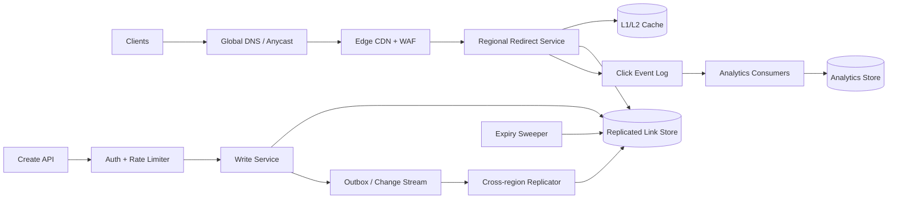

## 1. Problem

We are building a URL-shortening service for people and applications that turn a long destination into a stable short link. A link may be created automatically or with a requested custom alias, then served as an HTTP 301 (permanent) or 302 (temporary) redirect. Owners can inspect click analytics and set a time-to-live (TTL).

The service must preserve permanent links: once an alias is published, it must not silently point somewhere else. Redirect traffic is the critical path, while analytics is deliberately off that path. We assume 100:1 redirect-to-create traffic, global users, and clients that may retry requests after a timeout.

Non-functional targets:

- Redirect p99 below 50 ms at the service edge, excluding the user's network and destination fetch.
- 99.99% monthly availability for redirect serving; creation and analytics may have separate, lower SLOs.
- Collision-free generated keys and linearizable ownership for custom aliases.
- No loss of committed mappings; analytics may be delayed but not silently duplicated in reports.
- A read path that remains useful during a write-region or analytics outage.

## 2. Scale Estimation

The numbers below are planning assumptions, not claims about a particular existing product.

- Assume 100 million daily active redirecting clients. At 10 redirects per client per day: `100M x 10 = 1B redirects/day`.
- Average redirect rate is `1B / 86,400 = 11,574 requests/s`.
- A 10x diurnal and campaign peak gives `115,740 requests/s`; provision for 150,000 requests/s to leave headroom.
- With a 100:1 read:write ratio, creates are `10M/day`, or `116 writes/s` average and about `1,160 writes/s` at peak.
- If a mapping row averages 600 bytes including indexes and replication metadata, seven years of non-expiring links require `10M x 365 x 7 x 600 = 15.33 TB` before replicas and compaction. With three copies, plan for about 46 TB.
- A redirect response is roughly 1 KB including headers. Peak egress is `150,000 x 1 KB x 8 = 1.2 Gb/s`; edge providers need additional room for TLS and cache misses.
- A click event is about 200 bytes. At one event per redirect, raw event ingress is `1B x 200 = 200 GB/day`, or roughly 73 TB/year before Kafka replication and warehouse storage.
- Use a 1.2 cumulative planning factor for link growth: seven-year retained mappings are approximately `10M x 1.2 x 365 x 7 = 30.66B` rows, or 18.4 TB of primary row bytes at the same 600-byte estimate.
- The availability budget for a 99.99% monthly SLO is about 4.32 minutes per 30-day month. Redirects therefore fail open to cache where safe, but never invent a destination.

The key consequence is that a database sized for writes is not enough: the read fleet, edge cache, and cross-region replication must absorb two orders of magnitude more traffic.

## 3. API Design

### Create a link

`POST /v1/links`

```json
{
  "destination": "https://example.com/articles/very-long-path",
  "alias": "launch-2026",
  "status_code": 302,
  "expires_at": "2027-01-01T00:00:00Z"
}
```

`alias` is optional. The authenticated owner is taken from the access token, not the body. The client supplies `Idempotency-Key`; the server stores the request fingerprint and result for 24 hours.

```json
{
  "id": "01K2...",
  "alias": "launch-2026",
  "short_url": "https://s.example/launch-2026",
  "status_code": 302,
  "expires_at": "2027-01-01T00:00:00Z"
}
```

Return `201` for a new link, `200` for an idempotent replay, `409` for an occupied custom alias, `422` for an invalid destination or TTL, and `429` for an owner or IP rate limit. A custom alias is never reassigned, including after expiry.

### Redirect

`GET /{alias}` returns `301` for a permanent mapping or `302` for a temporary mapping, with a `Location` header. Unknown, expired, disabled, and malformed aliases return `404`, without revealing whether a deleted alias once existed. The edge may cache a negative response briefly, but must respect a short negative TTL.

### Analytics

`GET /v1/links/{id}/analytics?from=...&to=...&bucket=hour` returns aggregated counts and a freshness timestamp. It is eventually consistent. `POST /v1/links/{id}/disable` is authenticated and idempotent; disabling is a strongly ordered state transition.

## 4. Data Model

The source of truth is a sharded, strongly consistent key-value/SQL-compatible store. SQL notation makes constraints explicit; the physical implementation can use a distributed SQL service or a key-value service with equivalent conditional writes.

```sql
CREATE TABLE links (
  link_id       UUID PRIMARY KEY,
  alias         VARCHAR(32) NOT NULL UNIQUE,
  owner_id      BIGINT NOT NULL,
  destination   TEXT NOT NULL,
  redirect_code SMALLINT NOT NULL CHECK (redirect_code IN (301, 302)),
  state         VARCHAR(12) NOT NULL CHECK (state IN ('active', 'disabled', 'expired')),
  created_at    TIMESTAMP NOT NULL,
  expires_at    TIMESTAMP NULL,
  version       BIGINT NOT NULL,
  shard_key     BIGINT NOT NULL
);

CREATE INDEX links_owner_created ON links (owner_id, created_at DESC);
CREATE INDEX links_expiry ON links (expires_at) WHERE state = 'active';

CREATE TABLE idempotency_records (
  owner_id      BIGINT NOT NULL,
  idempotency_key VARCHAR(128) NOT NULL,
  request_hash  CHAR(64) NOT NULL,
  response_json JSON NOT NULL,
  created_at    TIMESTAMP NOT NULL,
  PRIMARY KEY (owner_id, idempotency_key)
);
```

`alias` is the redirect lookup key, so its unique index is the authoritative collision check. `(owner_id, created_at)` supports the owner's list view without scanning aliases. The partial expiry index feeds a sweeper; expiry is also checked synchronously on reads, so the sweeper is not a correctness dependency. The shard key is a stable hash of the alias, not a sequential ID: it distributes hot popular aliases and avoids a monotonically increasing write partition.

Analytics is separate:

```sql
CREATE TABLE click_hourly (
  link_id       UUID NOT NULL,
  hour          TIMESTAMP NOT NULL,
  country       CHAR(2) NOT NULL,
  device_class  VARCHAR(16) NOT NULL,
  clicks        BIGINT NOT NULL,
  PRIMARY KEY (link_id, hour, country, device_class)
);
```

The event stream, not the redirect database, is the source for this aggregate. The aggregate key makes a link/time query efficient; retention and rollups prevent unbounded analytics storage.

## 5. High-Level Architecture



- Global DNS/Anycast sends a client to a nearby healthy edge, reducing handshake and network latency.
- The CDN/WAF absorbs cacheable redirects, blocks abusive scans, and applies coarse rate limits before origin capacity is consumed.
- Regional redirect services do a cache lookup, validate state and expiry, and return the redirect. They are stateless so capacity scales horizontally.
- The replicated link store is the durable source of truth. Reads use a local replica; writes go to the alias's home region or a quorum-capable write endpoint.
- The click event log decouples analytics from redirect latency. A bounded event payload avoids putting user-agent or destination data on the hot mapping path.
- Consumers batch and upsert hourly aggregates into an analytics store, with replay from retained events.
- The outbox/change stream makes a committed create visible to replication and cache invalidation without a dual-write gap.
- The expiry sweeper reclaims or marks old rows, but request-time expiry checks protect correctness if it is late.

## 6. Deep Dive

### Redirect path and caching

The lookup key is the normalized alias. Edge caching is safe for `301` only when the product contract treats the destination as immutable. A `302` has a short, configurable cache lifetime. Cache entries include `state`, `expires_at`, `redirect_code`, and a mapping version. The origin compares expiry against its clock and returns `404` after expiry.

Use per-region L1 memory caches for the hottest aliases and a shared L2 cache for warm data. Cache-aside reads fill L2 after a miss; writes invalidate or version-bump both levels after the store commit. A single-flight mechanism coalesces concurrent misses for one alias. It is bounded and local, so a cache outage degrades to the store rather than creating a global lock.

Popular aliases create hot keys even when shards are balanced. CDN caching, per-key request coalescing, and replicated read copies address this; blindly adding database shards does not.

### Key generation and custom aliases

Automatic aliases use a 64-bit random or time-sortable ID encoded in base62. A 64-bit space gives `62^11`, about `5.2e19`, possible 11-character strings. We still enforce uniqueness transactionally: a rare collision retries with a new ID. Custom aliases use a conditional insert on the unique alias key. The operation is idempotent only for the same owner and request key; two owners racing for the same alias produce one success and one `409`.

Never recycle an alias. A tombstone or permanent reservation records historical ownership, preventing an old QR code or cached 301 from acquiring a different meaning.

### Writes, replication, and transactions

The write transaction inserts `links` and `idempotency_records` together. A unique constraint and conditional write are the collision boundary. The response is returned only after the home replica durably acknowledges the transaction. A change stream/outbox is emitted from committed state, so a process crash cannot report success while losing the replication notification.

Reads are served locally after replication. A newly created link may briefly miss in another region; the API can return the home region and the redirect service can perform a bounded read-through to the home region on a local miss. This protects read-your-write for the creator without making every global redirect synchronous.

### Analytics, queues, and backpressure

The redirect handler emits a compact event with `event_id`, `link_id`, timestamp, coarse geography, device class, and region. It does not wait for analytics. The log is partitioned by a salted hash of `link_id`, with enough partitions for peak ingress and consumer parallelism. A single famous link must not map every event to one partition.

Consumers commit offsets after durable aggregate upserts. Upserts are keyed by `(link_id, hour, country, device_class)` and carry a deduplication watermark or event-ID set for the replay window. This gives at-least-once delivery with bounded duplicate protection. Exact global event uniqueness is not worth delaying redirects; reports expose freshness and may reconcile late events.

If consumers lag, the log retains events, consumers scale out, and low-priority dimensions can be sampled or delayed. If the log is unavailable, the redirect still succeeds; a bounded local buffer may absorb a short outage, then drops are counted explicitly. A dead-letter queue holds malformed events after a finite retry budget. Exponential backoff with jitter prevents a bad downstream from causing a retry storm.

### Rate limits, retries, and load balancing

Create and disable APIs use token buckets by authenticated owner, API key, IP, and destination-domain reputation. Redirects use WAF abuse controls and per-edge limits, but ordinary popular links are not throttled as if they were attacks. The load balancer uses latency- and health-aware routing, with connection draining during deploys.

Clients retry creates only with the same `Idempotency-Key`. The server rejects a reused key with a different request hash (`409`). Redirect GETs are safe to retry, but a retry must not generate a second billing or analytics side effect; `event_id` is derived from request ID plus a short time bucket or deduplicated downstream.

Connection pools are sized below database limits: each service instance has a bounded pool and a request queue with a deadline. Once the queue is full, fail fast rather than letting threads pile up and amplify latency. Circuit breakers stop sending traffic to a failing replica; half-open probes test recovery.

### TTL and disaster recovery

TTL is metadata, not a timer that must wake exactly at the deadline. Request-time checks are authoritative. The sweeper marks expired links in batches, rate-limited to avoid competing with reads, and cache invalidation follows the state change. Permanent aliases retain tombstones.

Each region has independent compute and cache capacity. Link data is synchronously durable within its home region and asynchronously replicated to another region with a documented RPO target, for example five minutes. A regional failover changes routing to a healthy replica; the control plane prevents two regions from accepting conflicting writes for the same alias. Backups are encrypted, tested by restore drills, and retained separately from the live store.

## 7. Consistency Model

Strong consistency is required for alias ownership, idempotency records, disable operations, and the committed source-of-truth mapping. A custom alias cannot have two destinations, and a successful disable must not be overwritten by an older update.

Eventual consistency is acceptable for regional replicas, cache fills, analytics aggregates, owner list views, and expiry sweeping. Replica lag is measured and bounded. On a local cache miss immediately after creation, the service can route the creator's request to the home region; for other users, a short propagation delay is an explicit availability/latency trade-off.

If the create response is lost after commit, the client retries the same idempotency key and receives the stored response. If the server timed out before commit, the retry either finds the committed idempotency record or safely executes the transaction. A different key is a new operation and may create another link by design.

## 8. Failure Scenarios

| Failure | Impact | Detection | Recovery |
|---|---|---|---|
| Home link-store quorum unavailable | Creates fail or become read-only; cached redirects continue | Write error rate, quorum health, commit latency | Route writes to an approved failover region or return `503`; never acknowledge an uncommitted mapping |
| Regional read replica is down or lagging | Local cache misses increase; fresh links may be absent | Replica health, replication lag, read fallback rate | Use another replica or bounded home-region read; remove unhealthy endpoint from routing |
| Cache cluster fails | Redirect origin QPS and p99 rise sharply | Cache hit ratio, origin QPS, store saturation | Serve from store with admission control; restore cache gradually and avoid stampede with single-flight |
| Kafka/log producer unavailable | Analytics events are delayed or dropped from bounded buffer | Producer errors, buffer utilization, event-loss counter | Keep redirect response successful, replay local buffer if possible, alert on loss, restore log and backfill if source exists |
| Analytics consumer stuck on poison event | Aggregate freshness stops; log depth grows | Consumer lag by partition, retry count, DLQ rate | Pause partition, send event to DLQ after retry budget, deploy/fix consumer, replay from offset |
| Region-wide network failure | Clients in that region see elevated latency or errors | Anycast health probes, regional SLO, synthetic redirects | Withdraw region, fail over reads, preserve write fencing, restore after health and lag checks |
| Idempotency store timeout after DB commit | Client may retry and appear to duplicate a create | Mismatch between committed links and idempotency records | Keep both in one transaction; reconciliation job detects historical anomalies and returns the original mapping |
| Hot alias campaign overwhelms origin | One key saturates a shard or service pool | Per-alias QPS, shard skew, cache bypass rate | Extend edge TTL where contract permits, coalesce misses, replicate read data, apply targeted protection |

## 9. Observability

Every request carries or receives a `trace_id` and `request_id`; logs include alias hash, link ID where known, region, cache tier, store outcome, and response class. Do not log full destinations or raw user identifiers by default.

SLIs and useful alerts:

- Redirect success rate and p50/p95/p99 latency by region, cache outcome, status code, and alias class. Alert on p99 above 50 ms or error budget burn.
- Cache hit ratio, origin reads per second, single-flight waiters, and hot-key distribution. A hit-ratio collapse signals cache failure or a deployment that changed cache keys.
- Store read/write latency, conditional-write conflicts, replica lag, unavailable shards, and connection-pool utilization. Pool saturation with normal CPU indicates queueing or leaked connections.
- Log producer error rate, publish latency, buffer fill, consumer lag by partition, retry rate, DLQ count, and aggregate freshness. Lag without consumer CPU suggests a stuck partition or downstream store.
- WAF blocks, rate-limit rejects, malformed aliases, 404 ratio, and per-alias QPS. A sudden 404 spike can signal bad replication or an alias-normalization release.
- Synthetic probes create a test link, redirect from several regions, verify expiry, and query analytics. Traces connect create, replication, cache fill, redirect, and aggregate paths.

## 10. Capacity Planning

Plan for 150,000 peak redirects/s and 1,160 peak creates/s.

- If one redirect instance safely handles 2,000 requests/s at target p99, `150,000 / 2,000 = 75`; deploy 100 instances for 25% headroom and one-region loss scenarios. If a region normally carries 25%, the remaining fleet must handle 100% during failover, so capacity is provisioned per failure domain, not just globally.
- Assume 90% edge/L1/L2 hit rate. Origin sees `150,000 x 10% = 15,000 reads/s`; with 100 instances, average origin-facing load is 150 reads/s per instance, before failover.
- At 600 bytes per mapping, 30.66B seven-year rows are 18.4 TB of primary data. Three replicas, indexes, and 30% operational headroom yield roughly `18.4 x 3 / 0.7 = 79 TB` of provisioned storage.
- For 200 GB/day of click events, retain 14 days in the log: `200 x 14 = 2.8 TB` raw; with three replicas and 30% headroom, provision about 10.9 TB. Longer-term aggregates belong in cheaper analytics storage.
- At 200,000 events/s peak, with 200-byte events and a conservative 1 MB/s payload limit per log partition, the payload requires about 40 partitions; choose 64 to allow consumer parallelism and rebalance room. Start 16 consumers with four partitions each, then autoscale on lag, not CPU alone.
- For 1,160 peak writes/s and 300 writes/s per database writer, at least four writer workers are needed; deploy eight across failure domains. Keep each instance's pool at 20 connections: 100 redirect instances should not all hold large write pools, so redirect services use read-only pools and the write service owns write connections.
- An L2 cache holding 2B hot mappings at an average 450 bytes plus overhead needs approximately 1.5 TB usable memory. This is a target for measured popularity, not a requirement to cache all 30.66B rows.

These figures are validated with load tests using a Zipfian alias distribution, cache-warm and cache-cold runs, failover traffic, and realistic TLS/serialization overhead.

## 11. Bottlenecks and Evolution

The first bottleneck is usually not alias generation; it is cache-miss origin capacity during a popular-link burst or cache invalidation storm. The first redesign is therefore better edge caching, single-flight, and hot-key replication, not more ID bits.

At 10x, origin reads approach 150,000/s even with the same hit rate, and analytics reaches 2B events/day. Split redirect serving from the control plane, use a dedicated globally replicated mapping tier, and partition analytics by salted link hash with separate raw and aggregate retention.

At 100x, a single global store and one event log are organizational and operational bottlenecks. Move immutable mappings into regionally replicated read stores or an edge-distributed key-value layer, keep ownership writes in a sharded control plane, and use hierarchical aggregation. The target architecture has edge-resident redirect data, quorum-protected alias ownership, independent regional failure domains, and replayable analytics. Every move must preserve the no-reuse alias invariant.

## 12. Trade-offs

| Decision | Option A | Option B | Decision | Why |
|---|---|---|---|---|
| Primary store | Distributed SQL | Key-value store | Distributed SQL-compatible store initially | Conditional uniqueness, owner queries, and transactions are valuable; move read replicas to KV when access patterns stabilize |
| Event transport | Kafka/log | RabbitMQ | Kafka-like durable log | High-volume replay, partition ordering, and consumer recovery matter more than per-message routing |
| Cache | Redis/shared cache | Database cache | L1 plus shared cache | Keeps hot reads off the store and supports TTL; cache is never the source of truth |
| Analytics timing | Synchronous | Asynchronous | Asynchronous | Redirect p99 is protected from warehouse and consumer failures |
| Multi-region | Active-active | Active-passive | Active reads, fenced regional writes | Reads need locality; alias ownership needs one conflict boundary |
| Sharding | Range by alias | Hash by alias | Hash by alias | Avoids sequential and lexical hot partitions; owner/time queries use a secondary index |
| Client updates | Polling | Push/webhook | Polling for analytics | Aggregates are low urgency and polling is simpler to operate at this scale |
| Service protocol | REST/HTTP | gRPC | REST at the edge, gRPC internally where useful | Redirects and public APIs are HTTP-native; internal typed calls can reduce overhead without exposing gRPC to browsers |

## 13. Production Checklist

- [ ] Alias uniqueness, tombstones, normalization, and no-reuse behavior are covered by concurrent-write tests.
- [ ] Create retries with the same idempotency key return the same response; hash mismatches return `409`.
- [ ] 301/302 cache directives, expiry checks, disabled state, and negative caching are verified from multiple regions.
- [ ] Redirect p99, error budget, replica lag, cache hit ratio, store pools, queue depth, consumer lag, and DLQ alerts have owners.
- [ ] Load tests include Zipfian hot keys, cold-cache storms, 10x peak, failover, and slow downstreams.
- [ ] Backpressure, bounded buffers, retry budgets, circuit breakers, and dead-letter replay are tested.
- [ ] Backups restore successfully; regional failover and write fencing have been rehearsed with measured RPO/RTO.
- [ ] Destination privacy, abuse prevention, SSRF policy for metadata fetchers, authentication, authorization, and audit logs are reviewed.

## 14. Engineering References

1. **Google, _Site Reliability Engineering Book_** — https://sre.google/sre-book/table-of-contents/ — Service-level objectives, error budgets, and overload handling informed the separate redirect SLO, failover budget, and saturation alerts.
2. **Google Research, _Research Publications_** — https://research.google/pubs/ — The public research index informed the use of probabilistic thinking for collision analysis and the discipline of stating measurable assumptions rather than treating scale as a product slogan.
3. **Netflix, _Netflix Tech Blog_** — https://netflixtechblog.com/ — Its operational focus on resilient, independently failing services influenced stateless regional redirect fleets, graceful degradation, and controlled retries.
4. **Cloudflare, _Cloudflare Blog_** — https://blog.cloudflare.com/ — Edge-first traffic management lessons influenced Anycast/CDN placement, WAF protection, cache policy, and the decision to keep the redirect path independent of analytics.
