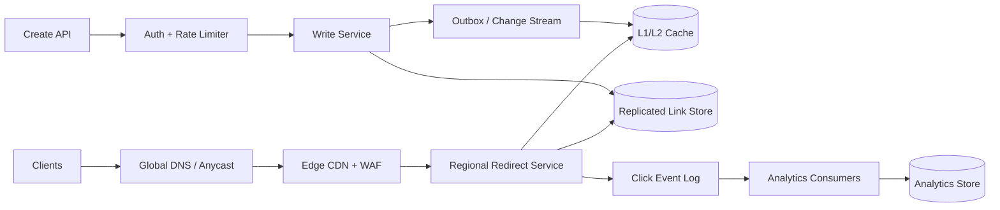

## 1. Problem

We need a service that turns a long destination into a stable short URL. A client may request an automatically generated key or a custom alias. A redirect can be permanent (`301`) or temporary (`302`). The owner can disable a link, set an expiry time, and inspect click analytics.

The hard part is not generating a short string. It is keeping the redirect path fast and available while preserving the meaning of a published alias. Redirects are latency-sensitive; analytics is useful but can be asynchronous. Clients can also retry after a timeout, so link creation needs idempotency.

The requirements and traffic figures in this article are planning inputs, not measurements from a named production system. The design uses the following labels:

- **[SOURCE FACT]**: a requirement or input supplied for this exercise.
- **[ASSUMPTION]**: an explicit sizing or example assumption.
- **[ANALYSIS]**: a consequence of those inputs.
- **[PROPOSED DESIGN]**: one implementation that satisfies the requirements.

### [SOURCE FACT] Requirements

- A published alias must not silently point to a different destination later. An expired alias is therefore not reused.
- Redirect traffic is the critical path. Analytics must not be required to complete a redirect.
- Users are global, and clients may retry after a timeout.
- The read path should remain useful during a write-region or analytics outage.

### [ASSUMPTION] Service targets

- Redirect p99 is below 50 ms at the service edge, excluding the user's network and the destination fetch.
- Redirect serving has a 99.99% monthly availability target. Creation and analytics may have separate SLOs.
- Generated keys are collision-free, and custom-alias ownership is linearizable (concurrent writes have one authoritative order).
- Committed mappings are not lost. Analytics may be delayed, but a single click must not be silently counted twice in reports.

## 2. Scale Estimation

These are **[ASSUMPTION] planning figures**, not claims about an existing product.

- Assume 100 million daily active redirecting clients. At 10 redirects per client per day, that is `100M x 10 = 1B redirects/day`.
- The average rate is `1B / 86,400 = 11,574 requests/s`.
- Assume a 10x peak from daily traffic and campaigns. The resulting peak is `115,740 requests/s`; provision for 150,000 requests/s to leave headroom.
- With a 100:1 redirect-to-create ratio, creation is `10M/day`, or 116 writes/s on average and about 1,160 writes/s at peak.
- Assume a mapping row averages 600 bytes including indexes and replication metadata. Seven years of non-expiring links require `10M x 365 x 7 x 600 = 15.33 TB` before replicas and compaction. Three copies require about 46 TB.
- Assume a redirect response is 1 KB including headers. Peak egress is `150,000 x 1 KB x 8 = 1.2 Gb/s`, before additional capacity for TLS and cache misses.
- Assume one 200-byte click event per redirect. Raw event ingress is `1B x 200 = 200 GB/day`, or about 73 TB/year before log replication and warehouse storage.
- Apply a 1.2 cumulative planning factor for link growth. Seven-year retained mappings become approximately `10M x 1.2 x 365 x 7 = 30.66B` rows, or 18.4 TB of primary row bytes at the same 600-byte estimate.
- A 99.99% monthly SLO allows about 4.32 minutes of unavailability in a 30-day month.

**[ANALYSIS]** The write workload is modest compared with the redirect workload. A database sized only for creates is not enough: the read fleet, edge cache, and cross-region replication must handle the redirect volume. Cache can reduce store reads, but it cannot be the only copy of a committed mapping.

## 3. API Design

The following is a **[PROPOSED DESIGN]**. The JSON bodies are illustrative examples.

### Create a link

`POST /v1/links`

```json
{
  "destination": "https://example.com/articles/very-long-path",
  "alias": "launch-2026",
  "status_code": 302,
  "expires_at": "2027-01-01T00:00:00Z"
}
```

`alias` is optional. The authenticated owner comes from the access token, never from the request body. The client supplies an `Idempotency-Key`. The service stores a request fingerprint and the resulting response for 24 hours. A retry with the same key and a different request fingerprint is rejected rather than treated as a new operation.

```json
{
  "id": "01K2...",
  "alias": "launch-2026",
  "short_url": "https://s.example/launch-2026",
  "status_code": 302,
  "expires_at": "2027-01-01T00:00:00Z"
}
```

Return `201` for a new link, `200` for an idempotent replay, `409` for an occupied custom alias, `422` for an invalid destination or TTL, and `429` for an owner or IP rate limit. A custom alias is never reassigned, including after expiry.

### Redirect

`GET /{alias}` returns `301` for a permanent mapping or `302` for a temporary mapping, with a `Location` header. Unknown, expired, disabled, and malformed aliases return `404`. The response does not reveal whether a deleted alias once existed. The edge may cache a negative response briefly, subject to a short negative TTL.

The lookup order is edge cache, regional L1/L2 cache, and then the replicated link store. A cache hit can serve a redirect during a store outage if the cached entry is still valid for the policy in force. The service must never invent a destination or extend an expired mapping merely because the store is unavailable.

### Analytics

`GET /v1/links/{id}/analytics?from=...&to=...&bucket=hour` returns aggregated counts and a freshness timestamp. It is eventually consistent.

`POST /v1/links/{id}/disable` is authenticated and idempotent. Disabling is a strongly ordered state transition: once the write is acknowledged, later reads must not serve the link as active. Cache invalidation is part of that write path; a bounded stale-cache policy must not violate the chosen disable semantics.

## 4. Data Model

The source of truth is a sharded, strongly consistent key-value or SQL-compatible store. The SQL below is a logical model: the physical implementation can use distributed SQL or a key-value store with equivalent conditional writes.

```sql
CREATE TABLE links (
  link_id       UUID PRIMARY KEY,
  alias         VARCHAR(32) NOT NULL UNIQUE,
  owner_id      BIGINT NOT NULL,
  destination   TEXT NOT NULL,
  redirect_code SMALLINT NOT NULL CHECK (redirect_code IN (301, 302)),
  state         VARCHAR(12) NOT NULL CHECK (state IN ('active', 'disabled', 'expired')),
  created_at    TIMESTAMP NOT NULL,
  expires_at    TIMESTAMP NULL,
  version       BIGINT NOT NULL,
  shard_key     BIGINT NOT NULL
);

CREATE INDEX links_owner_created ON links (owner_id, created_at DESC);
CREATE INDEX links_expiry ON links (expires_at) WHERE state = 'active';

CREATE TABLE idempotency_records (
  owner_id        BIGINT NOT NULL,
  idempotency_key VARCHAR(128) NOT NULL,
  request_hash    CHAR(64) NOT NULL,
  response_json   JSON NOT NULL,
  created_at      TIMESTAMP NOT NULL,
  PRIMARY KEY (owner_id, idempotency_key)
);
```

The unique constraint on `alias` is the authoritative collision check. The create transaction must insert the mapping and any idempotency record atomically, or use an equivalent compare-and-set operation. `(owner_id, created_at)` supports the owner's list view without scanning aliases.

The partial expiry index feeds a sweeper. Expiry is also checked synchronously on reads, so a delayed sweeper does not make an expired link valid. The sweeper can mark rows as expired and invalidate related cache entries. `shard_key` is a stable hash of the alias rather than a sequential ID; this distributes writes and avoids a monotonically increasing write partition. Popular aliases still need cache protection because hashing does not remove a single-key hotspot.

Analytics is stored separately:

```sql
CREATE TABLE click_hourly (
  link_id      UUID NOT NULL,
  hour         TIMESTAMP NOT NULL,
  country      CHAR(2) NOT NULL,
  device_class VARCHAR(16) NOT NULL,
  clicks       BIGINT NOT NULL,
  PRIMARY KEY (link_id, hour, country, device_class)
);
```

The event stream, not the redirect database, is the input to this aggregate. The aggregate key makes link/time queries efficient. Retention and rollups keep analytics storage bounded.

## 5. High-Level Architecture



**[ANALYSIS]** Anycast or global DNS sends a client to a nearby edge. The edge terminates TLS, applies WAF and rate-limit policy, and serves safe cached redirects. A regional redirect service handles cache misses and reads the replicated store. It emits a click event without waiting for analytics consumers.

**[PROPOSED DESIGN]** Writes go through an authenticated write service. For a custom alias, the service performs a conditional insert on the authoritative store. A generated key follows the same uniqueness check; random generation is not itself a proof of uniqueness. The outbox or change stream publishes mapping changes for cache population and invalidation. The redirect service consumes those changes or fetches on demand.

## 6. Redirect Path and Cache Rules

The redirect path should do only the work needed to select a destination:

1. Validate the alias format at the edge and reject malformed input.
2. Check the edge and regional caches.
3. On a miss, read the mapping by alias from the replicated store.
4. Check state and `expires_at` against a trusted current time.
5. Return the configured status and `Location` header.
6. Publish a click event asynchronously.

Permanent and temporary redirects need different cache policies. A permanent mapping can have a long positive TTL only if disable and correction semantics accept that delay. A temporary mapping should have a shorter TTL. Disable and expiry events must invalidate positive cache entries; negative entries also need a short TTL so a newly created alias is not hidden for long.

The service should use request coalescing for a cold popular key, so concurrent misses do not all query the store. It should also enforce connection-pool limits and timeouts. If the store times out, return a cached valid mapping where policy permits; otherwise return an error, not a guessed redirect. Circuit breakers and backpressure protect the store from a cache-miss storm.

## 7. Writes, Replication, and Failure Handling

Custom-alias ownership requires a single authoritative conditional write. Cross-region replicas can serve reads after the mapping is durably replicated according to the chosen consistency contract. If a write region is unavailable, the service may reject creation or route it to another authority; it must not accept two owners for the same alias.

The redirect read path can use replicas, but the replica must satisfy the freshness required by the redirect contract. A newly created link may briefly return `404` in a region if asynchronous replication is allowed; if that is unacceptable, route the first reads through the write authority or wait for the required replication acknowledgement. This is a design choice, not a universal property of replicated stores.

For disable, the state transition is committed in the source of truth, then propagated through the change stream. The implementation must define whether acknowledgement waits for cache invalidation. If it does, the operation is slower but gives a clearer guarantee. If it does not, the contract needs a bounded stale-read window and the cache must enforce it.

The event log uses at-least-once delivery in this proposal. Consumers therefore deduplicate using an event ID or a deterministic key such as `(link_id, timestamp, request ID)` before updating aggregates. A consumer retry can then be safe without claiming that the transport itself is exactly once. Poison events go to a dead-letter path and are retried with an explicit policy.

## 8. Security and Abuse Controls

The service validates the destination scheme and applies an allow/deny policy for destinations. It should reject malformed URLs and define how redirects to private or local address ranges are handled to limit server-side request forgery risk in any component that fetches or previews destinations. The redirect service itself should not fetch the destination.

Authentication is required for creation, listing, analytics, and disable operations. Authorization checks the owner associated with the token. Rate limiting is applied per owner and, where appropriate, per IP or network identity. Custom aliases need normalization rules, reserved names, and a defined case-sensitivity policy; collision checks use the normalized value.

The edge and application logs should avoid storing sensitive query parameters by default. Analytics dimensions should be deliberately bounded so an attacker cannot create unbounded cardinality.

## 9. Operations and Trade-offs

Monitor redirect p50/p95/p99 latency, cache hit ratio, store read latency, timeout and error rates, stale-cache age, replication lag, event-log lag, consumer retry rate, and aggregate freshness. Alert separately for redirect SLO impact and analytics delay; an analytics backlog should not page the redirect team at the same threshold as a redirect outage.

Backups and restore drills protect committed mappings. Retention jobs remove or archive analytics data according to policy. Mapping deletion, if supported, needs an explicit tombstone or permanent reservation so an old URL cannot later acquire a different meaning.

The main trade-off is consistency versus availability during failures. Serving a cached mapping can preserve redirect availability, but only while the entry is known to be valid under the expiry and disable policy. Serving stale data after a confirmed disable may be unacceptable. Conversely, requiring a fresh authoritative read on every request protects consistency but raises latency and makes store outages visible to users. The correct boundary belongs in the API contract, not in an accidental cache behavior.

## 10. Summary

The design keeps the redirect path small: edge cache, regional cache, authoritative lookup on miss, and an asynchronous click event. Strong conditional writes protect alias ownership and idempotent creation. Replication and cache invalidation make reads resilient without treating the cache as the source of truth. Analytics consumes a durable event stream and deduplicates at the consumer.

The scale figures above are explicit planning assumptions. Before implementation, replace them with measured traffic distributions, destination and alias policies, regional failure requirements, cache-staleness guarantees, and a tested recovery plan.
