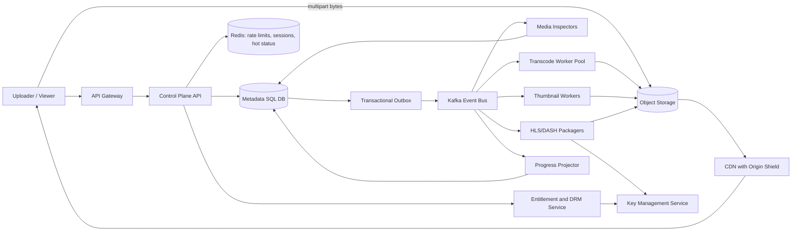

## 1. Problem

We are building a multi-tenant video platform for creators, education providers, and internal media teams. A user uploads a source video, watches processing progress, receives thumbnails, and publishes the result. Viewers stream published assets on phones, browsers, and connected TVs.

Functional requirements:

- Resumable upload of video and optional captions.
- Transcode into an adaptive-bitrate (ABR) ladder: 240p, 360p, 480p, 720p, 1080p, and 4K when the source supports it.
- Generate a poster and a contact sheet of thumbnails.
- Package HLS and DASH manifests and segments.
- Encrypt content with per-title keys and enforce entitlement through DRM/license services.
- Report durable processing progress and publish only a complete, validated asset.
- Support private, tenant-visible, and public playback.

Non-functional requirements:

- Process at least 25,000 source hours per hour during the normal peak window.
- Time to first playable frame under 8 seconds for a warm CDN path and under 30 seconds after a new upload is published.
- 99.95% monthly control-plane availability and 99.99% manifest/segment delivery availability.
- Preserve source and derived media durably, while bounding storage growth and egress cost.
- Scale workers horizontally, tolerate a worker, queue, database, cache, or region failure, and avoid duplicate billing or publication.

The key boundary is intentional: the API owns authorization, metadata, workflow state, and progress; object storage and the CDN carry the large immutable media objects. A request must not wait for transcoding.

## 2. Scale Estimation

The following is a capacity target, not a claim about an existing product. Each assumption is chosen to expose a design constraint.

| Quantity | Assumption and calculation | Result |
|---|---|---:|
| Daily active users | Given product target | 5,000,000 DAU |
| API requests | 5,000,000 users x 20 requests/day | 100,000,000 requests/day |
| Average API RPS | 100,000,000 / 86,400 | 1,157 RPS |
| Peak API RPS | 1,157 x 10 for launches and evening viewing | 11,570 RPS |
| Uploads | 300,000/day x 20 minutes average | 100,000 source hours/day |
| Processing peak | 25,000 source hours/hour | 25,000 source hours/hour |
| Source storage/day | 300,000 x 1.5 GB average source | 450 TB/day |
| Derived storage/day | 450 TB x 0.9 (ladder plus manifests and thumbnails) | 405 TB/day |
| Storage retained | (450 + 405) TB x 30 days hot retention | 25.65 PB hot |
| Viewer egress | 5,000,000 x 2 hours/day x 1.5 Mbps average | 6.75 PB/day |
| Read:write ratio | 100,000,000 API requests versus 300,000 upload sessions | about 333:1 |

The 1.5 GB source is plausible for a 20-minute mixed-quality upload: roughly 10 Mbps including container overhead. The 1.5 Mbps viewing rate is a population average across mobile and broadband, not the top rung of the ladder. Egress is deliberately much larger than ingest, so CDN cache hit ratio and origin shielding dominate cost.

At 25,000 source hours/hour, a 20-minute source creates 75,000 jobs/hour. If one normalized transcode job consumes 12 worker-minutes (parallel renditions are grouped into a job), steady compute is 15,000 worker-hours/hour, or 15,000 concurrent worker equivalents. A 30% headroom target makes the fleet 19,500 equivalents. This is capacity planning input; the benchmark must measure codec, resolution, and hardware mix.

A 450 TB/day source ingest rate means 13.5 PB/month before replication. With three-way object durability handled by the storage service, the application should budget logical bytes separately from physical copies. Hot retention is 25.65 PB; after 30 days, move originals and rarely watched derivatives to cheaper storage, subject to legal hold and tenant policy.

Availability targets imply a monthly error budget of about 21.9 minutes for the 99.95% control plane and 4.4 minutes for 99.99% playback delivery. A single-region synchronous design cannot credibly meet the latter during a regional outage; media is replicated cross-region and the CDN has origins in at least two regions.

## 3. API Design

The API uses short-lived bearer tokens, tenant authorization, and an idempotency key on every mutating endpoint. Upload bytes go directly to object storage through a multipart session; application servers never proxy them.

### Create an upload

`POST /v1/uploads`

Request:

```json
{
  "filename": "lecture-01.mov",
  "size_bytes": 2147483648,
  "content_sha256": "optional-full-file-hash",
  "visibility": "private"
}
```

Response `201`:

```json
{
  "upload_id": "upl_01J...",
  "asset_id": "ast_01J...",
  "part_size_bytes": 67108864,
  "parts": [{"part_number": 1, "url": "https://object.example/..."}],
  "expires_at": "2026-08-15T04:00:00Z"
}
```

The client sends `Idempotency-Key: <tenant-id>/<client-upload-id>`. Repeating the request returns the original IDs and does not create another asset. Per-part checksum validation and a final compose operation protect against incomplete or reordered uploads.

### Complete an upload

`POST /v1/uploads/{upload_id}/complete`

Request:

```json
{"parts":[{"part_number":1,"etag":"..."},{"part_number":2,"etag":"..."}]}
```

Response `202`:

```json
{"upload_id":"upl_01J...","asset_id":"ast_01J...","state":"INSPECTING"}
```

The endpoint verifies the object manifest, writes an outbox event in the same transaction as state `UPLOADED`, and returns `202`. A lost response is safe: the idempotency record and state can be read again.

### Read status

`GET /v1/assets/{asset_id}` returns state, percentage, completed renditions, errors, and a version. Clients poll with `If-None-Match` every 2 seconds while active, then back off. The API never reports `PUBLISHED` until manifest validation, encryption, and authorization metadata are complete.

### Publish and playback

`POST /v1/assets/{asset_id}/publish` changes a validated asset to `PUBLISHED` after an entitlement check. `GET /v1/assets/{asset_id}/playback` returns a short-lived signed manifest URL and DRM license configuration; it does not return media bytes. The playback token contains tenant, asset, expiry, and policy claims. License requests are authenticated separately and are rate limited by viewer and device.

### Operational contracts

Mutations return a stable `request_id`. `409` means a legal state transition is impossible; `429` includes `Retry-After`; `503` is retryable. Clients retry only idempotent operations with exponential backoff and jitter. Upload URLs are scoped to one object prefix, part, checksum, and expiry.

## 4. Data Model

The source of truth is PostgreSQL-compatible SQL. Media bytes live in object storage, keyed by immutable asset and rendition IDs.

```sql
CREATE TABLE assets (
  tenant_id       BIGINT NOT NULL,
  asset_id        UUID NOT NULL,
  source_object   TEXT NOT NULL,
  state           TEXT NOT NULL CHECK (state IN ('UPLOADING','INSPECTING','PROCESSING','READY','PUBLISHED','FAILED')),
  visibility      TEXT NOT NULL,
  source_sha256   BYTEA,
  version         BIGINT NOT NULL DEFAULT 0,
  created_at      TIMESTAMPTZ NOT NULL,
  updated_at      TIMESTAMPTZ NOT NULL,
  PRIMARY KEY (tenant_id, asset_id),
  UNIQUE (tenant_id, source_sha256)
);

CREATE TABLE renditions (
  tenant_id       BIGINT NOT NULL,
  asset_id        UUID NOT NULL,
  rendition_id    SMALLINT NOT NULL,
  codec           TEXT NOT NULL,
  width           INT NOT NULL,
  height          INT NOT NULL,
  bitrate_kbps    INT NOT NULL,
  state           TEXT NOT NULL,
  object_prefix   TEXT,
  checksum        BYTEA,
  PRIMARY KEY (tenant_id, asset_id, rendition_id),
  FOREIGN KEY (tenant_id, asset_id) REFERENCES assets(tenant_id, asset_id)
);

CREATE TABLE workflow_tasks (
  task_id         UUID PRIMARY KEY,
  tenant_id       BIGINT NOT NULL,
  asset_id        UUID NOT NULL,
  task_type       TEXT NOT NULL,
  attempt         INT NOT NULL DEFAULT 0,
  state           TEXT NOT NULL,
  lease_until     TIMESTAMPTZ,
  idempotency_key TEXT NOT NULL UNIQUE,
  updated_at      TIMESTAMPTZ NOT NULL
);

CREATE INDEX tasks_ready_idx ON workflow_tasks (state, lease_until, updated_at);
CREATE INDEX assets_tenant_updated_idx ON assets (tenant_id, updated_at DESC);
```

`(tenant_id, asset_id)` is the shard key because authorization and almost every asset query are tenant-scoped; it keeps a tenant's metadata locality while allowing large tenants to be split by a hashed asset suffix later. The source hash uniqueness prevents accidental duplicate uploads within a tenant, but deduplication is not global because cross-tenant data sharing can be a security leak.

The task index supports leasing ready work without scanning all tasks. The tenant/time index supports the asset list endpoint and avoids sorting a whole tenant. At larger scale, workflow tasks are partitioned by hash of `asset_id`, with a separate state index per partition; state alone is not a partition key because `PROCESSING` would become hot.

Progress is an append-or-upsert projection, not a transactionally exact counter. The durable task row is authoritative; progress events may be compacted by `(asset_id, rendition_id)` and expire after 90 days. Outbox rows contain event ID, aggregate ID, type, payload, and publish status, with a unique `(aggregate_id, version, type)` constraint.

## 5. High-Level Architecture



The gateway terminates TLS, authenticates tokens, applies tenant quotas, and provides load shedding. The control plane owns small, transactional metadata and never streams a source file.

Object storage provides immutable source, segment, manifest, and thumbnail objects with lifecycle policies. A CDN caches immutable segments for a long TTL and uses signed URLs for access; origin shielding prevents every edge miss from reaching storage.

The SQL database provides state transitions, tenant policy, and task leases. The outbox closes the dual-write gap between a committed state change and an event. Kafka is used for replayable, high-volume workflow events and progress fan-out; worker pools consume distinct topics by workload class.

Inspectors reject malformed media before expensive encoding. Transcoders produce temporary rendition output, packagers validate duration and keyframes, and only then does the control plane expose playback. KMS/DRM keeps content keys out of application logs and database rows. The progress projector makes frequent updates cheap without making every frame a database transaction.

## 6. Deep Dive

### Workflow, idempotency, and ordering

Completion creates an `INSPECT` task. Inspection emits a normalized media profile, from which the planner creates rendition, thumbnail, and packaging tasks. A task has a lease, attempt number, and deterministic output prefix. A worker may crash after writing output but before acknowledging Kafka; the next attempt checks output checksums and adopts valid objects rather than charging twice.

Ordering is required per asset, not globally. Kafka keys events by `asset_id`, preserving inspection-before-planning order for one asset while distributing assets across partitions. A versioned state transition (`WHERE version = ?`) rejects stale workers. Publication is a compare-and-set from `READY` to `PUBLISHED`; a distributed lock is not the primary correctness mechanism. A short lease can reduce duplicate expensive work, but the database transition and deterministic outputs provide the real fence.

### Queues, backpressure, and retries

Separate topics exist for inspection, CPU transcode, GPU transcode, thumbnails, packaging, and progress. This prevents a flood of 4K jobs from starving small thumbnails. The scheduler assigns a weighted tenant quota and admits work only when worker utilization and temporary storage remain below limits.

Consumers pause or reduce fetch when their output queue, encoder slots, or object-storage error rate crosses a threshold. Queue depth is bounded by admission control; when full, the API accepts metadata but reports an upload processing delay rather than pretending the job is healthy. Retries use exponential backoff with jitter and a maximum attempt count. Deterministic media errors go directly to a DLQ with the source probe and reason; transient storage or network errors retry. DLQ replay requires an operator-approved filter.

### Scaling and storage

API instances are stateless and autoscale on request rate, p95 latency, and CPU, with a separate pool for playback-token issuance. Connection pools are bounded: a pool of 40 per instance across 100 API instances would be 4,000 database connections, so a proxy and a database-wide cap are required. Read replicas serve asset lists and progress reads, but publish and lease decisions use the writer.

The CDN is the primary bandwidth scaler. Segment names include a content version, allowing long caching without invalidation races. Manifests are short-lived at the edge because entitlement and publish state change; an origin shield absorbs refreshes. Redis is a cache and rate-limit store, never the only copy of state. Cache failures degrade to the database behind per-key request coalescing and a circuit breaker.

Large tenants can create hot metadata shards or hot playback keys. Hash-shard by asset ID within a tenant, add a tenant quota, and avoid a single global counter. For playback, signed URLs are independently cacheable by asset/version while authorization is checked at token issuance. Object prefixes include a hash fan-out to avoid storage-listing hotspots.

### Security and disaster recovery

Upload URLs are least-privilege and expire. Malware scanning and container parsing run in a sandbox with CPU, memory, and decompression limits. Workers use workload identities and cannot read unrelated tenant prefixes. Encryption at rest uses a key hierarchy; DRM packaging uses a per-title content key wrapped by KMS. Audit events record publish, policy, license, and administrative changes without logging tokens.

Metadata is synchronously replicated within a region and continuously backed up to a second region. Object versions and derived outputs replicate asynchronously; the CDN has both origins. Recovery prioritizes control-plane metadata, then manifests and popular renditions, then cold originals. The documented RPO is 15 minutes for metadata projections and RTO is 60 minutes for a regional control-plane failover; playback of already replicated assets should continue during that failover.

Rate limits apply by tenant, user, IP, upload bytes, license requests, and task admission. Load balancing is least-loaded for APIs and capability-aware for workers; a GPU worker must not receive a CPU-only codec job. Circuit breakers stop repeated calls to a failing KMS, database replica, or object endpoint.

## 7. Consistency Model

Strong consistency is used for asset ownership, visibility, idempotency keys, task leases, versioned state transitions, and publication. A caller must not see `PUBLISHED` before all required renditions and DRM metadata exist. The writer database and a transaction containing the outbox event are the authority.

Eventual consistency is acceptable for progress percentages, search/list replicas, CDN manifests, analytics, and cross-region media replication. Progress can move backward when a late task reports a lower stage; the projector uses stage ordering and event version to prevent regressions. Read replicas may lag; after a mutation, the response includes the authoritative version and clients can request `?min_version=` or be routed to the writer for read-after-write behavior.

If a completion request commits but its response is lost, the client retries the same idempotency key. The server returns the stored response or current state. If the worker receives an event twice, the unique task key and output checksum make the operation safe. If an outbox publisher crashes after publishing but before marking sent, the event is delivered again; consumers must be idempotent. Exactly-once end-to-end is not assumed.

## 8. Failure Scenarios

| Failure | Impact | Detection | Recovery |
|---|---|---|---|
| SQL writer unavailable | New uploads, leases, and publication stop; CDN playback of existing assets continues | Writer errors, connection-pool wait, transaction latency, failed health probes | Retry boundedly, fail over to the regional standby, fence the old writer, replay outbox; return `503` for mutations |
| Kafka consumer stuck on a poison message | One asset partition stops making progress and lag grows | Consumer lag by partition, unchanged offset, no task completions | Pause partition, move the identified message to DLQ after capture, restart consumer, replay after fix |
| Redis cluster failure | Higher database load and less effective rate limiting; correctness remains | Cache error ratio, DB QPS, latency, circuit-breaker openings | Serve bounded stale status, coalesce misses, enforce emergency gateway limits, restore Redis |
| Primary region failure | Control plane may be unavailable; some new uploads pause; replicated playback can continue | Regional synthetic checks, CDN origin errors, DNS/health failover | Promote secondary metadata writer, switch origins and API routing, reconcile outbox and uploads after recovery |
| Object storage throttling | Transcodes fail or retry; manifests may be delayed | Put/GET latency, 429/5xx rate, worker retry count, temporary disk usage | Reduce admission, exponential backoff, use alternate prefix/region where safe, replay tasks |
| GPU worker fleet exhaustion | 4K/HEVC queue grows while lower rungs may remain healthy | GPU utilization, queue age by codec, scheduler rejection | Route supported jobs to CPU pool with cost guardrails, add capacity, communicate delayed high-rung availability |
| DRM/KMS outage | New packaging or license requests fail; already cached encrypted segments may not start new sessions | License p95/error rate, KMS throttles, synthetic playback by DRM | Circuit break, use approved regional KMS endpoint, do not expose keys, retry licenses with bounded backoff |

## 9. Observability

Every request, Kafka event, task, and storage operation carries a `trace_id`; the client-visible `request_id` is logged with tenant and asset IDs but never with bearer tokens. Logs are structured and sampled by outcome. Traces connect upload completion to inspection, each rendition, packaging, publication, and the first manifest request.

Core SLIs/SLOs:

- Control-plane availability: successful authenticated requests / total, SLO 99.95%.
- Playback availability: successful manifest and segment requests, SLO 99.99%.
- Time to first playable frame: p50/p95 from publish to first decoded frame, targets under 8/30 seconds by path.
- Processing throughput: source hours completed per hour, and p95 upload-to-ready duration.
- Error rate by endpoint, codec, tenant, region, and status class.

Alerts must point to a likely action. Queue age and consumer lag indicate stuck workers or insufficient capacity; queue depth without age can hide a fast drain. Encoder CPU/GPU saturation and temporary-disk fullness indicate worker limits. Database commit latency, replica lag, lock waits, and connection-pool utilization identify SQL pressure. CDN hit ratio and origin egress identify cache regressions. KMS/license errors identify entitlement outages. Upload checksum failures identify client or storage-path corruption. A synthetic upload and playback runs continuously in each region.

## 10. Capacity Planning

At the 11,570 peak API RPS, target 200 RPS per API instance at 60% CPU. `11,570 / (200 x 0.6) = 96.4`, so deploy 100 instances plus 30% burst headroom: 130 instances. Playback-token issuance is isolated and sized for its own p95 because it should not compete with upload control calls.

For 25,000 source hours/hour and 12 worker-minutes per source hour-equivalent job, the fleet needs 15,000 worker equivalents; with 30% headroom, 19,500. In practice, split this by measured codec mix: for example, 70% CPU-equivalent and 30% GPU-equivalent, then validate that mix against benchmarked per-rendition minutes rather than treating “worker” as a uniform machine.

Assume 30% CDN cache hit ratio initially. Origin egress is `6.75 PB/day x 0.70 = 4.725 PB/day`; improving hit ratio to 85% reduces it to 1.0125 PB/day, a larger saving than optimizing API RPS. The cache needs enough hot segments for the working set, not all 25.65 PB. If the top 10% of assets produce 60% of traffic and 7 days of their segments average 2.5 PB, provision at least 3 PB effective cache plus eviction headroom.

Kafka receives about 75,000 workflow events/hour plus progress events. At 10 events per source asset and 300,000 uploads/day, workflow volume is 3,000,000/day, or 35 events/second average and 350 peak. Progress can be 20 events per rendition, so compacted progress topics may reach 100 million records/day. Use 96 partitions for workflow topics and 192 for progress topics, starting with 3 consumers per partition maximum and scaling by lag; the partition count is chosen for future parallelism, not current throughput.

The SQL writer is sized for roughly 12,000 peak API transactions/second only after caching and read replicas remove list/status reads. Start with 8 read replicas, a 2,000-connection proxy limit, and 100 API instances x 20 pooled connections = 2,000 maximum, leaving reserved capacity for workers and operators. Measure transaction mix before increasing the writer. Daily logical media growth is 855 TB, so 30-day hot storage is 25.65 PB; lifecycle policies must start before the first 30-day cohort arrives.

## 11. Bottlenecks and Evolution

The first bottleneck is usually origin egress and encoding compute, not the API. At 10x, the design adds regional worker pools, more CDN shield capacity, codec-aware scheduling, and database partitioning by hashed asset ID. Progress events are compacted and sampled so status freshness does not consume the same capacity as media processing.

At 100x, a single metadata writer and one Kafka cluster become organizational and failure-domain bottlenecks. Move toward tenant-cell architecture: each cell owns a bounded metadata database, event bus, worker pools, and object namespace; a global directory maps tenant to cell. Keep playback objects globally addressable through CDN, but make control-plane failover cell-scoped. Use a global catalog only for routing, not per-frame or per-task writes.

The redesign order is: improve CDN shielding and cacheability, isolate codec compute, partition task/event streams, then split metadata into cells. A multi-region active-active SQL system is not the first answer because publication and entitlement correctness are harder than adding a second active-passive writer. The target architecture is active-active media delivery with cell-local, strongly consistent control planes and asynchronous cross-region replication.

## 12. Trade-offs

| Decision | Option A | Option B | Decision | Why |
|---|---|---|---|---|
| Metadata store | SQL | NoSQL | SQL | State transitions, uniqueness, leases, and tenant transactions need constraints; media bytes do not belong here |
| Workflow bus | Kafka | RabbitMQ | Kafka | Replay, partition ordering, and high-volume progress fan-out outweigh simpler per-message routing |
| Hot cache | Redis | Database cache | Redis | Bounded latency and distributed rate limits; DB remains the source of truth |
| Processing | Synchronous API | Asynchronous jobs | Async | Transcoding is long-running, bursty, retryable, and must not hold HTTP connections |
| Regions | Active-active control plane | Active-passive control plane | Active-passive initially | Fewer conflict modes for publication; media/CDN remains active-active |
| Sharding | Range by time | Hash by asset | Hash | Even load for processing and status access; time ranges create hot newest partitions |
| Progress | Polling | Push/WebSocket | Polling first | Works through proxies and reconnects; add push when freshness justifies connection cost |
| Service calls | REST | gRPC | REST externally, gRPC internally | REST is debuggable and compatible for clients; gRPC helps typed, high-volume internal calls |

## 13. Production Checklist

- [ ] Upload URLs enforce tenant, object, part, checksum, and expiry boundaries.
- [ ] Every mutation has an idempotency key and a replay-safe response.
- [ ] State transitions are versioned and publication is gated on validated outputs.
- [ ] Outbox, Kafka retries, consumer idempotency, and DLQ replay are tested.
- [ ] Queue age, lag, storage throttling, and worker saturation have alerts and runbooks.
- [ ] SQL backups, restore drills, replica promotion, and old-writer fencing are verified.
- [ ] CDN signed URLs, origin shielding, cache headers, and cross-region origins are tested.
- [ ] DRM keys never enter logs, client responses, or ordinary database rows.
- [ ] Rate limits cover API, bytes, licenses, tenants, and task admission.
- [ ] Synthetic upload-to-playback checks run in every serving region.
- [ ] Capacity tests cover codec mix, hot tenants, 4K bursts, and cache-miss storms.
- [ ] RPO/RTO, legal retention, deletion propagation, and tenant isolation are documented.

## 14. Engineering References

1. **Company:** Google SRE  
   **Article title:** *The Site Reliability Engineering Book: Table of Contents*  
   **URL:** https://sre.google/sre-book/table-of-contents/  
   **Key engineering lesson:** Reliability is an explicit service objective with measurable indicators and an error budget, not an informal promise.  
   **How it influenced this design:** It drove separate control-plane and playback SLOs, error-budget language, bounded retries, and operational runbooks.

2. **Company:** Netflix Tech Blog  
   **Article title:** *Netflix Tech Blog*  
   **URL:** https://netflixtechblog.com/  
   **Key engineering lesson:** Large-scale media systems isolate failure domains, automate resilience, and validate behavior under production-like failure.  
   **How it influenced this design:** It informed cell-like worker isolation, multi-origin delivery, synthetic playback, and deliberate failure testing without attributing an invented implementation to Netflix.

3. **Company:** Cloudflare  
   **Article title:** *Cloudflare Blog*  
   **URL:** https://blog.cloudflare.com/  
   **Key engineering lesson:** Edge caching, origin shielding, and careful cache semantics can move the dominant cost and latency away from application origins.  
   **How it influenced this design:** It shaped immutable segment URLs, short-lived manifests, origin shielding, and cache-hit-ratio capacity math.

4. **Company:** AWS Architecture Blog  
   **Article title:** *AWS Architecture Blog*  
   **URL:** https://aws.amazon.com/blogs/architecture/  
   **Key engineering lesson:** Durable event-driven systems need explicit retry, idempotency, backpressure, and recovery boundaries.  
   **How it influenced this design:** It reinforced the transactional outbox, bounded queues, DLQs, lifecycle storage policies, and region recovery plan.
