## 1. Bài toán và phạm vi

[SOURCE FACT] Nguồn được cung cấp là [AWS Architecture Blog](https://aws.amazon.com/blogs/architecture/). Tài liệu đã xác minh được cung cấp cùng bài viết không mô tả một hệ thống production cụ thể, traffic, schema cơ sở dữ liệu hay chi tiết triển khai nào.

[ANALYSIS] Giới hạn này quyết định những gì có thể khẳng định. Một trang tập hợp bài viết về kiến trúc không phải bằng chứng cho topology nội bộ cụ thể của AWS. Câu hỏi kỹ thuật hữu ích là: làm thế nào áp dụng các chủ đề như well-architected design, triển khai multi-AZ, decoupling, queue và resilience vào một hệ thống chịu được partial failure mà không buộc caller đồng bộ chờ mọi downstream operation?

[PROPOSED DESIGN] Bài viết dùng một nền tảng xử lý đơn hàng làm bài toán thiết kế cụ thể. Client gửi order, nhận response sau khi request đã được ghi durable, rồi đọc tiến độ fulfillment sau đó. Nền tảng phải giữ được intent của order, tránh duplicate side effect khi retry, đưa worker chậm ra khỏi request path, và tiếp tục nhận việc khi một availability zone hoặc worker pool bị suy giảm.

Phần quan trọng nhất là xác định failure boundary và guarantee:

- Synchronous path xác thực và ghi durable order.
- Queue hấp thụ burst và tách admission khỏi processing.
- Worker thực hiện fulfillment idempotent và phát hành thay đổi trạng thái.
- Read path vẫn hoạt động khi async processing bị chậm.

## 2. Ranh giới nguồn và hệ thống đề xuất

[SOURCE FACT] Tài liệu đã xác minh được cung cấp cho bài viết không mô tả runtime system gốc nào. Nguồn duy nhất được xác minh là landing page của AWS Architecture Blog: https://aws.amazon.com/blogs/architecture/.

[ANALYSIS] Vì vậy, sẽ không có cơ sở nếu nói AWS đã dùng queue, database, retry policy hay sơ đồ multi-AZ cụ thể dựa trên nguồn này. Các mẫu bên dưới là phân tích kỹ thuật và proposed design, không phải bản tái dựng một triển khai production của AWS.

[PROPOSED DESIGN] Request service ghi order và outbox record trong cùng một database transaction. Outbox relay phát hành record vào durable queue. Fulfillment worker consume message, cập nhật order state và ghi nhận kết quả idempotency. Notification consumer riêng xử lý email hoặc webhook. Các consumer có thể được scale, pause hoặc repair độc lập.

Do đó, accepted order chỉ có nghĩa nền tảng đã ghi request một cách durable. Nó không có nghĩa mọi downstream action đã hoàn tất. Contract này ngăn notification provider chậm kéo dài request latency của khách hàng.

## 3. Kiến trúc

[ANALYSIS] Nguồn được cung cấp không nêu runtime component nào, nên không component nào trong sơ đồ được hiểu là claim về AWS.

[PROPOSED DESIGN] Topology dưới đây cố ý đánh dấu rõ các component được đề xuất:

```mermaid
flowchart LR
    SRC["AWS Architecture Blog\n[Source-backed context]"]
    C["Client"] --> G["API ingress\n[Proposed component]"]
    G --> R["Order API\n[Proposed component]"]
    R --> DB[("Orders + outbox\n[Proposed component]")]
    DB --> O["Outbox relay\n[Proposed component]"]
    O --> Q["Durable order queue\n[Proposed component]"]
    Q --> W["Fulfillment workers\n[Proposed component]"]
    W --> DB
    W --> E["External fulfillment\n[Proposed component]"]
    W --> NQ["Notification queue\n[Proposed component]"]
    NQ --> N["Notification workers\n[Proposed component]"]
    N --> P["Email/webhook provider\n[Proposed component]"]
    R --> READ["Order status read API\n[Proposed component]"]
    READ --> DB
    SRC -. "focus only; not an implementation claim" .- R
```



[ANALYSIS] Multi-AZ deployment là thuộc tính bố trí, tự nó không phải availability guarantee. Theo proposed deployment choice, stateless API và worker pool nên được đặt ở ít nhất hai availability zone. Database, queue và load-balancing layer cần có failure behavior được hiểu và kiểm thử. Redundancy giữa các zone không loại bỏ dependency failure, deployment lỗi, connection pool cạn hay poison message.

## 4. Request path và delivery guarantee

[ANALYSIS] Thiết kế tách các mối quan tâm chính: admission bảo vệ user-facing path; durability bảo vệ intent đã được chấp nhận; async processing cô lập downstream latency biến động; idempotency bảo vệ tính đúng đắn khi delivery bị retry.

[PROPOSED DESIGN] Order API nhận idempotency key do client cung cấp và scope theo customer. API validate request, kiểm tra key, rồi insert order và outbox event một cách atomic. Retry với cùng key và request hash sẽ trả về kết quả ban đầu. Dùng lại key với payload khác sẽ trả conflict.

[ANALYSIS] Outbox đóng dual-write gap. Không có outbox, API có thể commit order rồi lỗi trước khi publish queue message, hoặc publish message rồi lỗi trước khi commit order. Relay có thể publish event nhiều hơn một lần, nên không được giả định exactly-once delivery. Consumer phải idempotent.

[PROPOSED DESIGN] Dùng state transition có kiểm soát và đơn điệu:

`PENDING -> PROCESSING -> FULFILLED`

Đồng thời model rõ `FAILED_RETRYABLE` và `FAILED_FINAL`. Worker claim việc bằng lease, gọi external fulfillment system với idempotency token, rồi commit kết quả. Khi lease hết hạn, worker khác có thể retry message. External operation phải chịu được retry đó; local database lock không thể biến external side effect thành exactly-once.

## 5. Data model

[PROPOSED DESIGN] Relational model giúp order transition và outbox insert atomic. Unique constraint trên `(customer_id, idempotency_key)` thực thi request contract ở database boundary.

```sql
CREATE TABLE orders (
  order_id          UUID PRIMARY KEY,
  customer_id       UUID NOT NULL,
  idempotency_key   TEXT NOT NULL,
  request_hash      TEXT NOT NULL,
  status            TEXT NOT NULL,
  result_json       JSONB,
  created_at        TIMESTAMP NOT NULL,
  updated_at        TIMESTAMP NOT NULL,
  UNIQUE (customer_id, idempotency_key)
);

CREATE TABLE outbox (
  event_id          UUID PRIMARY KEY,
  aggregate_id      UUID NOT NULL,
  event_type        TEXT NOT NULL,
  payload_json      JSONB NOT NULL,
  published_at      TIMESTAMP
);
```

[ANALYSIS] Outbox relay nên claim các row chưa publish một cách an toàn, publish chúng, rồi đánh dấu published. Crash xảy ra giữa publish và update sẽ tạo duplicate, vì vậy queue consumer cần durable deduplication hoặc idempotency record. Giữ outbox row đến khi publication policy được đáp ứng cũng giúp recovery dễ chẩn đoán; retention policy là quyết định vận hành, không phải source fact.

## 6. Xử lý failure

[PROPOSED DESIGN] Đặt timeout cho database call và external call. Chỉ retry transient failure, dùng exponential backoff có giới hạn kèm jitter, và giới hạn số lần hoặc tổng thời gian retry. Retry không có timeout có thể giữ worker vô thời hạn; retry không giới hạn có thể làm dependency đang phục hồi quá tải.

[PROPOSED DESIGN] Dùng dead-letter queue cho message không thể xử lý sau retry policy đã cấu hình. Operator nên kiểm tra và replay an toàn sau khi sửa nguyên nhân. Poison message không được chặn các work không liên quan trong main queue.

[ANALYSIS] Backpressure (điều tiết áp lực ngược) là một phần của design, không phải việc bổ sung sau cùng. Queue depth và message age cho biết worker có theo kịp hay không. Hệ thống nên giới hạn in-flight work và bảo vệ database connection pool, thay vì tăng concurrency không có giới hạn.

[PROPOSED DESIGN] Circuit breaker (ngắt mạch) có thể dừng call đến external dependency đang lỗi trong một khoảng thời gian có kiểm soát. Tùy business contract, hệ thống có thể fail fast hoặc để work trong queue. Circuit breaker không thay thế timeout, bounded retry hay idempotency strategy.

## 7. Read path và vận hành

[PROPOSED DESIGN] Status API đọc durable order state và trả về progress tách khỏi fulfillment completion. API không nên gọi fulfillment provider hoặc notification provider synchronously. Nếu read traffic tăng độc lập, có thể thêm read projection, nhưng projection phải công bố freshness hoặc lag.

[ANALYSIS] Các signal hữu ích gồm request error rate và latency, queue depth và message age, worker failure và retry rate, database connection-pool exhaustion, outbox backlog và external-provider timeout. Những signal này mô tả failure boundary của design, không phải measurement từ AWS source.

[PROPOSED DESIGN] Hãy kiểm thử các failure mode mà topology tuyên bố xử lý được: dừng worker giữa lúc processing, restart relay sau khi publish, làm external provider phản hồi chậm, làm cạn connection pool và cô lập một availability zone. Xác minh retry không tạo duplicate order hoặc fulfillment, poison message được cô lập, và read path vẫn trả về durable state.

## 8. Tóm tắt cho phỏng vấn

[ANALYSIS] Cách giải thích design này tốt nhất không phải là liệt kê AWS service. Hãy trình bày guarantee và failure boundary:

- Transaction làm accepted order và outbox event durable cùng nhau.
- Relay và consumer giả định at-least-once delivery.
- Idempotency key bảo vệ request retry và external side effect.
- Queue tách admission latency khỏi fulfillment latency.
- Lease cho phép phục hồi khi worker lỗi; bounded retry giới hạn áp lực lên dependency.
- Multi-AZ placement giảm ảnh hưởng của zone failure nhưng không loại bỏ các failure mode khác.

[PROPOSED DESIGN] Chỉ chọn service cụ thể sau khi các contract này rõ ràng. Source hỗ trợ các chủ đề kiến trúc, còn order platform trong bài vẫn là proposed design.
