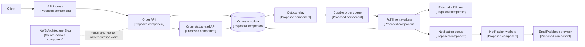

## 1. Original Engineering Problem

[SOURCE FACT] Nguồn được cung cấp là AWS Architecture Blog, một tuyển tập do AWS xuất bản tại [AWS Architecture Blog](https://aws.amazon.com/blogs/architecture/). Đoạn trích đã xác minh được cung cấp không mô tả một hệ thống sản xuất cụ thể, lưu lượng, lược đồ cơ sở dữ liệu hay cách triển khai nào.

[ANALYSIS] Giới hạn này rất quan trọng. Một trang tập hợp về kiến trúc không phải là bằng chứng cho một cấu trúc liên kết nội bộ cụ thể của AWS. Câu hỏi kỹ thuật có thể bảo vệ được là: làm thế nào chuyển trọng tâm về thiết kế well-architected, triển khai đa AZ, tách rời, hàng đợi và khả năng chống lỗi thành một hệ thống có thể chịu lỗi cục bộ mà không buộc người gọi đồng bộ phải chờ mọi thao tác phía sau?

[PROPOSED DESIGN] Ta sẽ thiết kế một nền tảng xử lý đơn hàng. Máy khách gửi đơn, nhận phản hồi chấp nhận đã được lưu bền vững, rồi theo dõi tiến độ hoàn tất sau đó. Nền tảng phải giữ được ý định của đơn, tránh tác dụng phụ trùng lặp khi retry, cô lập worker chậm khỏi đường dẫn request, và tiếp tục nhận việc khi một availability zone hoặc một nhóm worker bị suy giảm.

Vấn đề cốt lõi không phải là chọn một dịch vụ thời thượng. Đó là chọn ranh giới lỗi và làm rõ các bảo đảm:

- Đường dẫn đồng bộ xác thực và ghi bền vững một đơn hàng.
- Hàng đợi hấp thụ đột biến và tách việc tiếp nhận khỏi xử lý.
- Worker thực hiện fulfillment idempotent và phát hành thay đổi trạng thái.
- Đường đọc vẫn khả dụng khi xử lý bất đồng bộ bị chậm.

## 2. What the Original System Did

[SOURCE FACT] Tài liệu đã xác minh được cung cấp cho bài viết này không mô tả hệ thống runtime gốc nào. Nguồn duy nhất được xác minh là trang AWS Architecture Blog: https://aws.amazon.com/blogs/architecture/.

[ANALYSIS] Vì vậy, không có cách có trách nhiệm để viết rằng “AWS đã sử dụng” một hàng đợi, cơ sở dữ liệu, chính sách retry hay sơ đồ đa AZ cụ thể dựa trên nguồn này. Các mẫu trong bài nên được đọc là phân tích kỹ thuật về trọng tâm được yêu cầu, không phải bản tái dựng một triển khai sản xuất của AWS.

[PROPOSED DESIGN] Trong nền tảng đề xuất, dịch vụ request ghi đơn hàng và bản ghi outbox trong cùng một giao dịch cơ sở dữ liệu. Một relay phát hành bản ghi outbox vào hàng đợi bền vững. Fulfillment worker đọc message, cập nhật trạng thái đơn và ghi nhận kết quả idempotency. Một consumer thông báo riêng xử lý email hoặc webhook. Các consumer này có thể được scale, tạm dừng hoặc sửa chữa độc lập.

Lựa chọn này tạo ra một hợp đồng hữu ích: đơn được chấp nhận nghĩa là “nền tảng đã ghi bền vững request”, không phải “mọi hành động phía sau đã hoàn tất”. Phân biệt đó ngăn nhà cung cấp thông báo chậm kéo dài latency của request khách hàng.

## 3. Architecture Diagram

[ANALYSIS] Sơ đồ không có runtime component nào được nguồn hỗ trợ vì đoạn trích được cung cấp không nêu component nào. Bối cảnh nguồn được hiển thị riêng để cấu trúc đề xuất không bị nhầm là hệ thống do AWS mô tả.

[PROPOSED DESIGN] Tất cả runtime node bên dưới đều là component đề xuất. Nhãn cố ý phân biệt chúng với bối cảnh nguồn.



[ANALYSIS] Triển khai đa AZ là thuộc tính bố trí, không phải bảo đảm availability kỳ diệu. Mỗi API stateless và worker pool nên có instance ở ít nhất hai zone; cơ sở dữ liệu, hàng đợi và lớp cân bằng tải phải có hành vi khi lỗi mà ta hiểu và kiểm thử được. Dự phòng liên zone cũng không loại bỏ lỗi dependency, deployment hỏng, cạn connection pool hay poison message.

## 4. System Design Analysis

[ANALYSIS] Thiết kế tách bốn mối quan tâm. Admission bảo vệ đường dẫn hướng người dùng. Durability bảo vệ intent đã chấp nhận. Xử lý bất đồng bộ bảo vệ hệ thống trước latency biến động của downstream. Idempotency bảo vệ tính đúng đắn khi delivery bị retry.

[PROPOSED DESIGN] Order API dùng idempotency key do client cung cấp, giới hạn theo customer. Nó xác thực request, kiểm tra key, rồi insert order cùng outbox event một cách nguyên tử. Nếu cùng key được retry với cùng request hash, nó trả về kết quả ban đầu. Nếu key được dùng lại với payload khác, nó trả conflict.

[ANALYSIS] Outbox tránh khoảng trống dual-write. Không có nó, API có thể commit order rồi lỗi trước khi publish message, hoặc publish message rồi lỗi trước khi commit order. Relay có thể publish cùng event nhiều hơn một lần; do đó không nên giả định “exactly once”. Consumer phải idempotent.

[PROPOSED DESIGN] State transition là đơn điệu và có kiểm soát: `PENDING -> PROCESSING -> FULFILLED`, cùng các trạng thái rõ ràng `FAILED_RETRYABLE` và `FAILED_FINAL`. Worker claim việc bằng lease, thực hiện external call với idempotency token, rồi commit kết quả. Lease hết hạn cho phép worker khác retry.

## 5. Data Model

[PROPOSED DESIGN] Mô hình quan hệ giúp state transition của order và insert outbox có tính nguyên tử.

```sql
CREATE TABLE orders (
  order_id          UUID PRIMARY KEY,
  customer_id       UUID NOT NULL,
  request_key       VARCHAR(128) NOT NULL,
  request_hash      CHAR(64) NOT NULL,
  state             VARCHAR(32) NOT NULL,
  version           BIGINT NOT NULL DEFAULT 0,
  external_ref      VARCHAR(128),
  created_at        TIMESTAMP NOT NULL,
  updated_at        TIMESTAMP NOT NULL,
  UNIQUE (customer_id, request_key)
);

CREATE TABLE outbox_events (
  event_id          UUID PRIMARY KEY,
  aggregate_id      UUID NOT NULL,
  event_type        VARCHAR(64) NOT NULL,
  payload           JSON NOT NULL,
  published_at      TIMESTAMP,
  created_at        TIMESTAMP NOT NULL
);

CREATE TABLE idempotency_results (
  consumer_name     VARCHAR(64) NOT NULL,
  message_id        UUID NOT NULL,
  result_hash       CHAR(64) NOT NULL,
  completed_at      TIMESTAMP NOT NULL,
  PRIMARY KEY (consumer_name, message_id)
);
```

[ANALYSIS] `version` hỗ trợ optimistic concurrency, còn cặp customer/key duy nhất khiến retry API có thể quan sát được. Bảng idempotency ghi nhận công việc của consumer, nhưng không thể hoàn tác tác dụng phụ tại provider bên ngoài. Provider phải chấp nhận idempotency token, hoặc integration cần reconciliation và hành động bù trừ theo nghiệp vụ.

## 6. API Design

[PROPOSED DESIGN] Contract bên ngoài được cố ý giữ nhỏ:

```text
POST /v1/orders
Idempotency-Key: customer-opaque-key

201 Created
{
  "order_id": "uuid",
  "state": "PENDING",
  "status_url": "/v1/orders/uuid"
}

GET /v1/orders/{order_id}

200 OK
{
  "order_id": "uuid",
  "state": "FULFILLED",
  "updated_at": "2026-08-16T03:00:00Z"
}
```

[PROPOSED DESIGN] `202 Accepted` cũng hợp lệ nếu service cố ý tách admission bền vững khỏi việc tạo resource. Quy tắc quan trọng là phải ghi rõ response bảo đảm điều gì. `409 Conflict` biểu thị idempotency key được dùng lại với request khác. `429 Too Many Requests` truyền đạt áp lực admission, còn `503 Service Unavailable` phù hợp khi service không thể chấp nhận request mới một cách bền vững.

[ANALYSIS] Status endpoint tốt hơn việc buộc client poll queue hoặc phơi bày trạng thái worker nội bộ. Nó cũng cho phép đường đọc tiếp tục hoạt động khi có sự cố xử lý, tùy theo availability và hành vi consistency của cơ sở dữ liệu.

## 7. Scaling Strategy

[PROPOSED DESIGN] Scale API tier theo chiều ngang giữa các zone vì nó stateless. Giới hạn connection pool để database chậm không biến mọi API replica thành nguồn overload bổ sung. Scale worker theo queue depth và message age, không chỉ theo CPU: worker pool dùng ít CPU vẫn có thể không drain được công việc.

[ANALYSIS] Chỉ queue depth là chưa đủ. Backlog gồm message cũ khẩn cấp hơn cùng số lượng message mới. Tín hiệu hữu ích gồm tuổi message lâu nhất, processing latency, retry rate, database saturation và tỷ lệ lỗi provider bên ngoài. Autoscaling cần có trần và admission control; nếu không backlog có thể gây load storm do retry.

[PROPOSED DESIGN] Partition work theo stable key khi cần ordering theo customer hoặc order. Dùng dead-letter queue cho message vượt chính sách retry. Chỉ re-drive dead letter sau khi hiểu defect nền. Giữ payload nhỏ và lưu tài liệu immutable lớn riêng, được tham chiếu bằng identifier.

## 8. Failure Scenarios

[PROPOSED DESIGN] Nếu một availability zone lỗi, traffic được chuyển tới API replica và worker khỏe mạnh. Request đang chạy có thể lỗi và được retry bằng cùng idempotency key. Hệ thống phải chịu được delivery trùng lặp và không được coi timeout của client là bằng chứng order chưa được tạo.

[ANALYSIS] Nếu database chính không khả dụng, service nên fail closed với write thay vì acknowledge công việc mà nó không thể ghi bền vững. Đường status chỉ đọc có thể tiếp tục nếu các bảo đảm consistency và failover chấp nhận được. Bố trí đa AZ giảm dependency đơn zone nhưng tự nó không định nghĩa thời gian hay điểm khôi phục.

[PROPOSED DESIGN] Nếu worker crash sau external call nhưng trước khi commit kết quả, lease hết hạn và worker khác retry. External call dùng cùng deterministic idempotency token. Nếu provider không có tính năng đó, reconciliation đối chiếu trạng thái provider với order record trước khi gọi lại.

[PROPOSED DESIGN] Nếu poison message liên tục lỗi validation, retry có giới hạn sẽ chuyển nó vào dead-letter queue. Nếu provider ngoài chậm, circuit breaker và giới hạn concurrency ngăn worker pool dùng hết database connection. Notification có queue riêng để lỗi notification không chặn fulfillment.

## 9. Capacity Estimation

[PROPOSED DESIGN] Các con số sau là illustrative assumptions, không phải source facts: 1,000 order request mỗi giây lúc peak, order record 4 KB, 30 ngày dữ liệu hot và fulfillment trung bình 2 giây.

[PROPOSED DESIGN] Với 1,000 request/giây, dòng order xấp xỉ 86.4 triệu request/ngày. Với 4 KB mỗi order trước index, đó là khoảng 346 GB/ngày payload logic. Fulfillment trung bình hai giây hàm ý khoảng 2,000 order đang xử lý đồng thời ở peak, trước khi cộng headroom cho variance và retry. Đây chỉ là input lập kế hoạch; sizing production cần payload đo được, index overhead, replication, queue retention và traffic lỗi.

[ANALYSIS] Queue capacity nên được biểu diễn bằng mục tiêu time-to-drain, không chỉ số message. Nếu worker xử lý quá chậm, thêm replica chỉ có ích đến khi database hoặc provider ngoài trở thành bottleneck. Capacity test nên đưa vào zone loss, provider latency, message trùng lặp và database throttling, đồng thời đo tuổi message lâu nhất và tỷ lệ lỗi người dùng.

## 10. Trade-offs

[ANALYSIS] Outbox thêm storage, relay logic, cleanup và metric vận hành, nhưng loại bỏ khoảng trống dual-write nguy hiểm nhất giữa API và queue. Delivery at-least-once tạo công việc trùng lặp, nhưng idempotency thường dễ quan sát và khôi phục hơn việc giả vờ distributed exactly-once execution tồn tại.

[ANALYSIS] Database quan hệ đơn giản hóa state change transaction và status query. Nó có thể thành bottleneck dùng chung cho API write, relay scan, worker update và reconciliation. Tách read model hoặc partition theo tenant có thể giúp về sau, nhưng thêm replication lag và độ phức tạp vận hành.

[PROPOSED DESIGN] Dùng consistency mạnh cho create response và idempotency lookup; eventual consistency chấp nhận được cho projection phụ và notification. Đây là ranh giới có chủ ý, không phải quy tắc phổ quát. Nghiệp vụ phải quyết định status cũ có chấp nhận được không và notification được phép trễ bao lâu.

## 11. What We Can Learn From This Architecture

[SOURCE FACT] Nguồn được cung cấp là tài nguyên AWS Architecture Blog; tài liệu đã xác minh không cung cấp implementation hay measurement cụ thể. Nguồn: https://aws.amazon.com/blogs/architecture/.

[ANALYSIS] Bài học có thể chuyển giao là biến reliability thành các contract rõ ràng: điều gì được ghi bền vững, điều gì retry được, điều gì idempotent, điều gì được phép stale, và điều gì xảy ra khi dependency không khả dụng. Bố trí đa AZ chỉ hữu ích khi state, failover và quy trình vận hành được thiết kế xoay quanh nó.

[ANALYSIS] Decoupling cũng không đồng nghĩa với việc thêm queue ở mọi nơi. Queue xứng đáng khi hấp thụ burst, cô lập latency, cung cấp retry có kiểm soát hoặc tách ownership. Mỗi queue đều tạo lag, vấn đề visibility, xử lý poison message và một state machine vận hành khác.

## 12. Proposed Interview-Style System Design

[PROPOSED DESIGN] Trong phỏng vấn, trước hết tôi sẽ nêu phạm vi: tạo order, báo cáo status, xử lý fulfillment bất đồng bộ và chịu được zone failure. Tôi sẽ hỏi ordering, cancellation, data residency và provider idempotency có phải yêu cầu không. Sau đó tôi vẽ API, transactional store, outbox, queue, worker và status path trước khi bàn về product cụ thể.

[PROPOSED DESIGN] Câu trả lời thiết kế nên gồm các invariant sau:

- Request đã chấp nhận có order record bền vững.
- Retry cùng key không thể tạo order thứ hai.
- Message có thể được delivery nhiều lần mà không nhân đôi fulfillment.
- Worker failure không làm mất vĩnh viễn order trong queue.
- Notification failure không chặn fulfillment.
- Zone failure đơn lẻ không buộc thay đổi contract với client.

[ANALYSIS] Tôi sẽ kết thúc bằng observability và kiểm thử: trace order ID qua API, outbox, queue, worker và provider; cảnh báo tuổi message lâu nhất và retry tăng; chạy diễn tập failover và replay; xác minh quy trình khôi phục giữ nguyên invariant. Đây là thiết kế phỏng vấn được đề xuất, không phải khẳng định về hệ thống nội bộ AWS.

## Original Sources

- Company: AWS; Exact Article Title: AWS Architecture Blog; URL: https://aws.amazon.com/blogs/architecture/; What information from the source was used: Nhận diện nguồn và sự tồn tại của tài nguyên AWS Architecture Blog. Đoạn trích đã xác minh được cung cấp không có hệ thống, component kiến trúc, trích dẫn, số liệu hay dữ kiện triển khai cụ thể.
