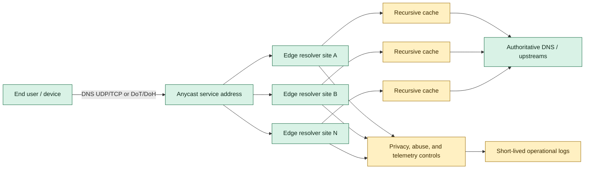

## 1. Original Engineering Problem

[SOURCE FACT] DNS là bước tra cứu giống như một danh bạ, thường diễn ra trước khi tải website, gửi email hoặc mở ứng dụng. Nguồn phân biệt DNS có thẩm quyền, phục vụ phía nội dung, với trình phân giải phục vụ người dùng và thường được ISP, nhà vận hành Wi-Fi hoặc mạng di động lựa chọn. ([Cloudflare, “Announcing 1.1.1.1: the fastest, privacy-first consumer DNS service”](https://blog.cloudflare.com/announcing-1111/))

[SOURCE FACT] Cloudflare mô tả hai vấn đề hướng tới người dùng: trình phân giải có thể chậm và có thể làm lộ các tên miền người dùng truy vấn cho nhà vận hành mạng, ngay cả khi website đích dùng HTTPS. Nguồn cũng mô tả việc chặn DNS như một cơ chế kiểm duyệt. ([Cloudflare](https://blog.cloudflare.com/announcing-1111/))

[ANALYSIS] Đây là bài toán hệ thống phân tán với ba mục tiêu gắn chặt:

- Giảm độ trễ tra cứu bằng cách đặt việc phân giải đệ quy gần người dùng.
- Làm cho dịch vụ vẫn có thể truy cập dù từng địa điểm hoặc mạng riêng lẻ gặp lỗi.
- Giảm thiểu tác hại quyền riêng tư do vận hành một điểm quan sát lưu lượng lớn.

Điểm khó không phải là trả lời một câu hỏi DNS. Điểm khó là vận hành một dịch vụ có thể truy cập trên toàn cầu, độ trễ thấp, đồng thời giữ cho định tuyến, bộ nhớ đệm, kiểm soát lạm dụng, tương thích giao thức và thời hạn lưu dữ liệu nhất quán.

## 2. What the Original System Did

[SOURCE FACT] Cloudflare cho biết họ dùng mạng toàn cầu lớn, kết nối rộng và kinh nghiệm về DNS để ra mắt một trình phân giải cho người tiêu dùng. Thử nghiệm cho thấy trình phân giải chạy trên mạng đó nhanh hơn các dịch vụ DNS tiêu dùng khác có sẵn khi ấy. ([Cloudflare](https://blog.cloudflare.com/announcing-1111/))

[SOURCE FACT] Dịch vụ dùng các địa chỉ dễ nhớ `1.1.1.1` và `1.0.0.1`. Nhóm nghiên cứu của APNIC sở hữu các địa chỉ này và từng quan sát một luồng lưu lượng rác tràn vào khi chúng được quảng bá. Cloudflare cung cấp mạng của mình để tiếp nhận và nghiên cứu lưu lượng đó, đồng thời cung cấp trình phân giải trên các địa chỉ này. ([Cloudflare](https://blog.cloudflare.com/announcing-1111/))

[SOURCE FACT] Cloudflare cam kết không ghi địa chỉ IP truy vấn xuống đĩa, xóa log trong vòng 24 giờ, và thuê KPMG kiểm toán hằng năm rồi công bố báo cáo. Nguồn nói vẫn cần một phần log để ngăn lạm dụng và gỡ lỗi. ([Cloudflare](https://blog.cloudflare.com/announcing-1111/))

[SOURCE FACT] Khi ra mắt, 1.1.1.1 hỗ trợ DNS-over-TLS và DNS-over-HTTPS. Nguồn xem DNS-over-HTTPS là một hướng được mã hóa, có tiềm năng cho các phương thức truyền và khả năng giao thức mới hơn. ([Cloudflare](https://blog.cloudflare.com/announcing-1111/))

[SOURCE FACT] DNSPerf được mô tả là xếp 1.1.1.1 nhanh nhất đối với truy vấn tới khách hàng không dùng Cloudflare, trung bình khoảng 14 ms trên toàn cầu. Với khách hàng dùng DNS có thẩm quyền của Cloudflare, nguồn nói trình phân giải và recursor nằm trên cùng mạng và phần cứng, cho phép trả lời rất nhanh và cập nhật tức thời mà không cần chờ TTL hết hạn. ([Cloudflare](https://blog.cloudflare.com/announcing-1111/))

[ANALYSIS] Những dữ kiện này gợi ý một thiết kế tập trung vào điểm vào tại edge và tính cục bộ của cache đệ quy, thay vì một cụm trình phân giải trung tâm. Tuy nhiên, chúng không tự tiết lộ chính sách định tuyến, bố cục tiến trình, thuật toán cache hay pipeline chống lạm dụng chính xác.

## 3. Architecture Diagram

Sơ đồ tách các thành phần được nguồn nói rõ khỏi phần mở rộng theo kiểu phỏng vấn.



[SOURCE FACT] Trong sơ đồ, node màu xanh là [Source-backed component] và node màu vàng là [Proposed component].

[SOURCE FACT] Các thành phần có căn cứ từ nguồn là trình phân giải tiêu dùng, mạng toàn cầu, các địa chỉ dịch vụ dễ nhớ, hỗ trợ DNS-over-TLS/DNS-over-HTTPS và quan hệ với DNS có thẩm quyền của Cloudflare. ([Cloudflare](https://blog.cloudflare.com/announcing-1111/))

[PROPOSED DESIGN] Cache tại từng site, pipeline quyền riêng tư rõ ràng và nơi ghi log ngắn hạn là cách phân rã cụ thể để thảo luận. Nguồn không khẳng định Cloudflare dùng đúng các thành phần hoặc ranh giới này.

## 4. System Design Analysis

[ANALYSIS] Anycast cho dịch vụ một địa chỉ duy nhất từ góc nhìn client, đồng thời cho phép traffic đi vào tại edge gần hoặc phù hợp nhất về mặt cấu trúc mạng. Lợi ích không đảm bảo khoảng cách địa lý: BGP chọn tuyến theo chính sách mạng, và một site gần có thể không truy cập được hoặc không tối ưu. Vì vậy, rút quảng bá khi lỗi và đa dạng tuyến quan trọng không kém số lượng site.

[ANALYSIS] DNS có lợi thế cache rất mạnh. Trình phân giải đệ quy có thể trả lời nhiều câu hỏi lặp lại từ cache tại edge, tránh một vòng đi lên upstream. Câu trả lời âm và TTL cũng định hình tải; tuy nhiên cache tích cực phải tôn trọng bản ghi có thẩm quyền để không biến dữ liệu cũ thành lỗi đúng-sai.

[ANALYSIS] Quyền riêng tư là ràng buộc kiến trúc, không chỉ là nội dung chính sách. Nếu hệ thống không cần địa chỉ IP client sau khi xử lý request, data path nên tránh lưu bền vững chúng. Khi đó phát hiện lạm dụng cần các tín hiệu thô, ngắn hạn hoặc được bảo vệ riêng. Cam kết xóa trong 24 giờ của nguồn là source fact; cơ chế triển khai ở đây là phân tích.

[ANALYSIS] Mã hóa đoạn client tới trình phân giải làm thay đổi tải tại edge. DoH thêm quản lý kết nối HTTP và phân tích request; DoT thêm xử lý phiên TLS. Cả hai cải thiện tính bí mật so với DNS plaintext trên mạng truy cập, nhưng không khiến trình phân giải không nhìn thấy chính truy vấn.

## 5. Data Model

[PROPOSED DESIGN] Các bản ghi logic sau đây là mô hình dùng trong phỏng vấn, không phải mô tả schema nội bộ của Cloudflare:

```text
CacheEntry {
  question_key: (qname, qtype, qclass, ecs_scope)
  response: dns_message
  expires_at: timestamp
  authoritative_ttl: duration
  negative: boolean
}

AbuseSignal {
  coarse_source_token: short_lived_token
  edge_site: opaque_site_id
  query_class: enum
  count_window: short_window
  expires_at: timestamp
}

RouteHealth {
  edge_site: opaque_site_id
  resolver_ready: boolean
  upstream_reachability: enum
  withdraw_recommended: boolean
}
```

[ANALYSIS] `question_key` phải bao gồm mọi chiều có thể làm thay đổi câu trả lời. Cache key bỏ qua loại truy vấn hoặc phạm vi client-subnet áp dụng có thể trả về một DNS message hợp lệ nhưng cho sai câu hỏi. `expires_at` cho phép serving path từ chối dữ liệu hết hạn mà không thay đổi ngữ nghĩa authoritative.

[PROPOSED DESIGN] `coarse_source_token` cố ý không phải IP client thô. Đây là đầu vào chống lạm dụng bảo vệ quyền riêng tư, có thời gian sống ngắn. Thiết kế production phải xác định cách tạo, chính sách truy cập và kiểm thử xóa trước khi ra mắt.

## 6. API Design

[PROPOSED DESIGN] Interface công khai có thể cung cấp các transport DNS tương thích chuẩn thay vì một application API tùy biến:

```http
POST /dns-query HTTP/2
Content-Type: application/dns-message
Accept: application/dns-message

<wire-format DNS query>
```

```text
Response: 200 OK
Content-Type: application/dns-message

<wire-format DNS response>
```

[SOURCE FACT] Nguồn nói 1.1.1.1 hỗ trợ DNS-over-HTTPS và DNS-over-TLS khi ra mắt. ([Cloudflare](https://blog.cloudflare.com/announcing-1111/))

[PROPOSED DESIGN] Với DNS UDP và TCP, contract tương đương là request DNS wire-format tới service address và response wire-format, cùng các mã phản hồi chuẩn như `NOERROR`, `NXDOMAIN` và `SERVFAIL`. DoH và DoT nên dùng chung resolver core để lựa chọn transport không làm thay đổi ngữ nghĩa cache hoặc policy.

[ANALYSIS] API vận hành không nên mặc định phơi bày query log. Interface an toàn hơn chỉ báo cáo sức khỏe tổng hợp, hiệu quả cache, nhóm lỗi upstream và trạng thái xóa mà không trả về lịch sử người dùng thô.

## 7. Scaling Strategy

[SOURCE FACT] Nguồn Cloudflare nói trình phân giải chạy trên mạng toàn cầu và resolver cùng DNS có thẩm quyền có thể chạy trên cùng mạng, cùng phần cứng đối với khách hàng Cloudflare. ([Cloudflare](https://blog.cloudflare.com/announcing-1111/))

[ANALYSIS] Việc scale đi theo tính cục bộ của request:

- Thêm năng lực ingress tại edge để một site không trở thành nút thắt toàn cầu.
- Giữ cache đệ quy đủ cục bộ để tận dụng nhu cầu lặp lại mà không phải replicate mọi record tới mọi site.
- Dùng quảng bá route anycast cho khả năng truy cập, với health check có thể loại site lỗi.
- Tách xử lý packet, công việc đệ quy, kết thúc transport mã hóa và kiểm soát lạm dụng để một đợt tăng kết nối DoH không làm nghẽn DNS thông thường.
- Giữ co-location với authoritative như fast path, đồng thời dùng recursion upstream cho domain ngoài fast path đó.

[PROPOSED DESIGN] Một rollout thực tế sẽ dùng admission limit theo site và work queue có giới hạn. Khi site bão hòa, site nên loại bỏ recursion tốn kém trước khi cạn memory hoặc lan truyền tail latency. Kích thước queue và số site cụ thể là illustrative assumptions, không phải source fact.

## 8. Failure Scenarios

[ANALYSIS] Các failure case quan trọng gồm:

- Mất edge site: anycast nên chuyển traffic mới sang nơi khác; session TCP, DoT hoặc DoH đang tồn tại có thể cần retry.
- Hijack hoặc leak route: địa chỉ vẫn có thể truy cập nhưng tới nhầm mạng. Xác thực origin route, giám sát độc lập và rút route nhanh giúp giảm rủi ro.
- Authoritative upstream lỗi: phục vụ entry cache còn hạn, trả lỗi trung thực khi không thể recursion, và không tự tạo câu trả lời.
- Nỗ lực cache poisoning: xác thực response, giới hạn bailiwick và cô lập upstream đáng ngờ.
- Privacy control lỗi: fail closed với field bền vững bị cấm; observability outage không được âm thầm biến thành lưu query thô.
- Flood lạm dụng: rate-limit tại edge, giữ capacity cho truy vấn bình thường và chỉ lưu tín hiệu ngắn hạn tối thiểu cần thiết.

[SOURCE FACT] Nguồn nói các địa chỉ trước đó đã thu hút lượng traffic rác áp đảo khi được quảng bá, khiến lọc traffic và cô lập capacity trở thành mối quan tâm hạng nhất. ([Cloudflare](https://blog.cloudflare.com/announcing-1111/))

## 9. Capacity Estimation

[SOURCE FACT] Nguồn báo cáo trung bình khoảng 14 ms trên toàn cầu cho truy vấn tới khách hàng không dùng Cloudflare, theo mô tả về DNSPerf. Nguồn cũng nói Cloudflare cam kết xóa log trong vòng 24 giờ. ([Cloudflare](https://blog.cloudflare.com/announcing-1111/))

[PROPOSED DESIGN] Nguồn được phép không cung cấp request rate, kích thước packet, số site, cache hit ratio hoặc năng lực phần cứng. Vì vậy mọi mô hình số dưới đây là illustrative assumption, không phải tuyên bố về Cloudflare:

```text
Assume peak query rate per edge site        = 1,000,000 queries/s
Assume average request + response bytes     = 600 bytes
Estimated DNS payload bandwidth             = 1,000,000 * 600 * 8
                                             = 4.8 Gbit/s per site
Assume 30% headroom                          = 6.24 Gbit/s planned
```

[ANALYSIS] Biến số sizing có ý nghĩa là packet rate, encrypted connection rate, cache hit ratio, concurrency của recursion, upstream latency và failure amplification. Resolver có thể dư bandwidth nhưng vẫn lỗi do CPU dành cho TLS, áp lực memory từ recursion đang chờ hoặc outage của dependency upstream. Cần load-test theo tail latency và cache-miss storm, không chỉ throughput trung bình.

## 10. Trade-offs

[ANALYSIS] Anycast toàn cầu đánh đổi độ phức tạp vận hành để có endpoint ổn định, dễ nhớ. Nó có thể rút ngắn đường đi cho nhiều người dùng, nhưng routing phụ thuộc policy và chẩn đoán lỗi trở nên phân tán.

[ANALYSIS] Cache tại edge giảm latency và traffic upstream, nhưng tạo cache fragmentation và nhiều bản sao state có thể thay đổi. Cache coordination tập trung có thể tăng hit rate ở một số workload nhưng thêm latency và dependency coordination.

[ANALYSIS] Thời hạn lưu ngắn hạn chế rủi ro quyền riêng tư và lịch sử điều tra. Nó cũng thu hẹp cửa sổ điều tra lạm dụng và lỗi gián đoạn. Nguồn nói rõ logging giới hạn vẫn tương thích với ngăn lạm dụng và gỡ lỗi, nhưng không công bố các control cụ thể. ([Cloudflare](https://blog.cloudflare.com/announcing-1111/))

[ANALYSIS] DoH cải thiện khả năng triển khai nhờ hạ tầng HTTP và mã hóa, nhưng tiêu tốn thêm tài nguyên kết nối và parsing so với đường UDP tối giản. Hỗ trợ cả DoH và DoT tăng tương thích cũng như bề mặt vận hành.

## 11. What We Can Learn From This Architecture

[SOURCE FACT] Nguồn liên hệ hiệu năng với việc chạy resolver trên mạng toàn cầu và đặt resolver cùng chức năng authoritative trên cùng mạng, cùng phần cứng. ([Cloudflare](https://blog.cloudflare.com/announcing-1111/))

[ANALYSIS] Bài học có thể chuyển giao là đặt computation nơi request vốn đã cần đi tới. Topology mạng, cache locality và quyền sở hữu authoritative có thể củng cố lẫn nhau; không nên tối ưu chúng như các service tách biệt.

[SOURCE FACT] Nguồn cũng mô tả các cam kết quyền riêng tư với cơ chế xóa cụ thể và audit. ([Cloudflare](https://blog.cloudflare.com/announcing-1111/))

[ANALYSIS] Một lời hứa về quyền riêng tư đáng tin khi nó được thể hiện trong schema lưu trữ, retention job, access control và báo cáo có thể kiểm tra độc lập. “Chúng tôi không dùng dữ liệu” yếu hơn việc thiết kế hệ thống để dữ liệu nhạy cảm nhất không bao giờ được ghi bền vững.

## 12. Proposed Interview-Style System Design

[PROPOSED DESIGN] Yêu cầu:

- Cung cấp DNS đệ quy qua UDP, TCP, DoT và DoH.
- Cung cấp một service identity truy cập toàn cầu với cô lập lỗi theo vùng.
- Trả lời đúng với tail latency thấp và công việc upstream có giới hạn.
- Tránh lưu IP client bền vững và xóa operational log trong cửa sổ policy đã nêu.
- Bảo vệ người dùng bình thường khỏi traffic rác và client lạm dụng.

[PROPOSED DESIGN] Request path:

1. Anycast đưa client tới một edge site.
2. Edge xác thực transport và áp dụng admission control rẻ.
3. Question đã chuẩn hóa kiểm tra cache cục bộ.
4. Cache hit được trả sau khi kiểm tra TTL; cache miss được deduplicate theo question key.
5. Một recursive worker xử lý miss qua authoritative server hoặc upstream được cấu hình.
6. Response được xác thực, chèn vào cache với TTL và trả cho các client đang chờ.
7. Tín hiệu aggregate an toàn cho quyền riêng tư cấp dữ liệu cho health và abuse control; IP client thô không được ghi vào durable log.

[PROPOSED DESIGN] Consistency và correctness:

- TTL là contract freshness tối thiểu; không tự ý kéo dài.
- Negative caching tuân theo quy tắc hiệu lực của negative response.
- In-flight request coalescing ngăn một cache miss phổ biến biến thành upstream storm.
- Route health phản ánh cả readiness của process và khả năng truy cập dependency đệ quy.

[PROPOSED DESIGN] Các success metric trong phỏng vấn nên gồm p50/p95/p99 lookup latency, cache-hit ratio, tỷ lệ `SERVFAIL`, tỷ lệ timeout upstream, chi phí handshake transport mã hóa, thời gian hội tụ route và tỷ lệ field bị cấm xuất hiện trong retention audit. Đây là metric đề xuất, không phải số đo được báo cáo trong nguồn.

## Original Sources

- Company: Cloudflare
- Exact Article Title: “Announcing 1.1.1.1: the fastest, privacy-first consumer DNS service”
- URL: https://blog.cloudflare.com/announcing-1111/
- What information from the source was used: Vấn đề của DNS resolver, động lực về quyền riêng tư và kiểm duyệt, triển khai trên mạng toàn cầu, các địa chỉ `1.1.1.1` và `1.0.0.1`, bối cảnh traffic rác, hỗ trợ DNS-over-TLS và DNS-over-HTTPS, cam kết lưu log và audit, con số hiệu năng toàn cầu khoảng 14 ms, cùng việc colocate resolver với DNS authoritative.
