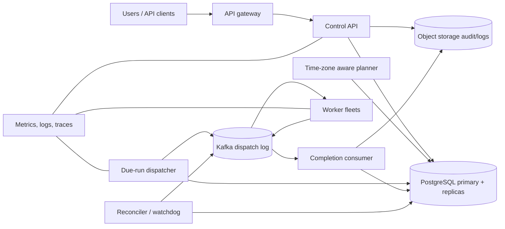

## 1. Problem

Ta xây dựng một bộ lập lịch đa tenant cho pipeline dữ liệu, tác vụ tính cước, thông báo và bảo trì. Người dùng có thể định nghĩa lịch cron, gửi một lần chạy hoặc ghép các tác vụ thành đồ thị có hướng không chu kỳ (DAG). Bộ lập lịch quyết định khi nào một lần chạy đến hạn và sắp xếp việc thực thi trên các cụm worker; nó không phải là business worker.

Yêu cầu chức năng:

- Hỗ trợ biểu thức cron, mốc thời gian một lần và dependency của DAG.
- Một run được thực thi ít nhất một lần: worker có thể nhận lại run sau timeout hoặc failover.
- Retry dùng exponential backoff có giới hạn và jitter, kết thúc ở trạng thái dead-letter sau số lần theo chính sách.
- Catch-up là hành vi tường minh: các occurrence bị lỡ sau downtime có thể được replay, gộp hoặc bỏ qua theo từng schedule.
- Múi giờ và chuyển giờ mùa hè dùng bộ quy tắc IANA. Một giờ địa phương xuất hiện hai lần được biểu diễn bằng offset riêng; giờ không tồn tại tuân theo chính sách bỏ qua đã khai báo.

Yêu cầu phi chức năng:

- Không double-execution âm thầm: nền tảng ngăn các *logical dispatch* trùng nhau, nhưng mã job vẫn phải idempotent vì delivery ít nhất một lần không thể ngăn worker cũ hoàn thành muộn.
- Phát hiện task bị lỡ, lịch sử audit, scale ngang, cô lập tenant và khôi phục thảm họa theo vùng.
- Mục tiêu availability là 99.95% cho đánh giá schedule và control API, cùng mục tiêu 99.9% cho độ trễ dispatch trong tải bình thường. Run đến hạn nên được đưa vào queue trong 30 giây kể từ thời điểm đến hạn ở p99.

Người dùng là các team nền tảng và chủ dịch vụ. Họ cần bản ghi bền vững về điều đã dự kiến, điều đã dispatch, attempt nào đã chạy, và lý do run bị bỏ qua hoặc trì hoãn.

## 2. Scale Estimation

Giả định 2.000 tenant và 10.000 schedule đang hoạt động. Đây là quy mô khởi đầu vừa phải: đủ tạo áp lực vận hành nhưng vẫn cho phép database chính giữ vai trò trạng thái chuẩn. Giả định trung bình mỗi tenant có 25 thao tác API mỗi ngày (sửa schedule, truy vấn run và trigger thủ công).

- Lưu lượng API = `2,000 DAU x 25 requests/day = 50,000 requests/day`.
- Tốc độ API trung bình = `50,000 / 86,400 = 0.58 RPS`; thiết kế cho đỉnh `10x = 5.8 RPS`, làm tròn thành 10 RPS cho burst.
- Nếu mỗi schedule tạo 100 occurrence/ngày, số occurrence = `10,000 x 100 = 1,000,000 occurrences/day`, hay trung bình `11.6/giây`. Burst theo thời gian 10x là 116 due event/giây.
- Giả sử 2% occurrence cần retry. Số dispatch-attempt event là `1,000,000 x 1.02 = 1.02 million/day`. Với 1,5 KB/event, event log khoảng `1.53 GB/day`, hay `1.67 TB` trong ba năm trước compression và replica.
- Một run row chuẩn trung bình 1 KB. Với 1,02 triệu attempt cộng metadata, hot storage 30 ngày xấp xỉ `1.02M x 1 KB x 30 = 30.6 GB`, chưa tính index và replica; dự phòng 3x, tức 92 GB.
- Nếu 5% run dùng 20 KB log và giữ 30 ngày, log ingress là `1.02M x 0.05 x 20 KB = 1.02 GB/day`; log phải vào object storage, không phải transactional database.
- Event dispatch 1,5 KB ở đỉnh 116 event/giây chỉ là `174 KB/s` hay 1,4 Mbps trước replication. Cấp 10 Mbps cho mỗi hướng broker để có chỗ cho metadata workflow và burst.
- Tỷ lệ đọc control so với attempt bình thường gần 20:1. UI và controller đọc trạng thái run, còn attempt thiên về append.

Dự báo tăng 3x trong 18 tháng: 30.000 schedule và 3 triệu occurrence/ngày. Ta chỉ cấp cho 100.000 due event/giây ở mốc 100x sau khi đạt milestone sharding, thay vì giả vờ cluster ban đầu có năng lực đó. Mục tiêu availability yêu cầu không một scheduler process hay availability zone nào là điều kiện cho correctness. Mất một vùng là mục tiêu khôi phục, không phải active-active không mất dữ liệu: RPO 5 phút và RTO 30 phút.

## 3. API Design

Mọi endpoint yêu cầu OAuth2 service hoặc user token. `tenant_id` lấy từ principal đã xác thực và không bao giờ tin giá trị từ query parameter. Mọi request thay đổi trạng thái nhận `Idempotency-Key`; server lưu kết quả 24 giờ, giới hạn theo tenant và endpoint.

`POST /v1/schedules`

```json
{
  "name": "nightly-settlement",
  "cron": "0 2 * * *",
  "timezone": "America/New_York",
  "misfire_policy": "catch_up",
  "max_catch_up": 3,
  "job_ref": "settlement:v4",
  "retry_policy": {"max_attempts": 5, "backoff_seconds": 30, "max_backoff_seconds": 3600}
}
```

`201 Created` trả về `schedule_id`, các trường schedule đã chuẩn hóa, `next_fire_at` và `version`. Server validate cron và IANA zone trước khi commit.

`PATCH /v1/schedules/{schedule_id}` cập nhật schedule với header `If-Match: <version>`. Version cũ trả `409`, ngăn operator ghi đè thay đổi đồng thời. `DELETE` tắt các occurrence tương lai nhưng không xóa audit history.

`POST /v1/schedules/{schedule_id}/runs` tạo run thủ công hoặc một lần:

```json
{"scheduled_for":"2026-08-20T09:30:00Z","parameters":{"account":"eu"}}
```

Response là `202 Accepted` với `run_id` và `status: "queued"`. Nó bất đồng bộ vì worker có thể chưa sẵn sàng và API không nên giữ transaction database mở trong lúc thực thi.

`POST /v1/workflows` nhận DAG gồm task reference và edge. API từ chối cycle, task reference không tồn tại và DAG quá 500 node. `GET /v1/runs/{run_id}` trả run, trạng thái task, số attempt và timestamp. `POST /v1/runs/{run_id}/cancel` ghi nhận yêu cầu hủy; worker dừng hợp tác, còn side effect đã hoàn tất không được rollback.

Dispatch contract gồm `run_id`, `task_id`, `attempt`, `lease_id`, `fencing_token`, deadline và trace ID. Worker acknowledge nhận việc, gia hạn lease và báo hoàn thành bằng lease đó. Completion của lease đã hết hạn bị từ chối là stale và có thể retry an toàn.

## 4. Data Model

PostgreSQL là nguồn sự thật. Thời gian lưu UTC; timezone IANA gốc và expression người dùng được giữ lại để giải thích.

```sql
CREATE TABLE schedules (
  tenant_id UUID NOT NULL,
  schedule_id UUID NOT NULL,
  name TEXT NOT NULL,
  cron TEXT,
  timezone TEXT NOT NULL,
  misfire_policy TEXT NOT NULL CHECK (misfire_policy IN ('skip','catch_up','coalesce')),
  max_catch_up INT NOT NULL DEFAULT 3,
  next_fire_at TIMESTAMPTZ,
  enabled BOOLEAN NOT NULL DEFAULT true,
  version BIGINT NOT NULL DEFAULT 1,
  updated_at TIMESTAMPTZ NOT NULL,
  PRIMARY KEY (tenant_id, schedule_id)
);

CREATE TABLE runs (
  tenant_id UUID NOT NULL,
  run_id UUID NOT NULL,
  schedule_id UUID,
  workflow_id UUID,
  scheduled_for TIMESTAMPTZ NOT NULL,
  status TEXT NOT NULL,
  created_at TIMESTAMPTZ NOT NULL,
  PRIMARY KEY (tenant_id, run_id),
  UNIQUE (tenant_id, schedule_id, scheduled_for)
);

CREATE TABLE task_attempts (
  tenant_id UUID NOT NULL,
  run_id UUID NOT NULL,
  task_id UUID NOT NULL,
  attempt INT NOT NULL,
  status TEXT NOT NULL,
  lease_id UUID,
  fencing_token BIGINT,
  available_at TIMESTAMPTZ NOT NULL,
  started_at TIMESTAMPTZ,
  finished_at TIMESTAMPTZ,
  PRIMARY KEY (tenant_id, run_id, task_id, attempt)
);

CREATE INDEX runs_due_idx ON runs (status, scheduled_for);
CREATE INDEX attempts_ready_idx ON task_attempts (available_at)
  WHERE status IN ('READY','RETRY');
CREATE INDEX attempts_run_idx ON task_attempts (tenant_id, run_id);
```

Khóa unique schedule/time làm cho tính toán cron idempotent: hai evaluator có thể tranh chấp nhưng chỉ một logical run được insert. Partial ready index phục vụ dispatcher mà không scan attempt đã hoàn tất. Run index phục vụ lookup cho UI và reconciliation. Khi lớn hơn, bảng lớn được range-partition theo `created_at` mỗi tháng để retention, còn logical shard key là `tenant_id`; như vậy transaction control của một tenant nằm trong một shard và tránh một due-time index toàn cục thành write hotspot. Hash của `tenant_id` ánh xạ tenant vào database shard. Báo cáo liên tenant là bất đồng bộ.

## 5. High-Level Architecture



Gateway xác thực, rate-limit và gán request ID. Control API sở hữu validation và mutation có transaction; read replica hấp thụ dashboard nhưng không bao giờ quyết định run có tồn tại hay không. Planner tiến con trỏ occurrence kế tiếp của từng schedule theo quy tắc timezone và tạo durable run intent. Dispatcher claim attempt sẵn sàng theo batch ngắn rồi append dispatch record bất biến vào Kafka. Kafka phù hợp vì log append tách burst due work khỏi khả năng sẵn sàng của worker, hỗ trợ replay và cho thấy consumer lag; nó không phải nguồn sự thật.

Worker chạy business code và phải dùng idempotency key riêng cho job như `(tenant_id, run_id, task_id)`. Completion consumer áp dụng state transition. Reconciler so sánh intent trong database, dispatch record, lease và completion state để sửa khoảng trống sau crash. Object storage giữ log dài và audit export bất biến. Metrics và trace là thành phần xuyên suốt, không phải phần bổ sung sau cùng.

## 6. Deep Dive

**Thời gian và catch-up.** Planner lưu occurrence cuối đã commit và tính occurrence tiếp theo bằng thư viện timezone dựa trên database IANA. Nó không bao giờ cộng 24 giờ vào timestamp địa phương. Với giờ DST lặp lại, policy chọn cả hai offset hoặc một offset rõ ràng; với giờ không tồn tại, `skip` ghi nhận occurrence bị bỏ qua còn `catch_up` chuyển nó đến instant hợp lệ kế tiếp. Một transaction của planner khóa một schedule row, insert từng run có giới hạn bằng unique key và tiến `next_fire_at`. Catch-up bị giới hạn để outage kéo dài một năm không tạo burst vô hạn; phần còn lại được báo là missed.

**Lập lịch ngang.** Planner và dispatcher là các fleet stateless. Chúng claim việc bằng `SELECT ... FOR UPDATE SKIP LOCKED` theo batch giới hạn, đặt lease expiry, commit rồi publish ngoài transaction. Crash giữa commit và publish được reconciler sửa qua outbox table hoặc republish attempt ID bị thiếu. Cách ưu tiên là ghi outbox row cùng transaction với state transition; outbox publisher đưa nó vào Kafka rồi đánh dấu sent. Điều này loại bỏ khoảng trống dual-write giữa database và Kafka.

**Queue, ordering và backpressure.** Kafka partition theo `tenant_id` để có ordering và isolation trong từng tenant. Không cố ý hứa ordering toàn cục. Worker pool giới hạn số việc in-flight và chỉ lấy lease khi còn capacity. Queue depth và tuổi message lớn nhất điều khiển admission: khi tuổi vượt 20 giây, run low-priority mới bị trì hoãn, còn tenant deadline-critical giữ capacity dự phòng. Retry được lập lịch trong database bằng `available_at`, không requeue ngay, để dependency lỗi không tạo vòng lặp chặt. Sau năm attempt, task vào `DLQ` và workflow bị block hoặc chạy compensation theo policy.

**Ranh giới exactly-once.** Scheduler cung cấp delivery ít nhất một lần cộng với ngăn logical-run trùng. Nó không thể làm một HTTP call tùy ý trở thành exactly-once. Worker truyền idempotency key cho hệ thống downstream; ví dụ billing consumer commit key và effect trong cùng một transaction downstream. Completion dùng compare-and-set trên `lease_id` và `fencing_token`. Worker cũ hoàn thành muộn không thể ghi đè attempt mới. Lease là cơ chế liveness, không phải bằng chứng process cũ đã dừng.

**Thực thi DAG.** Mỗi task có dependency count. Transaction completion đánh dấu task thành công và giảm counter của task phụ thuộc; khi counter về zero, dependent attempt thành READY. Transaction cũng append outbox event. Task thất bại ngăn descendant chạy trừ khi workflow khai báo nhánh thay thế. Cách này tránh coordinator giữ toàn bộ DAG state trong memory và cho phép recovery bằng cách replay task state bền vững.

**Lock và transaction.** Row lock serialize cursor của schedule; không giữ transaction worker dài hạn. Fencing token tăng mỗi khi lease được lấy. Worker gửi token trong heartbeat và completion, database từ chối token cũ. Redis có thể cung cấp counter rate-limit, nhưng correctness lock nằm trong PostgreSQL vì mất Redis không được tạo hai owner. Ở quy mô lớn, transaction theo shard là strong; analytics toàn cục eventual.

**Retry và bảo vệ.** Backoff là `min(max_backoff, base * 2^(attempt-1)) + random(0, base)`, bị giới hạn bởi deadline của run. Chỉ retry nhóm lỗi transient; parameter không hợp lệ đi thẳng tới terminal failure. Quota theo tenant, giới hạn concurrency theo job, circuit breaker cho dependency downstream và global token bucket ngăn tenant xấu làm cạn connection pool. Load balancer API và worker dùng health check và connection draining. Pool có giới hạn: việc dư chờ trong queue thay vì mở connection database vô hạn.

**Cache và storage.** Cache schedule definition và tenant policy cho đường API đọc nhiều bằng TTL ngắn và invalidation có version. Không bao giờ cache `next_fire_at` cho quyết định planner. Redis lỗi làm tăng latency và database read; không được thay đổi correctness. Read replica phục vụ truy vấn run lịch sử cùng chỉ báo `replica_lag_seconds`. Audit record append-only được export vào object storage có retention lock. Partition và event segment cũ chỉ xóa sau retention window và backup đã xác minh.

**Disaster recovery.** Synchronous standby trong vùng chính hỗ trợ failover; WAL được replicate bất đồng bộ sang vùng thứ hai. Promotion dùng fencing epoch để primary cũ bị cô lập không nhận write. Khi khôi phục, planner scan schedule và áp dụng misfire policy đã khai báo. RPO/RTO được nêu rõ vì active-active write sẽ làm phức tạp unique run, lease ownership và ordering của timezone cursor mà không giúp ích cho trường hợp thường.

## 7. Consistency Model

Strong consistency cần cho update version của schedule, tạo run với unique `(schedule_id, scheduled_for)`, lấy lease, kiểm tra fencing-token, chuyển trạng thái cancellation và dependency counter của task. Các thao tác dùng primary của shard và transaction serializable hoặc read-committed có phạm vi được kiểm soát.

Eventual consistency chấp nhận được cho dashboard từ replica, metrics, search index, audit export và trạng thái consumer Kafka. UI gắn nhãn run mới submit là “pending visibility” nếu replica đang lag thay vì kết luận run không tồn tại.

Nếu write thành công nhưng response bị mất, client retry cùng idempotency key. API trả kết quả đã lưu thay vì tạo schedule hoặc run khác. Nếu planner crash sau database commit, unique constraint khiến replay vô hại. Nếu dispatcher crash sau publish, cùng attempt có thể được giao lại; downstream idempotency key và fencing của worker xử lý. Nếu replication lag trong failover, recovery có thể replay trong RPO đã công bố; audit tool đánh dấu phần không chắc chắn thay vì âm thầm tuyên bố lịch sử exactly-once.

## 8. Failure Scenarios

| Failure | Impact | Detection | Recovery |
|---|---|---|---|
| Primary database unavailable | Control writes fail; planning and lease changes pause | Connection errors, primary health, transaction latency, replica WAL position | Fail over to synchronous standby; reject writes during fencing; replay planner from durable cursor |
| Kafka consumer stuck or poisoned message | One partition’s completion state and downstream tasks stop advancing | Consumer lag, oldest message age, repeated exception rate | Pause partition, move offending record to DLQ with trace ID, deploy/fix consumer, replay after validation |
| Redis/cache outage | Higher database read load and slower API responses | Cache error rate, hit ratio, DB read IOPS | Bypass cache with request-rate limits; rebuild asynchronously; correctness remains in PostgreSQL |
| Planner process crash after run commit | A due run may not be published promptly | Outbox age, due-versus-dispatched gap, watchdog heartbeat | Another planner claims the schedule; outbox publisher/reconciler republishes idempotently |
| Worker dies after downstream side effect | Duplicate attempt can repeat the side effect | Lease expiry, missing heartbeat, attempt timeout | Retry with downstream idempotency key; stale completion rejected by fencing token |
| Region loss | API and execution unavailable in the region; possible recent writes lost | Regional health checks, WAL shipping age, synthetic probes | Promote secondary, fence old region, replay within 5-minute RPO, apply catch-up policy |
| Hot tenant or schedule | One shard/partition saturates and other tenants see latency | Per-tenant queue depth, shard CPU, partition skew | Apply quotas, split tenant to a dedicated shard, salt high-volume event keys while preserving tenant-local ordering where required |

## 9. Observability

Mọi API request, planner transaction, dispatch event, worker attempt và completion mang `trace_id`, `request_id`, `tenant_id`, `run_id` và `task_id`. Log có cấu trúc; parameter được che. Một trace nối quyết định API với database transaction, Kafka offset, worker execution và downstream call.

SLI và alert gồm:

- Thành công của schedule evaluation và availability control API, với SLO tháng 99.95%.
- `due_to_enqueue_seconds` p50/p95/p99; alert khi p99 vượt 30 giây trong 10 phút.
- Error rate của run và attempt theo tenant, job và lý do terminal; phân biệt code lỗi với hạ tầng lỗi.
- Kafka consumer lag và tuổi event lớn nhất; tuổi tăng trong khi producer bình thường cho thấy consumer bị kẹt.
- Ready-queue depth và `available_at` cũ nhất; báo worker saturation hoặc backpressure.
- Lease-expiry rate và heartbeat failure; báo worker crash hoặc network partition.
- Database commit latency, lock wait, replication lag, CPU, IOPS, storage và connection-pool utilization; pool bão hòa với CPU thấp thường là connection bị leak hoặc chậm.
- Cache hit ratio và error rate; hit ratio giảm đồng thời DB IOPS tăng là dấu hiệu cache lỗi.
- Reconciliation gap: READY attempt bền vững nhưng không có outbox/dispatch record, và attempt đã dispatch nhưng không có kết quả terminal.

Dashboard phải drill-down được theo tenant và tách riêng occurrence bị skip, coalesce và misfire. Alert chỉ page khi ảnh hưởng khách hàng, không phải mỗi retry. Synthetic schedule ở mọi timezone được hỗ trợ phải kiểm tra DST, failover và latency end-to-end.

## 10. Capacity Planning

Với 116 due event/giây ở đỉnh ban đầu, dùng 3 planner instance trên ba zone, mỗi instance 100 event/giây, và 4 dispatcher instance ở 150 claim/giây. Sau khi mất một instance vẫn còn headroom trên 2x. Sáu worker consumer, mỗi consumer 25 task đồng thời, cung cấp 150 task in-flight; quy mô worker thực tế phụ thuộc runtime task, không chỉ event rate.

Kafka ban đầu dùng 12 partition: với năng lực an toàn quan sát được 50 event/giây mỗi partition, tổng là 600 event/giây, hơn 5x đỉnh 116. Sáu consumer có thể chia các partition; chỉ tăng consumer đến số partition. Tăng partition trước mốc tăng trưởng 3x, đồng thời nhớ rằng đổi partition-key ảnh hưởng ordering.

PostgreSQL bắt đầu với 8 vCPU, 32 GB RAM, 1.000 IOPS provisioned, một synchronous standby và hai read replica. Nếu mỗi claim due-row tốn 4 ms CPU primary, 116 claim/giây dùng khoảng `0.464 CPU-seconds/second`, tương đương 46% một core trước các transaction khác; batch 50 row và partial ready index làm giảm chi phí. Pool 100 connection trên 10 application process sẽ làm quá tải database 8-vCPU, nên dùng 8 process, mỗi process 8 connection (tổng 64), dành connection cho migration và reconciliation.

Hot storage cần 92 GB cho 30 ngày attempt và khoảng 30 GB cho schedule, index, safety margin; provision 250 GB usable. Event storage khoảng 1,67 TB trong ba năm trước compression/replica, nên dùng Kafka retention phân tầng và object storage cho audit stream bất biến. Redis cần 2 GB cho 10.000 schedule, policy object, key và overhead 3x; provision cluster replica 6 GB.

Ở tăng trưởng 3x, nâng lên 24 Kafka partition, 12 consumer và shard PostgreSQL theo tenant hash trên ba primary. Ở 100x, global due index và một planner namespace là mục tiêu redesign đầu tiên: duy trì timing wheel hoặc due queue theo bucket ở từng shard, chỉ dùng coordinator cho shard ownership và giữ reconciliation theo shard. Test capacity phải bao gồm burst DST 10x, retry từ dependency lỗi và mất một zone.

## 11. Bottlenecks and Evolution

Nút thắt đầu tiên thường là due-row scan và lock contention của database primary, không phải HTTP API. Partial ready index, claim có giới hạn, partition theo tháng và planner cursor giúp kiểm soát. Ở 10x, nút thắt tiếp theo là partition skew do tenant lớn và completion-consumer lag; quota tenant, mở rộng partition và consumer theo shard giải quyết việc này.

Ở 100x, một primary không thể sở hữu toàn bộ schedule cursor và audit write. Tách control state theo tenant hash, đặt outbox cạnh từng shard và chạy nhóm planner/dispatcher độc lập. Dùng compact time-bucket index hoặc timing wheel mỗi shard thay vì poll mọi schedule. Giữ stream phân tích riêng cho báo cáo liên tenant. Giao thức worker push sau này có thể giảm polling, nhưng durable lease và outbox vẫn là ranh giới correctness.

Evolution phải được đo bằng queue age, lock wait, partition skew và reconciliation gap. Thêm máy mà không đo các chỉ số này có thể che giấu retry policy tệ hoặc tenant không giới hạn.

## 12. Trade-offs

| Decision | Option A | Option B | Decision | Why |
|---|---|---|---|---|
| Primary store | SQL | NoSQL | SQL initially | Transactions, unique run keys, and DAG state transitions matter more than schema flexibility |
| Event transport | Kafka | RabbitMQ | Kafka | Replayable append log and lag visibility fit dispatch; RabbitMQ may be preferable for small low-latency queues |
| Cache | Redis | Database cache | Redis for reads only | TTL and invalidation are practical; correctness does not depend on it |
| Execution API | Synchronous | Asynchronous | Asynchronous | Workers and retries outlive HTTP requests |
| Regional topology | Active-active | Active-passive | Active-passive | Simpler lease fencing and unique scheduling; accept explicit RPO |
| Sharding | Range by time | Hash by tenant | Hash by tenant, time partitions inside | Tenant isolation avoids hot global time ranges; time partitions control retention |
| Worker wake-up | Polling | Push | Polling plus leases initially | Durable and easy to recover; push can reduce latency at high scale |
| Service protocol | REST | gRPC | REST control plane, Kafka worker contract | REST is accessible to operators; event contract decouples worker languages and versions |

## 13. Production Checklist

- Validate cron, IANA timezone, DST behavior, catch-up cap và schedule version conflict.
- Xác minh tạo run unique và replay idempotency-key sau khi response bị mất.
- Test lease expiry, fencing token, completion muộn, delivery trùng và downstream idempotency.
- Diễn tập DB failover, Kafka partition pause, poisoned-message DLQ, cache bypass và promote vùng.
- Xác nhận alert cho p99 due-to-enqueue, consumer lag, queue age, reconciliation gap và replica lag.
- Load-test peak 10x, retry storm, tenant nóng, giới hạn connection pool và mất một zone.
- Xác minh backup, WAL restore, audit retention lock, xóa partition và số đo RPO/RTO.
- Xác nhận quota tenant, reservation ưu tiên, rotation secret, access control, log đã che dữ liệu và audit trail operator.

## 14. Engineering References

1. **Company:** Google SRE. **Article title:** *The Site Reliability Engineering Book: Table of Contents*. **URL:** https://sre.google/sre-book/table-of-contents/ . **Key engineering lesson:** Reliability is an explicit engineering target measured with SLOs, error budgets, and operational practices rather than an implicit promise. **How it influenced this design:** The design makes availability, dispatch latency, RPO/RTO, alerts, and capacity headroom measurable.
2. **Company:** Netflix Tech Blog. **Article title:** *Netflix Tech Blog*. **URL:** https://netflixtechblog.com/ . **Key engineering lesson:** Large distributed services isolate failure domains, automate recovery, and use telemetry to operate asynchronous systems. **How it influenced this design:** Leases, reconciliation, regional fencing, bounded queues, and failure-oriented tests are first-class components.
3. **Company:** AWS Architecture Blog. **Article title:** *AWS Architecture Blog*. **URL:** https://aws.amazon.com/blogs/architecture/ . **Key engineering lesson:** Resilient architectures make retry, backpressure, decoupling, and disaster-recovery objectives deliberate choices. **How it influenced this design:** The outbox, retry jitter, queue-age admission control, tiered retention, and explicit RPO/RTO follow that principle.
4. **Company:** Uber Engineering. **Article title:** *Uber Engineering Blog*. **URL:** https://www.uber.com/blog/engineering/ . **Key engineering lesson:** Multi-tenant, high-throughput platforms evolve through partitioning, operational ownership, and workload-aware scaling. **How it influenced this design:** Tenant-hash sharding, per-tenant quotas, partition-skew metrics, and a staged 3x/100x evolution path are part of the initial model.
