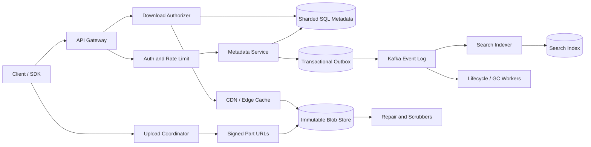

## 1. Problem

Ta xây dựng một object store đa tenant cho người dùng sản phẩm, service nội bộ và hệ thống tự động hóa. Client phải có thể upload video 4 GB qua kết nối di động không ổn định, tiếp tục upload sau khi process khởi động lại, lấy một version cũ và tạo link hết hạn vào ngày mai. Một service phải có thể tìm object theo metadata do tenant sở hữu mà không quét các byte blob.

Yêu cầu chức năng:

- Multipart upload và download, gồm range có thể tiếp tục và các part song song.
- Object version bất biến. Một key logic như `reports/2026.pdf` có thể trỏ tới version mới trong khi version cũ vẫn được truy cập.
- Deduplication nội bộ tenant, không cho phép một tenant suy ra dữ liệu của tenant khác.
- Read có xác thực và share link sống ngắn với TTL, tùy chọn giới hạn số lần tải.
- Tìm kiếm trên metadata được chỉ mục rõ ràng: tenant, key prefix, content type, tag, size và thời điểm tạo.
- Delete, restore, lifecycle expiration và audit event.


Hợp đồng phi chức năng quan trọng hơn một API upload đẹp:

- Ít nhất 99.999999999% durability hằng năm cho các byte đã commit. Đây là mục tiêu durability, không phải cam kết mọi request luôn available trong thảm họa vùng.
- Availability hàng tháng 99.99% cho metadata API và 99.9% cho data transfer, với degraded mode được công bố.
- Object từ kilobyte tới 5 TB. Data plane không được mang payload qua metadata plane.
- Capacity tăng theo chiều ngang, CDN edge caching cho read public hoặc shared, xác minh checksum ở mọi biên lưu trữ và tenant isolation.
- Retry thành công không được tạo logical version thứ hai hoặc tính phí client hai lần.

Ranh giới cốt lõi là hai plane: transactional metadata/control plane và immutable blob/data plane. Plane đầu quyết định object có ý nghĩa gì; plane sau lưu byte hiệu quả.

## 2. Scale Estimation

Các giả định được ghi rõ để có thể thay bằng telemetry sản phẩm:

| Đại lượng | Giả định | Lý do |
|---|---:|---|
| Daily active users | 10 triệu | Sản phẩm consumer/work collaboration quy mô lớn |
| Object API operation trên mỗi active user/ngày | 20 | 8 read, 2 write, 10 thao tác metadata/list/link |
| Logical object mới/ngày | 5 triệu | Không phải API operation nào cũng tạo object |
| Kích thước object mới trung bình | 20 MB | Hỗn hợp document, ảnh và media ngắn; file lớn là thiểu số |
| Tỷ lệ byte read:write | 5:1 | Asset shared được download nhiều lần |
| Hệ số peak | 10x trung bình | Tập trung trong giờ làm việc và các sự kiện ra mắt |
| Retention | 3 năm | Chính sách versioning và recovery |
| Kích thước multipart part | 64 MiB | Retry đủ nhỏ mà không tạo quá nhiều manifest row |

Tính request:

```text
10,000,000 DAU x 20 operations/day = 200,000,000 operations/day
200,000,000 / 86,400 = 2,315 average API requests/second
2,315 x 10 = 23,150 peak API requests/second
```

Write tạo `5,000,000 x 20 MB = 100 TB/day` payload logic. Với retention 3 năm:

```text
100 TB/day x 365 x 3 = 109,500 TB = 109.5 PB logical bytes
```

Nếu tenant-local dedup loại bỏ 25% content lặp, primary byte vật lý là 82.1 PB. Ba bản lưu độc lập hoặc mức tương đương bằng erasure coding với overhead trung bình 1.5x tạo khoảng 123.1 PB trong primary region. Region thứ hai với chính sách durability tương tự làm capacity cần thiết tăng gấp đôi, khoảng 246 PB. Metadata nhỏ hơn nhưng không thể bỏ qua: 5 triệu object version/ngày x footprint row trung bình 1.2 KB là 6 GB/ngày trước index, hoặc khoảng 6.6 TB trong 3 năm sau overhead row/index 1.2x. Multipart manifest và part record thêm khoảng 10%.

Tỷ lệ byte read 5:1 nghĩa là khoảng `500 TB/day` egress từ origin trước CDN. Đó là:

```text
500 TB x 8 / 86,400 = 46.3 Gbit/s average origin egress
46.3 x 10 = 463 Gbit/s peak origin egress
```

CDN hit rate 70% giảm origin transfer peak còn khoảng 139 Gbit/s, nhưng edge vẫn phải phục vụ đủ 463 Gbit/s. Vì vậy mục tiêu capacity gồm cả bandwidth quy mô CDN và bảo vệ origin, không chỉ application RPS. Ở availability 99.99% hàng tháng, error budget khoảng 4.32 phút/tháng; durability được đo độc lập qua telemetry repair, checksum và loss budget.

## 3. API Design

Mọi endpoint dùng HTTPS và yêu cầu bearer token theo tenant, ngoại trừ share URL. `Idempotency-Key` bắt buộc với mutation. Server bind key với tenant, endpoint, request hash và result trong 24 giờ; dùng lại key với request khác trả `409`.

### Tạo upload

```http
POST /v1/tenants/{tenant_id}/uploads
Authorization: Bearer <token>
Idempotency-Key: 01J...
Content-Type: application/json

{
  "key": "videos/demo.mp4",
  "size": 4294967296,
  "content_type": "video/mp4",
  "content_sha256": "optional-final-sha256",
  "metadata": {"project": "demo", "classification": "internal"},
  "dedup_scope": "tenant"
}
```

```json
{
  "upload_id": "upl_7f3",
  "object_id": "obj_91a",
  "version_id": "ver_2b1",
  "part_size": 67108864,
  "expires_at": "2026-08-16T10:00:00Z"
}
```

Control plane reserve một version nhưng chưa làm nó visible. Client upload từng part trực tiếp tới signed data-plane URL:

```http
PUT /v1/uploads/upl_7f3/parts/42
Content-Length: 67108864
Content-Digest: sha-256=:...:
```

Response gồm checksum server quan sát và `ETag` opaque. `PUT /v1/uploads/{upload_id}/parts/{part_number}` có thể retry an toàn vì part number là duy nhất trong upload; checksum khác nhau trả `409`.

### Hoàn tất hoặc hủy

```http
POST /v1/uploads/upl_7f3/complete
Idempotency-Key: 01J...

{"parts":[{"number":1,"sha256":"..."},{"number":2,"sha256":"..."}]}
```

Service xác minh part membership, checksum, kích thước khai báo và digest cuối, sau đó atomically chuyển version từ `UPLOADING` sang `COMMITTED`. Completion lặp lại trả kết quả version ban đầu. `DELETE /v1/uploads/{upload_id}` hủy upload; sweeper cũng expire upload bị bỏ quên.

### Đọc và list

```http
GET /v1/tenants/{tenant_id}/objects/{key}?version_id=ver_2b1
Range: bytes=0-67108863
```

API trả redirect tới signed data URL hỗ trợ range hoặc stream qua gateway để enforcement policy. `GET /v1/tenants/{tenant_id}/objects?prefix=videos/&limit=100&cursor=...` list các version đã commit. Listing dùng cursor và có giới hạn; không hứa hẹn một directory không giới hạn.

```http
POST /v1/tenants/{tenant_id}/shares
Idempotency-Key: 01J...

{"version_id":"ver_2b1","ttl_seconds":86400,"max_downloads":3}
```

Response có token ngẫu nhiên, không thể enumerate. `GET /s/{token}` kiểm tra revocation, expiry và download count trước khi cấp CDN URL sống ngắn. Share token không phải object key và được lưu dưới dạng hash.

### Tìm kiếm metadata và lifecycle

```http
POST /v1/tenants/{tenant_id}/search

{"filters":{"content_type":"video/mp4","tags":{"project":"demo"},"size_gte":1000000},"sort":"created_at_desc","limit":50,"cursor":"..."}
```

Search eventual consistent và chỉ bao phủ field được khai báo. `POST /v1/tenants/{tenant_id}/lifecycle-rules` định nghĩa chuyển sang cold storage và deletion theo tuổi hoặc tag. Authorization kiểm tra tenant, role, object policy và legal hold trước khi mint data-plane URL.

## 4. Data Model

Source of truth là sharded SQL metadata store. Blob byte nằm trong immutable segment được địa chỉ hóa bằng hash; SQL lưu reference, không lưu byte.

```sql
CREATE TABLE object_versions (
  tenant_id       BIGINT NOT NULL,
  object_id       UUID NOT NULL,
  version_id      UUID NOT NULL,
  object_key      TEXT NOT NULL,
  state           TEXT NOT NULL CHECK (state IN ('UPLOADING','COMMITTED','DELETING','DELETED')),
  size_bytes      BIGINT NOT NULL CHECK (size_bytes >= 0),
  content_sha256  BYTEA NOT NULL,
  content_type    TEXT NOT NULL,
  metadata        JSONB NOT NULL DEFAULT '{}',
  created_at      TIMESTAMPTZ NOT NULL,
  committed_at    TIMESTAMPTZ,
  legal_hold      BOOLEAN NOT NULL DEFAULT FALSE,
  PRIMARY KEY (tenant_id, object_id, version_id)
);

CREATE UNIQUE INDEX current_key ON object_versions (tenant_id, object_key)
  WHERE state = 'COMMITTED';
CREATE INDEX versions_by_key ON object_versions (tenant_id, object_key, created_at DESC);
CREATE INDEX versions_by_sha ON object_versions (tenant_id, content_sha256);
```

Partial unique index bảo đảm chỉ có một current committed version cho mỗi logical key; historical version vẫn nằm trong index thứ hai. Prefix tenant có trong mọi index để ngăn cross-tenant scan và hỗ trợ authorization cấp tenant.

```sql
CREATE TABLE blob_chunks (
  tenant_id       BIGINT NOT NULL,
  chunk_sha256    BYTEA NOT NULL,
  size_bytes      INT NOT NULL,
  storage_class   TEXT NOT NULL,
  replica_state   TEXT NOT NULL,
  ref_count       BIGINT NOT NULL DEFAULT 0,
  PRIMARY KEY (tenant_id, chunk_sha256)
);

CREATE TABLE version_chunks (
  tenant_id       BIGINT NOT NULL,
  version_id      UUID NOT NULL,
  part_number     INT NOT NULL,
  chunk_sha256    BYTEA NOT NULL,
  offset_bytes    BIGINT NOT NULL,
  size_bytes      INT NOT NULL,
  PRIMARY KEY (tenant_id, version_id, part_number)
);

CREATE TABLE upload_parts (
  tenant_id       BIGINT NOT NULL,
  upload_id       UUID NOT NULL,
  part_number     INT NOT NULL,
  chunk_sha256    BYTEA NOT NULL,
  size_bytes      INT NOT NULL,
  state           TEXT NOT NULL,
  PRIMARY KEY (tenant_id, upload_id, part_number)
);
```

`blob_chunks` cố ý scoped theo tenant: global dedup có thể làm lộ sự tồn tại qua timing hoặc lỗi authorization. Content hash là địa chỉ và integrity check, không phải authorization grant. `version_chunks` dựng object theo thứ tự và cho garbage collector tìm chunk không còn reference. `upload_parts` khiến tiến độ resumable có idempotent key.

Entity khác gồm `share_links(share_hash PK, tenant_id, version_id, expires_at, max_downloads, used_count, revoked_at)`, `idempotency_records(tenant_id, key, request_hash, status, response, expires_at)` và outbox table có key `(tenant_id, event_id)`. Shard key là `tenant_id` để isolation và truy vấn tenant dự đoán được; tenant cực lớn được subpartition bởi `hash(object_id)`. Search có projection index riêng theo tenant và time, nhận dữ liệu từ outbox.

## 5. High-Level Architecture



Gateway xác thực request, chuẩn hóa key, áp quota và phát request ID. Nó không proxy payload nhiều gigabyte thông thường vì sẽ tiêu tốn connection và memory của application. Metadata service sở hữu version state, idempotency, quyết định authorization và cấp signed URL. Sharded SQL cung cấp transaction cho các record nhỏ này.

Upload coordinator tính part URL và ghi completion. Immutable blob store tối ưu cho sequential read lớn, capacity độc lập và replication hoặc erasure coding. Content-addressed chunk cho phép deduplication và làm checksum của scrubber chính xác. CDN hấp thụ read lặp lại gần user, còn download authorizer bảo đảm cache key không vượt qua tenant hoặc share policy.

Kafka là durable change stream, không phải commit path của upload thành công. Outbox khiến SQL state transition và event publication có thể phục hồi. Search, lifecycle, notification và garbage collection consume độc lập. Repair worker liên tục so checksum lưu trữ với manifest và dựng lại replica thiếu.

## 6. Deep Dive

### Multipart transfer và commit

Client yêu cầu part size theo object size rồi upload trực tiếp tới ingress khỏe gần nhất. Mỗi part mang checksum; ingress xác minh trước khi acknowledge staging bền vững. Completion request liệt kê mọi part. Coordinator từ chối gap, trùng part number, length sai hoặc final digest sai. Chỉ sau khi mọi chunk đạt replication policy SQL mới mark version `COMMITTED`. Client có thể thấy upload pending trong khi repair bắt kịp; không được thấy object đã commit một phần.

Commit transaction insert `version_chunks`, tăng reference chunk, đổi state version, cập nhật current-key pointer và ghi outbox event. Nếu transaction fail, không có version public. Nếu thành công nhưng HTTP response mất, cùng idempotency key hoặc truy vấn `GET upload` trả kết quả committed thay vì tạo version khác.

### Deduplication không bỏ qua correctness

Write path hash chunk và lookup `(tenant_id, chunk_sha256)`. Hit có thể tránh lưu byte, nhưng ref count và version reference phải đổi transactionally hoặc được reconciliation job sửa. Store dùng trạng thái chunk sống ngắn `PENDING` để hai writer đua cùng hash không publish pointer trước khi byte được verify. Hash collision với SHA-256 cực kỳ khó xảy ra nhưng vẫn xử lý bằng cách so size và sampled/full bytes khi policy yêu cầu.

Deduplication không phải lý do bỏ qua encryption boundary. Per-tenant encryption key và tenant-scoped hash giữ isolation. Nếu sau này cần cross-tenant deduplication, đó phải là một side-channel và confidentiality review rõ ràng.

### Scaling và hot key

API server stateless và scale phía sau layer-7 load balancer. Byte upload/download bypass chúng. Metadata shard theo tenant; tenant có prefix nóng được tách bằng object ID cho point operation, còn prefix listing dùng time-bucketed index và continuation token. Một object phổ biến được CDN và origin request coalescing phục vụ; nếu không, một hash hoặc key có thể làm quá tải metadata row hoặc storage gateway.

SQL dùng primary cho transaction và read replica cho list/search-adjacent read. Read theo sau write mang minimum commit sequence; router gửi tới replica đã bắt kịp sequence đó hoặc primary. Rebalance chuyển whole tenant partition bằng dual-write hoặc change-capture, rồi checksum comparison trước cutover.

### Queue, backpressure và ordering

Outbox publisher dùng batch có giới hạn và retry với exponential backoff cộng jitter. Kafka partition dùng hash ổn định của `tenant_id` và event type; event của một version có thứ tự, nhưng cố ý không hứa global ordering. Consumer chỉ checkpoint sau khi side effect bền vững. Consumer kẹt được phát hiện bằng lag age, không chỉ message count. Sau số retry giới hạn, poison event vào DLQ cùng payload gốc, lỗi, schema version và correlation ID. Replay là thao tác explicit, có audit.

Worker dùng token bucket cho storage read và bounded work queue. Khi repair tụt lại, lifecycle deletion nhường repair; admission API trả `429` cho bulk job mới. Cách này tốt hơn việc để background work làm starvation foreground read. Retry bị giới hạn bởi deadline; retry storage request timeout có thể chạy đồng thời khi request đầu đã thành công, nên operation được định danh bằng part hoặc repair task ID.

### Cache, link và rate limit

CDN cache immutable version URL bằng cache key chứa `version_id` và checksum. Mutable logical key được authorizer resolve trước và nên có cache lifetime ngắn. Share link được authorize lúc cấp và lúc redeem; revocation check chỉ cache vài giây. Edge không cache response chứa private authorization decision không có giới hạn.

Rate limit có nhiều tầng: theo IP cho anonymous redemption, user và tenant cho API request, tenant cho byte và concurrent multipart upload. Limit được enforce tại gateway và storage ingress vì client có thể bypass một tầng. Distributed token bucket trong Redis phù hợp admission gần đúng, throughput cao; quota accounting ảnh hưởng billing dùng SQL ledger record.

Connection pool có giới hạn mỗi instance. Với 100 API instance và pool 40 connection, 4.000 connection lý thuyết phải thấp hơn connection và query budget của mỗi DB shard. Pool timeout được báo như overload thay vì tạo socket vô hạn. Load balancing dùng least outstanding request cho metadata và locality-aware routing cho data ingress.

### Lock, transaction và garbage collection

Current-key update được bảo vệ bằng database constraint và transaction, không phải distributed lock dài hạn. Lease ngắn có thể serialize lifecycle transition của một object, nhưng cần lease expiry và fencing token. Không giữ lock trong lúc transfer byte. Outbox là transaction boundary cho downstream effect.

Deletion trước hết mark version `DELETING`, loại nó khỏi current-key view và phát tombstone. Grace period cho phép restore và delayed reader hoàn tất. Garbage collection scan `version_chunks`, trừ reference idempotently và chỉ delete chunk sau mark-and-sweep pass thứ hai. Legal hold và retention policy override deletion thông thường.

### Disaster recovery

Primary region lưu dữ liệu trên các failure domain độc lập và liên tục scrub checksum. Metadata synchronous replicate trong region và asynchronous replicate sang region thứ hai bằng ordered log. Mục tiêu là RPO dưới 15 phút cho metadata và object byte đã commit, RTO dưới 60 phút khi region lỗi. Trong failover, control plane có thể read-only cho tới khi replica log position được fence; phục vụ pointer cũ tệ hơn trả `503` cho private object.

## 7. Consistency Model

Hệ thống cố ý dùng consistency hỗn hợp:

| Operation | Guarantee | Behavior |
|---|---|---|
| Complete upload | Strong trong region | Version committed visible atomically cùng manifest và checksum. |
| Read theo exact `version_id` | Read-after-write | Router chờ replica sequence hoặc dùng primary. |
| Read theo mutable key | Strong trên primary, bounded stale trên replica | Client có thể yêu cầu `consistency=strong`; read thường có thể lag ngắn. |
| List và metadata search | Eventual | Outbox/index lag được expose bằng metric và response metadata. |
| Share revocation | Bounded eventual tại CDN, strong tại authorizer | Revocation lan truyền trong cache TTL; tenant nhạy cảm có thể bypass edge cache. |
| Delete | Tombstone-first | Object CDN cũ expire hoặc purge; legal hold có thể từ chối delete. |

Nếu completion thành công nhưng response mất, idempotency record và upload lookup trả cùng `version_id`. Nếu `PUT` một part timeout, retry cùng part number và checksum là an toàn. Nếu checksum khác, server từ chối overwrite, buộc upload mới hoặc thay part explicit trước completion. Dedup hit không có nghĩa “caller được read hash này”; authorization vẫn resolve qua version reference của tenant.

Replication lag được trả trong `X-Metadata-Commit-Sequence` và `X-Read-Sequence`. Client cần read-after-write gửi commit sequence. Service chờ tới deadline hoặc trả `503 consistency_timeout`, tránh stale read im lặng.

## 8. Failure Scenarios

| Failure | Impact | Detection | Recovery |
|---|---|---|---|
| SQL shard primary unavailable | Metadata write fail hoặc read-only; byte đã ở blob store vẫn nguyên vẹn | Primary health check, transaction error rate, pool timeout, replica apply position | Promote replica có fence, replay outbox, retry request idempotent; trả `503` thay vì expose commit không chắc chắn |
| Kafka consumer kẹt ở poison schema/event | Search hoặc GC ngừng tiến triển ở partition bị ảnh hưởng | Lag age, checkpoint không tiến, DLQ rate | Pause partition, đưa event vào DLQ sau retry giới hạn, sửa consumer, replay từ offset đã ghi |
| CDN hoặc Redis cache fail | Origin egress và share redemption latency tăng; không mất data | CDN hit ratio, origin bandwidth, Redis timeout và fallback rate | Bypass cache với origin rate limit chặt; dùng authorizer/SQL cho correctness; khôi phục cache từ từ |
| Storage ingress mất một region | Upload trong region fail và read có thể chậm | Regional error-budget burn, health probe, checksum/replication alert | Route traffic mới sang region khác, hoàn tất từ manifest đã replicate, fence writer cũ, reconcile sau recovery |
| Blob replica âm thầm corrupt segment | Một phần read có thể fail checksum | Scrubber mismatch, client checksum failure, replica divergence | Cách ly replica, reconstruct từ replica/erasure fragment khác, alert nếu vượt repair budget |
| Client retry sau khi mất response | Có thể tạo duplicate version hoặc charge duplicate nếu thiếu idempotency | Thấy request hash/key lặp | Trả idempotency result đã lưu; từ chối key dùng với request hash khác |
| Repair queue làm storage quá tải | Foreground read/write latency tăng mạnh | Queue depth, oldest task age, storage IOPS saturation | Backpressure bằng token bucket, ưu tiên data under-replicated, tạm dừng cold lifecycle job |
| Tenant nóng hoặc object phổ biến | Một shard, key hoặc origin path bão hòa | RPS/byte theo tenant, shard p99, CDN miss concentration | Tách tenant subpartition, coalesce origin request, tăng edge TTL cho immutable version |

## 9. Observability

Mỗi request nhận `trace_id`, `request_id` được tạo hoặc xác thực và correlation ID an toàn cho tenant. Log có operation, tenant hash, object/version ID, idempotency key hash, outcome, byte, checksum result, retry count và policy decision; không chứa bearer token hay raw share token. Trace bao phủ gateway, metadata SQL, outbox publish, URL signing, blob ingress và CDN origin fetch.

SLI và alert:

| Signal | Ý nghĩa SLI / alert |
|---|---|
| API availability và error rate | Alert khi 5-minute burn của metadata SLO 99.99%; tách policy error `4xx` khỏi `5xx`. |
| p50/p95/p99 metadata latency | p99 tăng cùng pool wait chỉ saturation DB; p99 chỉ một shard thường là hot partition. |
| Upload completion latency | p99 cao nhưng SQL latency bình thường chỉ ra blob replication hoặc checksum verification. |
| CDN hit ratio và origin egress | Hit ratio giảm báo trước bandwidth cost và origin overload trước khi request fail. |
| Kafka lag age và checkpoint rate | Age chỉ search/GC stale; checkpoint phẳng chỉ consumer stuck. |
| Queue depth và oldest task age | Cho thấy repair/lifecycle backpressure và queue có drain trong SLA không. |
| DB connection, pool wait, CPU, IOPS, replica lag | Phân biệt connection exhaustion, compute saturation, storage saturation và stale read. |
| Under-replicated byte và scrub mismatch rate | Durability health trực tiếp; page trước khi tiêu loss budget. |
| 429 rate và concurrent upload | Chỉ quota pressure hoặc admission control chủ động, không nhất thiết server fault. |

Dashboard phải phân tách latency và error theo tenant tier, region, storage class, endpoint và status. Synthetic probe thực hiện multipart upload nhỏ, range read có checksum, search và share redemption tại mỗi region. SLO bao gồm repair time và search freshness, không chỉ HTTP success.

## 10. Capacity Planning

Đây là allocation production ban đầu với headroom 30% trên các phép tính peak 10x:

| Component | Calculation | Initial capacity |
|---|---|---:|
| Metadata API | 23,150 peak RPS / 300 RPS mỗi instance / 0.70 utilization mục tiêu | 111 instance; deploy 120 |
| Metadata SQL shard | 23,150 x 20% metadata write/read / 2,000 op/s bền vững / 0.70 | 4 primary shard cộng 2 standby capacity; bắt đầu 8 shard để tenant isolation |
| Redis admission cache | 10 triệu token bucket active x 200 B cộng replica | Khoảng 4 GB logical; deploy 12 GB usable mỗi region |
| Kafka | 5 triệu version/ngày = 58 event/s trung bình; 10x cộng retry và lifecycle event | 96 partition, 3 replica, 12 broker với 10 TB usable mỗi broker |
| Search consumer | 580 peak event/s / 50 event/s mỗi consumer / 0.70 | 17 consumer; deploy 20 |
| DB connection | 120 instance x 40 max = 4,800 lý thuyết | Giới hạn 4,000 tổng; route 500 connection/shard qua primary/read replica và dùng pool timeout |
| Primary blob capacity | 109.5 PB logical x 0.75 dedup x 1.5 redundancy | 123.2 PB, cộng 20% free-space reserve = 148 PB |
| Two-region blob capacity | 148 PB x 2 | 296 PB provisioned |
| Origin bandwidth | 463 Gbit/s peak x 30% miss rate x 1.3 headroom | 181 Gbit/s provisioned mỗi region, có burst contract |

Con số metadata API giả định một instance chịu được 300 mixed request/s ở p99 target đã chọn. Load test phải xác nhận bằng authorization, SQL và signing thật. Storage mua theo failure-domain unit, không phải một pool: reserve 20% cần cho rebuild, tăng trưởng tenant không đều và compaction. Nếu object trung bình nhỏ đi, object count và metadata/index cost tăng dù byte capacity không đổi.

Part 64 MiB nghĩa là upload 4 GB có 64 part. Với 10.000 upload 4 GB đồng thời, coordinator theo dõi 640.000 part row, một working set nóng chấp nhận được, trong khi data plane nhận khoảng 5.1 Gbit/s ingress nếu trải trong 10 phút. Concurrent-upload quota theo tenant ngăn một customer chiếm hết memory của coordinator.

## 11. Bottlenecks and Evolution

Bottleneck đầu tiên thường là origin bandwidth và fan-out của hot object, không phải Kafka. CDN adoption, immutable cache key và origin coalescing là đòn bẩy redesign đầu tiên. Tiếp theo là metadata concentration: vài tenant enterprise có thể làm quá tải một shard dù fleet average bình thường. Tenant subpartitioning và online movement xử lý trước khi thêm công nghệ database mới.

Ở 10x, 100 triệu DAU dẫn tới 231.500 peak API RPS, 1 PB/ngày logical write và khoảng 4.6 Tb/s peak origin-equivalent read trước caching. Hệ thống cần regional metadata cell, globally routed control plane, Kafka fleet lớn hơn và storage namespace tách theo tenant cohort. Search phải scale độc lập và được phép stale theo freshness SLO rõ ràng.

Ở 100x, một global SQL namespace là abstraction sai. Dùng cell theo geography hoặc tenant cohort, global directory map tenant tới home cell và asynchronous replication fabric cho disaster recovery. Object vẫn immutable và portable; metadata migration copy manifest rồi verify checksum trước khi đổi directory ownership. Active-active write cần version ID conflict-free và conflict policy cho cùng logical key, vì vậy active-passive an toàn hơn cho tới khi product semantics biện minh cho độ phức tạp.

Target dài hạn là cell-based metadata plane, multi-CDN edge delivery, erasure-coded cold tier, quota ledger riêng và searchable event projection. Invariant không đổi: chỉ manifest được commit transactionally mới khiến immutable byte visible.

## 12. Trade-offs

| Decision | Option A | Option B | Decision | Why |
|---|---|---|---|---|
| Metadata database | SQL | NoSQL | SQL trước | Version visibility, idempotency, uniqueness và outbox cần transaction; shard SQL theo tenant. |
| Event transport | Kafka | RabbitMQ | Kafka | Ordered partition có replay phù hợp search, GC và audit fan-out; RabbitMQ hợp hơn work queue nhỏ có routing từng message. |
| Hot cache | Redis | Database cache | Redis | Distributed rate limit và share state ngắn hạn cần latency thấp; SQL vẫn là correctness source. |
| Completion path | Synchronous | Asynchronous | Synchronous metadata commit, async projection | Caller cần kết quả committed/not-committed rõ; search và lifecycle có thể lag. |
| Regional topology | Active-active | Active-passive | Active-passive ban đầu | Fencing và conflict cùng key khiến active-active đắt; RPO/RTO failover được định nghĩa rõ. |
| Sharding | Range | Hash | Hash tenant key cộng time/index bucket | Hash tránh tenant range nóng; range/time bucket làm listing có giới hạn và retention scan hiệu quả. |
| Change delivery | Polling | Push | Outbox tới Kafka push | Giảm search freshness và database polling load; consumer vẫn replay được từ durable offset. |
| Service protocol | REST | gRPC | REST bên ngoài, gRPC nội bộ | Browser và SDK compatibility quan trọng ở edge; internal call typed giảm serialization overhead. |

Các lựa chọn không mang tính phổ quát. Với deployment nhỏ, SQL cộng object-storage product và managed CDN có thể an toàn hơn việc vận hành mọi worker. Chỉ nên custom phần cần kiểm soát do tenant semantic, deduplication hoặc lifecycle policy.

## 13. Production Checklist

- [ ] Mọi mutation có tenant authorization, request hashing và idempotency test.
- [ ] Multipart part xác minh size và checksum trước acknowledgment.
- [ ] Completion không expose partial manifest và an toàn sau response loss.
- [ ] Current-key uniqueness, version retention, legal hold và delete tombstone có transaction test.
- [ ] Blob replica trải trên failure domain độc lập; scrub và repair drill đã pass.
- [ ] CDN cache key không thể bypass share expiry, revocation hoặc tenant policy.
- [ ] Gateway và storage-ingress rate limit bảo vệ cả request budget và byte budget.
- [ ] Outbox, Kafka offset, DLQ replay và schema compatibility đã test.
- [ ] Backpressure pause lifecycle priority thấp trước khi foreground SLO burn.
- [ ] Dashboard có p99, pool wait, replica lag, queue age, CDN hit rate và under-replicated byte.
- [ ] Regional failover, stale-read fencing, restore và checksum reconciliation đã được diễn tập.
- [ ] Capacity test gồm hot tenant, một object phổ biến, upload 5 TB và traffic peak 10x.

## 14. Engineering References

1. **Google, _Google SRE Book: Table of Contents_**  
   URL: https://sre.google/sre-book/table-of-contents/  
   Bài học engineering chính: Availability target chỉ có ý nghĩa khi đi cùng SLI đo được, error budget và phản ứng vận hành.  
   Ảnh hưởng tới thiết kế: Bài viết tách availability khỏi durability, định nghĩa metadata error budget 4.32 phút/tháng và alert theo budget burn cùng repair health.

2. **Google Research, _Publications_**  
   URL: https://research.google/pubs/  
   Bài học engineering chính: Nghiên cứu hệ thống quy mô lớn xem replication, partitioning và failure là các chiều thiết kế cốt lõi.  
   Ảnh hưởng tới thiết kế: Tách metadata/data plane, bounded consistency và RPO/RTO theo region được thiết kế như thuộc tính scale và failure, không phải chi tiết thêm sau.

3. **Cloudflare, _Cloudflare Blog_**  
   URL: https://blog.cloudflare.com/  
   Bài học engineering chính: Edge caching và locality giảm origin work, nhưng cache key và invalidation là một phần của correctness.  
   Ảnh hưởng tới thiết kế: Immutable version URL có thể cache, mutable key có lifetime ngắn, và share authorization được kiểm tra trước khi cấp edge URL.

4. **AWS, _AWS Architecture Blog_**  
   URL: https://aws.amazon.com/blogs/architecture/  
   Bài học engineering chính: Object system bền vững cần failure domain độc lập, integrity validation, lifecycle tier và operational automation.  
   Ảnh hưởng tới thiết kế: Direct multipart transfer, checksum scrub, redundancy reserve, lifecycle worker và repair-before-delete là phần explicit của architecture.
