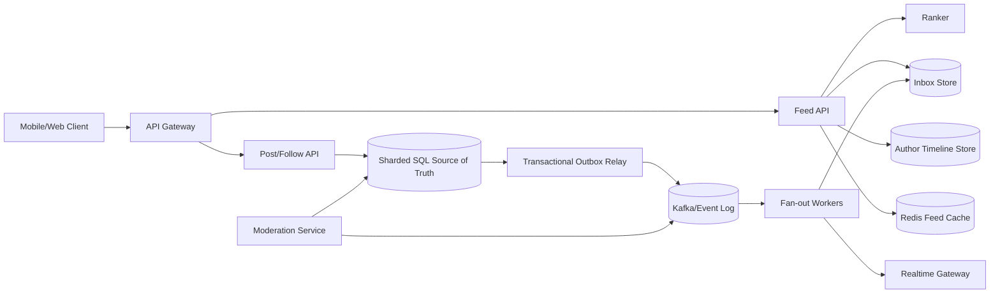

## 1. Problem

Ta xây dựng bảng tin chính cho một sản phẩm mạng xã hội. Người dùng theo dõi các tác giả, mở màn hình chính và mong đợi một luồng bài đăng đã được xếp hạng từ những tác giả đó. Một bài đăng thường phải hiển thị trong vòng 30 giây, trong khi trang đầu tiên phải tải với p95 dưới 300 ms. Người dùng có thể refresh hoặc phân trang mà không thấy bản sao hay mất mục vì thứ hạng thay đổi giữa các request.

Đối tượng sử dụng gồm độc giả, tác giả và các hệ thống xếp hạng/chống lạm dụng nội bộ. Yêu cầu chức năng là:

- tạo, xóa và lấy bài đăng;
- theo dõi và bỏ theo dõi tác giả;
- tổng hợp bài đăng của các tác giả được theo dõi và xếp hạng theo từng độc giả;
- phân trang bằng cursor;
- chèn các bài mới đủ điều kiện vào bảng tin đang mở mà không làm hỏng phân trang;
- ẩn nội dung đã xóa, bị chặn hoặc bị gỡ theo chính sách.

Workload thiên về đọc, khoảng 1.000 lần đọc bảng tin cho mỗi lần ghi bài. Độ trễ đọc và độ mới đều quan trọng, nhưng chấp nhận trễ vài giây. Thứ hạng được cá nhân hóa và có thể thay đổi khi feature đến. Vì vậy ta không hứa một thứ tự toàn cục giống hệt nhau. Ta hứa ranh giới trang ổn định, không cố ý trùng lặp và khả năng hiển thị đơn điệu của nội dung đã commit trong snapshot mà độc giả đã chọn.

Quyết định cốt lõi là nơi thực hiện việc tổng hợp. Fan-out-on-write sao chép bài vào inbox của từng follower, khiến đọc rẻ nhưng celebrity có thể tạo hàng triệu lần ghi. Fan-out-on-read tránh khuếch đại ghi nhưng độc giả theo dõi nhiều tác giả sẽ phải merge trong mỗi request. Thiết kế dưới đây dùng cả hai đường đi.

## 2. Scale Estimation

Các giả định được nêu rõ để có thể tính lại capacity thay vì coi đây là dự báo:

| Đại lượng | Giả định | Phép tính / kết quả |
|---|---:|---:|
| Người dùng hoạt động hằng ngày | 50 triệu | Mục tiêu sản phẩm |
| Số request bảng tin mỗi người/ngày | 20 | 50M x 20 = 1 tỷ request/ngày |
| RPS trung bình | 1B / 86.400 | 11.574 RPS |
| Hệ số đỉnh | 10x trung bình | 115.740 RPS; provision cho 150k RPS |
| Bài đăng mới/ngày | 1 triệu | Một bài mỗi 50 DAU mỗi ngày là baseline thận trọng cho ghi trong feed thiên về đọc |
| RPS ghi bài | 1M / 86.400 | Trung bình 11,6, khoảng 116 đỉnh |
| Tỷ lệ đọc:ghi | 1B / 1M | 1.000 lần đọc bảng tin cho mỗi bài, khớp yêu cầu thiên về đọc |
| Bản ghi bài | 2 KiB | 1M x 2 KiB x 365 = 0,73 TB/năm trước replica và index |
| Bản ghi cạnh bảng tin | 32 byte | Fan-out thông thường ước tính 5 follower/bài, nên 5M cạnh/ngày x 32 byte x 30 ngày = 4,8 GB dữ liệu inbox nóng logic |
| Response bảng tin | 20 mục x 1,5 KiB | 30 KiB; 115.740 x 30 KiB x 8 = 27,8 Gbit/s egress đỉnh trước nén |
| Mục tiêu availability | 99,95% theo tháng | Khoảng 22 phút không khả dụng/tháng cho đọc bảng tin; ghi có thể suy giảm thành fan-out trễ |

Giả định trung bình 5 follower không phải giả định phổ quát về social graph: đó là tập bài ta chọn fan-out. Các tác giả có degree cao còn lại dùng merge khi đọc. Ở tăng trưởng 10x, bài đăng thành 500M/ngày, traffic bảng tin trung bình thành 115.740 RPS, và ranh giới hybrid phải di chuyển dựa trên fan-out amplification đo được thay vì một ngưỡng follower cố định.

Storage thực tế lớn hơn: ba replica, index, tombstone, metadata kiểm duyệt và con trỏ media có thể khiến ước tính bài đăng 0,73 TB/năm thành khoảng 3 TB/năm. Media thuộc object storage và bị loại khỏi phép tính database bảng tin. Cạnh inbox có TTL ngắn vì chỉ là bộ tăng tốc truy xuất, không phải nguồn sự thật.

## 3. API Design

Mọi endpoint dùng HTTPS và danh tính người dùng đã xác thực từ access token. `X-Request-ID` được chấp nhận hoặc tự sinh rồi truyền qua log và trace. Cursor là opaque, được ký, chứa feed version và biên `(rank_key, post_id)` cuối cùng.

### Đọc bảng tin

```http
GET /v1/feed?limit=20&cursor=eyJ2Ijox...
Authorization: Bearer <token>
X-Request-ID: 7f2c...
```

Response:

```json
{
  "items": [{"post_id":"p91", "author_id":"u7", "text":"...", "created_at":"2026-08-15T02:00:00Z", "rank":0.984}],
  "next_cursor":"eyJ2IjoxLCJsYXN0IjpbMC45ODQsInA5MSJdfQ",
  "feed_version":"v-20260815-020001",
  "generated_at":"2026-08-15T02:00:03Z"
}
```

`limit` bị giới hạn ở 100. Cursor giữ cùng ranking snapshot trong một session có thời hạn, nên bài mới có thể được chèn lên đầu mà không đẩy lệch trang hiện tại. Nếu snapshot hết hạn, service trả cursor mới và cảnh báo `snapshot_expired` thay vì âm thầm lặp dòng.

### Tạo bài đăng

```http
POST /v1/posts
Authorization: Bearer <token>
Idempotency-Key: 01J...
Content-Type: application/json

{"text":"hello", "media_ids":["m1"]}
```

Response là `201 Created` cùng `post_id` bền vững. Idempotency key là duy nhất theo tác giả trong 24 giờ và lưu response ban đầu. Vì vậy timeout sau khi database commit có thể retry mà không tạo bài thứ hai.

### Theo dõi và bỏ theo dõi

```http
PUT    /v1/users/{author_id}/follow
DELETE /v1/users/{author_id}/follow
```

Cả hai thao tác đều idempotent. Ghi follow lưu `following_since`; feed reader dùng nó làm cận dưới để bài cũ không bị backfill bất ngờ. `DELETE` cũng phát event invalidation; các dòng đã materialize được lọc lúc đọc cho đến khi cleanup bất đồng bộ hoàn tất.

### Phát insertion realtime

Client mở `GET /v1/feed/stream` qua kết nối WebSocket hoặc server-sent event. Server chỉ gửi `{event:"new_item", post_id, feed_version}` cho mục vượt qua authorization và kiểm tra eligibility nhẹ. Client prepend mục đó bên ngoài danh sách phân trang và deduplicate theo `post_id`; trang HTTP kế tiếp vẫn dùng cursor.

## 4. Data Model

Nguồn sự thật là SQL được shard vì tạo bài, trạng thái follow, moderation và idempotency cần constraint và transaction. Inbox phi chuẩn hóa là bộ tăng tốc.

```sql
CREATE TABLE posts (
  post_id        BIGINT PRIMARY KEY,
  author_id      BIGINT NOT NULL,
  created_at     TIMESTAMPTZ NOT NULL,
  text           TEXT NOT NULL,
  rank_features  JSONB NOT NULL,
  visibility     SMALLINT NOT NULL DEFAULT 1,
  deleted_at     TIMESTAMPTZ NULL
);
CREATE INDEX posts_author_time ON posts (author_id, created_at DESC, post_id DESC);

CREATE TABLE follows (
  follower_id       BIGINT NOT NULL,
  followed_id       BIGINT NOT NULL,
  following_since   TIMESTAMPTZ NOT NULL,
  PRIMARY KEY (follower_id, followed_id)
);
CREATE INDEX follows_reverse ON follows (followed_id, follower_id);

CREATE TABLE feed_inbox (
  reader_id      BIGINT NOT NULL,
  rank_key       DOUBLE PRECISION NOT NULL,
  post_id        BIGINT NOT NULL,
  author_id      BIGINT NOT NULL,
  inserted_at    TIMESTAMPTZ NOT NULL,
  expires_at     TIMESTAMPTZ NOT NULL,
  PRIMARY KEY (reader_id, rank_key, post_id)
);
CREATE INDEX feed_inbox_expiry ON feed_inbox (expires_at);

CREATE TABLE outbox_events (
  event_id       BIGSERIAL PRIMARY KEY,
  aggregate_id   BIGINT NOT NULL,
  event_type     TEXT NOT NULL,
  payload        JSONB NOT NULL,
  created_at     TIMESTAMPTZ NOT NULL,
  published_at   TIMESTAMPTZ NULL
);
CREATE INDEX outbox_unpublished ON outbox_events (published_at, event_id)
  WHERE published_at IS NULL;
```

`posts_author_time` phục vụ timeline theo tác giả khi đọc. `follows_reverse` tìm các recipient fan-out của một bài. `feed_inbox` được partition theo hash `reader_id`, vì mọi lần đọc home feed đều khóa theo reader và celebrity không được dồn toàn bộ ghi vào một partition. `feed_inbox` dùng khóa `(rank_key, post_id)` để cursor có tổng thứ tự và tính quyết định. Entry inbox hết hạn sau 30 ngày; nội dung cũ hơn có thể lấy từ author timeline khi sản phẩm cho phép.

Outbox nằm trong cùng transaction SQL với mutation bài đăng hoặc follow. Publisher lease các dòng chưa publish và gửi chúng vào event stream bền vững. Điều này tránh khoảng trống dual-write khi bài đã tồn tại nhưng không có event fan-out. Consumer duy trì khóa dedup `(reader_id, post_id, algorithm_version)` hoặc dùng primary key inbox, nhờ đó delivery at-least-once an toàn.

## 5. High-Level Architecture



API Gateway xác thực, rate-limit và cân bằng traffic tới các service stateless. Feed API đọc inbox materialized hoặc đã cache, lấy timeline còn thiếu cho tác giả degree cao, gọi Ranker với tập candidate có giới hạn và lọc visibility. Post/Follow API sở hữu các mutation có transaction.

Sharded SQL là authoritative cho bài đăng, follow và moderation. Outbox relay tồn tại vì database commit và broker publish không phải một thao tác atomic. Kafka/Event Log hấp thụ burst và cho phép replay khi logic ranking hoặc fan-out thay đổi. Fan-out worker sao chép candidate của tác giả thông thường vào inbox reader với concurrency giới hạn. Tác giả degree cao được đánh dấu `on_read` và bỏ qua khuếch đại này.

Inbox Store tối ưu cho đọc theo reader có thứ tự và insert có điều kiện. Redis cache trang đầu trong thời gian ngắn, nhưng correctness không phụ thuộc vào nó. Author Timeline Store làm cho merge khi đọc có giới hạn và tránh scan database bài đăng. Realtime Gateway xử lý kết nối dài hạn tách khỏi capacity request bảng tin. Moderation phát invalidation để nội dung bị gỡ biến mất nhanh dù bản sao inbox còn tồn tại.

## 6. Deep Dive

### Fan-out hybrid và ranking

Sau khi post commit, classifier ước tính `follower_count x expected_read_rate`. Nếu chi phí theo sản phẩm vượt ngân sách, tác giả là `on_read`; nếu không event được fan-out. Điều này tránh quy tắc toàn cục nguy hiểm như “fan-out mọi tác giả dưới N follower”. Một tài khoản 40.000 follower nhưng bursty có thể đắt hơn tài khoản yên ắng 200.000 follower.

Với reader thông thường, Feed API lấy 100 candidate mới nhất từ inbox, thêm tối đa 20 candidate mỗi tác giả on-read (bị giới hạn bởi số tác giả cấu hình được), rồi gửi feature tới Ranker. Nó thực hiện k-way merge theo `(score, post_id)` và trả 20 mục. Một bài không bao giờ được chấp nhận chỉ vì có trong inbox: block list, follow start time, deletion và moderation được kiểm tra với state hiện tại hoặc authorization cache có version.

Ranker trả score cùng `algorithm_version` và feature TTL ngắn. Nếu timeout, service dùng fallback quyết định được như recency cộng author affinity. Availability vẫn được giữ mà không giả vờ ranker stale tương đương model hiện tại.

### Cache và phân trang

Trang đầu được cache theo `(reader_id, feed_version, policy_version)` trong 5 giây. Ta không cache rộng rãi các trang cursor tùy ý: cardinality và chi phí invalidation sẽ lớn hơn lợi ích. Mục đủ điều kiện mới làm tăng feed version của reader và chỉ invalidate key trang đầu. Push event có thể khiến client hiển thị mục ngay, nhưng phân trang vẫn dùng cursor server.

Cursor lưu snapshot/version đã ký và biên tổng thứ tự. Offset pagination bị loại vì insert ở đầu gây skip và duplicate. Cache failure fallback về inbox store; cache stampede được kiểm soát bằng request coalescing và lease nhỏ theo key, không phải distributed lock quanh toàn bộ feed.

### Event, retry và backpressure

Outbox relay publish event có key, dùng `post_id` làm key. Kafka cho buffering bền vững và ordering theo partition, nhưng không khiến operation end-to-end exactly once. Worker chỉ commit consumer offset sau khi inbox write thành công. Duplicate vô hại vì inbox insert idempotent. Lỗi tạm thời dùng exponential backoff có jitter và giới hạn retry; poison event vào DLQ cùng payload gốc, lỗi và lịch sử attempt.

Mỗi worker có fetch batch, semaphore và ngân sách connection database bị giới hạn. Khi inbox latency hoặc write rejection tăng, worker pause partition và để Kafka lag tăng. Autoscaler dùng lag và tuổi event cũ nhất, nhưng hard cap ngăn scale-out làm cạn SQL connection pool. DLQ replay được tách khỏi live consumer group.

### Ordering và realtime

Kafka ordering chỉ có theo partition, nên không dùng nó làm thứ tự global của feed. Rank key được tạo từ event time, model score và tie-breaker post ID quyết định được. Event đến muộn vẫn insert an toàn vì cursor feed là snapshot boundary. Notification realtime có thể tới trước inbox write; client coi đó là item provisional và reconcile ở response kế tiếp.

### Scale database và hot key

SQL primary được shard theo `hash(user_id)` cho các row mutation thuộc user, với read replica cho timeline nơi replica lag chấp nhận được. Feed inbox partition dùng cùng hash reader nhưng tách khỏi transactional primary. Một reader hoạt động mạnh là hot key; rate limit ghi theo reader, batching và side bucket “recent items” ngắn hạn ngăn một inbox chiếm partition. Follower list của celebrity được phân trang và xử lý theo chunk, không bao giờ nạp toàn bộ vào memory một worker.

Connection pool được định cỡ theo ngân sách connection an toàn của database, không theo concurrency tối đa của từng instance. Feed API đặt timeout ở mọi dependency boundary, chỉ hedge read idempotent trên replica khi tail latency đo được biện minh, và bỏ feature rank tùy chọn trước khi dùng hết request time.

### Transaction, idempotency và recovery

Post cộng outbox là một local transaction. Follow cộng outbox cũng là một transaction. Fan-out cố ý bất đồng bộ và eventual consistent. Idempotency record của post request commit cùng post; retry đọc và trả kết quả đã lưu. Inbox insert và processed-event marker của worker được commit cùng nhau nếu store hỗ trợ; nếu không, primary-key conflict là cơ chế dedup.

Vận hành cross-region dùng append-only event log được replicate sang recovery region. Ta giữ write region ổn định cho một user trong vận hành bình thường, vì active-active write khiến thứ tự follow/unfollow và cursor version khó suy luận hơn. Backup, media object store, schema và quy trình replay được test theo RPO 5 phút và RTO 30 phút.

Rate limit áp dụng riêng cho tạo bài, mutation follow, đọc feed và kết nối realtime. Gateway dùng token bucket theo user và IP, còn fan-out nội bộ có budget theo tenant/sản phẩm. Load balancing dùng least-request cho HTTP và connection-aware cho streaming; health check gồm dependency readiness, không chỉ process liveness.

## 7. Consistency Model

Hệ thống cố ý cung cấp nhiều mức consistency:

| Thao tác | Đảm bảo | Hành vi |
|---|---|---|
| Tạo bài | Strong tại write region | `201` nghĩa là post và outbox row đã commit; feed visibility có thể trễ tối đa 30 giây |
| Follow/unfollow | State nguồn sự thật strong | Read kiểm tra follow start/block state, nên unfollow dừng eligibility trước cleanup inbox |
| Fan-out inbox | Eventual, at-least-once | Duplicate bị chặn bởi inbox key; lag đo được |
| Ranking | Eventual theo model/feature | Fallback ranker phục vụ khi model hoặc feature store lỗi |
| Trang feed | Cursor ổn định theo snapshot | Version và boundary của cursor ngăn overlap; item mới xuất hiện phía trên snapshot |
| Recovery cross-region | Bất đồng bộ có giới hạn | RPO 5 phút; sau failover client có thể thấy feed version cũ |
| Insertion realtime | Best effort | Event có thể đi trước materialization; HTTP reconciliation là authoritative |

Nếu post write thành công nhưng response mất, client retry cùng idempotency key. Nếu outbox relay dừng, post vẫn bền vững và repair scanner publish các row chưa publish. Nếu consumer crash sau write nhưng trước commit offset, nó retry và gặp idempotent key. Replication lag được đưa vào response metadata và có thể khiến hệ thống bỏ qua replica hơi cũ cho reader vừa tạo post.

## 8. Failure Scenarios

| Failure | Impact | Detection | Recovery |
|---|---|---|---|
| SQL primary không khả dụng | Tạo post/follow lỗi hoặc vào degraded mode ngắn; feed hiện có vẫn phục vụ từ replica/cache | write error rate, primary health, transaction latency | failover trong region, dừng fan-out write mới, replay outbox sau recovery; trả 503 rõ ràng thay vì dựng post giả |
| Kafka broker hoặc partition không khả dụng | Freshness fan-out suy giảm; source write vẫn hoạt động | producer error, under-replicated partition, oldest-event age | dùng broker replica, pause consumer bị ảnh hưởng, khôi phục partition, replay từ offset đã commit |
| Fan-out consumer mắc ở poison event | Inbox của một partition dừng nhận update | lag theo partition, consumer heartbeat, oldest event age | retry có giới hạn, đưa event vào DLQ, tiến partition, điều tra và replay sau khi sửa |
| Redis cluster failure | Latency trang đầu và tải SQL tăng | cache error ratio, hit rate, DB QPS, p99 latency | bypass cache với request coalescing, bỏ feature ranking tùy chọn, khôi phục Redis mà không biến nó thành dependency correctness |
| Mất region | Request lỗi hoặc phục vụ từ recovery region stale | regional synthetic check và traffic-manager health | route sang recovery region, chấp nhận RPO/RTO đã nêu, dựng lại inbox từ posts/follows và event log |
| Burst follower của celebrity | Fan-out queue và inbox partition quá tải | amplification ratio, queue depth, DB write saturation | chuyển tác giả sang `on_read`, batch và throttle follower, giữ timeline hot-author |
| Ranker timeout hoặc model xấu | Thứ tự chậm hoặc chất lượng thấp | ranker p99, timeout rate, score distribution và quality guardrail | circuit-break sang fallback quyết định được, rollback model, giữ tương thích cursor |
| Moderation event trễ | Nội dung bị gỡ vẫn còn trong inbox materialized | moderation-to-hide latency, policy audit scan | lọc visibility lúc đọc, topic invalidation ưu tiên cao, scrub bản sao inbox bất đồng bộ |

## 9. Observability

Mọi request, event và database operation mang `trace_id`, `request_id`, `user_id` (đã hash trong log), `post_id` nếu có, region, shard và `algorithm_version`. Log có cấu trúc và không chứa post text hay access token. Distributed trace theo HTTP -> Feed API -> cache/inbox/timeline -> ranker, và Post API -> SQL -> outbox -> Kafka -> worker -> inbox.

SLI và alert hữu ích gồm:

| Signal | Cho biết | Alert ví dụ |
|---|---|---|
| Feed latency p50/p95/p99 | performance người dùng thấy và tail saturation | p95 > 300 ms trong 10 phút |
| Feed 5xx/timeout rate | lỗi dependency hoặc quá tải | >0,1% trong 5 phút |
| Freshness age: post commit đến feed eligible | trễ outbox, Kafka hoặc worker | p95 > 30 giây |
| Kafka consumer lag và oldest event age | worker mắc hoặc thiếu capacity | oldest age > 2 phút |
| Inbox write rejection và QPS từng shard | hot partition hoặc DB saturation | shard >80% budget |
| Cache hit rate và Redis p99 | cache outage hoặc keying kém | hit rate <70% trong khi DB QPS tăng |
| SQL connection-pool wait, CPU, lock time, replica lag | pool cạn, tranh chấp hoặc read stale | pool wait >20 ms hoặc lag >5 giây |
| Ranker timeout và tỷ lệ fallback | model/feature dependency lỗi | fallback >5% |
| DLQ depth | poison data hoặc regression code | tăng liên tục 10 phút |
| Số kết nối realtime/send failure | capacity gateway hoặc vấn đề mạng | send failure >1% |

Dashboard phân tách mọi signal theo region, shard, nhóm author degree, client version và cache hit/miss. Alert dùng burn rate theo SLO availability 99,95%, không chỉ CPU tức thời. Synthetic user publish một test post, chờ eligible và phân trang qua nó để đo freshness end-to-end cùng cursor contract.

## 10. Capacity Planning

Mục tiêu 150k peak feed RPS giả định burst 10x cộng headroom. Nếu một Feed API instance an toàn đạt 1.500 RPS ở p95 dưới 250 ms, cần `150,000 / 1,500 = 100` instance và giữ 30% capacity dự phòng: 130 instance. Với 50k realtime connection mỗi gateway instance và 10 triệu connection đồng thời, cần 200 instance cộng 25% dự phòng, tức 250.

Workload insert inbox nóng là 5M insert logic/ngày, hay trung bình 58 insert/s và khoảng 579/s đỉnh. Với 8 inbox partition, mỗi partition đạt 1.000 write/s theo latency mục tiêu, cần 1 partition ở peak; dùng 16 để cho phép rebalance và cô lập hot key. Fan-out worker không được tạo vượt ngân sách 579/s peak của store. Nếu một worker xử lý 500 insert/s với pool 16 connection, 2 worker đủ peak; deploy 4 và autoscale theo oldest-event age.

Với SQL, giả định 1.000 peak transaction/s cho post/follow và 2.000 read/s không phục vụ được từ timeline hoặc replica. Hai primary shard, mỗi shard 800 write transaction/s, cho 1.600/s; dùng bốn shard để cho phép rebalance và traffic follow không đều. Mỗi shard có ngân sách 300 connection, chia cho các service; 130 Feed instance không được mỗi instance mở full pool tới mọi shard. Dùng pooler và pool 2-4 connection/instance/shard, bị ép bởi global budget.

Sizing cache trang đầu Redis: 50M DAU x 20% active trong cửa sổ 5 phút x 20 item cache x 1,5 KiB là khoảng 3 TB value chưa nén, quá đắt cho một tier. Chỉ cache 10% reader nóng và lưu compact post ID cộng object cache 30 giây: `50M x 10% x 20 x 8 bytes` là 8 GB cho ID, metadata lưu riêng. Đây là lý do cache là tối ưu latency, không phải bản sao feed đầy đủ.

Post storage tăng 2 GB/ngày logic ở 2 KiB/post, hay 0,73 TB/năm; ba replica và index cần khoảng 3 TB/năm. Object storage xử lý media. Kafka sizing bắt đầu từ 1M post event cộng follow/moderation event, khoảng 3M event/ngày. Với event 1 KiB và retention 7 ngày, đó là 21 GB logic; replication factor ba và headroom vận hành 2x cần reserve khoảng 130 GB. Tính lại sau khi đo payload thực.

## 11. Bottlenecks and Evolution

Nút thắt đầu tiên thường là fan-out amplification và inbox write saturation, không phải HTTP tier stateless. Ở 10x, hệ thống nên chuyển thêm tác giả sang on-read, dùng candidate ID compact, tách timeline tác giả nóng và thêm candidate service riêng cho ranking. Inbox retention có thể giảm từ 30 xuống 7 ngày, còn trang cũ dùng timeline.

Ở 100x, một Kafka namespace toàn cục, SQL control plane và một ranker feature store trở thành ranh giới vận hành. Partition theo region và tenant, đặt user data gần write region, dùng global directory để routing và chạy feed cell độc lập. Một cell sở hữu gateway, Feed API, inbox partition, event topic và capacity ranker cho một tập user có giới hạn. Tránh fan-out cross-cell nếu follow graph không vượt region; nếu có, route event tới cell của reader.

Thiết kế lại tiếp theo không phải “dùng cache lớn hơn”. Đó là cell-based architecture với candidate log có thể replay, policy filter riêng, ranking theo model version và freshness budget rõ ràng. Correctness của feed vẫn suy ra từ posts/follows, nên rebuild inbox materialized là migration thông thường thay vì canh bạc data recovery.

## 12. Trade-offs

| Quyết định | Option A | Option B | Quyết định | Vì sao |
|---|---|---|---|---|
| Database nguồn | SQL | NoSQL | SQL source + ordered inbox store | constraint, outbox transaction và follow semantics quan trọng; inbox access đơn giản hơn trong key-oriented store |
| Event transport | Kafka | RabbitMQ | Kafka | replay, throughput theo partition và scale theo lag phù hợp fan-out; RabbitMQ hấp dẫn hơn cho task queue nhỏ |
| Cache | Redis | DB cache | Redis cho trang đầu | cô lập hot read và hỗ trợ TTL ngắn; DB vẫn là fallback và authority |
| Thời điểm fan-out | Synchronous | Asynchronous | Asynchronous | latency post không được nhân theo số follower; freshness được đo và giới hạn |
| Chế độ region | Active-active | Active-passive | Active-passive theo user cell | follow ordering và cursor version đơn giản hơn; recovery chấp nhận RPO giới hạn |
| Sharding | Range | Hash | Hash cho inbox, time index cho timeline | locality theo reader mà không tạo celebrity range hotspot; author timeline cần thứ tự thời gian |
| Cập nhật live | Polling | Push | Push cộng HTTP reconciliation | độ trễ notification thấp mà socket không thành source of truth |
| Protocol service | REST | gRPC | REST ở edge, gRPC nội bộ | public dễ debug và tương thích; call nội bộ typed giảm serialization overhead |

## 13. Production Checklist

- Xác minh post/follow cộng outbox commit là atomic và idempotency key được giữ 24 giờ.
- Xác minh cursor được ký, có giới hạn, biết snapshot và dùng tie-breaker quyết định được.
- Xác minh deleted, blocked và pre-follow post vẫn bị lọc dù cleanup inbox trễ.
- Xác minh phân loại author degree, fan-out budget, giới hạn batch và throttle hot key.
- Xác minh consumer retry, thứ tự offset-sau-write, DLQ replay và xử lý poison event.
- Xác minh cache bypass, request coalescing, ranker fallback và timeout dependency.
- Xác minh alert capacity cho SQL shard, pooler, replica lag, Kafka, Redis và gateway.
- Xác minh synthetic test freshness, p95 latency, tỷ lệ 5xx và duplicate/skip của cursor.
- Xác minh diễn tập regional failover, restore backup, rebuild inbox, RPO/RTO và rollback schema.
- Xác minh privacy, authorization, token redaction, abuse limit và moderation invalidation.

## 14. Engineering References

1. **Google SRE Book** — *The Site Reliability Workbook / Table of Contents*. https://sre.google/sre-book/table-of-contents/ — Bài học kỹ thuật chính: availability là SLO với error budget, không phải lời hứa vô hạn. Nó ảnh hưởng đến mục tiêu 99,95%, burn-rate alert và suy giảm freshness có kiểm soát.
2. **Google Research** — *Research publications*. https://research.google/pubs/ — Bài học kỹ thuật chính: ranking và retrieval quy mô lớn nên tách thành candidate generation có giới hạn và scoring. Nó ảnh hưởng đến giới hạn candidate inbox/timeline và ranh giới fallback của ranker.
3. **Meta Engineering** — *Engineering at Meta*. https://engineering.fb.com/ — Bài học kỹ thuật chính: sản phẩm xã hội lưu lượng lớn cần storage chuyên biệt, pipeline bất đồng bộ và xử lý cẩn thận các entity nóng. Nó ảnh hưởng đến đường celebrity hybrid, event có thể replay và partition theo reader.
4. **AWS Architecture Blog** — *AWS Architecture Blog*. https://aws.amazon.com/blogs/architecture/ — Bài học kỹ thuật chính: decoupling, backpressure, retry và cô lập failure làm hệ thống elastic dễ dự đoán. Nó ảnh hưởng đến outbox, worker giới hạn, DLQ và thiết kế cache optional.
