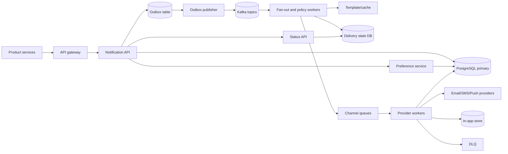

## 1. Problem

Ta xây dựng một nền tảng thông báo được các dịch vụ sản phẩm như billing, chat, bảo mật và marketing sử dụng. Producer gửi một sự kiện; nền tảng render template có phiên bản, đánh giá preference của người nhận, fan-out sang email, SMS, push và in-app, đồng thời lưu audit bền vững.

Hợp đồng là **at-least-once**: một notification đã được chấp nhận không bị mất âm thầm. Đây không phải exactly-once, vì timeout của provider có thể xảy ra sau khi provider đã chấp nhận message. Vì vậy mọi boundary đều mang idempotency key, và provider được gọi bằng delivery ID ổn định khi provider hỗ trợ deduplication.

Yêu cầu chức năng:

- Nhận notification command từ nhiều product service đã xác thực.
- Render template theo locale và channel với các biến được giới hạn, kiểm tra hợp lệ.
- Áp dụng preference người dùng, opt-out theo channel, quiet hours, consent và các policy.
- Fan-out một notification logic thành các channel delivery được retry độc lập.
- Hỗ trợ notification lên lịch, hủy trước khi dispatch và đọc inbox in-app.
- Lưu audit bất biến về acceptance, quyết định policy, attempt, kết quả provider và trạng thái cuối.

Yêu cầu phi chức năng:

- Trả về phản hồi enqueue dưới 1 giây ở p99.
- Cung cấp xử lý at-least-once, producer submission idempotent, retry với exponential backoff và dead-letter queue (DLQ).
- Cô lập provider chậm hoặc lỗi; tạo backpressure thay vì làm cạn worker pool hoặc database pool.
- Mục tiêu availability hằng tháng 99.95% cho acceptance và 99.9% dispatch thành công trong retry window của channel.
- Lưu dữ liệu audit 13 tháng và hỗ trợ xóa nội dung cá nhân theo privacy policy.

Platform xác nhận durable acceptance, không xác nhận provider delivery, trong response đồng bộ. Phân biệt này ngăn provider SMS chậm làm mọi product request chậm theo.

## 2. Scale Estimation

Workload ban đầu là một triệu channel message mỗi ngày. Một logical notification có thể fan-out, nên đơn vị sizing dưới đây là channel message, không phải producer event.

| Đại lượng | Giả định và phép tính | Kết quả |
|---|---|---:|
| Messages mỗi ngày | Yêu cầu đã cho | 1,000,000/ngày |
| Tốc độ enqueue/dispatch trung bình | 1,000,000 / 86,400 | 11.6 messages/s |
| Tốc độ đỉnh | 10x trung bình cho launch và billing run | 116 messages/s |
| Dư địa tăng trưởng | 3x peak cho capacity và hấp thụ burst | 350 messages/s |
| Payload message trung bình | Body đã render 4 KB cộng metadata | 4 GB/ngày raw |
| Kích thước row bền vững | Payload 4 KB + index/overhead 2 KB | 6 GB/ngày |
| Audit retention | 13 tháng, xấp xỉ 395 ngày | 2.37 TB trước compression |
| Delivery-attempt row | 1.5 attempt/message, mỗi row 2 KB | 1.19 TB/năm |
| In-app read | 20% message thành inbox item; 5 lần đọc/item | 1,000,000 read/ngày |

Phép tính 6 GB/ngày là `1,000,000 x 6 KB`; với 3x replica, lượng dùng trong 395 ngày khoảng 7.1 TB. Có thể giảm chi phí bằng cold audit storage, nhưng hot database không nên giữ toàn bộ 13 tháng. Partition theo tháng giúp retention và deletion rẻ hơn.

Về bandwidth, 4 KB x 350 messages/s là 1.4 MB/s, tương đương khoảng 11.2 Mb/s payload đã render trước protocol overhead. Provider egress là phần riêng: SMS và email có thể thêm response từ provider, còn push thường có payload nhỏ hơn. Dịch vụ có read:write khoảng 5:1 cho inbox in-app, nhưng durable delivery path thiên về write.

Giả sử 2 triệu DAU và 0.5 notification trên mỗi active user mỗi ngày: `2,000,000 x 0.5 = 1,000,000`. Đây là giả định sản phẩm rõ ràng, không phải tuyên bố về mọi sản phẩm. Với tăng trưởng volume 15% mỗi năm, average năm đầu khoảng 1.08M/ngày; 350 messages/s vẫn là envelope khởi đầu hợp lý.

Availability 99.95% cho phép khoảng 21.9 phút downtime mỗi tháng đối với acceptance API. Dispatch có thể tiếp tục từ queue trong một outage ngắn của API, nên acceptance và delivery có SLO riêng.

## 3. API Design

Mọi endpoint dùng TLS, OAuth2/mTLS service-to-service và `X-Request-Id`. Kiểm tra quyền tenant trước khi đọc hoặc sửa dữ liệu của tenant khác.

### Submit a notification

`POST /v1/notifications`

Request:

```json
{
  "idempotency_key": "billing:invoice:inv_928:due",
  "recipient": {"user_id": "usr_42"},
  "template": {"name": "invoice_due", "version": 3},
  "variables": {"amount": "125.00", "currency": "USD", "due_date": "2026-08-20"},
  "channels": ["email", "push", "in_app"],
  "send_at": "2026-08-19T04:00:00Z",
  "dedupe_window_seconds": 86400
}
```

Producer được xác thực và server lấy `tenant_id` từ credential. Variables được kiểm tra theo schema và giới hạn kích thước; mặc định không chấp nhận HTML và URL tùy ý.

Response `202 Accepted`:

```json
{"notification_id":"ntf_01J...", "status":"accepted", "channels":["email","push","in_app"]}
```

Unique key `(tenant_id, idempotency_key)` khiến request retry trả về notification ID gốc. Vì vậy response bị mất vẫn an toàn để retry. `409 Conflict` nghĩa là cùng key được dùng lại với request fingerprint khác.

### Query status

`GET /v1/notifications/{notification_id}` trả về trạng thái logical và trạng thái từng channel. Dữ liệu eventual consistent tối đa vài giây khi worker cập nhật attempt.

### Preferences

`GET /v1/users/{user_id}/notification-preferences` và `PUT /v1/users/{user_id}/notification-preferences` quản lý opt-out và quiet hours. `PUT` idempotent với version `If-Match`; version cũ nhận `412 Precondition Failed`. Channel quan trọng với sản phẩm có thể được policy bảo vệ, nhưng legal opt-out luôn được ưu tiên.

### In-app inbox

`GET /v1/users/{user_id}/inbox?cursor=...&limit=50` đọc danh sách phân trang bằng cursor. `POST /v1/users/{user_id}/inbox/{message_id}/read` idempotent và ghi `read_at`.

Hủy dùng `POST /v1/notifications/{id}/cancel` cùng idempotency key. Chỉ thành công khi channel delivery còn `pending` hoặc `scheduled`; một provider call đang chạy có thể vẫn thắng, nên không quảng cáo cancellation là retraction.

## 4. Data Model

PostgreSQL là source of truth cho command, preference và state transition. Kafka vận chuyển work; nó không phải audit database.

```sql
CREATE TABLE notifications (
  tenant_id       bigint NOT NULL,
  notification_id uuid NOT NULL,
  idempotency_key  text NOT NULL,
  request_hash     bytea NOT NULL,
  user_id          bigint NOT NULL,
  template_name    text NOT NULL,
  template_version int NOT NULL,
  variables_json   jsonb NOT NULL,
  created_at       timestamptz NOT NULL,
  send_at          timestamptz NOT NULL,
  status           text NOT NULL,
  PRIMARY KEY (tenant_id, notification_id),
  UNIQUE (tenant_id, idempotency_key)
) PARTITION BY RANGE (created_at);

CREATE TABLE deliveries (
  tenant_id       bigint NOT NULL,
  delivery_id     uuid NOT NULL,
  notification_id  uuid NOT NULL,
  channel         text NOT NULL,
  status           text NOT NULL,
  attempt_count   int NOT NULL DEFAULT 0,
  next_attempt_at timestamptz,
  provider_id     text,
  last_error      text,
  updated_at      timestamptz NOT NULL,
  PRIMARY KEY (tenant_id, delivery_id),
  UNIQUE (tenant_id, notification_id, channel)
);

CREATE INDEX deliveries_due_idx ON deliveries (next_attempt_at)
  WHERE status IN ('pending', 'retry');
CREATE INDEX deliveries_notification_idx ON deliveries (tenant_id, notification_id);

CREATE TABLE notification_preferences (
  tenant_id bigint NOT NULL, user_id bigint NOT NULL, version bigint NOT NULL,
  preferences_json jsonb NOT NULL, updated_at timestamptz NOT NULL,
  PRIMARY KEY (tenant_id, user_id)
);
```

Partition key của notification giữ retention và scan trong giới hạn; tạo sẵn partition theo tháng. Ở quy mô lớn hơn, các PostgreSQL shard phân phối write bằng hash tenant, còn `tenant_id` vẫn nằm trong mọi key để ngăn cross-tenant query. Partial due index phục vụ scheduler mà không index các row đã hoàn tất. Constraint delivery uniqueness khiến fan-out retry không thể tạo channel row thứ hai.

Bảng `notification_events` append-only lưu `(tenant_id, event_id, delivery_id, event_type, occurred_at, details_json)` cùng unique event ID. Dữ liệu in-app được index riêng theo `(tenant_id, user_id, created_at DESC, message_id)` vì read path tập trung theo user.

## 5. High-Level Architecture



Gateway xác thực, rate-limit và gắn tenant identity. API validate input rồi commit notification cùng outbox row trong một transaction; điều này đóng khoảng trống dual-write giữa database và Kafka. Publisher retry cho đến khi Kafka nhận event.

Kafka tách ingestion khỏi work và hấp thụ burst. Fan-out worker resolve preference và tạo một delivery cho mỗi channel được phép. Template cache tránh đọc database lặp lại nhưng có fallback theo version tới template store. Channel queue cô lập latency và rate limit của provider. Provider worker phụ trách retry, authentication riêng của provider và phân loại response. DLQ giữ poison message để kiểm tra và replay. Status API riêng đọc materialized state thay vì buộc client kiểm tra Kafka.

## 6. Deep Dive

**Horizontal scaling và backpressure.** API instance stateless và scale phía sau load balancer. Chúng dùng request body có giới hạn và database pool nhỏ. Kafka consumer scale theo partition, nhưng mỗi provider queue có worker pool và token bucket riêng. Khi provider chạm quota, worker giảm tốc độ fetch, Kafka lag tăng và alert lag có giới hạn sẽ bật. Cách này an toàn hơn việc nhận work không giới hạn vào memory hoặc giữ database connection mở.

**Transaction và idempotency.** Trong một PostgreSQL transaction, API insert logical notification, delivery row được phép và outbox record. Unique idempotency key xử lý producer retry. Outbox publisher có thể publish hai lần; consumer dùng `delivery_id` cùng atomic state transition như `UPDATE ... WHERE status IN ('pending','retry')`. Worker claim work bằng lease ngắn, không phải database lock dài. Nếu process chết sau provider timeout, lease hết hạn và delivery được retry. Duplicate provider delivery vẫn có thể xảy ra; stable provider idempotency key và policy dedupe phía người dùng giảm duplicate nếu provider hỗ trợ.

**Fan-out và race với preference.** Preference được đọc lúc fan-out, sau đó quyết định được ghi lại. Opt-out mới phát hành không thể quay ngược thời gian: message đã accept và trao cho provider có thể vẫn được gửi. Với channel chịu quy định, provider worker kiểm tra lại compact opt-out cache ngay trước send. Cache miss thì fail closed cho SMS/email thay vì gửi khi chưa biết consent. In-app message có thể bị ẩn sau opt-out mà không xóa audit.

**Retry và DLQ.** Phân loại lỗi: `429` và provider timeout là retryable; địa chỉ sai, template không hợp lệ và provider rejection vĩnh viễn thì không. Backoff là `min(1h, 2^attempt * 10s) + jitter`, tối đa 8 attempt. Retry row được lập lịch bằng `next_attempt_at`; scheduler dùng `FOR UPDATE SKIP LOCKED` theo batch nhỏ, nên một row bị kẹt không chặn row khác. Quá giới hạn thì status thành `dead` và event vào DLQ riêng theo channel. Replay cần operator reason và replay ID mới.

**Ordering.** Không cần và không thể mua global order với chi phí hợp lý. Với một user và event family, producer có thể đặt ordering key; Kafka giữ key đó trong một partition. Worker chỉ giữ order cho các message có predecessor chưa xử lý. Notification từ product không liên quan vẫn độc lập. Đảm bảo order theo user được ghi rõ là best effort vì retry và provider queue có thể reorder external delivery.

**Caching và database scaling.** Redis cache preference và template bằng TTL ngắn, versioned key và pub/sub invalidation. Redis là tối ưu hóa: cache miss đọc PostgreSQL, và không dùng preference stale cho send nhạy cảm về an toàn. Read replica phục vụ status và inbox query, còn write và preference update dùng primary. Connection pool bị giới hạn theo instance; kích thước pool dựa trên CPU database và query time, không dựa trên số HTTP request. Ở 10x, hash-shard theo tenant và route tenant nhất quán; không shard chỉ theo user vì có thể tạo celebrity tenant bị nóng.

**Distributed lock và scheduling.** Không dùng global lock. Lease ngắn trên delivery row ngăn claim đồng thời, còn Kafka partition ownership ngăn nhiều active consumer trùng nhau. Scheduled job dùng time bucket trong Kafka hoặc due index đã partition; một cron leader duy nhất sẽ là dependency availability không cần thiết.

**Cô lập provider và rate limit.** Mỗi provider có circuit breaker, timeout, concurrency limit và token bucket. Breaker mở khi failure ratio trong rolling window vượt ngưỡng và đóng dần bằng probe. Tenant quota bảo vệ capacity dùng chung; security notification có lane dự phòng. Credential provider được rotate qua secret manager và payload bị redact khỏi log.

**Load balancing và connection.** Gateway dùng least-loaded hoặc latency-aware balancing, Kafka cân bằng partition. HTTP client dùng keep-alive và connection pool riêng cho từng provider. Timeout ngắn hơn retry interval và bao gồm ngân sách DNS, connect, TLS và response. Retry không được nhân bản một request ở mọi layer; chỉ owner của delivery policy được retry provider call.

**Disaster recovery.** PostgreSQL dùng synchronous standby trong region và asynchronous cross-region replication; Kafka replicate topic quan trọng trên ba zone và mirror sang region phụ. Tư thế ban đầu là active-passive vì preference write và provider send dễ fence hơn. Regional failover promote database, redirect producer và resume consumer từ Kafka offset đã replicate. Định nghĩa RPO <= 5 phút và RTO <= 30 phút, rồi kiểm thử; replication tự nó chưa phải DR plan.

## 7. Consistency Model

Acceptance strong consistent trong primary: chỉ trả `202` sau khi notification và outbox row commit. Response mất sau commit sẽ trả cùng ID khi retry idempotent. Nếu primary hỏng sau commit nhưng trước response, retry có thể tạm thời gặp unavailable hoặc replica lag; client retry với backoff vào write endpoint.

Delivery state, status read, cache invalidation và analytics là eventually consistent. Status query có thể hiện `accepted` trong khi Kafka còn lag, và read replica có thể lag primary vài giây. API expose `updated_at` và chỉ xác nhận provider delivery sau khi provider result được ghi bền vững.

Duplicate prevention có nhiều lớp: unique producer key, unique `(notification, channel)`, atomic worker claim và provider idempotency key. Chúng ngăn phần lớn duplicate, nhưng không thể loại bỏ hoàn toàn ambiguity của provider-side timeout. Audit event append-only và ordered theo từng delivery bằng database sequence; thứ tự giữa các delivery không được quy định.

## 8. Failure Scenarios

| Failure | Impact | Detection | Recovery |
|---|---|---|---|
| PostgreSQL primary unavailable | Acceptance và preference write mới lỗi; work trong queue có thể tiếp tục | Write error rate, health check, replication alert | Failover sang synchronous standby; replay outbox; trả 503 retryable, không acknowledge work chưa commit |
| Outbox publisher dừng | API nhận row nhưng Kafka không nhận work mới | Alert outbox age và row count | Restart publisher; publish theo ID tăng dần; consumer deduplicate |
| Kafka consumer kẹt ở poison record | Lag của một partition tăng; record sau trong partition phải chờ | Lag từng partition, khoảng thời gian không commit | Pause partition, đưa poison record đã phân loại vào DLQ, resume; không âm thầm skip |
| SMS provider trả 429 | SMS latency và retry queue tăng | Provider status, 429 ratio, channel lag | Throttle bằng token bucket, exponential retry, tùy chọn secondary provider sau khi kiểm tra policy |
| Redis cluster unavailable | Preference/template latency tăng; cache lookup lỗi | Cache error rate, DB read saturation | Bypass với DB rate limit nghiêm ngặt; fail closed cho send cần consent; khôi phục cache |
| Mất region | Acceptance tại region lỗi; send đang chạy không chắc chắn | Regional synthetic check, replication lag | Fence region cũ, promote secondary, replay command đã replicate; dedupe ở mọi boundary |
| Worker chết sau khi provider accept nhưng trước commit | Message có thể gửi hai lần | Attempt timeout và báo cáo duplicate từ provider | Retry bằng stable provider key; reconcile provider receipt; đánh dấu riêng trạng thái uncertain |
| Tenant flood API | Queue và DB dùng chung bị cạn | Metric quota và queue share theo tenant | Enforce quota, giữ lane security, shed traffic không quan trọng bằng 429 rõ ràng |

## 9. Observability

Mọi request, outbox row, Kafka record, delivery và provider call mang `request_id`, `notification_id`, `delivery_id` và `trace_id`. Log chứa state transition và error class, không chứa message body, địa chỉ hay access token.

SLI và alert hữu ích:

- API availability, enqueue p50/p95/p99 và tỷ lệ 5xx/429: phát hiện gateway, validation và database trouble; alert khi p99 vượt 1 giây trong 10 phút.
- Outbox age, Kafka consumer lag theo topic/partition, queue depth, oldest message age: phân biệt publisher failure với provider backpressure.
- Dispatch success theo channel/provider, retry ratio, DLQ rate và provider latency: phát hiện provider degradation hoặc template hỏng.
- PostgreSQL CPU, WAL rate, replication lag, query latency, lock wait và connection-pool utilization: phát hiện saturation trước timeout.
- Redis hit rate, eviction, error và latency: phát hiện cache outage hoặc key không hiệu quả.
- Worker utilization, in-flight call, circuit-breaker state và rate-limit token: cho biết capacity hay quota bên ngoài đang giới hạn throughput.

Dashboard cắt mọi metric theo tenant, channel, provider, region và template version. Alert gắn với user impact: DLQ tăng do một template hỏng không nên page như global outage, nhưng security-channel lag cần page nhanh. Trace theo một mẫu successful work và toàn bộ failure qua boundary API, Kafka, worker và provider.

## 10. Capacity Planning

Envelope 350 messages/s là design target, không phải trung bình. Nếu một API instance xử lý an toàn 50 request/s ở p99 mục tiêu, dùng `ceil(350/50) = 7` instance và deploy 10 để có N+3 failure headroom. Nếu một provider worker xử lý 10 call/s, cần 35 logical worker slot, chia theo channel và quota, rồi chạy 45 slot trên các zone.

Kafka partition được chọn theo cả throughput và parallelism. Với safe consumer throughput 20 messages/s mỗi partition, `ceil(350/20) = 18`; provision 24 partition để có sáu lần tăng trưởng và chỗ cho rebalance. Dùng replication factor 3 trên các zone. Số consumer không thể vượt parallelism hữu ích của partition, và mỗi consumer có batch in-flight bị giới hạn.

Giả sử 6 GB/ngày primary data và 7.1 TB replicated trong 395 ngày. Giữ 30 ngày hot: `6 GB x 30 = 180 GB` raw, khoảng 540 GB với ba replica và index. Archive audit partition cũ vào object storage và giữ compact status row. Mục tiêu free-space 20% khiến ngân sách hot database khoảng 650 GB.

Với 1M in-app item/ngày, 30 ngày là 30M item. Ở indexed storage 1.5 KB, đó là 45 GB raw; với index, replica và 30% headroom, budget 100 GB. Redis chỉ cần preference và template nóng: 2M user x 1 KB = 2 GB cộng replica và overhead, nên provision khoảng 6 GB usable memory, không phải toàn bộ inbox.

Pool API có thể là 10 instance x 20 database connection = 200 connection, nhưng cần bắt đầu thấp hơn và validate theo CPU. Pool 200 connection không mặc nhiên an toàn: nếu query time trung bình 20 ms, capacity lý thuyết là `200/0.02 = 10,000 query/s`, cao hơn workload này rất nhiều, nhưng context switching của PostgreSQL vẫn có thể gây hại. Giới hạn mỗi pool, dành connection cho migration/operation và đo saturation.

Storage growth, queue oldest-age và provider quota utilization là trigger capacity. Scale consumer trước khi Kafka lag vi phạm dispatch SLO; scale database write IOPS trước khi WAL hoặc lock wait thành resource giới hạn.

## 11. Bottlenecks and Evolution

Bottleneck đầu tiên có khả năng là provider quota hoặc preference/database write path trong synchronized campaign, không phải Kafka throughput. Redesign đầu tiên là cô lập channel queue, thêm campaign admission control và batch/cache preference read mà không làm yếu semantics opt-out.

Ở 10x, 3,500 messages/s cần thêm partition, database shard theo tenant hash, provider pool theo region và scheduler chuyên dụng. Chuyển audit event sang append log cộng object storage, trong khi giữ current status ở operational database nhỏ hơn. Template rendering có thể cần compiled-template cache và worker CPU riêng.

Ở 100x, active-active ingestion cross-region trở nên hấp dẫn, nhưng chỉ sau khi chọn global idempotency namespace và region sở hữu preference rõ ràng. Dùng command log định tuyến toàn cầu, home region theo tenant và provider adapter có thể fence epoch cũ. Analytics phải tách khỏi delivery database. Không biến hệ thống thành active-active chỉ vì traffic tăng; hãy làm rõ từng consistency boundary.

## 12. Trade-offs

| Decision | Option A | Option B | Decision | Why |
|---|---|---|---|---|
| Operational state | SQL | NoSQL | SQL initially | Transaction, conditional update và audit query quan trọng hơn extreme scale ở 1M/ngày |
| Work transport | Kafka | RabbitMQ | Kafka | Replay, partitioned ordering và lag visibility hợp với durable work có burst; RabbitMQ hợp lý cho deployment nhỏ thiên về queue |
| Cache | Redis | DB cache | Redis | TTL và invalidation dùng chung; DB vẫn là fallback đúng đắn |
| Request path | Synchronous send | Async enqueue | Async enqueue | Giữ p99 ổn định và cô lập provider failure |
| DR | Active-active | Active-passive | Active-passive initially | Fence, preference ownership và duplicate control dễ hơn |
| Sharding | Range | Hash by tenant | Hash by tenant | Write đều và tenant locality; time range vẫn là table partition cho retention |
| Inbox updates | Polling | Push/WebSocket | Polling first | Reconnect và replay semantics đơn giản hơn; thêm push cho surface realtime quan trọng |
| Internal RPC | REST | gRPC | REST at boundaries, gRPC selectively | HTTP JSON dễ cho nhiều producer; gRPC hữu ích cho internal call volume cao, có type |

## 13. Production Checklist

- [ ] Load test peak 10x, provider throttling, retry và database failover.
- [ ] Kiểm tra unique idempotency constraint và replay sau response bị mất.
- [ ] Kiểm tra outbox recovery, Kafka partition rebalance, in-flight work có giới hạn và DLQ replay cần phê duyệt.
- [ ] Test opt-out, quiet hours, template versioning, cancellation race và privacy deletion.
- [ ] Cấu hình quota theo tenant/channel, capacity dự phòng cho security, circuit breaker và provider credential rotation.
- [ ] Xác nhận enqueue SLO p99, dispatch SLO, RPO/RTO, dashboard, synthetic check và alert có hành động.
- [ ] Thực hiện regional failover drill và reconcile provider outcome không chắc chắn.
- [ ] Partition và archive audit data trước khi hot database chạm ngưỡng free-space.

## 14. Engineering References

1. **Company:** Google. **Article title:** *The Site Reliability Workbook / Google SRE Book*. **URL:** https://sre.google/sre-book/table-of-contents/ . **Key engineering lesson:** SLO, error budget, capacity và failure handling đã kiểm thử là một phần của design, không phải operation sau launch. **How it influenced this design:** Tách acceptance và dispatch SLO, định lượng availability 99.95% và bắt buộc drill RPO/RTO cùng alert có hành động.
2. **Company:** Netflix. **Article title:** *Netflix Tech Blog*. **URL:** https://netflixtechblog.com/ . **Key engineering lesson:** Cô lập dependency và làm distributed system bền vững bằng controlled failure cùng operational feedback. **How it influenced this design:** Circuit breaker theo provider, bulkhead, bounded queue và dashboard theo provider.
3. **Company:** Uber. **Article title:** *Uber Engineering*. **URL:** https://www.uber.com/blog/engineering/ . **Key engineering lesson:** Event-driven platform bền vững cần partitioning, replay và quyết định scaling vận hành rõ ràng. **How it influenced this design:** Kafka partition sizing, outbox publication, consumer lag monitoring và evolution theo tenant.
4. **Company:** AWS. **Article title:** *AWS Architecture Blog*. **URL:** https://aws.amazon.com/blogs/architecture/ . **Key engineering lesson:** Decouple workload bất đồng bộ, thiết kế cho failure và làm rõ backpressure/retry. **How it influenced this design:** Channel queue, exponential backoff có jitter, DLQ và disaster recovery active-passive ở scale ban đầu.
