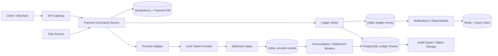

## 1. Problem

Ta xây dựng một nền tảng thanh toán cho merchant và khách hàng. Nền tảng nhận các payment intent từ thẻ và ngân hàng, ghi nhận nghĩa vụ của nền tảng với từng bên, hoàn tiền cho charge đã capture, payout cho merchant, và biểu diễn dispute. Merchant portal cùng đội vận hành nội bộ cần một lịch sử bền vững có thể giải thích từng cent mà không phụ thuộc vào các trường số dư có thể bị sửa.

Yêu cầu chức năng gồm:

- Tạo và capture charge, bao gồm reference ủy quyền từ provider.
- Refund toàn bộ hoặc một phần charge đã capture.
- Tạo và thực thi payout từ số dư phải trả cho merchant.
- Làm cho mọi command của client có tính idempotent, kể cả retry sau khi mất response.
- Ghi nhận mọi chuyển động tiền bằng các journal line double-entry cân bằng.
- Reconcile bản ghi của ta với báo cáo provider và sao kê ngân hàng.
- Đóng băng hoặc đảo tiền khi có card dispute, kèm một case có audit.

Các yêu cầu phi chức năng nghiêm ngặt hơn CRUD thông thường. Money semantics phải exactly once từ góc nhìn sổ cái: một command được chấp nhận tạo ra đúng một business effect, không bao giờ hai. Sổ cái commit với strong consistency, lịch sử journal chỉ append và có thể phát hiện sửa đổi, còn phạm vi PCI được giảm bằng cách token hóa thông tin thanh toán tại provider hosted. Mục tiêu là availability 99.99% mỗi tháng cho ledger command, p99 command latency dưới 400 ms khi provider phản hồi, và không có journal transaction mất cân bằng.

“Exactly once” không có nghĩa một request trên Internet được giao đúng một lần. Nó có nghĩa unique command key và immutable transaction bảo đảm một financial effect dù delivery là at-least-once. API của provider cũng được xem là at-least-once; provider idempotency key và reconciliation xử lý phần mơ hồ còn lại.

## 2. Scale Estimation

Giả định tổng cộng có 200.000 khách hàng và merchant hoạt động mỗi ngày. Mỗi active user trung bình tạo hoặc kiểm tra checkout 2 command thanh toán/ngày:

- `DAU x requests/day = 200,000 x 2 = 400,000 commands/day`.
- `400,000 / 86,400 = 4.63 average requests/second`.
- Đỉnh mua sắm 10x cho 46.3 command request/giây. Ta provision 100 request/giây để dành chỗ cho retry và một đợt khuyến mãi.
- Một charge tạo trung bình 1 payment row, 1 ledger transaction và 4 line; refund hoặc payout cũng khoảng 4 line. Với 500.000 ledger transaction/ngày và 4 line là 2.000.000 line write/ngày, trung bình 23 line/giây và 230 ở đỉnh mô hình.


Các giả định cố ý bảo thủ: dành thêm 25% command so với customer action cho automation của merchant, còn 100 request/giây hữu ích hơn average quan sát được khi lập capacity plan. Read traffic gấp 8 lần write vì dashboard, receipt và truy vấn reconciliation đọc lịch sử nhiều lần. Nếu mọi read đi qua service, đó là khoảng 800 read request/giây ở đỉnh.

Với storage, một payment hoặc journal-line row gồm index và metadata trung bình 700 byte. `2,000,000 lines/day x 700 bytes x 7 years = 3.58 TB` dữ liệu line chính, chưa tính replica, WAL và headroom. Thêm 1 payment row cho mỗi command: `400,000 x 500 bytes x 7 years = 0.51 TB`. Với hệ số 2x cho replica/WAL/headroom, cần dự trù khoảng 8.2 TB database storage. Provider event và audit record thêm khoảng 1 TB trong bảy năm.

Ingress peak ở 100 command/giây với request 3 KB là 2.4 Mb/s; egress peak ở 800 read/giây với response 10 KB là 64 Mb/s. Các số này chưa gồm provider webhook và export, vì vậy network nên tối thiểu 1 Gb/s cho mỗi production zone.

Mô hình tăng trưởng là 30% mỗi năm. Năm thứ ba, volume command là `400,000 x 1.3^3 = 878,800/day`; peak 10x xấp xỉ 102 command/giây sau khi làm tròn. Ledger SLO là availability 99.99% (khoảng 4.38 phút downtime), p99 dưới 400 ms cho local acceptance, và hoàn tất reconciliation trong 30 phút kể từ khi nhận file provider.

## 3. API Design

Mọi endpoint dùng TLS và OAuth2 authorization cho service/user. `Idempotency-Key` bắt buộc với command và được scope theo merchant cộng endpoint. Server lưu request hash, status, response body và resource ID trong 30 ngày; dùng lại key với body khác trả `409`.

### Tạo và capture charge

```http
POST /v1/charges
Authorization: Bearer <token>
Idempotency-Key: ch_merchant_20260815_001
Content-Type: application/json

{"amount":12500,"currency":"USD","merchant_id":"m_42","payment_method_token":"pm_tok_9","capture":true}
```

```json
{"id":"ch_901","status":"succeeded","amount":12500,"currency":"USD","ledger_transaction_id":"ltx_7001","provider_payment_id":"pp_88"}
```

Amount là integer theo minor unit của currency; tuyệt đối không dùng floating point. Service kiểm tra ownership của merchant, currency và tokenization, sau đó chỉ ghi local effect khi kết quả provider đã được correlate an toàn. Timeout trả `202` với `status: "pending"` nếu chưa biết kết quả provider; client poll `GET /v1/charges/{id}`.

### Refund

```http
POST /v1/charges/ch_901/refunds
Idempotency-Key: rf_merchant_20260815_001
Content-Type: application/json

{"amount":3000,"reason":"customer_request"}
```

```json
{"id":"rf_301","status":"succeeded","amount":3000,"charge_id":"ch_901","ledger_transaction_id":"ltx_7010"}
```

### Payout

```http
POST /v1/merchants/m_42/payouts
Idempotency-Key: po_merchant_20260815_001
Content-Type: application/json

{"amount":8000,"currency":"USD","destination_token":"bank_tok_2"}
```

```json
{"id":"po_501","status":"processing","amount":8000,"currency":"USD","ledger_transaction_id":"ltx_7020"}
```

Payout authorization kiểm tra available balance và giới hạn risk/velocity trong cùng database transaction. Việc thực thi với provider có thể giữ ở `processing`; webhook hoặc settlement file chuyển nó thành `paid` hoặc `failed`.

Các endpoint khác là `GET /v1/ledger/accounts/{id}/entries?cursor=...`, `POST /v1/provider-events` (signed webhook ingestion), `POST /v1/reconciliation/runs`, và `POST /v1/disputes/{id}/accept` hoặc `/contest`. Webhook ingestion xác thực chữ ký provider và deduplicate theo provider event ID.

## 4. Data Model

Schema kiểu PostgreSQL dưới đây biểu diễn các invariant quan trọng. Amount không bao giờ dùng floating point.

```sql
CREATE TABLE idempotency_keys (
  merchant_id bigint NOT NULL,
  endpoint text NOT NULL,
  idem_key text NOT NULL,
  request_hash bytea NOT NULL,
  status text NOT NULL,
  response_json jsonb,
  resource_id bigint,
  created_at timestamptz NOT NULL DEFAULT now(),
  PRIMARY KEY (merchant_id, endpoint, idem_key)
);

CREATE TABLE ledger_accounts (
  account_id bigint PRIMARY KEY,
  owner_type text NOT NULL,
  owner_id bigint NOT NULL,
  currency char(3) NOT NULL,
  account_type text NOT NULL,
  UNIQUE (owner_type, owner_id, currency, account_type)
);

CREATE TABLE ledger_transactions (
  transaction_id bigint PRIMARY KEY,
  command_id text NOT NULL UNIQUE,
  kind text NOT NULL,
  state text NOT NULL CHECK (state = 'posted'),
  provider_reference text,
  created_at timestamptz NOT NULL DEFAULT now()
);

CREATE TABLE ledger_lines (
  line_id bigint PRIMARY KEY,
  transaction_id bigint NOT NULL REFERENCES ledger_transactions(transaction_id),
  account_id bigint NOT NULL REFERENCES ledger_accounts(account_id),
  direction text NOT NULL CHECK (direction IN ('debit','credit')),
  amount_minor bigint NOT NULL CHECK (amount_minor > 0),
  currency char(3) NOT NULL,
  created_at timestamptz NOT NULL DEFAULT now()
);

CREATE INDEX ledger_lines_account_time ON ledger_lines(account_id, created_at, line_id);
CREATE INDEX ledger_transactions_provider ON ledger_transactions(provider_reference);
```

`command_id UNIQUE` ngăn hai posting cho một command đã được chấp nhận. Deferred constraint trigger kiểm tra mỗi transaction có ít nhất hai line, mọi line cùng currency, và tổng debit bằng tổng credit. Với charge, transaction minh họa debit `cash_at_provider` và credit `merchant_payable` cộng `platform_fee`; refund đảo các hướng kinh tế đó. Payout debit `merchant_payable` và credit `cash_at_provider` hoặc `payout_clearing`.

Index account-and-time phục vụ statement và việc dựng lại balance. Index provider phục vụ reconciliation và correlate webhook. Partition key tự nhiên là `account_id` cho line read, nhưng một account rất lớn có thể được salt vào partition theo tháng; transaction ID vẫn unique toàn cục. Command được route theo merchant ID để idempotency và balance lock nằm trên cùng database shard. Cross-merchant transfer là workflow riêng, không phải một multi-shard transaction ẩn.

Balance có thể materialize trong `account_balances(account_id, version, available_minor, pending_minor)`, nhưng phải được derive trong cùng transaction với line. Journal, không phải projection này, là source of truth. Không cho update hoặc delete posted row; correction là compensating transaction.

## 5. High-Level Architecture



- API Gateway xác thực, rate-limit và gắn request/trace ID; nó không quyết định money state.
- Payment Command Service validate command và sở hữu idempotency state machine.
- Ledger Writer là component duy nhất được phép post journal line. Database transaction của nó enforce balance và available-funds invariant.
- Provider Adapter cô lập SDK nhạy cảm PCI, retry, timeout và state riêng của provider. Raw PAN không bao giờ vào service.
- Webhook Ingest verify signature và đưa event vào durable queue trước khi acknowledge, ngăn provider retry bị hiểu là money mới.
- Kafka tách ledger write đã commit khỏi notification và reconciliation chậm. Kafka không phải financial source of truth.
- Redis và query store tăng tốc bounded, non-authoritative read. Statement có thể fallback về PostgreSQL.
- Object storage nhận audit export và reconciliation evidence bất biến, được mã hóa.

## 6. Deep Dive

### Command và workflow với provider

Với charge synchronous, command service insert idempotency row ở `started`, gọi provider bằng stable provider key được derive, rồi ghi provider result cùng posted ledger transaction trong một local commit. Nếu provider thành công nhưng local commit timeout, retry dùng cùng provider key rồi reconcile provider reference trước khi post. Nếu không thể xác định outcome, API trả `pending`, không trả “failed” chỉ vì socket đóng.

Provider call không thể tham gia SQL transaction của ta. Vì vậy state machine có `started`, `provider_unknown`, `posted` và `failed`, cùng một sweeper cho unknown command. Provider success không bị post hai lần vì `command_id`, provider reference và idempotency key đều unique. Refund và payout dùng cùng pattern, với amount ceiling được kiểm tra dựa trên tổng đã refund hoặc paid.

### Local transaction mạnh, các biên bất đồng bộ

Trong một shard, `SELECT ... FOR UPDATE` trên balance row cùng insertion của immutable line tạo ra quyết định tiền serializable mà không cần distributed lock. Transaction phải ngắn: validate, lock account theo thứ tự ID tăng dần, append line, update balance projection và commit. Không giữ lock trong lúc gọi provider hoặc publish Kafka. Một outbox row được commit cùng journal; outbox publisher retry tới khi event ở Kafka. Cách này tránh dual-write gap.

Kafka là at-least-once. Mỗi consumer lưu source event ID trong inbox table riêng, apply projection, rồi commit inbox marker và projection cùng nhau. Partition theo `account_id` để statement event có ordering; dùng topic khác, key theo merchant cho notification. Ordering chỉ được bảo đảm trong một key, đủ cho projection của một account.

### Scale ngang, backpressure và hot key

Command instance stateless scale ngang phía sau gateway. Mỗi instance có database pool bounded; khi pool hoặc shard queue bão hòa, admission control trả `429` với `Retry-After` thay vì tạo thread vô hạn. Token bucket theo merchant và IP bảo vệ quota provider cũng như account nóng. Một merchant có một account vẫn có thể serialize quyết định balance của chính nó, trong khi merchant khác scale độc lập.

Database ban đầu là PostgreSQL với synchronous standby trong region và read replica cho non-authoritative query. Khi khoảng 8 TB, partition line theo tháng và hash merchant qua các shard. Reconciliation dùng provider reference range và time window, không full-table scan. Rebalance shard là online copy rồi routing cutover ngắn; command được route bằng stable merchant-directory version.

Chỉ cache statement page bất biến và merchant configuration với TTL ngắn. Không dùng Redis để authorize spend hoặc claim balance. Vì vậy cache failure chỉ làm giảm hiệu năng, không làm sai correctness. Connection pool được tính từ capacity database, không từ số instance: nếu shard an toàn ở 300 active connection và 30 app instance cùng dùng nó, pool 10 connection/instance đã tiêu hết ngân sách.

Retry dùng exponential backoff có jitter và deadline. Không retry validation failure; chỉ retry transient database error trước client deadline; provider call chỉ retry với provider idempotency key. Async message hết retry vào DLQ và phải có alert cùng công cụ replay. Poison event được quarantine thay vì chặn cả partition.

Dispute đến bất đồng bộ. Signed event được lưu trước, sau đó workflow post debit vào merchant payable account và credit vào dispute-clearing account. Nếu merchant balance không đủ, payable có thể âm hoặc reserve account hấp thụ exposure theo policy; xóa lịch sử không bao giờ là recovery strategy.

Multi-region active-passive cho write: một home region sở hữu shard của merchant, secondary warm phục vụ read và takeover qua fenced lease. Active-active ledger write đòi hỏi globally ordered conflict protocol và làm provider ambiguity khó hơn, nên chưa hợp lý ở scale này. Backup được mã hóa, test liên tục và copy cross-region; RPO dưới 5 phút, RTO dưới 30 phút.

## 7. Consistency Model

Strong consistency áp dụng cho idempotency record, account availability, posted journal line, command state transition và dispute/payout authorization. Response thành công nghĩa shard đã commit và outbox record tồn tại. Balance projection và journal được update nguyên tử.

Eventual consistency áp dụng cho Redis, search/reporting read model, notification và dashboard. Chúng hiển thị watermark `last_updated_at` và có thể chậm vài giây. Provider status cũng chỉ biết dần; trước khi webhook, query hoặc settlement file giải quyết, resource giữ `pending` hoặc `unknown`.

Nếu write thành công nhưng response mất, client lặp lại đúng idempotency key và body. Service trả stored response, không gọi provider hoặc post lần hai. Nếu process crash sau provider success nhưng trước local commit, recovery worker query bằng provider idempotency key/reference rồi post đúng một lần hoặc đánh dấu manual review. Unique command ID và transaction constraint bảo đảm duplicate prevention không phụ thuộc cache.

Replication lag không được dùng cho quyết định authorization. Read replica có thể chưa thấy charge vừa post; authoritative `GET` sau command route vào primary hoặc chờ tới khi commit LSN hiển thị. Trong failover, command mới của shard bị ảnh hưởng fail closed với `503` có thể retry cho tới khi fencing token và primary được xác lập.

## 8. Failure Scenarios

| Failure | Impact | Detection | Recovery |
|---|---|---|---|
| Primary ledger DB unavailable | Commands cannot be authoritatively accepted | Connection errors, commit-error rate, failed health checks | Fail closed, route to synchronous standby after fencing, replay outbox; clients retry the same key |
| DB primary commits then process loses response | Client sees timeout; duplicate risk if naïve retry | Request timeout correlated with commit audit and idempotency state | Same key returns stored result; reconciliation repairs incomplete response metadata |
| Provider times out after authorization | Local status is unknown; funds may be held | Provider timeout rate plus unknown-command age | Query/provider webhook with same key, then post or compensate; never blind retry with a new key |
| Kafka consumer stuck on poison event | Read model or reconciliation lag grows | Partition lag, oldest-message age, consumer heartbeat | Pause only the bad message, send to DLQ, fix/replay; keep other partitions moving |
| Redis cluster fails | Higher DB read load; no money corruption | Cache error rate, DB QPS and latency | Bypass cache, rate-limit expensive statements, restore cluster asynchronously |
| Region is lost | Writes for its merchant shards unavailable | Regional health, replication/heartbeat alarms | Fence old region, promote warm secondary, verify RPO, resume writes; replay provider events |
| Webhook delivered 20 times | Duplicate work and noisy state transitions | Duplicate provider-event ID counter | Unique inbox key makes processing no-op after first commit |
| Ledger invariant check fails | Posting defect or corruption; financial close must stop | Unbalanced-transaction constraint and reconciliation alert | Block affected workflow, preserve evidence, compensate via reviewed transaction, restore from verified backup if needed |

## 9. Observability

Mọi request, provider call, Kafka record, SQL transaction và audit export mang `trace_id`, `request_id`, `merchant_id` và `command_id` đã redact. Tuyệt đối không log PAN, CVV, full bank account number hoặc authorization token. Structured log ghi state transition và provider reference hash.

SLI và alert hữu ích gồm:

- Availability: số command commit authoritative thành công chia cho valid command attempt; page khi burn rate 5 phút đe dọa SLO 99.99%.
- Latency: p50/p95/p99 của command acceptance và provider round trip; p99 trên 400 ms báo hiệu áp lực pool, lock hoặc provider.
- Correctness: unbalanced transaction, duplicate command conflict, negative balance và reconciliation delta; bất kỳ unbalanced count khác không đều page ngay.
- Saturation: DB CPU/IO, lock wait, WAL rate, connection-pool utilization, shard queue depth, gateway throttle và Kafka partition lag. Pool saturation với DB CPU thấp thường là pool sizing hoặc transaction bị kẹt; lock wait cao chỉ ra hot account.
- Provider health: timeout, decline, unknown-outcome và webhook age theo provider. Unknown age trên 10 phút page operations.
- Recovery: DLQ count/oldest age, outbox age, backup freshness, replication lag và failover drill duration.

Distributed trace nối API span với provider request và database commit, nhưng card data phải scrub. Dashboard tách business decline rate khỏi infrastructure error để fraud rule không page nhầm đội database.

## 10. Capacity Planning

Ở peak năm đầu là 100 command/giây, giả định 60% charge, 20% read, 10% refund và 10% payout. Provision 6 stateless instance, mỗi instance 25 command request/giây, cho 150 request/giây (headroom 1.5x) qua ba zone. Mỗi instance dùng pool 10 connection, nhưng chỉ cho phép 60 write connection tổng cộng trên shard; vẫn còn chỗ cho migration và operator trong giới hạn 300 connection/shard.

Peak 230 ledger-line write/giây phù hợp primary có khả năng 1.000 durable line insert/giây với headroom 4x. Hai replica synchronous/in-region cho failover; hai read replica xử lý 800 read/giây dự kiến. Partition giữ index maintenance bounded theo tháng. Với 8.2 TB storage, dùng volume usable 12 TB để WAL spike, vacuum và sáu tháng tăng trưởng không làm đầy volume.

Kafka nhận khoảng 300 ledger/provider event/giây ở peak. Mười hai partition cho phép 25 event/giây mỗi consumer lane; sáu consumer xử lý mỗi consumer hai partition, còn sáu lane dự phòng khi replay. Retry buffer 24 giờ ở 300 event/giây và 2 KB/event khoảng 52 GB trước replication, nên topic 3x replicated 200 GB là đủ. Outbox publisher nhắm tuổi dưới 30 giây.

Redis lưu 500.000 statement/configuration entry nóng, trung bình 8 KB: khoảng 4 GB value. Tính index, replica và eviction reserve, provision 12 GB mỗi primary. Redis có thể bỏ đi và không được tính là financial durability.

## 11. Bottlenecks and Evolution

Bottleneck đầu tiên thường là lock contention trên balance của merchant rất hoạt động, không phải CPU thô. Đo lock wait và chỉ tách operational account theo currency hoặc settlement bucket khi accounting policy cho phép. Kế tiếp, line index theo tháng và reconciliation scan gây áp lực IO database; partitioning cùng provider cursor incremental giải quyết việc đó.

Ở 10x, thêm merchant shard, reconciliation warehouse riêng và read model riêng cho statement và operations. Giữ write ownership authoritative của từng merchant ổn định. Ở 100x, chuyển journal storage sang append-oriented partition service có invariant checker tương thích SQL, giữ checkpoint gọn theo account và dùng merchant directory quản lý toàn cục. Cross-shard reporting thuộc về warehouse; cross-shard money movement vẫn là saga rõ ràng với compensation.

Hãy redesign database/shard routing trước khi thay Kafka hoặc thêm cache. Target architecture vẫn giữ one-writer ownership mỗi account, outbox/inbox durable, reconciliation không phụ thuộc provider và audit export có cryptographic chain. Khi đó có thể thêm provider adapter mới mà không đổi ledger semantics.

## 12. Trade-offs

| Decision | Option A | Option B | Decision | Why |
|---|---|---|---|---|
| Primary ledger store | SQL with constraints | NoSQL with application checks | SQL | ACID transactions, foreign keys, and deferred balance invariants reduce money-risk bugs |
| Event transport | Kafka | RabbitMQ | Kafka | Replayable ordered partitions suit durable projections; commands still use SQL |
| Read cache | Redis | Database cache tables | Redis | Fast disposable cache, while the journal remains authoritative |
| Provider workflow | Synchronous | Fully asynchronous | Hybrid | Fast success path, but pending states handle provider uncertainty safely |
| Regions | Active-active | Active-passive | Active-passive writes | Fewer split-brain and ordering hazards for a single account owner |
| Sharding | Range by merchant | Hash by merchant | Hash with directory | Even load; directory handles moves and preserves routing identity |
| Reconciliation | Polling | Push only | Both | Webhooks reduce latency; files/polling recover missed events |
| Internal RPC | REST | gRPC | REST at boundary, gRPC selectively | REST is interoperable for merchants; gRPC helps typed internal high-volume calls |

## 13. Production Checklist

- [ ] Mọi command yêu cầu scoped idempotency key và request hash.
- [ ] Provider key, webhook signature và xử lý timeout/unknown đã được test.
- [ ] Posted transaction bất biến; debit bằng credit và currency khớp.
- [ ] Balance authorization và journal line commit nguyên tử.
- [ ] Outbox/inbox, DLQ replay và isolation cho poison message có thể vận hành.
- [ ] Không có PAN/CVV trong log, database, trace hoặc analytics.
- [ ] Primary failover có fencing; drill RPO/RTO và restore test còn hiệu lực.
- [ ] Alert bao phủ SLO burn, unknown outcome, lock wait, pool saturation, lag, DLQ và reconciliation delta.
- [ ] Load test gồm merchant nóng, request trùng, provider timeout và mất region.
- [ ] Statement rebuild được từ journal và mọi correction có approver.

## 14. Engineering References

1. **Company:** Google. **Article title:** *Site Reliability Engineering Book: Table of Contents*. **URL:** https://sre.google/sre-book/table-of-contents/. **Key engineering lesson:** Define measurable SLIs/SLOs, error budgets, and failure-response practices rather than promising vague reliability. **How it influenced this design:** The 99.99% command SLO, burn-rate alerts, RPO/RTO, and fail-closed recovery policy are explicit operational contracts.
2. **Company:** Stripe. **Article title:** *Stripe Engineering*. **URL:** https://stripe.com/blog/engineering. **Key engineering lesson:** Payment systems must make retries safe and preserve a durable, inspectable state across unreliable network boundaries. **How it influenced this design:** Scoped idempotency keys, pending/unknown outcomes, provider adapters, and reconciliation are first-class rather than incidental error handling.
3. **Company:** Uber. **Article title:** *Uber Engineering*. **URL:** https://www.uber.com/blog/engineering/. **Key engineering lesson:** High-scale systems benefit from explicit event pipelines, ownership boundaries, and operational tooling. **How it influenced this design:** Kafka outbox/inbox processing, partition-key ordering, DLQs, and shard ownership are separated from the financial source of truth.
4. **Company:** AWS. **Article title:** *AWS Architecture Blog*. **URL:** https://aws.amazon.com/blogs/architecture/. **Key engineering lesson:** Resilience is designed through isolation, backpressure, retries with jitter, and tested recovery paths. **How it influenced this design:** Bounded pools, admission control, provider deadlines, retry budgets, regional fencing, and restore/failover drills are part of the architecture.
