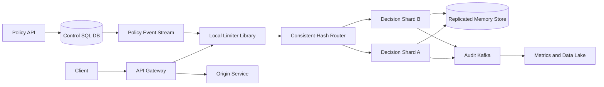

## 1. Problem

Ta cần một dịch vụ trả lời một câu hỏi trước khi request API đến code ứng dụng: **principal này có được phép tiêu tốn một đơn vị quota ngay bây giờ không?** Principal có thể là user, địa chỉ IP nguồn, API key hoặc OAuth token. Chính sách có thể khác theo route, HTTP method, gói tenant và region.

Dịch vụ phải hỗ trợ giới hạn token-bucket để điều tiết traffic và cho phép burst có kiểm soát, cùng giới hạn sliding-window khi sản phẩm cần một số đếm cứng trong một khoảng thời gian. Request bị từ chối nhận HTTP `429 Too Many Requests` và giá trị `Retry-After` hữu ích. Thay đổi cấu hình phải được truyền đi mà không cần restart gateway.

Người dùng của dịch vụ là API gateway và service nội bộ; người vận hành là các team platform và product. Limiter nằm trên đường đi đồng bộ của request, vì vậy các yêu cầu phi chức năng chính là:

| Yêu cầu | Mục tiêu |
|---|---|
| Độ trễ quyết định | p99 dưới 1 ms tại gateway, không tính thời gian mạng đến origin |
| Availability của quyết định | 99.99% mỗi tháng cho đường đi limiter |
| Ngữ nghĩa bộ đếm | Một bộ đếm logic toàn cục cho mỗi key và policy; độ trễ chéo region có giới hạn và được ghi rõ |
| Khả năng scale | Không có hotspot trung tâm cố định; ownership được chia ngang |
| Hành vi đồng hồ | Tính đúng không được phụ thuộc vào wall clock đồng bộ |
| An toàn | Limiter lỗi không được âm thầm biến thành traffic đắt tiền không giới hạn |

Thiết kế tách decision plane nhanh khỏi control plane chậm hơn. Đồng thời, fail-open hay fail-closed là lựa chọn của policy, không phải hệ quả ngẫu nhiên của timeout.

## 2. Scale Estimation

Giả sử có 10 triệu DAU. Mỗi user hoạt động tạo 100 API request mỗi ngày. Như vậy `10,000,000 x 100 = 1,000,000,000` quyết định/ngày. Chia cho 86.400 giây cho `11,574` quyết định/giây trung bình. Dùng đỉnh 10x cho các đợt phát hành và phân bố theo ngày cho `115,740` quyết định/giây lúc cao điểm. Cộng 30% headroom: provision cho `150,000` quyết định/giây.

Giả sử 20% quyết định đến từ API key hoặc service token, không được biểu diễn bởi user session, nên ước tính đã bao phủ các request đó thay vì cộng lại lần nữa. Tỷ lệ allow/reject 90:10 cho khoảng `135,000` allow/giây và `15,000` reject/giây ở đỉnh. Mỗi request là một lần đọc bộ đếm và thường là một lần cập nhật nguyên tử nhỏ, nên read:write của decision plane xấp xỉ `1:1`; config read được cache và không nằm trên đường đi này.

Với token bucket, lưu key, policy version, số token và monotonic timestamp cuối trong 40 byte. Với 500 triệu key đang hoạt động và hai replica, state nóng là `500,000,000 x 40 x 2 = 40 GB`, chưa tính overhead index và memory. Ở mức overhead 2.5x, cần dành 100 GB capacity in-memory usable. Bucket không hoạt động được expire sau 24 giờ; đây là activity TTL, không phải đồng hồ dùng để đảm bảo tính đúng.

Nếu mỗi quyết định phát ra một record audit/event gọn 100 byte, bandwidth event lúc đỉnh là `150,000 x 100 = 15 MB/s`, tương đương 1.296 TB/ngày chưa nén. Giữ event quyết định chi tiết ở dạng sampled, nhưng giữ toàn bộ counter và reject. Retention event nén 7 ngày ở 30% dữ liệu thô xấp xỉ `1.296 TB x 7 x 0.3 = 2.72 TB`.

Config nhỏ: 100.000 policy ở 1 KB là khoảng 100 MB, được replicate trong control database và distributed cache. Giả sử key tăng 5% mỗi ngày: state hoạt động tăng từ 500 triệu lên khoảng 525 triệu key sau một ngày nếu expiry không bù lại. Mục tiêu availability 99.99% mỗi tháng, tương đương khoảng 4,4 phút unavailable trong tháng 30 ngày. Budget p99 cố ý chặt hơn budget availability vì limiter chậm có thể gây outage toàn origin thông qua cạn connection và thread.

## 3. API Design

Gateway gọi endpoint quyết định với identity request ổn định. Authentication giữa gateway và limiter dùng mTLS; limiter không tin tenant do caller tự gửi nếu chưa xác thực identity gateway đã ký.

```http
POST /v1/decisions
Authorization: mTLS
Content-Type: application/json
X-Request-Id: 01J...
Idempotency-Key: gateway-01J...-attempt-1

{
  "principal_type": "api_key",
  "principal_id": "key_7f3",
  "route": "POST:/v1/payments",
  "region": "sg",
  "cost": 1
}
```

Response cho phép là:

```http
HTTP/1.1 200 OK
Content-Type: application/json

{"allowed":true,"remaining":39,"limit":40,"reset_at":"2026-08-15T03:01:00Z","policy_version":812}
```

Response từ chối là:

```http
HTTP/1.1 429 Too Many Requests
Retry-After: 2
Content-Type: application/json

{"allowed":false,"remaining":0,"limit":40,"retry_after_ms":1840,"policy_version":812}
```

`cost` cho phép thao tác đắt tiền tiêu tốn hơn một token. Gateway chuyển tiếp cùng `X-Request-Id`; retry dùng cùng `Idempotency-Key`. Decision record được deduplicate trong một khoảng ngắn để response timeout không tiêu quota hai lần. Key này không thay thế idempotency key của business operation: việc tạo payment vẫn cần contract idempotency durable riêng.

Với quản trị:

```http
PUT /v1/policies/{policy_id}
If-Match: "policy-version-811"

{"match":{"route":"POST:/v1/payments","plan":"standard"},"algorithm":"token_bucket","rate_per_second":20,"burst":40,"scope":"api_key"}
```

`PUT` là idempotent và `If-Match` ngăn lost update. Chỉ operator được cấp quyền mới đổi được policy. Policy bất biến theo version; gateway có thể dùng version trước trong thời gian ngắn khi propagation, và độ trễ propagation tối đa được xuất thành metric.

## 4. Data Model

Nguồn sự thật là relational control database. Mutable bucket state nằm trong decision store in-memory được shard và được summarize định kỳ, không copy đồng bộ vào SQL.

```sql
CREATE TABLE rate_policy (
  policy_id        BIGINT PRIMARY KEY,
  version          BIGINT NOT NULL,
  route_pattern    TEXT NOT NULL,
  method           TEXT NOT NULL,
  principal_scope  TEXT NOT NULL,
  algorithm        TEXT NOT NULL CHECK (algorithm IN ('token_bucket', 'sliding_window')),
  rate_per_second  NUMERIC,
  burst            INTEGER,
  window_seconds   INTEGER,
  limit_count      INTEGER,
  state            TEXT NOT NULL CHECK (state IN ('active', 'disabled')),
  updated_at       TIMESTAMPTZ NOT NULL
);

CREATE UNIQUE INDEX rate_policy_version
  ON rate_policy (policy_id, version);

CREATE INDEX rate_policy_match
  ON rate_policy (method, route_pattern, principal_scope, state);

CREATE TABLE policy_audit (
  policy_id BIGINT NOT NULL,
  version BIGINT NOT NULL,
  actor TEXT NOT NULL,
  change_json JSONB NOT NULL,
  created_at TIMESTAMPTZ NOT NULL,
  PRIMARY KEY (policy_id, version)
);
```

Key của decision store là `hash(tenant_id | principal_type | principal_id | route | policy_id)`. Hash partitioning phân tán traffic customer tùy ý và tránh hotspot do ID tuần tự gây ra. Value là `{tokens, last_elapsed_ns, policy_version, dedupe entries}`. Value của sliding-window là ring giới hạn gồm các count theo giây cùng window epoch; không phải danh sách timestamp request không giới hạn.

Các index control hỗ trợ policy matching và optimistic version check. Không có SQL index cho mọi bucket vì điều đó sẽ đặt hot path lên database. Bucket record có idle TTL 24 giờ và được eviction an toàn: bucket thiếu bắt đầu đầy theo policy hiện tại. Policy version mismatch khiến shard khởi tạo hoặc migrate state theo tham số mới.

## 5. High-Level Architecture



Gateway là enforcement point: nó trả `429` trước khi tiêu capacity của origin. Local library giữ route match và policy version đã compile, giảm network hop cho config và batch telemetry, nhưng không sở hữu global counter mutable. Consistent-hash router map decision key vào primary shard và replica; virtual node rebalance ownership.

Decision shard thực hiện compare-and-update nguyên tử trong replicated memory store. Memory store được chọn vì thao tác dưới một millisecond và TTL native, không phải làm policy authority durable. Policy API và SQL database cung cấp cấu hình có audit và transaction. Policy event stream phân phối version đến gateway và shard. Kafka mang audit data vì hỗ trợ replay và consumer lag; nó cố ý không nằm trên synchronous allow/reject path. Consumer data lake tạo analytics và alert.

## 6. Deep Dive

**Algorithm và atomicity.** Token bucket có capacity `B`, refill rate `r`, số token hiện tại `t` và elapsed time `d`: `t' = min(B, t + r x d)`. Request cost `c` được phép khi `t' >= c`, sau đó lưu `t'-c` và elapsed timestamp hiện tại trong một atomic script. Sliding window chia thời gian thành bucket một giây và tính tổng `W` bucket gần nhất. Update và expiry của ring phải atomic, nếu không request đồng thời có thể cùng thấy quota còn trống. Token bucket là mặc định vì giới hạn burst mà state có kích thước cố định; sliding window dành cho nơi hard interval count quan trọng.

Dùng monotonic elapsed-time source cho phép tính refill. Wall-clock timestamp chỉ dùng để tính reset estimate gửi cho client. Nếu monotonic clock của process nhảy hoặc không có, shard từ chối update thay vì tự tạo token. Vì vậy clock skew giữa node chỉ ảnh hưởng display trong tolerance cấu hình, không ảnh hưởng tính đúng của quota.

**Scale ngang và hot key.** Shard theo toàn bộ decision key, không chỉ tenant. Một API key bị lạm dụng vẫn là hot key, nhưng traffic của nó được serialize tại một owner, điều này không tránh được với counter exact. Router có thể đặt hot key lên shard riêng và áp dụng local per-connection guard. Tách một exact key trên nhiều shard sẽ over-admit trừ khi có quota lease protocol. Lease chunk tăng throughput nhưng đánh đổi độ chính xác; chỉ dùng cho policy được xác định là approximate.

**Replication và failover.** Mỗi shard có primary và synchronous replica gần đó cho acknowledged update, cùng một bản sao cross-region asynchronous. Primary chỉ trả success sau khi replica acknowledge. Khi lỗi, fencing epoch cho phép primary mới từ chối write của owner cũ. Failover region có thể mất chỉ telemetry asynchronous, không mất counter state đã acknowledge, nếu client được route tới region ghép cặp. Trong partition, active-active exact global write cần consensus cho mọi decision và vi phạm latency target; policy có thể chọn regional budget có giới hạn.

**Caching và policy propagation.** Gateway cache route match đã compile và policy version. Control-plane event invalidate hoặc update chúng; snapshot age tối đa 60 giây được thực thi cho route nhạy cảm an toàn. Hành vi khi policy unknown hoặc expired là rõ ràng: fail closed cho authentication, billing và mutation đắt tiền; fail open với emergency local bucket nhỏ cho read rủi ro thấp. Cache failure không được khiến mọi gateway đồng thời query SQL.

**Queue, retry và backpressure.** Audit event được ghi vào Kafka bất đồng bộ qua buffer bounded theo shard. Khi buffer đầy, bỏ allow đã sample nhưng giữ reject, policy change và saturation counter. Consumer commit offset sau xử lý durable; consumer bị kẹt được cô lập bằng dead-letter topic cho event lỗi format. Producer retry với exponential backoff bounded và jitter. Kafka không bao giờ được retry inline trước response quyết định.

**Idempotency và ordering.** Gateway retry có thể lặp request sau khi mất response. Shard lưu kết quả `(idempotency_key, decision)` trong thời gian ngắn và trả kết quả gốc cho cùng key và policy version. Key được scope theo gateway và principal để tránh collision xuyên tenant. Event có sequence number theo shard; analytics phát hiện gap. Policy version được áp dụng theo thứ tự, và shard pause một route nếu nhận version 813 trước 812.

**Load balancing và pool.** Consistent hashing giữ decision key ổn định, còn health-aware routing loại node lỗi. Gateway pool dùng connect/request deadline ngắn, circuit breaker và concurrency bounded. Mục tiêu p99 1 ms là bất khả thi nếu pool xếp hàng sau node chết, vì vậy pool wait time được đo riêng với store execution time. Limiter reject hoặc dùng emergency mode của route khi concurrency budget cạn.

**Transaction và durability.** Policy update, audit row và outbox record commit trong một SQL transaction. Outbox publisher khiến config delivery retryable mà không có dual-write gap. Bucket update không phải SQL transaction; atomicity đến từ single-key script và replication protocol của shard. Snapshot định kỳ hữu ích cho chẩn đoán và warm restart, nhưng không được xem là event log lossless.

**DR và kiểm soát vận hành.** Policy replicate sang region thứ hai và được kiểm thử bằng cách restore vào namespace cô lập. Runbook quy định route dùng global exact mode, regional budget mode hay emergency local mode. Operator có thể hạ limit, disable policy lỗi hoặc quarantine principal mà không deploy lại gateway. Mọi override có expiry và actor audit.

## 7. Consistency Model

Policy write strong consistent ở SQL primary: một version, một audit record và một outbox event commit cùng nhau. Policy view của gateway eventually consistent, bị giới hạn bởi snapshot TTL và event-replay SLA. Vì vậy policy restrictive mới có propagation window được công bố; route critical về security fail closed khi snapshot stale.

Counter update của một key linearizable trong shard vì primary serialize atomic update và đợi synchronous replica. Read trả từ owner, không bao giờ từ bản analytics asynchronous. Cross-region replication asynchronous ở normal mode, nên region partition có thể tạm thời cho traffic theo regional budget thay vì giả vờ hai counter độc lập là một global counter exact.

Nếu update thành công nhưng response mất, idempotency record khiến retry trả cùng decision. Nếu client retry bằng key mới, nó có thể tiêu token lần nữa; điều này có chủ đích và được ghi rõ. Nếu primary lỗi sau local execution nhưng trước replica acknowledgement, operation được xem là unknown và client có thể retry. Trong tình huống mơ hồ, hệ thống chọn khả năng under-admit thay vì over-admit.

## 8. Failure Scenarios

| Failure | Impact | Detection | Recovery |
|---|---|---|---|
| Control database SQL unavailable | Không có policy change mới; policy cache tiếp tục dùng | SQL health, write fail, tuổi outbox | Fail admin write, giữ snapshot hợp lệ cuối, restore/đổi SQL, replay outbox |
| Decision primary lỗi | Key bị ảnh hưởng timeout hoặc reject trong lúc election | Shard heartbeat, owner epoch, p99 timeout | Fence owner cũ, promote synchronous replica, chỉ rehash virtual node của nó |
| Memory-store cache/replica lỗi | Decision counter có thể unavailable hoặc mất state chưa acknowledge | Store error rate, replication offset, failover event | Fail closed route đắt tiền; promote replica; dựng lại cold key bằng emergency budget rõ ràng |
| Kafka consumer bị kẹt | Audit và analytics lag; quota decision vẫn chạy | Consumer lag, tuổi event cũ nhất, DLQ rate | Restart/scale consumer, replay từ offset commit cuối, kiểm tra poison message |
| Gateway policy cache expired | Request dùng emergency behavior hoặc bị reject | Snapshot age và route-mode metric | Replay policy stream, khôi phục control-plane connectivity, page owner route an toàn |
| Network partition giữa region | Global exact mode không thể phối hợp an toàn | Cross-region RTT, mất quorum, routing health | Chuyển regional budget hoặc active-passive; reconcile counter sau fencing |
| Hot API key flood một shard | Một shard bão hòa và p99 tăng | QPS từng key, CPU shard, queue wait | Cô lập key, áp dụng connection guard, báo tenant; không tự ý tách exact state |
| Client retry sau khi mất 200 | Quota bị tiêu hai lần nếu không dedupe | Tỷ lệ duplicate idempotency key và request trace | Trả kết quả đã lưu trong dedupe TTL; yêu cầu gateway dùng key ổn định |
| Clock skew hoặc wall-clock rollback | Reset header sai hoặc nguy cơ refill sai | NTP offset và monotonic clock error | Dùng elapsed monotonic time; giới hạn reset display; quarantine host lỗi |

## 9. Observability

Mỗi request mang `X-Request-Id` và trace context từ gateway qua router đến shard. Log có tenant, policy version, shard, decision, failure mode và latency, nhưng hash hoặc redact principal identifier. Không bao giờ log API key thô.

SLI cốt lõi là availability của decision success, mẫu kiểm tra correctness allow/reject, latency p50/p95/p99/p99.9 và timeout rate. Alert khi p99 trên 1 ms trong 5 phút, availability dưới 99.99%, hoặc fail-open decision tăng trên route được bảo vệ. Đo riêng gateway queue wait, store script time, network time và policy-match time.

Tín hiệu capacity và failure gồm CPU/memory từng shard, QPS hot key, replica offset, số election, connection-pool utilization, pool wait, circuit-breaker open, Kafka producer buffer utilization, consumer lag, tuổi event cũ nhất, DLQ rate, SQL lock time, SQL connection-pool saturation, outbox age và policy snapshot age. Mỗi alert gắn với hành động: consumer lag page owner analytics, pool saturation page owner gateway, replica offset page owner storage và snapshot age page owner control plane.

Sample 1% allow để trace nhưng sample 100% reject, error, policy change và fail-open decision. Synthetic probe chạy một key đã biết ở mọi region và kiểm tra cả boundary `200` lẫn `429`. Reconciliation job so sánh decision total của shard với quan sát gateway đã sample; nó chỉ dùng chẩn đoán, không làm authority quota real-time.

## 10. Capacity Planning

Ở 150.000 decision/giây đỉnh, giả sử một decision shard xử lý an toàn 25.000 atomic operation/giây ở p99 mục tiêu, đã gồm replication. Cần `150,000 / 25,000 = 6` shard active. Dùng 8 shard active để có 33% headroom cho failure và rebalance, mỗi shard có một synchronous replica: 16 shard process. Với failure domain hai replica, có 24 process nếu mỗi shard còn có một asynchronous copy cross-zone.

Giả sử 500.000 decision/giây active là trần thực tế của memory-store fleet trước tier partition kế tiếp; fleet hiện tại thấp hơn nhiều, nhưng ước tính state 100 GB cần tối thiểu 8 node, mỗi node 16 GB usable state sau khi dành chỗ cho overhead memory. Giữ 30% memory trống, nên provision 8 node x 24 GB allocation usable thay vì chạy sát giới hạn. Cross-region traffic cho state copy asynchronous xấp xỉ `150,000 x 40 = 6 MB/s` trước protocol overhead; dành 10 MB/s cho mỗi cặp region.

Gateway instance được tính ở 5.000 decision/giây, dựa trên load test có TLS và local matching. `150,000 / 5,000 = 30`; deploy 36 instance trên ba zone. Với pool 200 connection mỗi instance, fleet có 7.200 connection khả dụng, nhưng active concurrency limit phải lấy từ load test thay vì mở hết.

Kafka nhận peak 15 MB/s. Nếu một partition được budget 5 MB/s sustained, cần 6 partition cho throughput và 8 để rebalance. Bắt đầu với 8 partition và 4 consumer, mỗi consumer xử lý hai partition; có thể scale tối đa 8 consumer mà không đổi topic. Event store nén 7 ngày khoảng 2.72 TB; dành 4 TB gồm index và tăng trưởng.

SQL database có lẽ nhận 10 policy write/giây trong vận hành bình thường, không phải 150.000 decision/giây. Hai read replica phục vụ admin và audit; primary cần durable write IOPS và outbox, nhưng không được tính decision capacity theo SQL QPS. SQL pool 100 connection chia cho các control-plane instance là đủ cho write rate này; giới hạn pool để retry storm không làm cạn backend database.

## 11. Bottlenecks and Evolution

Hot key hoặc gateway connection pool quá tải thường là bottleneck đầu tiên, không phải SQL. Ở 10x, peak là 1,5 triệu decision/giây: tăng virtual shard, đặt tenant nóng lên capacity cô lập và chuyển từ một router process sang routing library replicated, nhận biết locality. Ở 100x, 15 triệu decision/giây khiến exactness mỗi request xuyên region không thực tế về kinh tế và vật lý; dùng regional budget với global reconciliation định kỳ, hoặc chỉ dành global exact mode cho một tập key nhỏ.

Thiết kế lại kế tiếp là state protocol: vẫn có thể giữ một primary cho mỗi exact key, nhưng approximate token theo lease, hierarchical tenant bucket và local admission filter giảm traffic. Target architecture giữ fast path tại gateway, fleet shard theo region, policy log replicate toàn cầu và một consistency tier rõ ràng cho từng route. Không thay đổi âm thầm semantics limit của customer trong bất kỳ bước tiến hóa nào.

## 12. Trade-offs

| Decision | Option A | Option B | Decision | Why |
|---|---|---|---|---|
| Policy store | SQL | NoSQL | SQL | Transaction, version check và audit history quan trọng hơn throughput ghi policy |
| Event transport | Kafka | RabbitMQ | Kafka | Replay và audit stream throughput cao, phân partition phù hợp; decision không phụ thuộc bên nào |
| Hot state | Memory store tương thích Redis | DB cache | Memory store | Atomic script và TTL đáp ứng p99; SQL vẫn là control authority |
| Telemetry | Đồng bộ | Bất đồng bộ | Bất đồng bộ | Không thêm latency Kafka/storage vào admission; buffer bounded bảo vệ memory |
| Region mode | Active-active exact | Active-passive exact | Active-passive cho exact, regional budget cho availability | Consensus cho mọi global token quá chậm; passive failover giữ semantics |
| Sharding | Range | Hash | Hash | Principal key đồng đều tránh hotspot của range tuần tự |
| Phân phối config | Polling | Push stream | Push với polling fallback có giới hạn | Propagation nhanh mà không tạo polling storm vào SQL; polling phục hồi event bị lỡ |
| API nội bộ | REST/HTTP | gRPC | REST ở edge, gRPC tùy chọn nội bộ | HTTP tích hợp phổ quát; gRPC giảm overhead nội bộ sau khi đo đạc |

## 13. Production Checklist

- Verify atomicity của token-bucket và sliding-window dưới tải đồng thời.
- Verify p99 dưới 1 ms với TLS, replication và key skew thực tế.
- Verify mọi route có mode fail-open hoặc fail-closed rõ ràng.
- Verify semantics của `429`, `Retry-After`, reset, cost và policy-version.
- Verify idempotency key ổn định qua gateway retry và response bị mất.
- Verify fencing, promote replica, rehash và regional failover.
- Verify thứ tự policy version, outbox replay, TTL và snapshot expiry.
- Verify hot-key isolation và connection pool bounded của gateway/store.
- Verify Kafka backpressure, retention, consumer replay và owner của DLQ.
- Verify dashboard, synthetic probe, alert, runbook và error budget.
- Verify credential thô hoặc principal identifier không lọt vào log.
- Chạy failure-injection exercise trước khi bật global exact mode.

## 14. Engineering References

1. **Company:** Google SRE. **Article title:** *Site Reliability Engineering Book*. **URL:** https://sre.google/sre-book/table-of-contents/ **Key engineering lesson:** Định nghĩa SLO đo được, error budget và thực hành vận hành hướng theo failure. **How it influenced this design:** Mục tiêu availability 99.99%, phân rã latency SLI, ngưỡng paging và hành vi theo error budget xuất phát từ việc xem limiter là production dependency.
2. **Company:** Cloudflare. **Article title:** *Cloudflare Blog*. **URL:** https://blog.cloudflare.com/ **Key engineering lesson:** Enforcement ở edge phải tính đến locality, traffic đối nghịch và key cardinality rất cao. **How it influenced this design:** Gateway-local matching, hash sharding, hot-key isolation và regional emergency mode ngăn traffic xấu biến một global service thành hotspot.
3. **Company:** Netflix. **Article title:** *Netflix TechBlog*. **URL:** https://netflixtechblog.com/ **Key engineering lesson:** Isolation, concurrency bounded và graceful degradation phải được thiết kế vào distributed client. **How it influenced this design:** Giới hạn connection pool, circuit breaker, failure mode và quyết định loại Kafka khỏi synchronous path là các constraint hạng nhất.
4. **Company:** AWS. **Article title:** *AWS Architecture Blog*. **URL:** https://aws.amazon.com/blogs/architecture/ **Key engineering lesson:** Capacity, retry, backpressure và multi-region recovery cần ranh giới vận hành rõ ràng. **How it influenced this design:** Các phép tính, retry bounded có jitter, queue limit, regional failover mode và recovery runbook được đặc tả thay vì ngầm hiểu.
