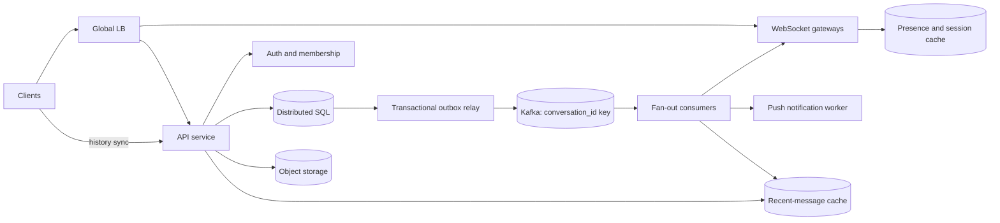

## 1. Problem

Ta xây dựng tính năng chat cho một sản phẩm người dùng cuối, nơi người dùng, nhân viên hỗ trợ và client tự động có thể trao đổi. Người dùng có thể tạo cuộc trò chuyện 1:1 hoặc nhóm, gửi văn bản và media, xem presence, nhận typing indicator, đọc lịch sử gần đây và tiếp tục nhận tin sau khi một thiết bị offline. Một tài khoản có thể có nhiều điện thoại, trình duyệt và client desktop.

Các đảm bảo quan trọng được giới hạn có chủ ý:

- Mỗi tin nhắn được chấp nhận đều bền vững và có một thứ tự trong cuộc trò chuyện của nó.
- Send chỉ được xác nhận sau khi commit bền vững, không phải chỉ sau khi đưa vào bộ nhớ.
- Delivery là at-least-once; client khử trùng lặp bằng `message_id` và tiếp tục từ cursor.
- Presence và typing là dữ liệu tạm thời, có thể cũ. Lịch sử tin nhắn thì không.
- Mục tiêu là p99 xác nhận gửi dưới 200 ms trong cùng region, hàng triệu WebSocket đồng thời, lịch sử bền vững và đồng bộ đa thiết bị.

Đây không phải hệ thống broadcast có một total order toàn cầu. Thứ tự chỉ được đảm bảo theo từng conversation, còn byte media nằm ngoài message database. Ranh giới này giữ chi phí của các đảm bảo khó ở mức hợp lý.

## 2. Scale Estimation

Các giả định là đầu vào để lập kế hoạch, không phải dữ kiện sản phẩm:

| Quantity | Assumption | Reason |
|---|---:|---|
| DAU | 50 million | A large consumer deployment |
| Active senders/day | 20% of DAU | Many users read without sending |
| Messages/sender/day | 20 | Includes text and media metadata messages |
| Average message envelope | 1 KB | Text, IDs, timestamps, and a few attributes |
| Media attachment average | 2 MB, 5% of messages | Media is object storage, not hot-row storage |
| Retention | 3 years | Durable product history |
| Peak multiplier | 10x average | Regional time-zone and event spikes |

Messages/day = `50,000,000 x 20% x 20 = 200,000,000`.

Average message writes = `200,000,000 / 86,400 = 2,315 writes/s`; planning peak = `23,150 writes/s`. Mỗi send cũng tạo một outbox event, do đó durable write path xử lý khoảng 46,300 row/event writes/s trước replication. Delivery at-least-once và retry không được tính là tin nhắn người dùng mới.

Raw message storage trong ba năm = `200,000,000 x 1 KB x 1,095 days = 219 TB` thập phân. Cộng hai replica, index, tombstone và 30% headroom: khoảng `219 x 2 x 1.3 = 569 TB`. Media storage = `200,000,000 x 5% x 2 MB x 1,095 = 21.9 PB` trước lifecycle compression hoặc xóa; phần này thuộc object storage có CDN.

Ở peak, message ingress khoảng `23,150 x 1 KB = 23 MB/s` (184 Mb/s) và media upload khoảng `1,158 x 2 MB = 2.3 GB/s` nếu cùng peak factor. Vì vậy bắt buộc phải upload multipart trực tiếp tới object storage. Một active user điển hình có 12 conversation reads/ngày, tức 600 triệu read/ngày, trung bình 6,944 request/s và peak khoảng 69,440 request/s. Tỷ lệ request read:write xấp xỉ 3:1, chưa tính WebSocket frame.

Với 10 triệu client kết nối đồng thời, giả sử 20% kết nối nằm trong mỗi region, bốn region chứa mỗi region 2 triệu socket. Ở mức trung bình 4 KB/s outbound cho mỗi client kết nối (presence, typing và message), egress là 8 GB/s mỗi region ở mức tải đó. Mục tiêu availability là 99.99% cho message acceptance và history read; presence có thể có mục tiêu thấp hơn là 99.9% vì có thể khôi phục.

Traffic tăng theo DAU và mức tương tác. Capacity được cấp cho 2x forecast peak, và mức tăng 100% hằng năm là tín hiệu cần thêm shard thay vì kéo dài một cluster vượt quá failure domain.

## 3. API Design

HTTP API xác thực bằng access token sống ngắn; WebSocket upgrade dùng cùng token. Mọi request thay đổi dữ liệu nhận một idempotency key có phạm vi theo authenticated user.

```http
POST /v1/conversations
Authorization: Bearer <token>
Idempotency-Key: 7d2e...
Content-Type: application/json

{"type":"group","member_ids":["u2","u3"],"title":"Project"}
```

```json
{"conversation_id":"c_91","created_at":"2026-08-15T03:00:00Z","last_seq":0}
```

```http
POST /v1/conversations/{conversation_id}/messages
Authorization: Bearer <token>
Idempotency-Key: client-device-42:local-881
Content-Type: application/json

{"client_message_id":"local-881","text":"hello","attachments":[]}
```

```json
{"message_id":"m_7","conversation_id":"c_91","seq":1842,"sender_id":"u1","text":"hello","created_at":"2026-08-15T03:00:01Z"}
```

`POST /v1/media/upload-sessions` trả về URL upload tới object storage có xác thực và giới hạn. Sau đó client gửi object ID trong message request. `GET /v1/conversations/{id}/messages?after_seq=1830&limit=50` trả về message và `next_after_seq`; server giới hạn `limit` ở 100. `POST /v1/conversations/{id}/read-cursors` lưu device cursor. `GET /v1/conversations?cursor=...` liệt kê membership và last-read state.

WebSocket endpoint là `GET /v1/realtime` với subprotocol `chat.v1`. Frame gồm `message.new`, `message.ack`, `typing.start/stop`, `presence.update` và `sync.required`. Khi reconnect, client gửi `{"type":"resume","conversation_cursors":{"c_91":1840}}`; server replay từ history rồi chuyển sang live delivery. Client acknowledge bằng `message.received` nhưng không bao giờ coi delivery acknowledgement là durable send acknowledgement.

## 4. Data Model

Authoritative store là distributed SQL database. Membership và message metadata cần transaction cùng conditional write dễ dự đoán; object storage giữ media.

```sql
CREATE TABLE conversations (
  conversation_id UUID PRIMARY KEY,
  kind TEXT NOT NULL CHECK (kind IN ('direct', 'group')),
  created_at TIMESTAMPTZ NOT NULL,
  next_seq BIGINT NOT NULL DEFAULT 0
);

CREATE TABLE conversation_members (
  conversation_id UUID NOT NULL,
  user_id UUID NOT NULL,
  role TEXT NOT NULL,
  joined_at TIMESTAMPTZ NOT NULL,
  PRIMARY KEY (conversation_id, user_id)
);
CREATE INDEX members_by_user ON conversation_members (user_id, conversation_id);

CREATE TABLE messages (
  conversation_id UUID NOT NULL,
  seq BIGINT NOT NULL,
  message_id UUID NOT NULL,
  sender_id UUID NOT NULL,
  client_message_id TEXT NOT NULL,
  body JSONB NOT NULL,
  created_at TIMESTAMPTZ NOT NULL,
  PRIMARY KEY (conversation_id, seq),
  UNIQUE (sender_id, client_message_id)
);
CREATE INDEX messages_by_id ON messages (message_id);

CREATE TABLE outbox (
  event_id UUID PRIMARY KEY,
  conversation_id UUID NOT NULL,
  seq BIGINT NOT NULL,
  payload JSONB NOT NULL,
  published_at TIMESTAMPTZ NULL,
  UNIQUE (conversation_id, seq)
);
```

`(conversation_id, seq)` khiến history scan có thứ tự và nằm cục bộ theo conversation. `members_by_user` phục vụ fan-out lúc login và kiểm tra membership; primary key phục vụ truy vấn “ai thuộc group này?”. Unique key sender/client khiến HTTP retry trả lại message ban đầu thay vì cấp sequence khác. `messages_by_id` phục vụ tra cứu receipt và moderation.

Các row được hash-partition theo `conversation_id`, với chính sách riêng cho hot conversation: group rất lớn được gán vào home shard của conversation và fan-out của nó được song song hóa sau ordered append. Một transaction lock hoặc atomically increment `next_seq`, insert message và outbox row rồi commit. Không có database sequence dùng chung cho mọi conversation vì global order không cần thiết.

## 5. High-Level Architecture



Global load balancer route WebSocket tới gateway khỏe và giữ cho reconnect storm được phân tán. API service validate token, membership, payload size và idempotency, sau đó thực hiện transactional append. Distributed SQL là source of truth. Outbox relay tồn tại vì database commit và broker publish không thể là một atomic operation; nó publish event at-least-once. Kafka partition theo conversation key, bảo toàn order theo key và cho phép các conversation song song.

Fan-out consumer resolve member và session location, gửi tới device đang kết nối và enqueue push notification cho device offline. Gateway sở hữu socket và chỉ dùng session cache như routing hint; nếu hint bị mất, history replay sẽ sửa trạng thái. Redis lưu presence, typing và connection ownership có expiry, không lưu history không thể thay thế. Recent-message cache giảm tail read lặp lại, còn object storage và CDN giữ file lớn khỏi application và database link.

## 6. Deep Dive

**Horizontal scaling và connection ownership.** Gateway không stateful ngoài live socket. Consistent-hash hoặc rendezvous assignment hạn chế session movement, nhưng correctness không phụ thuộc vào nó. Gateway gửi heartbeat, expire session sau lease ngắn và đăng ký `(user_id, device_id, gateway_id, epoch)` trong Redis. Epoch ngăn gateway cũ xóa registration mới hơn. Load balancer drain connection trước deploy; client reconnect bằng exponential backoff có jitter.

**Ordered append.** Message transaction kiểm tra membership, conditional increment `next_seq`, insert `(conversation_id, seq)` và insert outbox event. Chỉ một transaction thắng mỗi sequence. Kafka giữ order của committed event theo conversation. Fan-out completion không làm chậm send response. Nếu một group nóng, append vẫn serialized, còn delivery work được chia theo recipient batch; như vậy client giữ được message order mà không giả định mọi recipient dùng một queue.

**Outbox, retry và backpressure.** Relay dùng `SELECT ... FOR UPDATE SKIP LOCKED` hoặc tương đương của database, publish với event ID và chỉ set `published_at` sau broker acknowledgement. Crash giữa publish và mark tạo duplicate; consumer persist hoặc atomically kiểm tra inbox/event ID trước side effect. Retry dùng bounded exponential backoff. Poison payload vào DLQ cùng conversation và event ID; operator có thể replay sau khi sửa code. Consumer lag và queue depth là tín hiệu admission: pause push không thiết yếu, làm chậm fan-out notification ưu tiên thấp và từ chối media upload mới trước khi memory tăng vô hạn.

**Database scaling.** History append-heavy, nên mỗi shard dùng key tuần tự theo conversation và compaction/archive theo thời gian. Read replica chỉ phục vụ history khi cursor cũ hơn replay position của replica; sau send, writer hoặc replica đạt required LSN sẽ phục vụ read. Membership và sequence allocation vẫn ở writer. Connection pool được giới hạn theo application instance; nếu không, tăng API instance có thể cạn database connection nhanh hơn CPU.

**Caching và hot key.** Chỉ cache immutable message page hoặc conversation tail ngắn hạn, với key theo conversation và sequence range. Invalidate bằng version hoặc chấp nhận TTL ngắn; cache hit không bao giờ là bằng chứng persistence. Presence dùng TTL lease và coalesced update, có rate limit theo user. Celebrity group có thể làm một conversation key nóng; chỉ tách fan-out topic theo recipient bucket sau ordered append, đồng thời giới hạn group hoặc dùng sản phẩm broadcast riêng nếu semantics cho phép.

**Retry, limit và lock.** Request mang idempotency key và response được giữ đủ lâu cho retry window của client. Retry sau lost response trước hết kiểm tra unique client key. Rate limit theo user, IP, conversation và gateway: message count, payload byte và connection attempt dùng bucket riêng. Tránh distributed lock trên send path; conditional sequence update của row là lock có owner bền vững. Lease ngắn có thể bảo vệ membership migration một lần, kèm fencing token để chặn holder cũ.

**Multi-region disaster recovery.** Mỗi conversation có home region để write. Synchronous replication trong region tạo durability boundary cho acknowledgement; asynchronous cross-region replication nhắm RPO dưới một phút. Khi mất region, routing chuyển home conversation sau khi fence writer cũ. Client có thể thấy khoảng read-only ngắn thay vì hai writer cấp sequence xung đột. Media dùng cross-region object replication và immutable object ID.

## 7. Consistency Model

Message append, membership authorization, idempotency lookup, sequence allocation và outbox insertion là strongly consistent trong home region của conversation. HTTP response thành công nghĩa là message đã nằm trong writer commit và sẽ khôi phục được từ outbox, không có nghĩa mọi recipient đã nhìn thấy.

Delivery, presence, typing, unread count, push notification và cache content là eventual. Consumer có thể chậm hơn Kafka; client thấy tail cũ hơn rồi nhận replayed message khi cursor bắt kịp. API trả `read_at_seq` và khi cần là writer commit position. History read tới lagging replica được chuyển tới writer khi `after_seq` vượt replay position của replica.

Nếu write thành công nhưng response mất, client retry cùng idempotency key và `client_message_id`; unique constraint trả row và sequence hiện có. Nếu outbox publish hai lần, event ID và `(conversation_id, seq)` chặn fan-out duplicate. UI có thể hiển thị “sent” tại commit và chỉ hiển thị “delivered/read” từ device cursor riêng. Không tuyên bố exactly-once network delivery.

## 8. Failure Scenarios

| Failure | Impact | Detection | Recovery |
|---|---|---|---|
| SQL writer unavailable | Sends fail or enter a short retry window; history may remain readable | p99 write latency, connection errors, failed health probes | Route to a healthy replica/home region after fencing; return retryable 503 and preserve client idempotency key |
| Outbox relay crashes after Kafka publish | Duplicate event | Relay heartbeat and duplicate event counters | Consumer inbox check makes replay harmless; restart relay and drain pending rows |
| Kafka consumer stuck on one partition | One conversation's delivery is delayed; other partitions continue | Partition consumer lag and age of oldest event | Restart or reassign consumer; inspect poison event and move it to DLQ |
| Redis session cache fails | Live routing and presence degrade; history remains durable | Redis errors, cache miss ratio, gateway send failures | Gateways fall back to local connection registry and clients reconnect; rebuild ephemeral keys |
| Gateway process dies | Its sockets disconnect; messages are replayable | Heartbeat lease expiry and socket disconnect rate | Load balancer removes node; clients reconnect with cursors; push covers offline gap |
| Region is lost | New sends in that home region pause; users reconnect elsewhere | Regional synthetic probes and replication health | Fence old region, promote designated home, replay cross-region log, accept declared RPO |
| Push provider throttles | Offline users receive delayed notifications | Provider response codes and notification age | Exponential retry, provider-specific rate limit, rely on sync on next app open |
| Hot group overwhelms a partition | Rising append or fan-out latency for one group | Per-conversation throughput and partition skew | Cap/rate-limit group, isolate fan-out buckets, move shard/home region |

## 9. Observability

Mọi request và event mang trace ID, request ID, conversation ID, event ID và client idempotency key. Log có cấu trúc, không chứa message body hay access token. Trace bao phủ API authorization, SQL commit, outbox publish, Kafka wait, fan-out, gateway write và push enqueue.

SLI và alert gồm:

- Send success rate và p50/p95/p99 acknowledgement latency; alert khi p99 vượt 200 ms trong năm phút.
- History error rate, stale-read rate và replica replay lag; alert khi cursor không được phục vụ trong freshness budget.
- Kafka consumer lag, tuổi outbox row cũ nhất, DLQ rate và queue depth; phát hiện consumer kẹt hoặc relay outage trước khi user báo mất delivery.
- Gateway connected socket, connection churn, event-loop saturation, outbound queue byte và send failure; phát hiện gateway lỗi hoặc reconnect storm.
- SQL CPU, disk latency, lock wait, replication lag, shard skew, failed transaction và connection-pool utilization; phân biệt storage saturation với application error.
- Redis memory, eviction, latency và error rate; báo hiệu mất presence/routing hint.
- Media upload failure, object-store latency, CDN cache hit rate và egress cost.

Dashboard phân tách latency và lag theo region, shard, conversation size, client version và message type. Alert có runbook và synthetic user end-to-end được lấy mẫu để send, reconnect và kiểm tra cursor.

## 10. Capacity Planning

Dùng số peak thay vì average. Giả sử một API instance xử lý an toàn 2,000 message write/s ở p99 yêu cầu. `23,150 / 2,000 = 12` instance; với headroom 2x cho failure/upgrade, deploy 24. Giả sử một gateway giữ 100,000 socket ở heartbeat và outbound rate đã chọn. `10,000,000 / 100,000 = 100` gateway; headroom 2x là 200 gateway phân bổ trong bốn region.

Giả sử một database shard xử lý 5,000 committed message transaction/s cùng replica. `23,150 / 5,000 = 5` write shard tối thiểu; chọn 8 để hấp thụ skew và maintenance. Raw history ba năm là 219 TB, khoảng 569 TB với hai replica và headroom. Với 200 triệu message/ngày, tăng trưởng khoảng 73 TB/năm raw trước index và replica. Archive partition immutable cũ sang storage rẻ hơn nếu sản phẩm chỉ cần search latency thấp cho lịch sử gần đây.

Kafka cần ít nhất `ceil(23,150 / 500) = 47` partition nếu một partition consumer xử lý an toàn 500 event/s. Chọn 96 partition để có consumer parallelism và tăng trưởng; key vẫn là `conversation_id`, nên partition không phải cơ chế global ordering. Nếu một consumer xử lý 1,000 fan-out event/s, 24 consumer active đủ peak; chạy 48 để failover và nhóm không đều.

Với 10 triệu socket, session record 512 byte chỉ khoảng 5 GB trước replica và overhead; cấp 20 GB usable Redis cho presence, session và churn. Pool 200 connection mỗi API instance sẽ quá lớn: 24 instance tạo 1,200 database connection dù chỉ 50 mỗi instance. Bắt đầu 25 mỗi instance, giới hạn tổng theo shard và đo wait time; tách read pool. Đây là capacity hypothesis cần xác thực bằng load test có group lớn và reconnect storm.

## 11. Bottlenecks and Evolution

Bottleneck đầu tiên thường là fan-out bandwidth và gateway write queue, không phải append transaction: một message có thể tới hàng trăm device. Ở 10x, group nóng và presence traffic chi phối, nên tách presence thành lossy stream, batch recipient resolution và partition fan-out theo recipient bucket sau ordered log. Ở 100x, một distributed SQL cluster và một Kafka fleet bị coupling vận hành; tách home region của conversation, dùng history cluster scale độc lập và đặt global directory phía trước.

Chỉ redesign append path khi sequence allocation hoặc shard disk latency vi phạm send SLO 200 ms. Nếu không, redesign delivery trước: regional gateway fleet, per-device cursor, membership snapshot compact và durable replay log. Target architecture về sau có thể dùng tiered history, searchable index feed bất đồng bộ và broadcast service riêng cho group lớn, nhưng giữ nguyên client cursor và idempotency contract.

## 12. Trade-offs

| Decision | Option A | Option B | Decision | Why |
|---|---|---|---|---|
| Primary history store | Distributed SQL | NoSQL wide-column | SQL | Transactions for membership, sequence, and outbox outweigh simpler horizontal writes at this scale |
| Event transport | Kafka | RabbitMQ | Kafka | Replay, partition ordering, and high sustained throughput fit the delivery log |
| Ephemeral cache | Redis | Database cache | Redis | TTL leases and connection routing must not compete with durable writes |
| Send work | Synchronous append, async fan-out | Synchronous recipient delivery | Async fan-out | Keeps p99 send independent of offline devices and push providers |
| Region topology | Active-active writes | Active-passive home region | Active-passive per conversation | Avoids split-brain sequence allocation while allowing regional reads and fast failover |
| Sharding | Range by conversation ID | Hash by conversation ID | Hash | Distributes unrelated conversations; a separate hot-key policy handles giant groups |
| Live updates | Long polling | WebSocket push | WebSocket | Millions of long-lived connections justify lower frame overhead and bidirectional cursors |
| Service calls | REST/HTTP | gRPC | REST externally, gRPC internally | Public debuggability and compatibility; efficient typed internal fan-out |

## 13. Production Checklist

- [ ] Membership authorization is checked in the same transaction boundary as append.
- [ ] Repeated idempotency keys return the original result, including after a lost response.
- [ ] Sequence numbers are unique and monotonic per conversation; no global-order promise exists.
- [ ] Outbox, inbox/deduplication, bounded retries, DLQ, and replay tooling are tested.
- [ ] Client cursors replay safely after gateway, device, broker, and region failure.
- [ ] Backpressure limits memory, push work, media uploads, and fan-out queues.
- [ ] Shards, Kafka partitions, connection pools, and gateway counts have 2x failure headroom.
- [ ] Replica-lag routing and the declared cross-region RPO are tested in a game day.
- [ ] Logs redact bodies and tokens; dashboards expose p99, lag, queues, saturation, and skew.
- [ ] Load tests include a million-socket ramp, reconnect storm, and one very large group.

## 14. Engineering References

1. **Company:** Google SRE. **Article title:** *Site Reliability Engineering: The Book*. **URL:** https://sre.google/sre-book/table-of-contents/ **Key engineering lesson:** Define measurable SLIs/SLOs, design for failure, and use capacity and error budgets to guide operations. **How it influenced this design:** The 200 ms send SLO, 99.99% acceptance target, lag alerts, failure runbooks, and game-day checklist are explicit rather than implied.
2. **Company:** Google Research. **Article title:** *Google Research Publications*. **URL:** https://research.google/pubs/ **Key engineering lesson:** Validate distributed-systems assumptions against published research instead of treating a product pattern as a guarantee. **How it influenced this design:** Per-conversation ordering and at-least-once delivery are stated as bounded guarantees, not as “exactly once” claims.
3. **Company:** Netflix Tech Blog. **Article title:** *Netflix Tech Blog*. **URL:** https://netflixtechblog.com/ **Key engineering lesson:** Resilience is an operational property achieved with isolation, graceful degradation, and tested failure behavior. **How it influenced this design:** The architecture isolates ephemeral presence, gateway sockets, push providers, and media from durable message acceptance.
4. **Company:** Cloudflare. **Article title:** *Cloudflare Blog*. **URL:** https://blog.cloudflare.com/ **Key engineering lesson:** Edge connection services must account for connection lifecycle, load distribution, and backpressure at very large concurrency. **How it influenced this design:** Gateways own sockets, load balancers drain nodes, reconnects use jitter, and outbound queues are observable and bounded.
