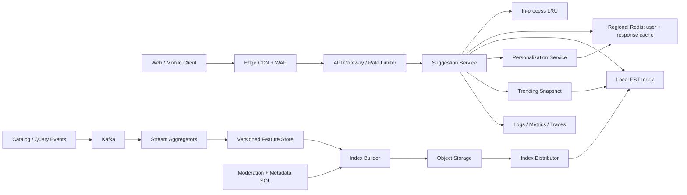

## 1. Problem

Chúng ta xây dựng dịch vụ gợi ý phía sau ô tìm kiếm. Khi người dùng nhập tiền tố như `phot`, dịch vụ trả về một danh sách ngắn, có thứ tự, gồm các hoàn chỉnh hữu ích như “photo printer”, “photo editor” và “photography”. Cùng dịch vụ này phục vụ các client web, mobile và trợ lý giọng nói.

Người dùng gồm khách truy cập ẩn danh, khách hàng đã đăng nhập và các job nạp dữ liệu nội bộ. Luồng tương tác phải hỗ trợ:

- Gợi ý theo tiền tố từ catalog toàn cục.
- Gợi ý cá nhân hóa dựa trên các tìm kiếm gần đây và tùy chọn của người dùng.
- Gợi ý thịnh hành phản ứng với nhu cầu gần đây mà không để một sự kiện nhiễu chi phối.
- Chịu lỗi chính tả thông thường với khoảng cách chỉnh sửa bằng một.
- Xếp hạng theo danh mục, chẳng hạn sản phẩm, người, địa điểm hoặc bài trợ giúp.
- Kết quả một phần khi cá nhân hóa, xu hướng hoặc một replica index không khả dụng.

SLO hướng tới người dùng là p99 dưới 50 ms tại biên dịch vụ, không tính thời gian mạng phía client. Mục tiêu availability của đường dẫn tiền tố cốt lõi là 99.99% theo tháng. Kết quả cũ nhưng an toàn tốt hơn lỗi; gợi ý không được làm lộ truy vấn riêng tư, từ bị chặn hoặc dữ liệu của tenant khác. Một click hoặc sự kiện tìm kiếm có thể mất trong thời gian ngắn, nhưng request ingestion đã hoàn tất phải idempotent và cuối cùng được lập chỉ mục.

## 2. Scale Estimation

Các giả định được nêu rõ để có thể thay bằng số đo production:

- 50 triệu người dùng hoạt động hằng ngày (DAU). Đây là một sản phẩm tiêu dùng lớn, không phải web index toàn cầu.
- Mỗi người dùng thực hiện 20 request autocomplete mỗi ngày. Con số này tính các phím đi qua debounce phía client, không phải mọi lần nhấn phím.
- `50,000,000 x 20 = 1,000,000,000 requests/day`.
- Tốc độ trung bình: `1,000,000,000 / 86,400 = 11,574 RPS`.
- Traffic tăng mạnh quanh thời điểm ra mắt và buổi tối. Peak 10x cho khoảng `116,000 RPS`; cấp thêm headroom 30%, tức công suất đọc `151,000 RPS`.
- Response trung bình gồm 10 gợi ý x 80 byte cộng overhead JSON, xấp xỉ 2 KB. Egress lúc peak là `116,000 x 2 KB = 232 MB/s`, khoảng 1.86 Gbit/s trước overhead giao thức.
- Read chiếm ưu thế. Giả định 10 triệu write sự kiện/query được chấp nhận mỗi ngày: tỷ lệ read:write là `100:1`.
- Một event được chấp nhận khoảng 500 byte. Lưu raw event trong 30 ngày là `10,000,000 x 500 x 30 = 150 GB`; với ba replica bền vững, index và overhead 40%, cần dự phòng khoảng 630 GB. Event log giữ 30 ngày rồi compact hoặc xóa.
- Serving vocabulary có 200 triệu phrase duy nhất. Một entry trie/FST nén, metadata danh mục, counter và feature xếp hạng trung bình 120 byte, tương đương 24 GB raw. Năm replica theo region cộng không gian build tạm cần khoảng 150 GB.
- Mục tiêu availability là 99.99%, cho phép khoảng 4 phút 23 giây không khả dụng trong tháng 30 ngày. Mục tiêu p99 50 ms áp dụng cho response core thành công; suy giảm dependency phải tạo partial response có giới hạn, không chờ đến timeout.
- Phrase tăng 5% mỗi tháng. Event tăng theo DAU và mức sử dụng, vì vậy pipeline event nên chịu được ít nhất 2x peak hiện tại trước khi lên lịch mở rộng.

Các con số này dẫn đến một serving index tối ưu cho đọc và nằm trong memory, một event pipeline có thể scale độc lập, cùng fan-out có giới hạn. Dịch vụ không bao giờ query relational database một lần cho mỗi keystroke.

## 3. API Design

Endpoint public là:

```http
GET /v1/suggestions?q=phot&limit=8&category=all&locale=en-US
Authorization: Bearer <token>       # optional for personalization
X-Request-Id: 7f2c...
```

Response:

```json
{
  "query": "phot",
  "suggestions": [
    {"text": "photo printer", "category": "product", "score": 0.94},
    {"text": "photo editor", "category": "app", "score": 0.89}
  ],
  "complete": true,
  "sources": ["global", "trending"],
  "index_version": "2026-08-15T09:59:40Z",
  "request_id": "7f2c..."
}
```

`limit` bị giới hạn ở 10, còn query được chuẩn hóa (Unicode normalization, case folding và độ dài có giới hạn) trước khi lookup. Server trả `200` với `complete: false` nếu các source tùy chọn timeout. Trả `400` cho locale hoặc hình dạng query không hợp lệ, chỉ trả `401` khi một tính năng được yêu cầu rõ ràng cần danh tính xác thực, và trả `429` khi caller vượt quota. Core index outage trả kết quả cache nếu có; nếu không, trả `503` với `Retry-After`.

Ingestion event tách riêng:

```http
POST /v1/query-events
Idempotency-Key: 6b5d6b9e-...
Authorization: Bearer <token>
Content-Type: application/json

{"query":"photo printer","selected_suggestion":"photo printer","locale":"en-US","occurred_at":"2026-08-15T03:00:02Z"}
```

Response là `202 Accepted` sau khi event được nhận vào durable queue. Idempotency key có phạm vi tenant và endpoint, được giữ 48 giờ. Client không được retry `4xx`, ngoại trừ `429`; có thể retry response bị mất với cùng key. Event mang producer timestamp do server cấp và không được tin cậy cho authorization hoặc tenant identity.

## 4. Data Model

Metadata nguồn sự thật là relational vì ownership của phrase, moderation và publication có version cần constraint và transaction.

```sql
CREATE TABLE phrases (
  tenant_id       BIGINT NOT NULL,
  phrase_id       BIGINT NOT NULL,
  normalized_text  TEXT NOT NULL,
  locale           TEXT NOT NULL,
  category         TEXT NOT NULL,
  status           TEXT NOT NULL,
  base_score       DOUBLE PRECISION NOT NULL,
  updated_at       TIMESTAMPTZ NOT NULL,
  PRIMARY KEY (tenant_id, phrase_id),
  UNIQUE (tenant_id, locale, normalized_text)
);

CREATE INDEX phrases_lookup
  ON phrases (tenant_id, locale, status, normalized_text);

CREATE TABLE query_events (
  tenant_id       BIGINT NOT NULL,
  event_id        UUID NOT NULL,
  idempotency_key TEXT NOT NULL,
  user_id         BIGINT,
  normalized_text TEXT NOT NULL,
  category        TEXT,
  occurred_at     TIMESTAMPTZ NOT NULL,
  PRIMARY KEY (tenant_id, event_id),
  UNIQUE (tenant_id, idempotency_key)
);

CREATE INDEX events_time ON query_events (tenant_id, occurred_at);
```

Unique constraint của phrase ngăn các entry catalog trùng trong một tenant và locale. Lookup index phục vụ công cụ moderation và rebuild, không phục vụ hot suggestion path. Event dùng `(tenant_id, event_id)` để deduplicate bền vững và time index cho aggregation theo cửa sổ. Bảng event lớn được partition theo ngày; nhờ vậy retention 30 ngày là drop partition thay vì xóa một tỷ row.

Serving representation là FST/trie immutable, memory-mapped. Mỗi terminal lưu phrase ID, category, base score và tham chiếu feature nén. Một danh sách riêng theo user được key bằng `(tenant_id, user_id, locale)` và có TTL ngắn. Event stream được partition theo `hash(tenant_id, normalized_text)`: phrase là ordering key cho window aggregation xác định, còn tenant salt ngăn placement liên tenant có thể dự đoán. Một phrase rất phổ biến vẫn có thể nóng, nên aggregator dùng state theo key có giới hạn và combine hai giai đoạn.

## 5. High-Level Architecture



Edge xử lý TLS và abuse hiển nhiên, nhưng suggestion không thể tự do cache theo URL khi identity ảnh hưởng xếp hạng. Gateway áp quota theo tenant, user và IP trước khi request tới service. Suggestion Service sở hữu normalization, fan-out song song có giới hạn, merge và deadline response.

In-process LRU xử lý prefix anonymous lặp lại ở độ trễ cỡ nanosecond. Redis theo region lưu user suggestion ngắn hạn và các response fragment được chọn; nó không phải source of truth. FST local cho lookup tiền tố ổn định mà không cần network hop. Personalization và trending là các nhánh tùy chọn với deadline độc lập. Kafka tách read hướng người dùng khỏi event tăng theo burst. Stream aggregator tạo feature, builder publish snapshot immutable có checksum qua object storage. SQL vẫn là control plane authoritative cho moderation và metadata. Telemetry phát ra ở mọi boundary cùng request ID.

## 6. Deep Dive

**Serving và ranking.** Chuẩn hóa một lần, sau đó query local index để lấy tối đa 50 candidate. Song song, lấy tối đa 20 candidate cá nhân và 20 candidate thịnh hành. Deadline nội bộ 35 ms để dành thời gian cho serialization và biến thiên mạng. Merge theo phrase ID đã chuẩn hóa, loại phrase bị chặn hoặc trùng, áp category filter và xếp hạng bằng:

`final = 0.55 x global + 0.20 x personal + 0.15 x trend + 0.10 x freshness`

Trọng số là cấu hình, không hard-code. Global prior tối thiểu ngăn lịch sử thưa của user tạo ra kết quả rỗng hoặc kỳ lạ. Query nhạy cảm bị loại trước aggregation, còn personalization có phạm vi tenant.

**Chịu lỗi chính tả.** Trước hết query tiền tố chính xác vì cách này rẻ và giữ precision. Nếu có quá ít candidate, tạo các alternative có giới hạn bằng bản đồ thay thế theo bàn phím, một phép chèn, xóa hoặc hoán vị, rồi query một fuzzy side index nhỏ gọn. Service giới hạn số alternative theo độ dài tiền tố và edit distance, sau đó merge với penalty để exact match luôn xếp trước fuzzy match. Nhờ vậy không có fuzzy search không giới hạn trên mỗi keystroke và việc xử lý typo nằm trong latency budget.

**Scale ngang và load balancing.** Instance suggestion stateless, phân bổ trên ba availability zone. Load balancer dùng least outstanding requests vì chi phí CPU thay đổi theo độ dài prefix và fan-out tùy chọn. Autoscaling dùng CPU, p99 latency và request đang xử lý; chỉ dùng CPU sẽ phản ứng quá muộn với cache failure thiên về network. Mỗi instance có worker budget cố định và giới hạn connection riêng cho từng dependency.

**Caching.** Cache key gồm tenant, prefix đã chuẩn hóa, locale, category, model version và identity bucket khi cần. Kết quả global anonymous có TTL 30 giây; trending TTL 10 giây; dữ liệu cá nhân TTL 60 giây và xóa rõ ràng khi account bị xóa. Negative cache cho prefix không có kết quả giữ 2 giây. TTL jitter +/-20% tránh hết hạn đồng loạt. Khi Redis lỗi, kết quả global local vẫn khả dụng và bỏ qua personal ranking. Cache có giới hạn theo byte, không chỉ theo số entry, và không bao giờ cache lỗi authorization.

**Index publication.** Builder đọc một feature watermark nhất quán, tạo snapshot immutable mới, ghi vào object storage và lưu manifest gồm version, checksum, thống kê vocabulary và schema tối thiểu được hỗ trợ. Distributor xác minh checksum, warm snapshot rồi chuyển pointer atomically. Trong rollout, instance phục vụ snapshot cũ nếu snapshot mới không qua validation. Blue/green index rollout có thể so sánh quality và latency của candidate trước promotion; không cần mutate trie tại chỗ.

**Event, ordering và backpressure.** Producer ghi vào Kafka với idempotency key. Event consumer chỉ commit offset sau khi aggregate đã durable. Ordering được bảo đảm theo phrase partition, không toàn cục; ordering toàn cục sẽ làm nghẽn throughput mà không cải thiện chất lượng ranking. Nếu feature storage chậm, consumer pause partition sau khi buffer có giới hạn đầy. Quota event ở gateway và producer limit của Kafka ngăn ingestion spike chiếm tài nguyên đọc. Poison event được retry với exponential backoff, sau đó gửi DLQ kèm payload, error class và offset gốc. DLQ replay dùng replay ID mới nhưng vẫn idempotent.

**Retry và idempotency.** Interactive service không retry quá một lần, chỉ retry một cache read ngắn và idempotent, đồng thời không retry index query đã timeout sau request deadline. Kafka và event store dùng uniqueness `(tenant_id, idempotency_key)`. Nếu producer không nhận response sau khi broker đã nhận message, nó retry cùng key; consumer deduplicate message. Cách này xử lý tình huống “write thành công nhưng response bị mất” mà không giả vờ rằng delivery exactly-once phân tán tồn tại.

**Rate limiting và isolation.** Áp dụng token bucket ở cấp tenant, API key, user và IP. Dành riêng budget core-read, tách khỏi event ingestion. Tenant nhiễu không thể chiếm toàn bộ CPU FST hoặc connection Redis. Adaptive concurrency limit loại bỏ personalization tùy chọn trước khi p99 tăng cao. Gateway giới hạn độ dài query, số candidate và số category.

**Database và sharding.** SQL có một writer cho mỗi partition group và read replica phục vụ công cụ rebuild. Nó không nằm trên request path. Event aggregation dùng hash partition để phân tải đều; event store bền vững partition theo ngày để retention. Redis triển khai theo region với replica và automatic failover, nhưng cache có thể dựng lại. Không cần distributed lock cho serving: publication snapshot chỉ là thay đổi atomic pointer. Lease chỉ dùng để bảo đảm một builder đang hoạt động cho mỗi `(tenant, locale, model_version)`; mất lease thì dừng publication thay vì làm hỏng index.

**Region và disaster recovery.** Mỗi region có serving snapshot đầy đủ và có thể phục vụ global result độc lập. Event stream replicate bất đồng bộ sang region thứ hai. Route traffic khỏi region hỏng bằng health check, chấp nhận feature personal/trending mới nhất có thể bị trễ. Manifest snapshot và object storage được replicate cross-region. Recovery point objective là 15 phút cho event; recovery time objective là 30 phút cho full regional rebuild. Regional failover chủ động tắt personalization nếu user store của region đó không khả dụng.

## 7. Consistency Model

Có ba miền consistency rõ ràng:

- Moderation và metadata tenant strongly consistent trong transaction SQL primary. Phrase bị block không được đi vào snapshot mới sau khi transaction block đã được acknowledge.
- Global, trending và model feature eventually consistent. Mục tiêu freshness thông thường là 60 giây từ lúc nhận event đến khi snapshot khả dụng; replication lag được đưa vào response metadata và telemetry.
- User history có read-after-write trong serving region khi có thể, nhưng cross-region read có thể cũ tối đa 5 phút. Thiếu personal result thì hạ cấp về global ranking.

Publication atomic trên từng instance: request thấy trọn vẹn snapshot cũ hoặc mới, không bao giờ thấy cấu trúc đang build dở. Trong lúc lag, service phục vụ snapshot hợp lệ cuối cùng và đánh dấu `complete` dựa trên health của source, không dựa vào việc mọi optional feature đã đến hay chưa.

Với event write thành công nhưng HTTP response bị mất, client retry cùng idempotency key. API có thể trả lại `202` hoặc receipt đã lưu; không bao giờ tạo event logic thứ hai. At-least-once delivery cộng durable deduplication là bảo đảm thực tế. Search result không hứa query vừa nhập sẽ xuất hiện ngay.

## 8. Failure Scenarios

| Failure | Impact | Detection | Recovery |
|---|---|---|---|
| Primary metadata DB không khả dụng | Cập nhật moderation và manifest rebuild tạm dừng; serving dùng snapshot đã duyệt cuối cùng | DB health, write error, replica lag, transaction latency | Fail write closed, tiếp tục phục vụ snapshot cuối, failover SQL rồi rebuild từ watermark nhất quán cuối |
| Kafka consumer bị kẹt ở poison event | Freshness trending tăng; partition lag tăng | Consumer lag theo partition, tuổi message cũ nhất, DLQ rate | Dừng vòng retry, chuyển event vào DLQ, tiếp tục từ offset kế, replay sau khi sửa validation |
| Redis cluster failover hoặc không thể truy cập | Cache miss cá nhân và CPU service tăng; global result vẫn khả dụng | Cache timeout rate, hit ratio, connection error, pool saturation | Bypass Redis, dùng local cache, giảm optional fan-out, khôi phục replica trước khi bật write lại |
| Một index snapshot bị hỏng | Một phần instance không load được version mới | Checksum/load failure, version skew, readiness failure | Giữ snapshot cũ, cách ly artifact, rebuild và republish atomically |
| Region mất network hoặc nguồn điện | Request vùng đó lỗi; feature freshness replicate dừng | Synthetic probe, regional error-budget burn, load-balancer health | Chuyển traffic sang region khác, phục vụ snapshot cuối của region đó, reconcile event sau khi khôi phục |
| Trending key trở nên cực nóng | Một aggregator partition hoặc cache key bị bão hòa | Throughput từng key, partition skew, CPU và queue depth | Dùng salted subkey và aggregation hai giai đoạn; giới hạn đóng góp mỗi user |
| Ranking dependency vượt deadline | p99 tăng và request trở thành incomplete | Dependency latency histogram và tỷ lệ `complete=false` | Hủy công việc tùy chọn ở deadline và trả global candidate; không retry trong request path |

## 9. Observability

Mỗi request nhận hoặc truyền tiếp `X-Request-Id` và W3C trace ID. Log có cấu trúc, gồm tenant hash, độ dài prefix đã chuẩn hóa, cache outcome, index version, source set, deadline và số kết quả; raw user query được sample hoặc redact theo chính sách privacy.

SLI cốt lõi là availability, p50/p95/p99 latency, timeout rate và tỷ lệ response có ít nhất một suggestion hợp lệ. Alert phải gắn với hành động:

- p99 trên 50 ms trong 5 phút chỉ ra instance quá tải, dependency chậm hoặc connection-pool contention.
- `complete=false` trên 1% chỉ ra dependency tùy chọn hoặc snapshot health suy giảm.
- Index version skew hoặc freshness age trên 2 phút chỉ ra phân phối thất bại.
- Redis timeout rate và hit ratio phân biệt cache outage với miss thông thường.
- Kafka oldest-message age, lag theo partition, số lần rebalance và DLQ rate nhận diện consumer kẹt hoặc dữ liệu poison.
- SQL connection-pool utilization, lock wait, replica lag và transaction error nhận diện control-plane saturation.
- CPU, RSS, page fault, file-descriptor use và request đang xử lý nhận diện instance saturation.
- Rejection rate theo tenant và mức tập trung hot key nhận diện abuse hoặc partition skew.

Dashboard liên kết trace span cho normalization, index lookup, Redis, personal ranking và serialization. Synthetic probe gõ các prefix phổ biến từ mọi region. Quality metric như click-through rate, zero-result rate, duplicate rate và blocked-term exposure được theo dõi riêng với latency; suggestion sai nhưng nhanh vẫn là failure.

## 10. Capacity Planning

Ở peak đã cấp `151,000 RPS`, benchmark cho thấy một instance đạt 2,500 RPS với p99 dưới 35 ms và CPU 50%. Số instance cần là `151,000 / 2,500 = 61`; cộng năng lực N+2 khi mất zone và 30% headroom vận hành, triển khai 84 instance, 28 mỗi zone. Nếu mất một zone, 56 instance vẫn cung cấp 140,000 RPS, vì vậy autoscaling phải tăng các zone còn lại khi peak kéo dài hoặc admission controller phải loại bỏ optional work.

Index raw 24 GB trở thành khoảng 35 GB sau runtime structure. Instance 64 GB còn chỗ cho process, allocator fragmentation và hai snapshot memory-mapped trong rollout. Anonymous cache 30 giây ở peak có thể chứa `116,000 x 30 = 3.48 million` response. Với 2 KB mỗi response cộng overhead, dành 10 GB mỗi region cho tier này, có eviction thay vì tăng không giới hạn. Dung lượng personal cache được giới hạn riêng theo tenant và user.

Kafka cần ít nhất 48 partition cho event traffic, giả định 2,500 event/s mỗi partition và biên burst 2x (`10,000,000/day = 116 events/s average`, nhưng launch burst và replay mới là yếu tố chi phối). Sáu consumer instance, mỗi instance tám partition, cung cấp parallelism; scale lên 12 consumer khi catch-up. Giữ broker retention 24 giờ để replay, còn durable event store giữ 30 ngày.

Event database nhận khoảng 116 write/s trung bình và 1,160 write/s ở burst 10x, nhưng replica và index khiến I/O là giới hạn. Cấp primary cho 2,000 durable write/s, hai read replica và partition theo ngày. Connection pool 40 kết nối trên mỗi suggestion instance sẽ tạo 3,360 connection tiềm năng, nên request path không connect SQL; control-plane worker dùng pool riêng 100 connection mỗi region với maximum phía database được đặt phù hợp cho failover.

Truyền snapshot cross-region khoảng 35 GB mỗi lần publish. Publish mỗi giờ là 840 GB/tháng trước replication overhead, vì vậy nên đưa vào delta-aware distribution và manifest nếu con số này đáng kể. Capacity test đầu tiên phải gồm cold snapshot loading, Redis failure, Kafka replay và mất một zone, không chỉ cache hit steady-state.

## 11. Bottlenecks and Evolution

Bottleneck đầu tiên thường là tail p99 từ optional fan-out, không phải trie lookup. Ở 10x traffic, Redis connection pool, network bandwidth và hot prefix là các giới hạn kế tiếp. Trước hết, ta cô lập core index path, chuyển trending thành local snapshot nhỏ và áp adaptive concurrency trước khi thêm dependency.

Ở 100x, một vocabulary theo region và full snapshot trên từng instance trở nên đắt. Chia index theo tenant/locale hoặc prefix range, route prefix nhất quán và chỉ replicate hot range đến mọi node. Dùng index hai tầng: tier common-prefix rất nhỏ trong memory và immutable shard tải từ xa có admission control. Tách traffic interactive khỏi batch rebuild ở lớp network và compute.

Kiến trúc mục tiêu vẫn giữ serving stateless nhưng thêm global traffic manager, regional isolation, tiered index shard, streaming feature computation và offline evaluation gate cho thay đổi model. Ranking model có thể tiến từ rule có trọng số sang learned model chỉ sau khi freshness feature, khả năng giải thích và rollback đo được. Thứ tự redesign do tail latency và hot-key skew quyết định, không phải do chọn database thời thượng hơn.

## 12. Trade-offs

| Decision | Option A | Option B | Decision | Why |
|---|---|---|---|---|
| Metadata store | SQL | NoSQL | SQL | Uniqueness, moderation và constraint publication quan trọng hơn write scale; nó nằm ngoài hot path. |
| Event transport | Kafka | RabbitMQ | Kafka | Replay, ordering theo partition và stream throughput phù hợp với aggregation; RabbitMQ tốt hơn cho work queue nhỏ có routing từng message. |
| Cache | Redis | Database cache | Redis | Cần TTL có giới hạn, failover theo region và cấu trúc độ trễ thấp; DB vẫn authoritative. |
| Feature updates | Synchronous | Asynchronous | Asynchronous | Keystroke latency không được chờ aggregation; freshness được xác định là eventual. |
| Regions | Active-active | Active-passive | Active-active serving | Snapshot immutable đầy đủ giúp read failover thực tế; write vẫn dùng primary pipeline có kiểm soát. |
| Sharding | Range | Hash | Hash cho event, range có chọn lọc cho index shard | Hash tránh event hotspot; locality theo range chỉ giúp prefix lookup ở quy mô lớn hơn nhiều. |
| Freshness delivery | Polling | Push | Polling manifest | Snapshot theo giờ hoặc phút không biện minh cho persistent connection đến mọi serving node. |
| Service protocol | REST | gRPC | REST ở edge, gRPC nội bộ | Browser và mobile cần HTTP đơn giản; call nội bộ typed giảm overhead nơi có fan-out. |

## 13. Production Checklist

- [ ] SLO p99, availability, freshness và partial-result có owner và ngưỡng alert.
- [ ] Normalization query, tenant isolation, moderation filter và privacy redaction đã được test.
- [ ] Idempotency key, duplicate handling, retry limit và DLQ replay đã được xác minh.
- [ ] Checksum snapshot, schema compatibility, warm-up, rollback và version-skew check đều đạt.
- [ ] Load test bao phủ peak 10x, hot prefix, cold cache, Redis failure, Kafka replay và mất zone.
- [ ] Rate limit cô lập tenant, user, IP, core read và ingestion.
- [ ] Dashboard hiển thị p99, incomplete response, cache health, index age, lag, pool saturation và quality metric.
- [ ] Regional failover, event reconciliation, RPO 15 phút và RTO 30 phút đã được diễn tập.

## 14. Engineering References

1. **Company:** Google SRE  
   **Article title:** *Site Reliability Engineering: The SRE Book*  
   **URL:** https://sre.google/sre-book/table-of-contents/  
   **Key engineering lesson:** SLO, error budget, overload control và monitoring phải là các hợp đồng vận hành rõ ràng.  
   **How it influenced this design:** Mục tiêu p99 50 ms và availability 99.99%, alert có thể hành động, graceful degradation và headroom capacity được xem là input thiết kế chứ không phải metric sau launch.

2. **Company:** Google Research  
   **Article title:** *Google Research Publications*  
   **URL:** https://research.google/pubs/  
   **Key engineering lesson:** Search quality là bài toán hệ thống thực nghiệm: ranking, evaluation, latency và freshness phải được đo cùng nhau.  
   **How it influenced this design:** Thiết kế tách serving khỏi feature computation và yêu cầu quality metric cùng offline evaluation gate trước thay đổi ranking.

3. **Company:** Netflix Technology Blog  
   **Article title:** *Netflix Tech Blog*  
   **URL:** https://netflixtechblog.com/  
   **Key engineering lesson:** Hệ thống phân tán bền bỉ phải cô lập dependency và biến graceful degradation thành hành vi có chủ đích.  
   **How it influenced this design:** Personalization và trending có deadline độc lập, còn global index vẫn là fallback hữu ích khi dependency hoặc region lỗi.

4. **Company:** Cloudflare Blog  
   **Article title:** *Cloudflare Blog*  
   **URL:** https://blog.cloudflare.com/  
   **Key engineering lesson:** Hệ thống edge cần kiểm soát rõ ràng cho caching, abuse, traffic burst và regional failure.  
   **How it influenced this design:** Kiến trúc đặt WAF/rate limiting ở edge, dùng cache có giới hạn và jitter, đồng thời coi traffic shifting là một hành động recovery bình thường.
