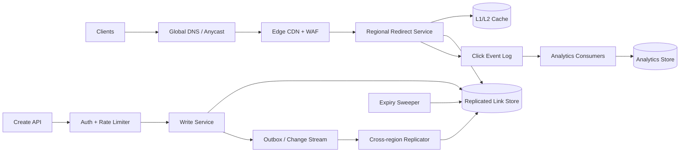

## 1. Problem

Ta xây dựng một dịch vụ rút ngắn URL cho người dùng và ứng dụng, biến một đích đến dài thành liên kết ngắn ổn định. Liên kết có thể được tạo tự động hoặc bằng alias tùy chỉnh; sau đó phục vụ chuyển hướng HTTP 301 (vĩnh viễn) hoặc 302 (tạm thời). Chủ sở hữu có thể xem phân tích lượt nhấp và đặt thời gian sống (TTL).

Dịch vụ phải giữ các liên kết vĩnh viễn: sau khi alias được công bố, nó không được âm thầm trỏ sang nơi khác. Lưu lượng chuyển hướng là đường đi quan trọng, còn phân tích được cố ý tách khỏi đường đi đó. Ta giả định tỷ lệ đọc:tạo là 100:1, người dùng toàn cầu và client có thể retry sau timeout.

Mục tiêu phi chức năng:

- p99 chuyển hướng dưới 50 ms tại edge dịch vụ, không tính mạng của người dùng và việc tải đích đến.
- Availability hàng tháng 99.99% cho việc phục vụ chuyển hướng; tạo liên kết và phân tích có thể có SLO thấp hơn riêng.
- Key sinh tự động không va chạm và quyền sở hữu alias tùy chỉnh được tuyến tính hóa.
- Không mất mapping đã commit; phân tích có thể trễ nhưng không bị nhân đôi âm thầm trong báo cáo.
- Đường đọc vẫn hoạt động trong thời gian region ghi hoặc hệ thống phân tích gặp sự cố.

## 2. Scale Estimation

Các con số dưới đây là giả định lập kế hoạch, không phải tuyên bố về một sản phẩm hiện hữu cụ thể.

- Giả định 100 triệu client hoạt động hằng ngày tạo chuyển hướng. Với 10 chuyển hướng/client/ngày: `100M x 10 = 1B redirects/day`.
- Tốc độ chuyển hướng trung bình là `1B / 86,400 = 11,574 requests/s`.
- Đỉnh theo ngày và chiến dịch tăng 10x cho `115,740 requests/s`; cấp năng lực 150,000 requests/s để có dư địa.
- Với tỷ lệ đọc:ghi 100:1, tạo liên kết là `10M/day`, trung bình `116 writes/s` và khoảng `1,160 writes/s` lúc đỉnh.
- Nếu một row mapping trung bình 600 byte, gồm index và metadata replication, bảy năm liên kết không hết hạn cần `10M x 365 x 7 x 600 = 15.33 TB` trước replica và compaction. Với ba bản sao, lập kế hoạch khoảng 46 TB.
- Một response chuyển hướng khoảng 1 KB, gồm header. Băng thông egress đỉnh là `150,000 x 1 KB x 8 = 1.2 Gb/s`; edge provider cần thêm dư địa cho TLS và cache miss.
- Một click event khoảng 200 byte. Với một event cho mỗi chuyển hướng, ingress thô là `1B x 200 = 200 GB/day`, tương đương khoảng 73 TB/năm trước replication Kafka và lưu trữ warehouse.
- Dùng hệ số lập kế hoạch tích lũy 1.2 cho tăng trưởng link: mapping giữ bảy năm xấp xỉ `10M x 1.2 x 365 x 7 = 30.66B` row, hay 18.4 TB byte row chính với ước tính 600 byte.
- Ngân sách availability cho SLO 99.99% là khoảng 4.32 phút mỗi tháng 30 ngày. Vì vậy redirect fail-open về cache khi an toàn, nhưng tuyệt đối không tự tạo destination.

Hệ quả chính là database được sizing theo ghi vẫn chưa đủ: read fleet, edge cache và replication liên vùng phải hấp thụ lưu lượng lớn hơn hai bậc độ lớn.

## 3. API Design

### Tạo liên kết

`POST /v1/links`

```json
{
  "destination": "https://example.com/articles/very-long-path",
  "alias": "launch-2026",
  "status_code": 302,
  "expires_at": "2027-01-01T00:00:00Z"
}
```

`alias` là tùy chọn. Chủ sở hữu đã xác thực được lấy từ access token, không lấy từ body. Client gửi `Idempotency-Key`; server lưu request fingerprint và kết quả trong 24 giờ.

```json
{
  "id": "01K2...",
  "alias": "launch-2026",
  "short_url": "https://s.example/launch-2026",
  "status_code": 302,
  "expires_at": "2027-01-01T00:00:00Z"
}
```

Trả `201` cho link mới, `200` cho replay idempotent, `409` khi alias tùy chỉnh đã có người dùng, `422` cho destination hoặc TTL không hợp lệ và `429` khi vượt rate limit của owner hoặc IP. Alias tùy chỉnh không bao giờ được gán lại, kể cả sau khi hết hạn.

### Chuyển hướng

`GET /{alias}` trả `301` cho mapping vĩnh viễn hoặc `302` cho mapping tạm thời, kèm header `Location`. Alias không tồn tại, hết hạn, bị vô hiệu hóa hoặc sai định dạng trả `404`, không tiết lộ alias đã xóa từng tồn tại hay chưa. Edge có thể cache response âm trong thời gian ngắn nhưng phải tôn trọng negative TTL ngắn.

### Phân tích

`GET /v1/links/{id}/analytics?from=...&to=...&bucket=hour` trả các bộ đếm tổng hợp và timestamp độ mới. Dữ liệu nhất quán cuối cùng. `POST /v1/links/{id}/disable` yêu cầu xác thực và idempotent; việc vô hiệu hóa là một state transition có thứ tự mạnh.

## 4. Data Model

Source of truth là một kho key-value/SQL-compatible được sharding và nhất quán mạnh. Ký hiệu SQL làm rõ constraint; triển khai vật lý có thể dùng distributed SQL hoặc key-value với các conditional write tương đương.

```sql
CREATE TABLE links (
  link_id       UUID PRIMARY KEY,
  alias         VARCHAR(32) NOT NULL UNIQUE,
  owner_id      BIGINT NOT NULL,
  destination   TEXT NOT NULL,
  redirect_code SMALLINT NOT NULL CHECK (redirect_code IN (301, 302)),
  state         VARCHAR(12) NOT NULL CHECK (state IN ('active', 'disabled', 'expired')),
  created_at    TIMESTAMP NOT NULL,
  expires_at    TIMESTAMP NULL,
  version       BIGINT NOT NULL,
  shard_key     BIGINT NOT NULL
);

CREATE INDEX links_owner_created ON links (owner_id, created_at DESC);
CREATE INDEX links_expiry ON links (expires_at) WHERE state = 'active';

CREATE TABLE idempotency_records (
  owner_id      BIGINT NOT NULL,
  idempotency_key VARCHAR(128) NOT NULL,
  request_hash  CHAR(64) NOT NULL,
  response_json JSON NOT NULL,
  created_at    TIMESTAMP NOT NULL,
  PRIMARY KEY (owner_id, idempotency_key)
);
```

`alias` là key tra cứu redirect, nên unique index là nơi kiểm tra va chạm có thẩm quyền. `(owner_id, created_at)` hỗ trợ màn hình danh sách của owner mà không quét alias. Partial expiry index cung cấp dữ liệu cho sweeper; expiry cũng được kiểm tra đồng bộ lúc đọc nên sweeper không phải dependency của tính đúng. `shard_key` là hash ổn định của alias, không phải ID tăng dần: nó phân bổ alias nóng và tránh write partition đơn điệu.

Analytics tách riêng:

```sql
CREATE TABLE click_hourly (
  link_id       UUID NOT NULL,
  hour          TIMESTAMP NOT NULL,
  country       CHAR(2) NOT NULL,
  device_class  VARCHAR(16) NOT NULL,
  clicks        BIGINT NOT NULL,
  PRIMARY KEY (link_id, hour, country, device_class)
);
```

Event stream, không phải redirect database, là nguồn của aggregate này. Aggregate key làm truy vấn link/time hiệu quả; retention và rollup ngăn storage analytics tăng vô hạn.

## 5. High-Level Architecture



- Global DNS/Anycast đưa client tới edge khỏe gần nhất, giảm handshake và độ trễ mạng.
- CDN/WAF hấp thụ redirect có thể cache, chặn scan lạm dụng và áp dụng rate limit thô trước khi tiêu thụ capacity origin.
- Regional redirect service tra cache, kiểm tra state và expiry rồi trả redirect. Nó stateless nên scale ngang được.
- Replicated link store là source of truth bền vững. Read dùng replica cục bộ; write tới home region của alias hoặc endpoint ghi có quorum.
- Click event log tách analytics khỏi latency redirect. Payload giới hạn tránh đưa user-agent hay destination vào đường mapping nóng.
- Consumer batch và upsert aggregate theo giờ vào analytics store, có thể replay từ event còn retention.
- Outbox/change stream khiến create đã commit được replication và cache invalidation nhìn thấy mà không có khoảng trống dual-write.
- Expiry sweeper thu hồi hoặc đánh dấu row cũ, nhưng kiểm tra expiry lúc request bảo vệ tính đúng nếu sweeper trễ.

## 6. Deep Dive

### Đường redirect và caching

Lookup key là alias đã normalize. Edge cache an toàn cho `301` chỉ khi hợp đồng sản phẩm coi destination là bất biến. `302` có thời gian cache ngắn và cấu hình được. Cache entry chứa `state`, `expires_at`, `redirect_code` và mapping version. Origin so sánh expiry với clock của mình và trả `404` sau khi hết hạn.

Dùng L1 memory cache theo region cho alias nóng nhất và L2 shared cache cho dữ liệu ấm. Cache-aside đọc sẽ nạp L2 sau miss; write invalidate hoặc tăng version cả hai tầng sau khi store commit. Cơ chế single-flight gộp các miss đồng thời của một alias. Nó bị giới hạn và cục bộ, nên cache outage làm giảm về store thay vì tạo global lock.

Alias phổ biến tạo hot key dù shard đã cân bằng. CDN cache, request coalescing theo key và read copy được nhân bản xử lý vấn đề này; chỉ thêm database shard thì không.

### Sinh key và alias tùy chỉnh

Alias tự động dùng ID ngẫu nhiên 64-bit hoặc ID có thứ tự theo thời gian, mã hóa base62. Không gian 64-bit có `62^11`, khoảng `5.2e19`, chuỗi 11 ký tự khả dĩ. Vẫn phải enforce uniqueness bằng transaction: va chạm hiếm gặp sẽ retry với ID mới. Alias tùy chỉnh dùng conditional insert trên alias key duy nhất. Thao tác chỉ idempotent với cùng owner và request key; hai owner tranh cùng alias sẽ có một bên thành công và một bên `409`.

Không bao giờ tái sử dụng alias. Tombstone hoặc reservation vĩnh viễn ghi nhận ownership lịch sử, ngăn QR cũ hoặc 301 đã cache mang ý nghĩa khác.

### Write, replication và transaction

Write transaction insert `links` và `idempotency_records` cùng nhau. Unique constraint và conditional write là ranh giới kiểm tra va chạm. Chỉ trả response sau khi replica home xác nhận transaction bền vững. Change stream/outbox phát từ committed state, nên process crash không thể báo thành công nhưng làm mất thông báo replication.

Read được phục vụ cục bộ sau replication. Link vừa tạo có thể tạm thời chưa có ở region khác; API có thể trả home region và redirect service có thể bounded read-through tới home region khi local miss. Cách này bảo vệ read-your-write của người tạo mà không biến mọi redirect toàn cầu thành synchronous.

### Analytics, queue và backpressure

Redirect handler phát event gọn gồm `event_id`, `link_id`, timestamp, địa lý thô, device class và region. Nó không chờ analytics. Log được partition bằng salted hash của `link_id`, đủ partition cho ingress đỉnh và consumer parallelism. Một link nổi tiếng không được dồn mọi event vào một partition.

Consumer commit offset sau durable aggregate upsert. Upsert có key `(link_id, hour, country, device_class)` và mang deduplication watermark hoặc tập event-ID trong cửa sổ replay. Điều này cho at-least-once delivery với chống duplicate có giới hạn. Exact global event uniqueness không đáng để làm chậm redirect; báo cáo công khai freshness và có thể reconcile event đến muộn.

Nếu consumer lag, log giữ event, scale thêm consumer, còn dimension ưu tiên thấp có thể sample hoặc xử lý muộn. Nếu log unavailable, redirect vẫn thành công; buffer cục bộ có giới hạn hấp thụ outage ngắn, sau đó drop phải được đếm rõ ràng. Dead-letter queue giữ event sai sau ngân sách retry hữu hạn. Exponential backoff kèm jitter ngăn downstream lỗi gây retry storm.

### Rate limit, retry và load balancing

API create và disable dùng token bucket theo owner đã xác thực, API key, IP và uy tín domain đích. Redirect dùng WAF abuse control và limit theo edge, nhưng link phổ biến bình thường không bị throttle như tấn công. Load balancer route theo latency và health, có connection draining khi deploy.

Client chỉ retry create với cùng `Idempotency-Key`. Server từ chối key đã dùng với request hash khác (`409`). Redirect GET an toàn để retry, nhưng retry không được tạo side effect billing hoặc analytics lần hai; `event_id` được suy ra từ request ID cộng time bucket ngắn hoặc được deduplicate downstream.

Connection pool phải thấp hơn giới hạn database: mỗi service instance có pool giới hạn và request queue có deadline. Khi queue đầy, fail-fast thay vì để thread chất đống và khuếch đại latency. Circuit breaker ngừng gửi tới replica lỗi; half-open probe kiểm tra phục hồi.

### TTL và disaster recovery

TTL là metadata, không phải timer phải thức đúng tại deadline. Kiểm tra lúc request là authoritative. Sweeper đánh dấu link hết hạn theo batch, rate-limit để không tranh capacity với read, và cache invalidation đi sau state change. Alias vĩnh viễn giữ tombstone.

Mỗi region có compute và cache capacity độc lập. Link data bền vững đồng bộ trong home region và replication bất đồng bộ sang region khác với RPO được công bố, ví dụ năm phút. Regional failover đổi routing sang replica khỏe; control plane ngăn hai region nhận write xung đột cho cùng alias. Backup được mã hóa, kiểm thử bằng restore drill và giữ tách khỏi live store.

## 7. Consistency Model

Nhất quán mạnh cần cho quyền sở hữu alias, idempotency record, thao tác disable và mapping source-of-truth đã commit. Alias tùy chỉnh không thể có hai destination, và disable thành công không được update cũ ghi đè.

Nhất quán cuối cùng chấp nhận được cho replica theo region, cache fill, analytics aggregate, owner list view và expiry sweeping. Replica lag được đo và giới hạn. Khi cache miss ngay sau khi tạo, service có thể route request của creator về home region; với người khác, propagation delay ngắn là đánh đổi availability/latency rõ ràng.

Nếu response create bị mất sau commit, client retry cùng idempotency key và nhận response đã lưu. Nếu server timeout trước commit, retry hoặc tìm thấy idempotency record đã commit hoặc thực thi transaction an toàn. Key khác là operation mới và có thể tạo link khác theo thiết kế.

## 8. Failure Scenarios

| Failure | Impact | Detection | Recovery |
|---|---|---|---|
| Home link-store quorum không khả dụng | Create lỗi hoặc chuyển read-only; redirect đã cache vẫn chạy | Tỷ lệ lỗi write, quorum health, commit latency | Route write tới failover region được phê duyệt hoặc trả `503`; không acknowledge mapping chưa commit |
| Regional read replica down hoặc lag | Cache miss cục bộ tăng; link mới có thể vắng mặt | Replica health, replication lag, tỷ lệ read fallback | Dùng replica khác hoặc bounded home-region read; loại endpoint không khỏe khỏi routing |
| Cache cluster lỗi | Origin QPS và p99 redirect tăng mạnh | Cache hit ratio, origin QPS, store saturation | Phục vụ từ store với admission control; khôi phục cache từ từ và tránh stampede bằng single-flight |
| Kafka/log producer không khả dụng | Event analytics trễ hoặc bị drop khỏi buffer giới hạn | Producer error, buffer utilization, event-loss counter | Vẫn thành công redirect, replay buffer cục bộ nếu có, cảnh báo loss, khôi phục log và backfill nếu còn source |
| Analytics consumer mắc ở poison event | Freshness aggregate dừng; log depth tăng | Consumer lag từng partition, retry count, DLQ rate | Pause partition, đưa event vào DLQ sau retry budget, sửa consumer, replay từ offset |
| Network toàn region lỗi | Client trong region tăng latency hoặc lỗi | Anycast health probe, regional SLO, synthetic redirect | Rút region, failover read, giữ write fencing, khôi phục sau khi kiểm tra health và lag |
| Idempotency store timeout sau DB commit | Client có thể retry và tưởng create bị duplicate | Mismatch giữa link đã commit và idempotency record | Giữ cả hai trong một transaction; reconciliation job phát hiện bất thường lịch sử và trả mapping gốc |
| Hot alias campaign làm origin quá tải | Một key làm shard hoặc service pool bão hòa | QPS theo alias, shard skew, cache bypass rate | Tăng edge TTL khi hợp đồng cho phép, coalesce miss, nhân bản read data, bảo vệ có mục tiêu |

## 9. Observability

Mỗi request mang hoặc nhận `trace_id` và `request_id`; log gồm alias hash, link ID nếu biết, region, cache tier, store outcome và response class. Mặc định không log destination đầy đủ hoặc định danh người dùng thô.

SLI và alert hữu ích:

- Redirect success rate và latency p50/p95/p99 theo region, cache outcome, status code và alias class. Alert khi p99 vượt 50 ms hoặc error budget burn.
- Cache hit ratio, origin reads/giây, single-flight waiter và phân bố hot-key. Hit ratio sụp báo cache failure hoặc deployment đổi cache key.
- Store read/write latency, conditional-write conflict, replica lag, shard unavailable và connection-pool utilization. Pool saturation với CPU bình thường cho thấy queueing hoặc rò rỉ connection.
- Log producer error rate, publish latency, buffer fill, consumer lag theo partition, retry rate, DLQ count và aggregate freshness. Lag không kèm consumer CPU thường là partition mắc hoặc downstream store lỗi.
- WAF block, rate-limit reject, malformed alias, tỷ lệ 404 và QPS theo alias. 404 tăng đột ngột có thể báo replication lỗi hoặc release normalize alias sai.
- Synthetic probe tạo test link, redirect từ nhiều region, kiểm tra expiry và query analytics. Trace nối các đường create, replication, cache fill, redirect và aggregate.

## 10. Capacity Planning

Lập kế hoạch cho 150,000 redirect/s đỉnh và 1,160 create/s đỉnh.

- Nếu một redirect instance xử lý an toàn 2,000 request/s ở p99 mục tiêu, `150,000 / 2,000 = 75`; deploy 100 instance để có 25% headroom và kịch bản mất một region. Nếu một region thường mang 25%, fleet còn lại phải xử lý 100% lúc failover, nên capacity được cấp theo failure domain, không chỉ toàn cục.
- Giả định hit edge/L1/L2 là 90%. Origin nhận `150,000 x 10% = 15,000 reads/s`; với 100 instance, tải trung bình hướng origin là 150 read/s/instance, trước failover.
- Với 600 byte/mapping, 30.66B row trong bảy năm là 18.4 TB dữ liệu chính. Ba replica, index và 30% headroom vận hành cho khoảng `18.4 x 3 / 0.7 = 79 TB` storage provisioned.
- Với 200 GB/ngày click event, giữ 14 ngày trong log: `200 x 14 = 2.8 TB` raw; ba replica và 30% headroom cần khoảng 10.9 TB. Aggregate dài hạn thuộc analytics storage rẻ hơn.
- Ở đỉnh 200,000 event/s, với event 200 byte và giới hạn payload bảo thủ 1 MB/s cho mỗi log partition, payload cần khoảng 40 partition; chọn 64 để có consumer parallelism và chỗ rebalance. Bắt đầu 16 consumer, mỗi consumer bốn partition, rồi autoscale theo lag, không chỉ CPU.
- Với 1,160 write/s đỉnh và 300 write/s mỗi database writer, cần ít nhất bốn writer worker; deploy tám worker trên các failure domain. Giữ pool mỗi instance ở 20 connection: 100 redirect instance không nên giữ write pool lớn, nên redirect service dùng read-only pool và write service sở hữu write connection.
- L2 cache chứa 2B mapping nóng, trung bình 450 byte cộng overhead, cần khoảng 1.5 TB usable memory. Đây là mục tiêu dựa trên popularity đo được, không phải yêu cầu cache toàn bộ 30.66B row.

Các số này được xác nhận bằng load test có phân bố alias Zipfian, chạy cache warm và cold, traffic failover cùng overhead TLS/serialization thực tế.

## 11. Bottlenecks and Evolution

Bottleneck đầu tiên thường không phải sinh alias; đó là origin capacity khi cache miss trong burst của link phổ biến hoặc cache invalidation storm. Vì vậy redesign đầu tiên là edge cache tốt hơn, single-flight và hot-key replication, không phải thêm bit cho ID.

Ở 10x, origin read tiến tới 150,000/s dù hit rate giữ nguyên, còn analytics đạt 2B event/ngày. Tách redirect serving khỏi control plane, dùng mapping tier replicated toàn cầu chuyên dụng và partition analytics bằng salted link hash với retention raw và aggregate riêng.

Ở 100x, một global store và một event log trở thành bottleneck về tổ chức và vận hành. Đưa mapping bất biến vào read store replicated theo region hoặc edge-distributed key-value layer, giữ ownership write trong control plane sharded và dùng hierarchical aggregation. Kiến trúc đích có redirect data tại edge, alias ownership được bảo vệ bằng quorum, failure domain region độc lập và analytics có thể replay. Mọi bước chuyển phải giữ invariant không tái sử dụng alias.

## 12. Trade-offs

| Decision | Option A | Option B | Decision | Why |
|---|---|---|---|---|
| Primary store | Distributed SQL | Key-value store | Distributed SQL-compatible store initially | Conditional uniqueness, owner query và transaction có giá trị; chuyển read replica sang KV khi access pattern ổn định |
| Event transport | Kafka/log | RabbitMQ | Kafka-like durable log | Replay volume lớn, ordering theo partition và consumer recovery quan trọng hơn routing từng message |
| Cache | Redis/shared cache | Database cache | L1 cộng shared cache | Đưa hot read khỏi store và hỗ trợ TTL; cache không bao giờ là source of truth |
| Analytics timing | Synchronous | Asynchronous | Asynchronous | Bảo vệ redirect p99 khỏi warehouse và consumer failure |
| Multi-region | Active-active | Active-passive | Active reads, fenced regional writes | Read cần locality; alias ownership cần một conflict boundary |
| Sharding | Range by alias | Hash by alias | Hash by alias | Tránh hot partition tuần tự và theo lexical; owner/time query dùng secondary index |
| Client updates | Polling | Push/webhook | Polling for analytics | Aggregate không khẩn cấp và polling đơn giản hơn ở scale này |
| Service protocol | REST/HTTP | gRPC | REST ở edge, gRPC nội bộ khi hữu ích | Redirect và public API vốn dùng HTTP; internal typed call có thể giảm overhead mà không buộc browser dùng gRPC |

## 13. Production Checklist

- [ ] Alias uniqueness, tombstone, normalization và no-reuse được kiểm thử với concurrent write.
- [ ] Create retry cùng idempotency key trả cùng response; hash khác trả `409`.
- [ ] Cache directive 301/302, expiry check, disabled state và negative cache được xác minh từ nhiều region.
- [ ] Alert redirect p99, error budget, replica lag, cache hit ratio, store pool, queue depth, consumer lag và DLQ có owner.
- [ ] Load test bao gồm hot key Zipfian, cold-cache storm, đỉnh 10x, failover và downstream chậm.
- [ ] Backpressure, buffer giới hạn, retry budget, circuit breaker và dead-letter replay được kiểm thử.
- [ ] Backup restore thành công; regional failover và write fencing được diễn tập với RPO/RTO đo được.
- [ ] Privacy của destination, chống lạm dụng, SSRF policy cho metadata fetcher, authentication, authorization và audit log được review.

## 14. Engineering References

1. **Google, _Site Reliability Engineering Book_** — https://sre.google/sre-book/table-of-contents/ — Các nguyên tắc về service-level objective, error budget và xử lý quá tải định hình redirect SLO riêng, ngân sách failover và alert saturation.
2. **Google Research, _Research Publications_** — https://research.google/pubs/ — Chỉ mục nghiên cứu công khai định hình cách dùng tư duy xác suất cho phân tích va chạm và kỷ luật nêu giả định đo được thay vì coi scale là khẩu hiệu sản phẩm.
3. **Netflix, _Netflix Tech Blog_** — https://netflixtechblog.com/ — Trọng tâm vận hành vào các service lỗi độc lập ảnh hưởng đến regional redirect fleet stateless, graceful degradation và retry có kiểm soát.
4. **Cloudflare, _Cloudflare Blog_** — https://blog.cloudflare.com/ — Bài học quản lý traffic ở edge ảnh hưởng đến vị trí Anycast/CDN, bảo vệ WAF, cache policy và quyết định tách redirect path khỏi analytics.
