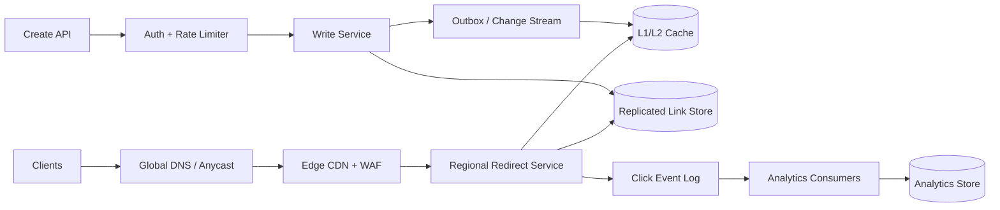

## 1. Bài toán

Ta cần một dịch vụ biến destination dài thành short URL ổn định. Client có thể yêu cầu key được sinh tự động hoặc alias tùy chỉnh. Redirect có thể là vĩnh viễn (`301`) hoặc tạm thời (`302`). Owner có thể vô hiệu hóa link, đặt thời gian hết hạn và xem analytics về lượt nhấp.

Điểm khó không nằm ở việc sinh một chuỗi ngắn. Vấn đề là giữ redirect path nhanh và sẵn sàng, đồng thời bảo toàn ý nghĩa của alias đã công bố. Redirect nhạy với độ trễ; analytics hữu ích nhưng có thể xử lý bất đồng bộ. Client cũng có thể retry sau timeout, nên thao tác tạo link cần idempotency.

Các yêu cầu và con số lưu lượng trong bài là đầu vào lập kế hoạch, không phải số đo của một hệ thống production cụ thể. Bài dùng các nhãn sau:

- **[SOURCE FACT]**: yêu cầu hoặc đầu vào được cung cấp cho bài toán này.
- **[ASSUMPTION]**: giả định rõ ràng để sizing hoặc minh họa.
- **[ANALYSIS]**: hệ quả rút ra từ các đầu vào đó.
- **[PROPOSED DESIGN]**: một phương án triển khai đáp ứng các yêu cầu.

### Yêu cầu [SOURCE FACT]

- Alias đã công bố không được âm thầm trỏ sang destination khác về sau. Vì vậy alias hết hạn không được tái sử dụng.
- Lưu lượng redirect là critical path. Analytics không được là điều kiện để hoàn tất redirect.
- Người dùng ở nhiều khu vực, và client có thể retry sau timeout.
- Read path nên vẫn hữu dụng khi write region hoặc hệ thống analytics gặp sự cố.

### Mục tiêu dịch vụ [ASSUMPTION]

- p99 của redirect dưới 50 ms tại service edge, không tính mạng của người dùng và việc tải destination.
- Phục vụ redirect có mục tiêu availability hàng tháng 99.99%. Tạo link và analytics có thể có SLO riêng.
- Key sinh tự động không va chạm; quyền sở hữu alias tùy chỉnh được tuyến tính hóa, tức các write đồng thời có một thứ tự có thẩm quyền.
- Mapping đã commit không bị mất. Analytics có thể trễ, nhưng một click không bị âm thầm đếm hai lần trong báo cáo.

## 2. Ước tính quy mô

Đây là **[ASSUMPTION] các con số lập kế hoạch**, không phải tuyên bố về một sản phẩm hiện hữu.

- Giả định 100 triệu client hoạt động hằng ngày tạo redirect. Với 10 redirect mỗi client mỗi ngày, ta có `100M x 10 = 1B redirects/day`.
- Tốc độ trung bình là `1B / 86,400 = 11,574 requests/s`.
- Giả định peak do chu kỳ ngày và campaign tăng 10x. Peak là `115,740 requests/s`; cấp năng lực 150,000 requests/s để có headroom.
- Với tỷ lệ redirect:tạo là 100:1, tạo link là `10M/day`, trung bình 116 writes/s và khoảng 1,160 writes/s lúc peak.
- Giả định một mapping row trung bình 600 byte, gồm index và replication metadata. Bảy năm link không hết hạn cần `10M x 365 x 7 x 600 = 15.33 TB` trước replica và compaction. Ba bản sao cần khoảng 46 TB.
- Giả định một redirect response khoảng 1 KB, gồm headers. Egress peak là `150,000 x 1 KB x 8 = 1.2 Gb/s`, chưa tính capacity bổ sung cho TLS và cache miss.
- Giả định mỗi redirect tạo một click event 200 byte. Raw event ingress là `1B x 200 = 200 GB/day`, tương đương khoảng 73 TB/năm trước log replication và warehouse storage.
- Áp dụng hệ số lập kế hoạch tích lũy 1.2 cho tăng trưởng link. Mapping lưu bảy năm thành khoảng `10M x 1.2 x 365 x 7 = 30.66B` row, tương đương 18.4 TB primary row bytes với cùng ước tính 600 byte.
- SLO hàng tháng 99.99% cho phép khoảng 4.32 phút unavailable trong một tháng 30 ngày.

**[ANALYSIS]** Write workload nhỏ hơn nhiều so với redirect workload. Database chỉ được sizing theo số lần tạo là chưa đủ: read fleet, edge cache và cross-region replication phải xử lý lưu lượng redirect. Cache có thể giảm số lần đọc store, nhưng không thể là bản sao duy nhất của mapping đã commit.

## 3. API

Đây là **[PROPOSED DESIGN]**. Các JSON body chỉ là ví dụ minh họa.

### Tạo link

`POST /v1/links`

```json
{
  "destination": "https://example.com/articles/very-long-path",
  "alias": "launch-2026",
  "status_code": 302,
  "expires_at": "2027-01-01T00:00:00Z"
}
```

`alias` là tùy chọn. Owner đã xác thực được lấy từ access token, không bao giờ lấy từ request body. Client gửi `Idempotency-Key`. Service lưu request fingerprint và response kết quả trong 24 giờ. Nếu retry dùng cùng key nhưng fingerprint khác, request bị từ chối thay vì được coi là thao tác mới.

```json
{
  "id": "01K2...",
  "alias": "launch-2026",
  "short_url": "https://s.example/launch-2026",
  "status_code": 302,
  "expires_at": "2027-01-01T00:00:00Z"
}
```

Trả `201` cho link mới, `200` cho idempotent replay, `409` khi custom alias đã được dùng, `422` cho destination hoặc TTL không hợp lệ và `429` khi vượt rate limit của owner hoặc IP. Custom alias không bao giờ được gán lại, kể cả sau khi hết hạn.

### Redirect

`GET /{alias}` trả `301` cho mapping permanent hoặc `302` cho mapping temporary, kèm header `Location`. Alias không tồn tại, hết hạn, bị disable hoặc sai format trả `404`. Response không tiết lộ alias đã xóa từng tồn tại hay chưa. Edge có thể cache negative response trong thời gian ngắn, theo một negative TTL ngắn.

Thứ tự lookup là edge cache, regional L1/L2 cache rồi replicated link store. Cache hit có thể phục vụ redirect trong lúc store outage nếu entry vẫn hợp lệ theo policy. Service tuyệt đối không tự tạo destination hoặc kéo dài mapping đã hết hạn chỉ vì store không khả dụng.

### Analytics

`GET /v1/links/{id}/analytics?from=...&to=...&bucket=hour` trả aggregate count và timestamp thể hiện độ mới của dữ liệu. Dữ liệu có eventual consistency.

`POST /v1/links/{id}/disable` yêu cầu xác thực và idempotent. Disable là một state transition có thứ tự mạnh: sau khi write được acknowledge, các read sau đó không được phục vụ link ở trạng thái active. Cache invalidation là một phần của write path; policy cho phép stale cache trong giới hạn phải không phá vỡ semantics đã chọn.

## 4. Data Model

Source of truth là một key-value store hoặc SQL-compatible store được sharding và có strong consistency. SQL dưới đây là logical model; triển khai vật lý có thể dùng distributed SQL hoặc key-value store với conditional write tương đương.

```sql
CREATE TABLE links (
  link_id       UUID PRIMARY KEY,
  alias         VARCHAR(32) NOT NULL UNIQUE,
  owner_id      BIGINT NOT NULL,
  destination   TEXT NOT NULL,
  redirect_code SMALLINT NOT NULL CHECK (redirect_code IN (301, 302)),
  state         VARCHAR(12) NOT NULL CHECK (state IN ('active', 'disabled', 'expired')),
  created_at    TIMESTAMP NOT NULL,
  expires_at    TIMESTAMP NULL,
  version       BIGINT NOT NULL,
  shard_key     BIGINT NOT NULL
);

CREATE INDEX links_owner_created ON links (owner_id, created_at DESC);
CREATE INDEX links_expiry ON links (expires_at) WHERE state = 'active';

CREATE TABLE idempotency_records (
  owner_id        BIGINT NOT NULL,
  idempotency_key VARCHAR(128) NOT NULL,
  request_hash    CHAR(64) NOT NULL,
  response_json   JSON NOT NULL,
  created_at      TIMESTAMP NOT NULL,
  PRIMARY KEY (owner_id, idempotency_key)
);
```

Unique constraint trên `alias` là nơi kiểm tra collision có thẩm quyền. Create transaction phải insert mapping và idempotency record atomically, hoặc dùng compare-and-set tương đương. `(owner_id, created_at)` hỗ trợ trang danh sách của owner mà không cần scan alias.

Partial expiry index cung cấp dữ liệu cho sweeper. Read cũng kiểm tra expiry đồng bộ, nên sweeper chạy trễ không làm link hết hạn trở nên hợp lệ. Sweeper có thể đánh dấu row là expired và invalidate cache liên quan. `shard_key` là hash ổn định của alias thay vì ID tăng dần; cách này phân bổ write và tránh write partition tăng đơn điệu. Alias phổ biến vẫn cần cache protection vì hash không loại bỏ hotspot của một key.

Analytics được lưu riêng:

```sql
CREATE TABLE click_hourly (
  link_id      UUID NOT NULL,
  hour         TIMESTAMP NOT NULL,
  country      CHAR(2) NOT NULL,
  device_class VARCHAR(16) NOT NULL,
  clicks       BIGINT NOT NULL,
  PRIMARY KEY (link_id, hour, country, device_class)
);
```

Event stream, không phải redirect database, là input của aggregate này. Aggregate key giúp query theo link/time hiệu quả. Retention và rollup giữ cho analytics storage có giới hạn.

## 5. Kiến trúc cấp cao



**[ANALYSIS]** Anycast hoặc global DNS đưa client tới edge gần hơn. Edge terminate TLS, áp dụng policy của WAF và rate limit, đồng thời phục vụ redirect đã cache khi an toàn. Regional redirect service xử lý cache miss và đọc replicated store. Service phát click event mà không chờ analytics consumer.

**[PROPOSED DESIGN]** Write đi qua authenticated write service. Với custom alias, service thực hiện conditional insert trên authoritative store. Key sinh tự động cũng phải qua cùng uniqueness check; việc sinh ngẫu nhiên tự nó không chứng minh uniqueness. Outbox hoặc change stream publish thay đổi mapping để populate và invalidate cache. Redirect service consume các thay đổi này hoặc fetch on demand.

## 6. Redirect Path và Quy tắc Cache

Redirect path chỉ nên làm công việc cần thiết để chọn destination:

1. Validate format của alias tại edge và từ chối input sai.
2. Kiểm tra edge cache và regional cache.
3. Nếu miss, đọc mapping theo alias từ replicated store.
4. Kiểm tra state và `expires_at` bằng current time đáng tin cậy.
5. Trả status đã cấu hình và header `Location`.
6. Publish click event bất đồng bộ.

Permanent và temporary redirect cần cache policy khác nhau. Permanent mapping có thể có positive TTL dài nếu semantics của disable và correction chấp nhận độ trễ đó. Temporary mapping nên có TTL ngắn hơn. Event disable và expiry phải invalidate positive cache entry; negative entry cũng cần TTL ngắn để alias mới không bị che khuất lâu.

Service nên dùng request coalescing cho một popular key đang cold, để nhiều miss đồng thời không cùng query store. Đồng thời phải giới hạn connection pool và timeout. Nếu store timeout, trả cached mapping còn hợp lệ khi policy cho phép; nếu không, trả error chứ không đoán redirect. Circuit breaker và backpressure bảo vệ store khỏi cache-miss storm.

## 7. Write, Replication và Xử lý Sự cố

Quyền sở hữu custom alias cần một conditional write có authoritative duy nhất. Cross-region replica có thể phục vụ read sau khi mapping được replicate bền vững theo consistency contract đã chọn. Nếu write region không khả dụng, service có thể từ chối create hoặc route sang authority khác; không được chấp nhận hai owner cho cùng alias.

Redirect read path có thể dùng replica, nhưng replica phải đáp ứng freshness cần thiết của redirect contract. Link vừa tạo có thể tạm thời trả `404` ở một region nếu cho phép replication bất đồng bộ. Nếu điều này không chấp nhận được, route các read đầu tiên qua write authority hoặc chờ replication acknowledgement cần thiết. Đây là lựa chọn thiết kế, không phải thuộc tính mặc định của mọi replicated store.

Với disable, state transition được commit ở source of truth rồi truyền qua change stream. Implementation phải quy định acknowledgement có chờ cache invalidation hay không. Nếu có, thao tác chậm hơn nhưng guarantee rõ hơn. Nếu không, contract cần nêu bounded stale-read window và cache phải thực thi giới hạn đó.

Event log trong phương án này dùng at-least-once delivery. Vì vậy consumer deduplicate bằng event ID hoặc key xác định như `(link_id, timestamp, request ID)` trước khi cập nhật aggregate. Retry ở consumer khi đó an toàn, nhưng ta không tuyên bố transport là exactly once. Poison event được đưa vào dead-letter path và retry theo policy rõ ràng.

## 8. Bảo mật và Kiểm soát Lạm dụng

Service validate scheme của destination và áp dụng policy allow/deny. Cần từ chối URL sai và định nghĩa cách xử lý redirect tới private hoặc local address range để hạn chế SSRF trong các component có fetch hoặc preview destination. Bản thân redirect service không nên fetch destination.

Authentication bắt buộc cho create, list, analytics và disable. Authorization kiểm tra owner gắn với token. Rate limit áp dụng theo owner và, khi phù hợp, theo IP hoặc network identity. Custom alias cần quy tắc normalization, reserved name và chính sách case sensitivity rõ ràng; collision check dùng giá trị đã normalize.

Edge và application log mặc định không nên lưu sensitive query parameter. Các dimension của analytics phải có giới hạn rõ ràng để attacker không tạo cardinality không có giới hạn.

## 9. Vận hành và Đánh đổi

Theo dõi redirect latency p50/p95/p99, cache hit ratio, store read latency, timeout và error rate, stale-cache age, replication lag, event-log lag, consumer retry rate và freshness của aggregate. Alert riêng cho tác động tới redirect SLO và độ trễ analytics; analytics backlog không nên page đội redirect ở cùng ngưỡng với redirect outage.

Backup và restore drill bảo vệ mapping đã commit. Retention job xóa hoặc archive analytics data theo policy. Nếu hỗ trợ deletion mapping, cần tombstone hoặc reservation vĩnh viễn để URL cũ không về sau nhận một ý nghĩa khác.

Đánh đổi chính là consistency so với availability khi có sự cố. Phục vụ mapping từ cache có thể giữ availability của redirect, nhưng chỉ khi entry được biết là còn hợp lệ theo policy expiry và disable. Phục vụ stale data sau khi disable đã được xác nhận có thể không chấp nhận được. Ngược lại, bắt buộc authoritative read mới ở mọi request bảo vệ consistency nhưng làm tăng latency và khiến store outage lộ ra với người dùng. Ranh giới đúng phải nằm trong API contract, không phải là hành vi tình cờ của cache.

## 10. Tóm tắt

Thiết kế giữ redirect path nhỏ: edge cache, regional cache, authoritative lookup khi miss và click event bất đồng bộ. Strong conditional write bảo vệ quyền sở hữu alias và idempotent create. Replication cùng cache invalidation giúp read chịu lỗi mà không biến cache thành source of truth. Analytics consume durable event stream và deduplicate tại consumer.

Các con số quy mô ở trên là giả định lập kế hoạch được nêu rõ. Trước khi triển khai, cần thay chúng bằng traffic distribution đo được, policy cho destination và alias, yêu cầu khi region lỗi, guarantee về cache staleness và recovery plan đã được kiểm thử.
