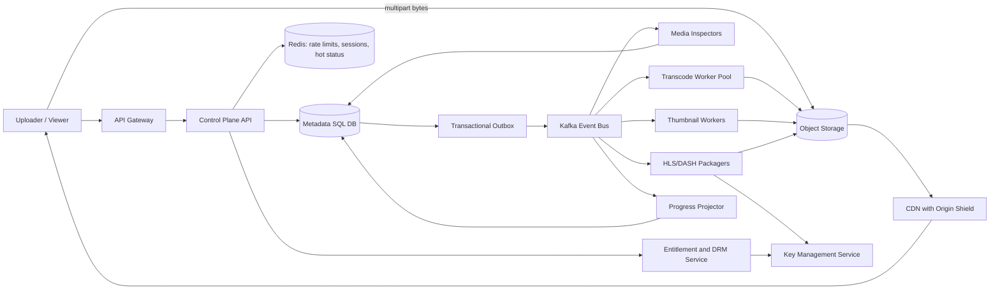

## 1. Problem

Ta xây dựng một nền tảng video multi-tenant cho nhà sáng tạo, đơn vị giáo dục và các đội ngũ truyền thông nội bộ. Người dùng tải video nguồn lên, theo dõi tiến độ xử lý, nhận thumbnail và xuất bản kết quả. Người xem stream tài sản đã xuất bản trên điện thoại, trình duyệt và TV kết nối.

Yêu cầu chức năng:

- Upload video và phụ đề tùy chọn, có thể tiếp tục khi bị gián đoạn.
- Chuyển mã thành adaptive-bitrate (ABR) ladder: 240p, 360p, 480p, 720p, 1080p và 4K khi nguồn hỗ trợ.
- Tạo poster và contact sheet thumbnail.
- Đóng gói manifest và segment HLS, DASH.
- Mã hóa nội dung bằng key theo từng title và thực thi quyền xem qua DRM/license service.
- Báo cáo tiến độ xử lý bền vững và chỉ xuất bản tài sản hoàn chỉnh, đã kiểm tra.
- Hỗ trợ playback private, theo tenant và public.

Yêu cầu phi chức năng:

- Xử lý tối thiểu 25.000 giờ video nguồn mỗi giờ trong khung peak thông thường.
- Time to first playable frame dưới 8 giây trên đường CDN warm và dưới 30 giây sau khi upload mới được xuất bản.
- Availability monthly 99,95% cho control plane và 99,99% cho manifest/segment delivery.
- Lưu bền vững source và media dẫn xuất, đồng thời giới hạn tăng trưởng storage và chi phí egress.
- Scale worker theo chiều ngang, chịu được lỗi worker, queue, database, cache hoặc region, và tránh tính phí hoặc xuất bản trùng.

Ranh giới chính được đặt có chủ ý: API sở hữu authorization, metadata, workflow state và progress; object storage và CDN vận chuyển các media object lớn, bất biến. Request không được chờ transcoding hoàn tất.

## 2. Scale Estimation

Các con số sau là mục tiêu capacity, không phải tuyên bố về một sản phẩm hiện hữu. Mỗi giả định nhằm làm lộ một ràng buộc thiết kế.

| Đại lượng | Giả định và phép tính | Kết quả |
|---|---|---:|
| Người dùng hoạt động hằng ngày | Mục tiêu sản phẩm cho trước | 5.000.000 DAU |
| API request | 5.000.000 người dùng x 20 request/ngày | 100.000.000 request/ngày |
| API RPS trung bình | 100.000.000 / 86.400 | 1.157 RPS |
| API RPS peak | 1.157 x 10 cho launch và giờ xem buổi tối | 11.570 RPS |
| Upload | 300.000/ngày x trung bình 20 phút | 100.000 giờ nguồn/ngày |
| Processing peak | 25.000 giờ nguồn/giờ | 25.000 giờ nguồn/giờ |
| Source storage/ngày | 300.000 x trung bình 1,5 GB source | 450 TB/ngày |
| Derived storage/ngày | 450 TB x 0,9 (ladder cộng manifest và thumbnail) | 405 TB/ngày |
| Storage retention | (450 + 405) TB x 30 ngày hot retention | 25,65 PB hot |
| Viewer egress | 5.000.000 x 2 giờ/ngày x trung bình 1,5 Mbps | 6,75 PB/ngày |
| Tỷ lệ read:write | 100.000.000 API request so với 300.000 upload session | khoảng 333:1 |

Source 1,5 GB là hợp lý cho upload hỗn hợp chất lượng, 20 phút: khoảng 10 Mbps gồm overhead container. Tốc độ xem 1,5 Mbps là trung bình toàn bộ người dùng trên mobile và broadband, không phải bitrate rung cao nhất. Egress lớn hơn ingest nhiều, vì vậy CDN cache hit ratio và origin shielding quyết định phần lớn chi phí.

Ở mức 25.000 giờ nguồn/giờ, source 20 phút tạo 75.000 job/giờ. Nếu một normalized transcode job tiêu thụ 12 worker-phút (các rendition song song được gom thành một job), compute ổn định là 15.000 worker-giờ/giờ, tức 15.000 worker equivalent đồng thời. Với headroom 30%, fleet cần 19.500 equivalent. Đây là đầu vào capacity planning; benchmark phải đo theo codec, độ phân giải và loại hardware.

Ingest source 450 TB/ngày tương đương 13,5 PB/tháng trước replication. Nếu object storage đã cung cấp durability ba bản, ứng dụng vẫn phải lập ngân sách logical bytes tách khỏi physical copies. Hot retention là 25,65 PB; sau 30 ngày, chuyển original và derivative ít được xem sang storage rẻ hơn, tuân theo legal hold và policy tenant.

Availability target tương đương error budget khoảng 21,9 phút/tháng cho control plane 99,95% và 4,4 phút cho playback delivery 99,99%. Thiết kế synchronous một region không thể đáng tin cậy đạt mục tiêu sau trong outage cấp region; media được replicate cross-region và CDN có origin ở ít nhất hai region.

## 3. API Design

API dùng bearer token ngắn hạn, tenant authorization và idempotency key trên mọi endpoint ghi. Byte upload đi thẳng tới object storage qua multipart session; application server không proxy chúng.

### Tạo upload

`POST /v1/uploads`

Request:

```json
{
  "filename": "lecture-01.mov",
  "size_bytes": 2147483648,
  "content_sha256": "optional-full-file-hash",
  "visibility": "private"
}
```

Response `201`:

```json
{
  "upload_id": "upl_01J...",
  "asset_id": "ast_01J...",
  "part_size_bytes": 67108864,
  "parts": [{"part_number": 1, "url": "https://object.example/..."}],
  "expires_at": "2026-08-15T04:00:00Z"
}
```

Client gửi `Idempotency-Key: <tenant-id>/<client-upload-id>`. Gọi lại request trả về các ID ban đầu và không tạo asset khác. Kiểm tra checksum từng part và thao tác compose cuối bảo vệ khỏi upload thiếu hoặc sai thứ tự.

### Hoàn tất upload

`POST /v1/uploads/{upload_id}/complete`

Request:

```json
{"parts":[{"part_number":1,"etag":"..."},{"part_number":2,"etag":"..."}]}
```

Response `202`:

```json
{"upload_id":"upl_01J...","asset_id":"ast_01J...","state":"INSPECTING"}
```

Endpoint kiểm tra object manifest, ghi outbox event trong cùng transaction với state `UPLOADED`, rồi trả `202`. Nếu response mất, idempotency record và state vẫn có thể đọc lại.

### Đọc trạng thái

`GET /v1/assets/{asset_id}` trả state, phần trăm, rendition đã hoàn thành, lỗi và version. Client poll với `If-None-Match` mỗi 2 giây khi đang chạy, rồi back off. API không báo `PUBLISHED` cho tới khi manifest validation, encryption và authorization metadata hoàn tất.

### Xuất bản và playback

`POST /v1/assets/{asset_id}/publish` chuyển asset đã kiểm tra sang `PUBLISHED` sau entitlement check. `GET /v1/assets/{asset_id}/playback` trả signed manifest URL ngắn hạn và cấu hình DRM license; nó không trả media bytes. Playback token chứa tenant, asset, expiry và policy claims. License request được authenticate riêng và rate limit theo viewer và device.

### Hợp đồng vận hành

Mutation trả `request_id` ổn định. `409` nghĩa là state transition không hợp lệ; `429` có `Retry-After`; `503` có thể retry. Client chỉ retry operation idempotent với exponential backoff và jitter. Upload URL bị giới hạn vào một object prefix, part, checksum và expiry.

## 4. Data Model

Source of truth là PostgreSQL-compatible SQL. Media bytes nằm trong object storage, với key theo asset ID và rendition ID bất biến.

```sql
CREATE TABLE assets (
  tenant_id       BIGINT NOT NULL,
  asset_id        UUID NOT NULL,
  source_object   TEXT NOT NULL,
  state           TEXT NOT NULL CHECK (state IN ('UPLOADING','INSPECTING','PROCESSING','READY','PUBLISHED','FAILED')),
  visibility      TEXT NOT NULL,
  source_sha256   BYTEA,
  version         BIGINT NOT NULL DEFAULT 0,
  created_at      TIMESTAMPTZ NOT NULL,
  updated_at      TIMESTAMPTZ NOT NULL,
  PRIMARY KEY (tenant_id, asset_id),
  UNIQUE (tenant_id, source_sha256)
);

CREATE TABLE renditions (
  tenant_id       BIGINT NOT NULL,
  asset_id        UUID NOT NULL,
  rendition_id    SMALLINT NOT NULL,
  codec           TEXT NOT NULL,
  width           INT NOT NULL,
  height          INT NOT NULL,
  bitrate_kbps    INT NOT NULL,
  state           TEXT NOT NULL,
  object_prefix   TEXT,
  checksum        BYTEA,
  PRIMARY KEY (tenant_id, asset_id, rendition_id),
  FOREIGN KEY (tenant_id, asset_id) REFERENCES assets(tenant_id, asset_id)
);

CREATE TABLE workflow_tasks (
  task_id         UUID PRIMARY KEY,
  tenant_id       BIGINT NOT NULL,
  asset_id        UUID NOT NULL,
  task_type       TEXT NOT NULL,
  attempt         INT NOT NULL DEFAULT 0,
  state           TEXT NOT NULL,
  lease_until     TIMESTAMPTZ,
  idempotency_key TEXT NOT NULL UNIQUE,
  updated_at      TIMESTAMPTZ NOT NULL
);

CREATE INDEX tasks_ready_idx ON workflow_tasks (state, lease_until, updated_at);
CREATE INDEX assets_tenant_updated_idx ON assets (tenant_id, updated_at DESC);
```

`(tenant_id, asset_id)` là shard key vì authorization và hầu hết truy vấn asset đều trong phạm vi tenant; nó giữ metadata của tenant gần nhau nhưng vẫn cho phép tách tenant lớn theo asset suffix đã hash về sau. Source hash uniqueness ngăn upload trùng trong một tenant, nhưng không deduplicate toàn cục vì chia sẻ dữ liệu cross-tenant có thể là rò rỉ bảo mật.

Task index hỗ trợ lease ready work mà không scan toàn bộ task. Tenant/time index hỗ trợ asset list endpoint và tránh sort cả tenant. Ở quy mô lớn hơn, workflow task được partition theo hash của `asset_id`, với state index riêng trên mỗi partition; chỉ dùng state làm partition key sẽ khiến `PROCESSING` thành hot.

Progress là projection append-or-upsert, không phải counter chính xác theo transaction. Durable task row là authoritative; progress event có thể compact theo `(asset_id, rendition_id)` và hết hạn sau 90 ngày. Outbox row chứa event ID, aggregate ID, type, payload và publish status, với unique constraint `(aggregate_id, version, type)`.

## 5. High-Level Architecture



Gateway terminate TLS, authenticate token, áp quota tenant và load shedding. Control plane sở hữu metadata nhỏ, có transaction và không stream source file.

Object storage cung cấp source, segment, manifest và object thumbnail bất biến với lifecycle policy. CDN cache segment bất biến trong thời gian dài và dùng signed URL; origin shielding ngăn mọi edge miss tới storage.

SQL database cung cấp state transition, tenant policy và task lease. Outbox đóng khoảng trống dual-write giữa state change đã commit và event. Kafka phục vụ workflow event có thể replay, volume cao và progress fan-out; worker pool consume các topic theo workload class.

Inspector loại media malformed trước encoding tốn kém. Transcoder tạo rendition output tạm, packager kiểm tra duration và keyframe, chỉ sau đó control plane mới mở playback. KMS/DRM giữ content key ngoài log ứng dụng và row database. Progress projector làm các cập nhật thường xuyên trở nên rẻ mà không biến mỗi frame thành một database transaction.

## 6. Deep Dive

### Workflow, idempotency và ordering

Completion tạo task `INSPECT`. Inspection phát normalized media profile, từ đó planner tạo rendition, thumbnail và packaging task. Task có lease, attempt number và output prefix xác định. Worker có thể crash sau khi ghi output nhưng trước khi acknowledge Kafka; attempt tiếp theo kiểm tra checksum output và nhận các object hợp lệ thay vì tính phí hai lần.

Ordering cần theo asset, không cần toàn cục. Kafka key event bằng `asset_id`, giữ thứ tự inspection-before-planning cho một asset trong khi phân phối asset qua các partition. Versioned state transition (`WHERE version = ?`) từ chối worker cũ. Publication là compare-and-set từ `READY` sang `PUBLISHED`; distributed lock không phải cơ chế đúng đắn chính. Lease ngắn có thể giảm việc trùng đắt đỏ, nhưng database transition và deterministic output mới là fence thực sự.

### Queue, backpressure và retry

Topic riêng tồn tại cho inspection, CPU transcode, GPU transcode, thumbnail, packaging và progress. Điều này ngăn một lượng 4K job làm starvation thumbnail nhỏ. Scheduler cấp weighted tenant quota và chỉ admit work khi worker utilization và temporary storage dưới giới hạn.

Consumer pause hoặc giảm fetch khi output queue, encoder slot hoặc object-storage error rate vượt ngưỡng. Queue depth được giới hạn bằng admission control; khi đầy, API vẫn nhận metadata nhưng báo processing delay thay vì giả vờ job khỏe. Retry dùng exponential backoff với jitter và số attempt tối đa. Media error xác định được đi thẳng DLQ cùng source probe và lý do; lỗi storage hoặc network tạm thời thì retry. Replay DLQ cần filter được operator phê duyệt.

### Scaling và storage

API instance stateless và autoscale theo request rate, p95 latency và CPU, với pool riêng cho playback-token issuance. Connection pool phải có giới hạn: pool 40 mỗi instance trên 100 API instance là 4.000 database connection, nên cần proxy và cap toàn database. Read replica phục vụ asset list và progress read, nhưng quyết định publish và lease dùng writer.

CDN là bandwidth scaler chính. Segment name có content version, cho phép cache TTL dài mà không race khi invalidation. Manifest ở edge có thời gian ngắn vì entitlement và publish state thay đổi; origin shield hấp thụ refresh. Redis là cache và rate-limit store, không bao giờ là bản duy nhất của state. Cache lỗi sẽ degrade về database sau request coalescing theo key và circuit breaker.

Tenant lớn có thể tạo hot metadata shard hoặc hot playback key. Hash-shard theo asset ID trong tenant, thêm tenant quota và tránh counter global đơn. Với playback, signed URL có thể cache độc lập theo asset/version trong khi authorization được kiểm tra lúc cấp token. Object prefix có hash fan-out để tránh storage-listing hotspot.

### Security và disaster recovery

Upload URL có least privilege và expiry. Malware scan và container parsing chạy trong sandbox với giới hạn CPU, memory và decompression. Worker dùng workload identity và không thể đọc prefix của tenant khác. Encryption at rest dùng key hierarchy; DRM packaging dùng content key theo title được KMS wrap. Audit event ghi publish, policy, license và thay đổi quản trị nhưng không log token.

Metadata được replicate synchronous trong region và backup liên tục sang region thứ hai. Object version và derived output replicate asynchronous; CDN có cả hai origin. Recovery ưu tiên metadata control plane, sau đó manifest và rendition phổ biến, cuối cùng original cold. RPO được nêu là 15 phút cho metadata projection và RTO 60 phút cho regional control-plane failover; playback của asset đã replicate phải tiếp tục trong failover.

Rate limit áp dụng theo tenant, user, IP, upload bytes, license request và task admission. Load balancing dùng least-loaded cho API và capability-aware cho worker; GPU worker không nhận codec job chỉ hỗ trợ CPU. Circuit breaker dừng các call lặp lại tới KMS, database replica hoặc object endpoint đang lỗi.

## 7. Consistency Model

Strong consistency dùng cho ownership asset, visibility, idempotency key, task lease, versioned state transition và publication. Caller không được thấy `PUBLISHED` trước khi mọi rendition bắt buộc và DRM metadata tồn tại. Writer database và transaction chứa outbox event là authority.

Eventual consistency chấp nhận được cho phần trăm progress, search/list replica, CDN manifest, analytics và cross-region media replication. Progress có thể lùi khi task đến muộn báo stage thấp hơn; projector dùng stage order và event version để ngăn regression. Read replica có thể lag; sau mutation, response có authoritative version và client có thể yêu cầu `?min_version=` hoặc được route tới writer để có read-after-write.

Nếu completion request commit nhưng response mất, client retry cùng idempotency key. Server trả stored response hoặc state hiện tại. Nếu worker nhận event hai lần, unique task key và output checksum làm operation an toàn. Nếu outbox publisher crash sau khi publish nhưng trước khi đánh dấu sent, event được giao lại; consumer phải idempotent. Không giả định exactly-once end-to-end.

## 8. Failure Scenarios

| Failure | Impact | Detection | Recovery |
|---|---|---|---|
| SQL writer không khả dụng | Upload mới, lease và publication dừng; CDN playback asset hiện có tiếp tục | Writer error, connection-pool wait, transaction latency, health probe thất bại | Retry có giới hạn, failover tới standby trong region, fence writer cũ, replay outbox; trả `503` cho mutation |
| Kafka consumer kẹt ở poison message | Một asset partition dừng tiến triển và lag tăng | Consumer lag theo partition, offset không đổi, không có task hoàn tất | Pause partition, đưa message đã xác định vào DLQ sau khi capture, restart consumer, replay sau khi sửa |
| Redis cluster lỗi | Database load tăng và rate limiting kém hiệu quả hơn; correctness vẫn còn | Cache error ratio, DB QPS, latency, circuit-breaker mở | Trả status stale có giới hạn, coalesce miss, áp emergency gateway limit, khôi phục Redis |
| Primary region lỗi | Control plane có thể không hoạt động; một số upload mới dừng; playback đã replicate có thể tiếp tục | Regional synthetic check, CDN origin error, DNS/health failover | Promote metadata writer phụ, đổi origin và API routing, reconcile outbox và upload sau recovery |
| Object storage throttling | Transcode lỗi hoặc retry; manifest có thể trễ | Put/GET latency, tỷ lệ 429/5xx, worker retry count, temporary disk usage | Giảm admission, exponential backoff, dùng prefix/region thay thế khi an toàn, replay task |
| GPU worker fleet cạn | Queue 4K/HEVC tăng trong khi rung thấp hơn vẫn khỏe | GPU utilization, queue age theo codec, scheduler rejection | Route job hỗ trợ sang CPU pool với cost guardrail, thêm capacity, báo delay high-rung |
| DRM/KMS outage | Packaging mới hoặc license request lỗi; encrypted segment đã cache có thể không start session mới | License p95/error rate, KMS throttle, synthetic playback theo DRM | Circuit break, dùng regional KMS endpoint được duyệt, không lộ key, retry license có giới hạn |

## 9. Observability

Mọi request, Kafka event, task và storage operation mang `trace_id`; `request_id` hiển thị cho client được log cùng tenant và asset ID nhưng không bao giờ cùng bearer token. Log có cấu trúc và sampling theo kết quả. Trace nối upload completion với inspection, từng rendition, packaging, publication và manifest request đầu tiên.

SLI/SLO cốt lõi:

- Control-plane availability: authenticated request thành công / tổng request, SLO 99,95%.
- Playback availability: manifest và segment request thành công, SLO 99,99%.
- Time to first playable frame: p50/p95 từ publish tới frame decode đầu tiên, mục tiêu dưới 8/30 giây theo path.
- Processing throughput: giờ nguồn hoàn tất mỗi giờ và p95 upload-to-ready duration.
- Error rate theo endpoint, codec, tenant, region và status class.

Alert phải gợi ý hành động. Queue age và consumer lag báo worker kẹt hoặc thiếu capacity; chỉ nhìn queue depth có thể che giấu việc drain nhanh. Encoder CPU/GPU saturation và temporary-disk đầy chỉ ra giới hạn worker. Database commit latency, replica lag, lock wait và connection-pool utilization xác định SQL pressure. CDN hit ratio và origin egress chỉ ra cache regression. KMS/license error chỉ ra entitlement outage. Upload checksum failure chỉ ra corruption phía client hoặc storage path. Synthetic upload và playback chạy liên tục ở mỗi region.

## 10. Capacity Planning

Ở 11.570 peak API RPS, mục tiêu 200 RPS mỗi API instance tại 60% CPU. `11,570 / (200 x 0.6) = 96.4`, vì vậy deploy 100 instance cộng 30% burst headroom: 130 instance. Playback-token issuance được cô lập và tính capacity theo p95 riêng vì không nên cạnh tranh với upload control call.

Với 25.000 giờ nguồn/giờ và 12 worker-phút cho mỗi normalized source-hour-equivalent job, fleet cần 15.000 worker equivalent; thêm headroom 30% là 19.500. Thực tế, tách theo codec mix đo được: ví dụ 70% CPU-equivalent và 30% GPU-equivalent, sau đó xác nhận mix bằng benchmark phút/rendition thay vì coi “worker” là máy đồng nhất.

Giả sử CDN cache hit ratio ban đầu 30%. Origin egress là `6.75 PB/day x 0.70 = 4.725 PB/day`; nâng hit ratio lên 85% giảm còn 1.0125 PB/day, tiết kiệm lớn hơn tối ưu API RPS. Cache cần đủ hot segment cho working set, không phải toàn bộ 25,65 PB. Nếu 10% asset đứng đầu tạo 60% traffic và segment của chúng trong 7 ngày trung bình 2,5 PB, provision tối thiểu 3 PB effective cache cộng eviction headroom.

Kafka nhận khoảng 75.000 workflow event/giờ cộng progress event. Với 10 event mỗi source asset và 300.000 upload/ngày, workflow volume là 3.000.000/ngày, tức trung bình 35 event/giây và peak 350. Progress có thể là 20 event mỗi rendition, nên compacted progress topic có thể đạt 100 triệu record/ngày. Dùng 96 partition cho workflow topic và 192 cho progress topic, bắt đầu tối đa 3 consumer mỗi partition và scale theo lag; số partition được chọn cho parallelism tương lai, không phải throughput hiện tại.

SQL writer được tính cho khoảng 12.000 peak API transaction/giây chỉ sau khi cache và read replica loại read list/status. Bắt đầu với 8 read replica, connection proxy limit 2.000 và 100 API instance x 20 pooled connection = tối đa 2.000, để dành capacity cho worker và operator. Đo transaction mix trước khi tăng writer. Media growth logic mỗi ngày là 855 TB, nên hot storage 30 ngày là 25,65 PB; lifecycle policy phải bắt đầu trước khi cohort 30 ngày đầu tiên tới.

## 11. Bottlenecks and Evolution

Bottleneck đầu tiên thường là origin egress và encoding compute, không phải API. Ở 10x, thiết kế thêm regional worker pool, CDN shield capacity, codec-aware scheduling và database partition theo asset ID đã hash. Progress event được compact và sample để status freshness không tiêu thụ cùng capacity với media processing.

Ở 100x, một metadata writer và một Kafka cluster trở thành bottleneck về failure domain và vận hành. Chuyển sang tenant-cell architecture: mỗi cell sở hữu metadata database, event bus, worker pool và object namespace có giới hạn; global directory map tenant tới cell. Playback object vẫn global-addressable qua CDN, nhưng control-plane failover theo cell. Global catalog chỉ dùng routing, không dùng cho ghi mỗi frame hoặc mỗi task.

Thứ tự redesign là: cải thiện CDN shielding và cacheability, cô lập codec compute, partition task/event stream, rồi chia metadata thành cell. Multi-region active-active SQL không phải câu trả lời đầu tiên vì conflict của publication và entitlement khó hơn việc thêm writer active-passive thứ hai. Kiến trúc mục tiêu là media delivery active-active với control plane strongly consistent theo cell và cross-region replication asynchronous.

## 12. Trade-offs

| Decision | Option A | Option B | Decision | Why |
|---|---|---|---|---|
| Metadata store | SQL | NoSQL | SQL | State transition, uniqueness, lease và transaction theo tenant cần constraint; media bytes không thuộc đây |
| Workflow bus | Kafka | RabbitMQ | Kafka | Replay, partition ordering và progress fan-out lớn đáng giá hơn routing message đơn giản |
| Hot cache | Redis | Database cache | Redis | Latency bounded và distributed rate limit; DB vẫn là source of truth |
| Processing | Synchronous API | Asynchronous jobs | Async | Transcoding dài, bursty, retryable và không được giữ HTTP connection |
| Regions | Active-active control plane | Active-passive control plane | Active-passive initially | Ít conflict mode hơn cho publication; media/CDN vẫn active-active |
| Sharding | Range by time | Hash by asset | Hash | Tải đều cho processing và status access; time range tạo partition mới nhất bị hot |
| Progress | Polling | Push/WebSocket | Polling first | Hoạt động qua proxy và reconnect; thêm push khi freshness biện minh chi phí connection |
| Service calls | REST | gRPC | REST externally, gRPC internally | REST dễ debug và tương thích client; gRPC hỗ trợ internal call typed, volume cao |

## 13. Production Checklist

- [ ] Upload URL giới hạn tenant, object, part, checksum và expiry.
- [ ] Mọi mutation có idempotency key và response replay-safe.
- [ ] State transition có version và publication bị chặn cho tới khi output được validate.
- [ ] Outbox, Kafka retry, consumer idempotency và DLQ replay đã được test.
- [ ] Queue age, lag, storage throttling và worker saturation có alert và runbook.
- [ ] SQL backup, restore drill, replica promotion và old-writer fencing đã được kiểm tra.
- [ ] CDN signed URL, origin shielding, cache header và cross-region origin đã được test.
- [ ] DRM key không bao giờ vào log, client response hoặc database row thông thường.
- [ ] Rate limit bao phủ API, bytes, license, tenant và task admission.
- [ ] Synthetic upload-to-playback check chạy tại mọi serving region.
- [ ] Capacity test bao phủ codec mix, tenant hot, burst 4K và cache-miss storm.
- [ ] RPO/RTO, legal retention, deletion propagation và tenant isolation được ghi rõ.

## 14. Engineering References

1. **Company:** Google SRE  
   **Article title:** *The Site Reliability Engineering Book: Table of Contents*  
   **URL:** https://sre.google/sre-book/table-of-contents/  
   **Key engineering lesson:** Reliability là một service objective rõ ràng với indicator đo được và error budget, không phải lời hứa không chính thức.  
   **How it influenced this design:** Định hướng control-plane và playback SLO riêng, error-budget, retry có giới hạn và operational runbook.

2. **Company:** Netflix Tech Blog  
   **Article title:** *Netflix Tech Blog*  
   **URL:** https://netflixtechblog.com/  
   **Key engineering lesson:** Hệ thống media quy mô lớn cô lập failure domain, tự động hóa resilience và kiểm chứng hành vi dưới failure giống production.  
   **How it influenced this design:** Định hướng worker isolation dạng cell, multi-origin delivery, synthetic playback và failure testing có chủ đích mà không gán một implementation bịa đặt cho Netflix.

3. **Company:** Cloudflare  
   **Article title:** *Cloudflare Blog*  
   **URL:** https://blog.cloudflare.com/  
   **Key engineering lesson:** Edge caching, origin shielding và cache semantic cẩn trọng có thể chuyển phần lớn cost và latency khỏi application origin.  
   **How it influenced this design:** Định hình immutable segment URL, manifest ngắn hạn, origin shielding và capacity math theo cache hit ratio.

4. **Company:** AWS Architecture Blog  
   **Article title:** *AWS Architecture Blog*  
   **URL:** https://aws.amazon.com/blogs/architecture/  
   **Key engineering lesson:** Hệ thống event-driven bền vững cần retry, idempotency, backpressure và recovery boundary rõ ràng.  
   **How it influenced this design:** Củng cố transactional outbox, bounded queue, DLQ, lifecycle storage policy và kế hoạch region recovery.
